# 简单序列化 (SSZ)

## 概述


Simple Serialize (SSZ) 是专门为 Ethereum 的 Beacon Chain 设计的序列化和 [Merkleization](/wiki/CL/merkleization.md) 方案。 SSZ 替换了 Execution Layer (EL) 上使用的 [RLP 序列化](/wiki/EL/RLP.md)，除了[对等节点发现协议](https://github.com/ethereum/devp2p)。它的开发和采用旨在增强 Ethereum 的 CL 的效率、安全性和可扩展性。

本文档是关于 SSZ 序列化。您可以在 [Merkleization wiki 页面](/wiki/CL/merkleization.md) 了解有关 SSZ Merkleization 的更多信息。


## SSZ 工具

SSZ 有很多可用的工具。这是 SSZ 工具的[完整列表](https://github.com/ethereum/consensus-specs/issues/2138)。以下是一些受欢迎的：

- [py-ssz](https://github.com/ethereum/py-ssz)
- [达夫尼](https://github.com/ConsenSys/eth2.0-dafny)
- [可提醒](https://github.com/protolambda/remerkleable)
- [fastssz](https://github.com/ferranbt/fastssz/)
- [Rust-ssz](https://github.com/ralexstokes/ssz-rs)

## SSZ VS RLP 序列化

| CRITERIA | COMPACT | EXPRESSIVENESS | HASHING | INDEXING |
|------------|---------|----------------|----------|----------|
| RLP |是的 |灵活|可能 |没有 |
| SSZ |没有 |是的 |是的 |可怜|

_表：Piper Merriam 的 [SSZ VS RLP 比较](https://twitter.com/pipermerriam)。_

**表现力**：
- **SSZ**：直接支持所有必需的数据类型，无需额外的抽象层。这使得 SSZ 本身对于处理 Ethereum PoS 中使用的复杂数据结构更加简单和稳健。
- **RLP**：仅限于动态长度字节字符串和列表。其他数据类型仅通过抽象层支持，这可能会带来复杂性和潜在的低效率。

**散列**：
- **SSZ**：有利于对象的高效哈希和重新哈希，特别有利于需要频繁更新数据状态的操作，例如分片和无状态客户端中的操作。这种效率对于维持区块链完整性和性能至关重要。
- **RLP**：虽然散列是可能的，但它不能提供相同的性能优化，特别是当数据结构进行微小修改时。

**索引**：
- **SSZ**：虽然索引被描述为“差”，但 SSZ 支持某种程度的直接访问序列化数据而无需完全反序列化，这对于区块链内的某些操作是有益的。
- **RLP**：不支持高效索引，可能导致访问内部数据时 `O(N)` 复杂性，这可能是大规模网络性能的重大缺陷。

**数据类型兼容性**：
- **SSZ**：旨在与 Ethereum 协议中使用的数据类型和结构完全兼容，增强其共识机制和网络操作的实用性。
- **RLP**：虽然灵活，但需要额外的层来支持各种数据类型可能会导致实施效率低下并增加复杂性。

**确定性序列化**：
- **SSZ**：提供确定性的序列化结果，确保相同的数据结构每次都序列化为完全相同的字节序列，这对于共识可靠性至关重要。
- **RLP**：RLP 还提供确定性序列化结果。


由于这些原因，Ethereum 做出了很大的努力，将所有内容完全迁移到 SSZ 序列化并停止使用 RLP 序列化。


## SSZ 的工作原理 - 基本类型

以下是 SSZ 如何处理序列化和基本类型的反序列化：

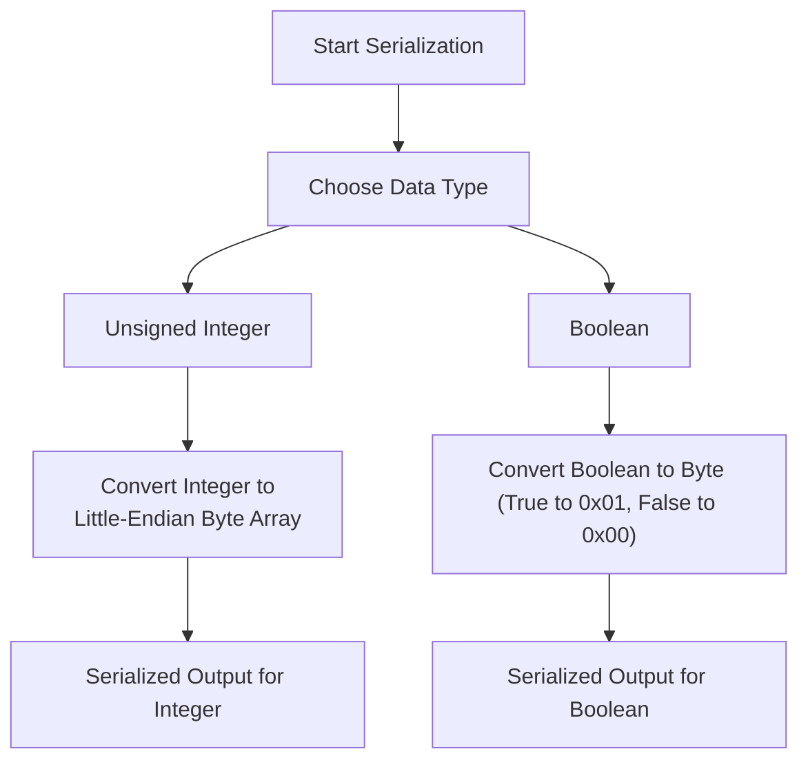

_图：序列化基本类型流程._


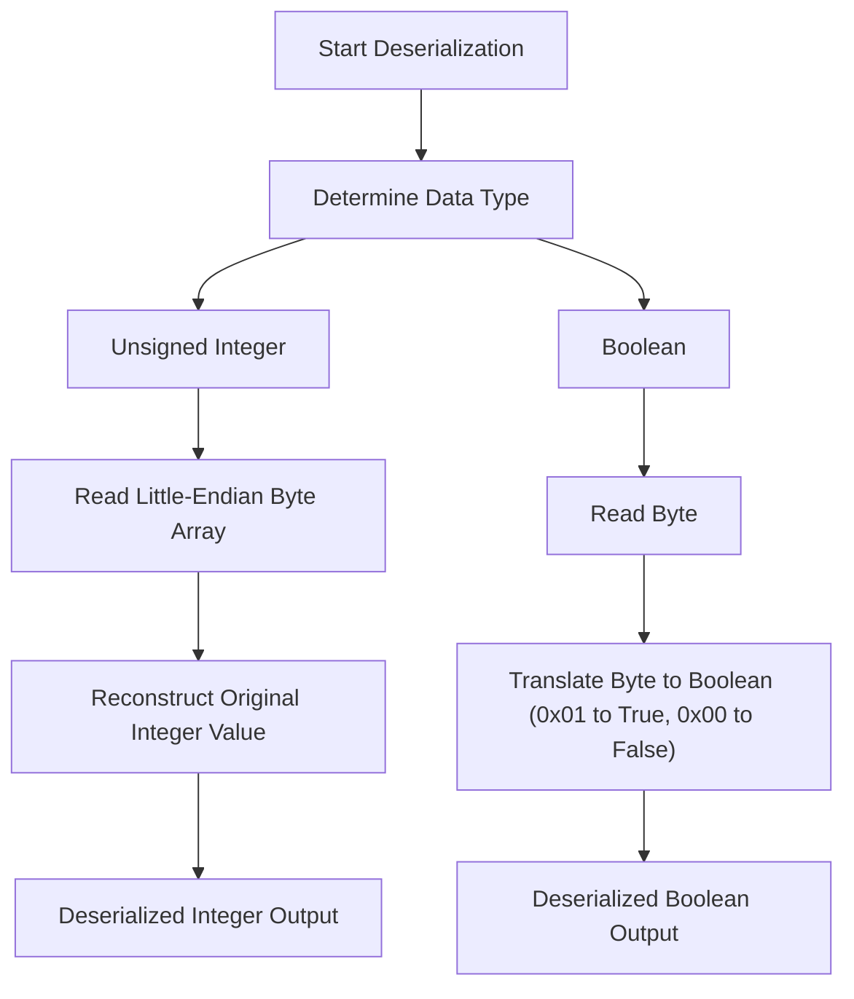

_图：基本类型的反序列化过程._

### 无符号整数

SSZ 中的无符号整数 (`uintN`) 表示，其中 `N` 可以是 8、16、32、64、128 或 256 位中的任意位。这些整数直接序列化为其小端字节表示形式，这种形式非常适合大多数现代计算机体系结构，并且有助于在字节级别更轻松地进行操作。

**序列化无符号整数处理：**

- **输入**：取 `uintN` 类型的无符号整数。
- **转换为字节**：将整数转换为长度为`N/8`的字节数组。例如，`uint16` 代表 2 个字节。
- **应用 Little-Endian 格式**：按照 Little-Endian 顺序排列字节，首先存储最低有效字节。
- **输出**：生成的字节数组是整数的序列化形式。

**示例：**
- 整数 `1025` 作为 `uint16` 将被序列化为十六进制的 `01 04`。首先，将 `1025` 转换为十六进制，得到 `0x0401`。在小端格式中，最低有效字节 (LSB) 首先出现。因此，小尾数中的 `0x0401` 是 `01 04`。字节数组 `[01, 04]` 是序列化输出。

**无符号整数的反序列化过程：**

- **输入**：读取表示序列化 `uintN` 的字节数组。
- **读取小尾数字节**：以小尾数顺序解释字节以重建整数值。
- **输出**：将字节数组转换回整数。

**示例：**
- 字节数组 `01 04`(十六进制)被反序列化为整数 `1025`。读取第一个字节 `01` 作为整数的低位部分，`04` 作为整数的高位部分。当以大端格式重新组装以供人类可读时，它会转换回十六进制的 `0401`，相当于十进制的 1025。

### 布尔值

SSZ 中的布尔值非常简单，每个布尔值表示为单个字节。

**序列化布尔值处理：**

- **输入**：取一个布尔值(`True` 或 `False`)。
- **转换为字节**： 
   - 如果布尔值是 `True`，则将其序列化为 `01`(十六进制)。
   - 如果布尔值是 `False`，则将其序列化为 `00`。
- **输出**：生成的单字节是布尔值的序列化形式。

**示例：**
- `True` 变为 `01`。
- `False` 变为 `00`。

**布尔值的反序列化过程：**

- **输入**：读取单个字节。
- **解释字节**： 
   - `01` 的一个字节表示 `True`。
   - `00` 的一个字节表示 `False`。
- **输出**：字节对应的布尔值。

**示例：**
- 字节 `01` 反序列化为 `True`。
- 字节 `00` 反序列化为 `False`。

我们可以按照 [说明](https://eth2book.info/capella/appendices/running/) 使用 python Eth PoS 规范运行 SSZ 序列化和反序列化命令，并验证上述字节数组。

```python
>>> from eth2spec.utils.ssz.ssz_typing import uint64, boolean
# Serializing 
>>> uint64(1025).encode_bytes().hex()
'0104000000000000'
>>> boolean(True).encode_bytes().hex()
'01'
>>> boolean(False).encode_bytes().hex()
'00' 

# Deserializing 
>>> print(uint64.decode_bytes(bytes.fromhex('0104000000000000')))
1025
>>> print(boolean.decode_bytes(bytes.fromhex('01')))
1
>>> print(boolean.decode_bytes(bytes.fromhex('00')))
0
```

## SSZ 如何在复合类型上工作

### 向量

SSZ 中的向量用于处理同质元素的固定长度集合。下面详细介绍了 SSZ 如何处理序列化和向量的反序列化。

**SSZ 序列化用于向量**

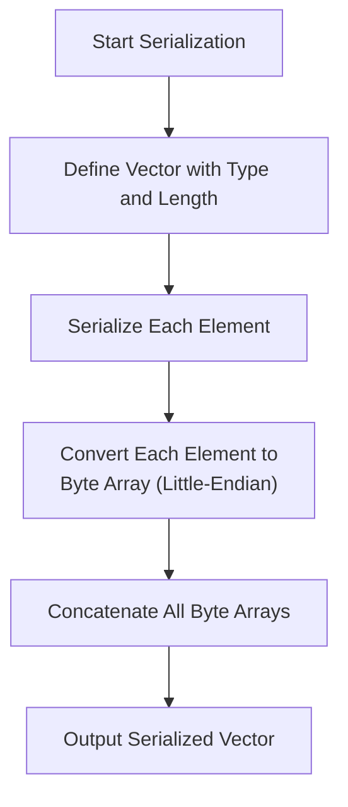

_图：向量的 SSZ 序列化 ._


**固定长度定义**： 
- 向量是用它们可以容纳的特定长度和元素类型来定义的，例如 `Vector[uint64, 4]` 表示包含四个 64 位无符号整数的向量。

**元素序列化**：
- 向量中的每个元素根据其类型独立序列化。 
- 对于整数或布尔值等基本类型，这意味着将每个元素转换为其字节表示形式。 
- 如果元素是复合类型，则每个元素根据其特定的序列化规则进行序列化。

**串联**：
- 每个元素的序列化输出按照它们在向量中出现的顺序连接起来。 
- 由于向量的长度和每个元素的大小已知且固定，因此序列化输出中不需要额外的元数据(如长度前缀)。

**示例：**
- 对于具有元素 `[256, 512, 768]` 的 `Vector[uint64, 3]`，每个元素都是 64 位或 8 字节长。 序列化将按如下方式进行：

**将每个整数转换为 Little-Endian 字节数组**：
- `256` 为 `uint64` 变为 `00 01 00 00 00 00 00 00`。
- `512` 为 `uint64` 变为 `00 02 00 00 00 00 00 00`。
- `768` 为 `uint64` 变为 `00 03 00 00 00 00 00 00`。

**连接这些字节数组**：
- 生成的串联字节数组将为 `00 01 00 00 00 00 00 00 00 02 00 00 00 00 00 00 00 03 00 00 00 00 00 00`。

**序列化输出**：
- `00 01 00 00 00 00 00 00 00 02 00 00 00 00 00 00 00 03 00 00 00 00 00 00`.


**SSZ 向量反序列化**

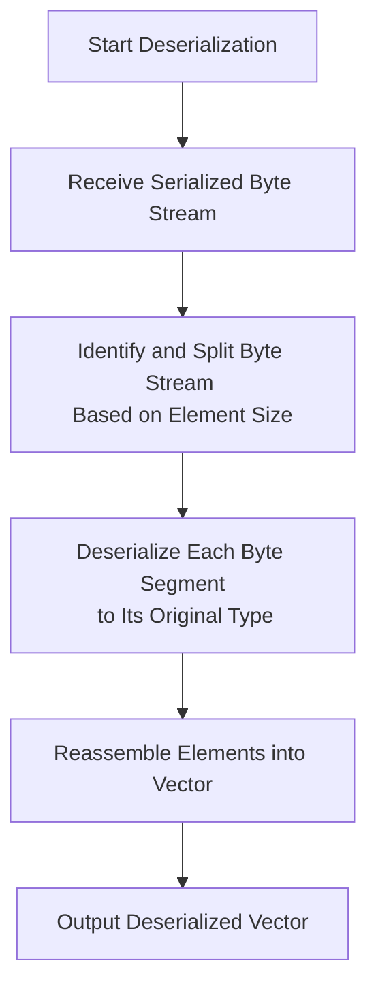

_图：SSZ 向量反序列化._


**固定长度利用率**：
- 解串器使用向量的预定义长度和类型来解析序列化数据。
- 它确切地知道每个元素占用多少字节以及向量中有多少个元素。

**元素反序列化**：
- 字节流被分成与每个元素的大小相对应的段。
- 每个段根据向量中元素的类型独立反序列化。

**重建**：
- 元素被重建为其原始形式(例如，将字节数组转换回整数或其他指定类型)。
- 然后聚合这些元素以重组原始向量。

**示例：**
- 给定 `Vector[uint64, 3]` 的序列化数据
- 序列化字节数组：`00 01 00 00 00 00 00 00 00 02 00 00 00 00 00 00 00 03 00 00 00 00 00 00`。

**将数据解析成段**：
- 每个段由 8 个字节组成。
- 第一段：`00 01 00 00 00 00 00 00` → 代表整数 256。
- 第二段：`00 02 00 00 00 00 00 00` → 代表整数 512。
- 第三段：`00 03 00 00 00 00 00 00` → 代表整数 768。

**将每个段从 Little-Endian 字节数组转换回整数**：
- 使用小端格式，读取每个字节数组并将其转换回相应的 `uint64` 整数。

**重建**：
- 重建的向量是`[256, 512, 768]`。

我们可以在 python 中运行并验证它，如下所示：

```python
>>> from eth2spec.utils.ssz.ssz_typing import uint8, uint16, Vector
>>> Vector[uint16, 3](256, 512, 768).encode_bytes().hex()
'000100000000000000020000000000000003000000000000'
>>> print(Vector[uint64, 3].decode_bytes(bytes.fromhex('000100000000000000020000000000000003000000000000')))
Vector[uint64, 3]<<len=3>>(256, 512, 768)
>>> 

```

### 列表

SSZ 中的列表对于管理指定最大长度 (`N`) 内同质元素的可变长度集合至关重要。这种灵活性允许动态管理数据结构，例如交易集或可变状态组件，以适应网络不断变化的需求。

**SSZ 序列化用于列表**

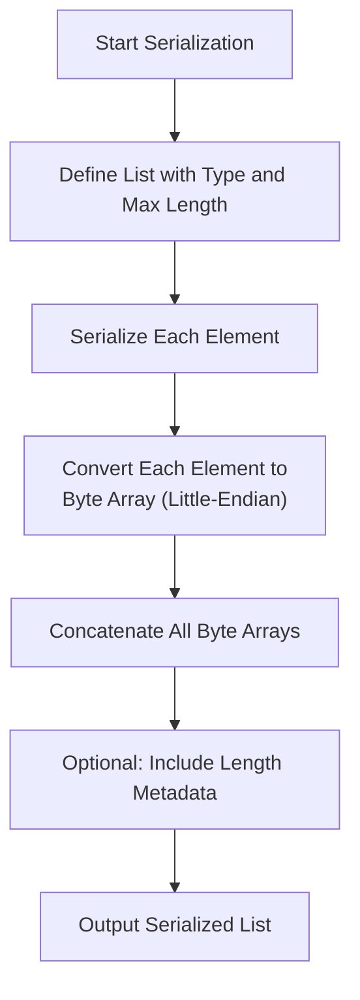

_图：SSZ 序列化列表._

**定义列表**： 
- SSZ 中的列表使用特定元素类型和最大长度定义，记为 `List[type, N]`。该定义不仅限制了列表的最大容量，还告知了元素应如何序列化。

**元素序列化**：
- 列表中的每个元素都根据其类型进行序列化。对于 `uint64` 元素，序列化过程涉及将每个整数转换为字节数组。

**连接序列化元素**：
- 序列化元素的输出按顺序连接。序列化数据的总长度根据序列化时存在的元素数量而变化。

**包括长度元数据(可选)**：
- 根据实现要求，列表的长度可能会明确包含在序列化数据的开头，以帮助反序列化期间的解析和验证。

**示例**： 
- 对于包含元素 `[1024, 2048, 3072]` 的 `List[uint64, 5]`，序列化过程将涉及：
- 将每个整数转换为小端格式的字节数组：`00 04 00 00 00 00 00 00`、`00 08 00 00 00 00 00 00`、`00 0C 00 00 00 00 00 00`。
- 连接这些数组会得到：`00 04 00 00 00 00 00 00 00 08 00 00 00 00 00 00 00 0C 00 00 00 00 00 00`。

**SSZ 列表反序列化**

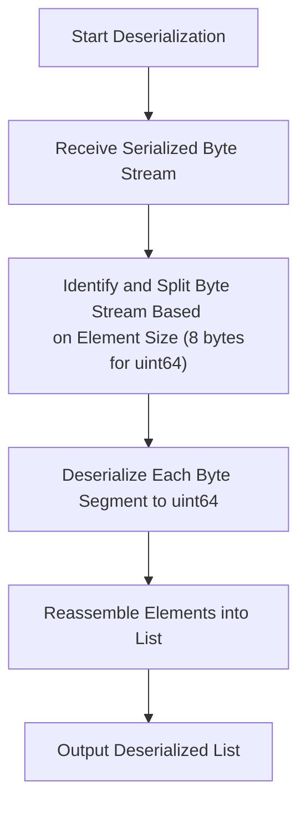

_图：SSZ 列表反序列化._

**接收序列化数据**： 
- 列表的序列化字节流是输入，其中包含每个元素的字节数组序列。

**解析并反序列化每个元素**：
- 根据元素类型(例如 `uint64`)，将序列化流解析为 8 字节段。
- 将每个字节数组从小端格式转换回 `uint64`。

**重新组合列表**：
- 重新组装反序列化的元素以重新创建原始列表。

**示例**： 
- 给定 `List[uint64, 5]` 的序列化数据 `00 04 00 00 00 00 00 00 00 08 00 00 00 00 00 00 00 0C 00 00 00 00 00 00`
- 将数据分成 8 个字节的段：`00 04 00 00 00 00 00 00`、`00 08 00 00 00 00 00 00`、`00 0C 00 00 00 00 00 00`。
- 将每个段从小端转换为整数：`1024`、`2048`、`3072`。
- 重建后的列表为`[1024, 2048, 3072]`。

我们可以运行并验证上面示例的 SSZ，如下所示：

```python
>>> from eth2spec.utils.ssz.ssz_typing import uint8, List, Vector
>>> List[uint64, 5](1024, 2048, 3072).encode_bytes().hex()
'00040000000000000008000000000000000c000000000000'
>>> Vector[uint64, 3](1024, 2048, 3072).encode_bytes().hex()
'00040000000000000008000000000000000c000000000000'
>>> print(List[uint64, 5].decode_bytes(bytes.fromhex('00040000000000000008000000000000000c000000000000')))
List[uint64, 5]<<len=3>>(1024, 2048, 3072)
>>> 
```

列表是 SSZ 中可变大小的对象，当包含在另一个对象中时，它们的编码方式与固定大小的向量不同，因此开销很小。例如，下面的 `Alice` 和 `Bob` 对象具有不同的编码。

```python
>>> from eth2spec.utils.ssz.ssz_typing import uint8, Vector, List, Container
>>> class Alice(Container):
...     x: List[uint8, 3] # Variable sized
>>> class Bob(Container):
...     x: Vector[uint8, 3] # Fixed sized
>>> Alice(x = [1, 2, 3]).encode_bytes().hex()
'04000000010203'
>>> Bob(x = [1, 2, 3]).encode_bytes().hex()
'010203'
>>> 
```

### 位向量

SSZ 中的位向量用于管理固定长度的布尔值序列，通常表示为位。这种数据结构对于紧凑地存储二进制数据或标志特别有效，这些数据或标志在 Ethereum 应用程序中很常见，用于指示状态条件、权限或其他二进制设置。

**SSZ 序列化用于位向量**

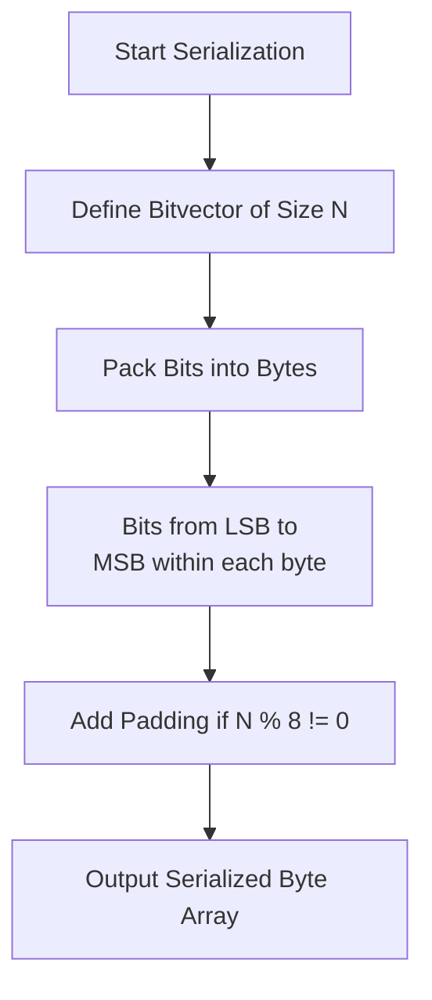

_图：SSZ 序列化位向量._

**定义位向量**： 
- SSZ 中的位向量由其长度 `N` 定义，它指定位数。例如，`Bitvector[256]` 表示包含 256 位的位向量。

**将位转换为字节**：
- 位向量中的每一位代表一个布尔值，其中 `0` 对应于 `False`，`1` 对应于 `True`。
- 这些位被打包成字节，每个字节中首先是最低有效位 (LSB)。这意味着位向量中的第一位对应于第一个字节的 LSB。

**字节数组形成**：
- 通过将 8 位打包到每个字节中，将这些位序列化为字节数组，直到所有位都被考虑在内。
- 如果 `N` 不是 8 的倍数，则最后一个字节将包含少于 8 位的数据，并在最高有效位位置用零填充。

**示例**：对于具有模式 `1011010010` 的 `Bitvector[10]`：
- 前 8 位 (`10110100`) 构成第一个字节。
- 剩余 2 位 (`10`) 用六个零填充以形成第二个字节：`10000000`。
- 序列化输出为十六进制的 `B4 80`。

**SSZ 位向量反序列化**

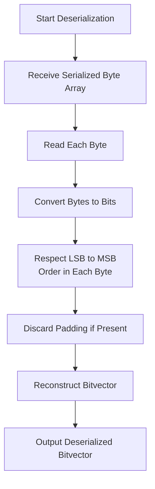

_图：SSZ 位向量反序列化._

**读取序列化字节数组**： 
- 从编码位向量的字节数组开始。

**从字节中提取位**：
- 将每个字节转换回位。请记住，每个字节中的位首先存储为 LSB。
- 如果位向量的长度 `N` 不是 8 的倍数，则丢弃最终字节中的无关填充位。

**Reconstruct the Bitvector**:
- 将提取的位重新组装为原始位向量格式，遵循指定的长度 `N`。

**示例**：给定 `Bitvector[10]` 的序列化数据 `B4 80`：
- 将 `B4`(二进制的 `10110100`)和 `80`(二进制的 `10000000`)转换回位。
- 从二进制序列中提取前 10 位：`1011010010`。
- The reconstructed bitvector is `1011010010`.

You can run and verify it in python as below:

```python
>>> from eth2spec.utils.ssz.ssz_typing import Bitvector
>>> Bitvector[8](0,0,1,0,1,1,0,1).encode_bytes().hex()
'b4'
>>> Bitvector[8](0,0,0,0,0,0,0,1).encode_bytes().hex()
'80'
```

请注意，从功能上讲，我们可以使用 `Vector[boolean, N]` 或 `Bitvector[N]` 来表示位列表。然而，在实践中，后者的序列化最多短八倍，因为前者每位将使用整个字节。

```python
>>> from eth2spec.utils.ssz.ssz_typing import Vector, Bitvector, boolean
>>> Bitvector[5](1,0,1,0,1).encode_bytes().hex()
'15'
>>> Vector[boolean,5](1,0,1,0,1).encode_bytes().hex()
'0100010001'
```

### 位列表

SSZ 中的位列表与位向量类似，但设计用于处理具有指定最大长度 (`N`) 的布尔值的可变长度序列。 

**SSZ 序列化用于位列表**

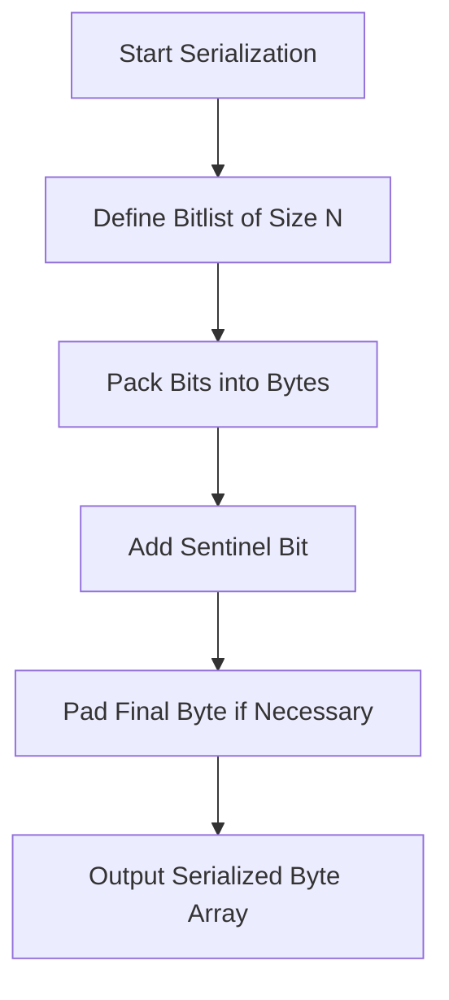

_图：SSZ 序列化位列表._


**定义位列表**： 
- 位列表由其最大长度 `N` 定义，它确定可以包含的位的上限。然而，实际位数可能小于 `N`。

**将位打包成字节**：
- 位列表中的每一位代表一个布尔值，其中`0`对应于`False`，`1`对应于`True`。
- 这些位被序列化为字节数组，每个字节内从 LSB 到 MSB 打包，类似于位向量。

**添加哨兵位**：
- 为了标记位列表的末尾并区分其实际长度和最大容量，将哨兵位 (`1`) 添加到位序列的末尾。这对于确保反序列化过程准确识别位列表的长度至关重要。

**字节数组形成和填充**：
- 包含哨兵位后，这些位将被打包成字节，如果总位数(包括哨兵)不能被 8 整除，则对最后一个字节应用任何必要的填充以完成该字节。


**SSZ 位列表反序列化**

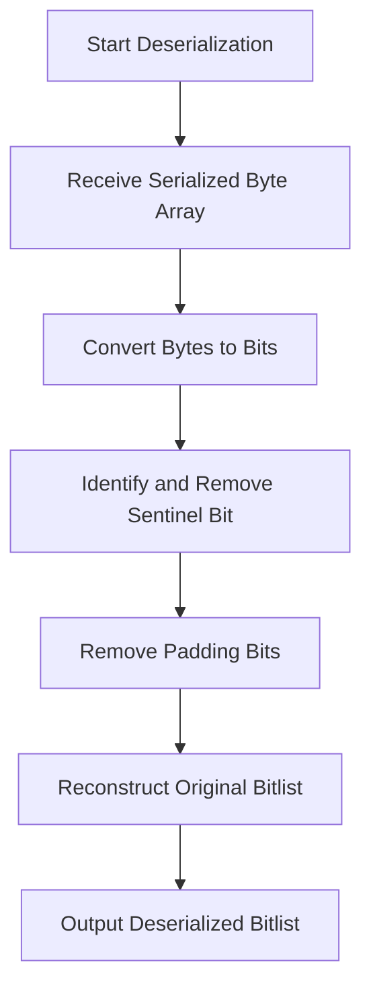

_图：SSZ 位列表反序列化._

**Receive Serialized Byte Array**: 
- 从编码位列表的字节数组开始，包括哨兵位。

**从字节中提取位**：
- 将每个字节转换回位，遵循顺序(LSB 到 MSB)。
- 对序列化数据中的每个字节继续此过程。

**识别并删除哨兵位**：
- 提取位时，从位序列末尾找到第一个 `1`(哨兵位)，以确定位列表数据的实际末尾。
- 哨兵位之后的所有位都被视为填充而被忽略。

**重建位列表**：
- 将提取的位(不包括哨兵位和任何填充)重新组装为原始位列表格式。

您可以像下面这样运行 Bitlist 的编码：

```python
>>> from eth2spec.utils.ssz.ssz_typing import Bitlist
>>> Bitlist[100](0,0,0).encode_bytes().hex()
'08'
```

作为哨兵的结果，如果位列表的实际长度是八的倍数(无论最大长度 `N` 是多少)，我们需要一个额外的字节来序列化位列表。位向量的情况并非如此。

```python
>>> Bitlist[8](0,0,0,0,0,0,0,0).encode_bytes().hex()
'0001'
>>> Bitvector[8](0,0,0,0,0,0,0,0).encode_bytes().hex()
'00'
```

### Container

SSZ 中的容器是用于将多个字段分组为单个复合类型的基本结构。容器内的每个字段可以是任何 SSZ 支持的类型，包括 `uint64` 等基本类型，以及其他容器、向量或列表等更复杂的类型。容器类似于编程语言中的结构或对象，使它们成为表示 Ethereum 中复杂和嵌套数据结构的组成部分。

**SSZ 序列化用于容器**

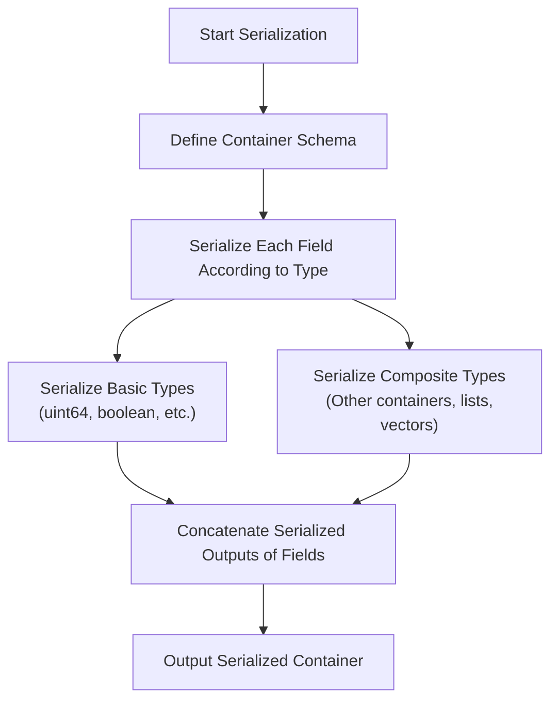

_图：SSZ 序列化容器._

**定义容器**： 
- SSZ 中的容器由其架构定义，该架构指定其字段的类型和顺序。该模式至关重要，因为它规定了数据应如何序列化和反序列化。

**序列化每个字段**：
- 容器中的每个字段都按照架构定义的顺序进行序列化。
- 每个字段的序列化方法取决于其类型：
- **基本类型** 直接转换为其字节表示形式。
- **复合类型**(其他容器、列表、向量)根据自己的规则递归序列化。

**连接序列化字段**：
- 所有字段的序列化输出被串联起来形成容器的完整序列化数据。
- 如果字段具有可变大小(例如具有可变长度的列表或向量)，则其序列化数据包括长度前缀，或者可以使用偏移量来指示数据的开始，具体取决于实现和类型的具体情况。

**SSZ 容器反序列化**

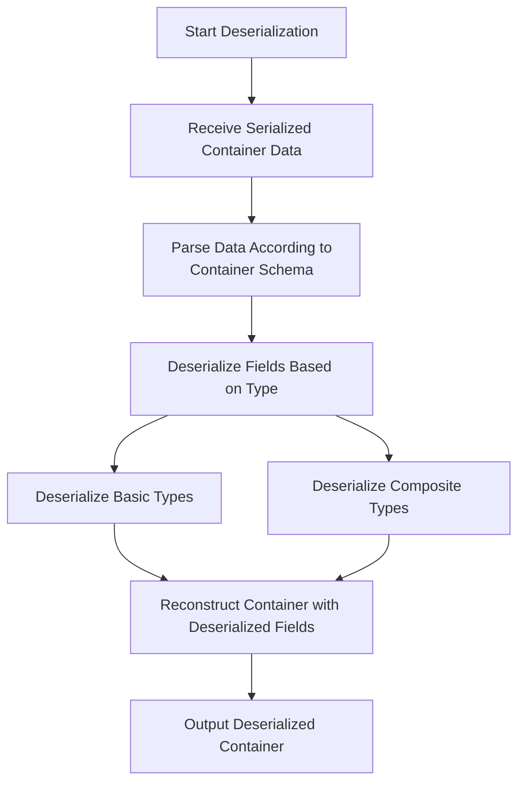

_图：SSZ 容器反序列化._

**读取序列化数据**： 
- 从表示容器的序列化字节流开始。

**根据 Schema 解析序列化数据**：
- 根据容器的架构，将序列化数据解析为其组成字段。
- 这需要了解每个字段的类型和大小才能正确提取和反序列化每个字段。

**反序列化每个字段**：
- 每个字段的数据根据其类型进行反序列化。
- 反序列化可能涉及将字节数组转换回整数、解码嵌套容器或从序列化形式重建列表和向量。

**重建容器**：
- 当每个字段被反序列化时，通过将每个字段放回其定义的位置来重建容器。

**示例**：

让我们使用 Beacon Chain 中的 `IndexedAttestation` 容器的具体示例来研究序列化和反序列化过程。此示例将概述如何在 SSZ 中处理和处理复杂的嵌套容器，特别是涉及固定大小和可变大小数据类型的容器。

`IndexedAttestation` 容器如下所示。

```python
class IndexedAttestation(Container):
    attesting_indices: List[ValidatorIndex, MAX_VALIDATORS_PER_COMMITTEE]
    data: AttestationData
    signature: BLSSignature
```

它包含一个 `AttestationData` 容器，

```python
class AttestationData(Container):
    slot: Slot
    index: CommitteeIndex
    beacon_block_root: Root
    source: Checkpoint
    target: Checkpoint
```

其中又包含两个 `Checkpoint` 容器，

```python
class Checkpoint(Container):
    epoch: Epoch
    root: Root
```    

**IndexedAttestation 容器结构**

`IndexedAttestation` 容器包含多个字段，其中一些是固定大小的基本类型，其他字段是复合类型，包括另一个容器 (`AttestationData`) 和列表(如 `attesting_indices`)。

结构如下：

- **attesting_indices**：`List[ValidatorIndex, MAX_VALIDATORS_PER_COMMITTEE]`(可变大小)
- **数据**：`AttestationData`(复合容器)
- **签名**：`BLSSignature`(固定大小)

**证明数据容器结构**

- **时隙**：`Slot`(固定大小)
- **索引**：`CommitteeIndex`(固定大小)
- **beacon_block_root**：`Root`(固定大小)
- **来源**：`Checkpoint`(复合容器)
- **目标**：`Checkpoint`(复合容器)

**检查点容器结构**
- **epoch**：`Epoch`(固定大小)
- **根**：`Root`(固定大小)

**序列化流程**

- **序列化固定和可变组件**
  - `IndexedAttestation` 的序列化涉及根据其类型序列化每个组件：

- **序列化固定大小的元素**
  - 每个固定大小的元素(`Slot`、`CommitteeIndex`、`Epoch`、`Root`、`BLSSignature`)都序列化为其相应的字节格式，对于数字类型通常为小端格式。

- **序列化可变大小的元素**
  - `List[ValidatorIndex, MAX_VALIDATORS_PER_COMMITTEE]` 通过首先记录列表的长度，然后记录每个索引的序列化形式来序列化。
  - 如果列表或另一个可变大小元素为空或未达到最大容量，则它仅消耗实际数据所需的空间，以及可能的一些长度或偏移元数据。

- **连接序列化数据**
  - 所有序列化字节都按照容器结构指定的顺序连接起来。固定大小字段直接按顺序放置，而可变大小字段可能包括偏移量或长度作为序列化的一部分。

**序列化输出示例**

```python
from eth2spec.utils.ssz.ssz_typing import *
from eth2spec.capella import mainnet
from eth2spec.capella.mainnet import *

attestation = IndexedAttestation(
    attesting_indices = [33652, 59750, 92360],
    data = AttestationData(
        slot = 3080829,
        index = 9,
        beacon_block_root = '0x4f4250c05956f5c2b87129cf7372f14dd576fc152543bf7042e963196b843fe6',
        source = Checkpoint (
            epoch = 96274,
            root = '0xd24639f2e661bc1adcbe7157280776cf76670fff0fee0691f146ab827f4f1ade'
        ),
        target = Checkpoint(
            epoch = 96275,
            root = '0x9bcd31881817ddeab686f878c8619d664e8bfa4f8948707cba5bc25c8d74915d'
        )
    ),
    signature = '0xaaf504503ff15ae86723c906b4b6bac91ad728e4431aea3be2e8e3acc888d8af'
                + '5dffbbcf53b234ea8e3fde67fbb09120027335ec63cf23f0213cc439e8d1b856'
                + 'c2ddfc1a78ed3326fb9b4fe333af4ad3702159dbf9caeb1a4633b752991ac437'
)

print(attestation.encode_bytes().hex())
```

表示此 `IndexedAttestation` 对象的数据的序列化 blob 的结果为(十六进制)：

```code
e40000007d022f000000000009000000000000004f4250c05956f5c2b87129cf7372f14dd576fc15
2543bf7042e963196b843fe61278010000000000d24639f2e661bc1adcbe7157280776cf76670fff
0fee0691f146ab827f4f1ade13780100000000009bcd31881817ddeab686f878c8619d664e8bfa4f
8948707cba5bc25c8d74915daaf504503ff15ae86723c906b4b6bac91ad728e4431aea3be2e8e3ac
c888d8af5dffbbcf53b234ea8e3fde67fbb09120027335ec63cf23f0213cc439e8d1b856c2ddfc1a
78ed3326fb9b4fe333af4ad3702159dbf9caeb1a4633b752991ac437748300000000000066e90000
00000000c868010000000000
```

**序列化输出的详细信息**

为了清楚地解释示例中的序列化过程以及 `IndexedAttestation` 容器的序列化数据的结构，让我们将序列化分解为各个组件，并了解每个部分在字节流中的表示方式。此解包有助于说明 SSZ 格式如何管理复杂的数据结构。

**第 1 部分：固定大小元素**

**可变大小列表的 4 字节偏移量 (`attesting_indices`)**：
- **字节偏移**：`00`
- **值**：`e4000000`
- **解释**：这表示序列化字节流中`attesting_indices`列表的开始。十六进制值 `e4` 转换为十进制为 `228`，这意味着列表从字节流开头的字节 `228` 开始。

**时隙(uint64)**：
- **字节偏移**：`04`
- **值**：`7d022f0000000000`
- **说明**：表示序列化为 64 位无符号整数的`slot`字段。小端格式的十六进制 `7d022f00` 转换为十进制 `3080829`，即时隙数字。

**委员会索引 (uint64)**：
- **字节偏移**：`0c`
- **值**：`0900000000000000`
- **说明**：这是 `index` 字段，将委员会索引表示为 64 位无符号整数。值 `09` 表示委员会索引 `9`。

**Beacon block 根(字节 32)**：
- **字节偏移**：`14`
- **值**：`4f4250c05956f5c2b87129cf7372f14dd576fc152543bf7042e963196b843fe6`
- **解释**：这是一个 256 位的哈希，存储为`Bytes32`，代表 Beacon block 的根哈希。

**来源检查点 epoch (uint64) 和根 (Bytes32)**：
- **epoch 字节偏移**：`34`
- **epoch 值**：`1278010000000000`
- **根字节偏移**：`3c`
- **根值**：`d24639f2e661bc1adcbe7157280776cf76670fff0fee0691f146ab827f4f1ade`
- **说明**：源检查点包含 `epoch` (96274) 和 `root`。根是另一个 256 位哈希。

**目标检查点 epoch (uint64) 和根 (Bytes32)**：
- **epoch 字节偏移**：`5c`
- **epoch 值**：`1378010000000000`
- **根字节偏移**：`64`
- **根值**：`9bcd31881817ddeab686f878c8619d664e8bfa4f8948707cba5bc25c8d74915d`
- **解释**：与源类似，目标检查点包括 `epoch` (96275) 和 `root`，详细说明了证明的预期目标。

**签名(BLSSignature/Bytes96)**：
- **字节偏移**：`84`
- **值**：由于其长度(总共 96 个字节)而连接在多行上。
- **说明**：这是证明的加密签名，验证其真实性。

**第 2 部分：可变大小元素**

**证明索引(列表[uint64，MAX_VALIDATORS_PER_COMMITTEE])**：
- **字节偏移**：`e4`
- **值**：`748300000000000066e9000000000000c868010000000000`
- **解释**：这表示正在证明区块的 验证者索引列表。它从偏移量 `228` 开始，包含 `33652`、`59750` 和 `92360` 等索引。


## 资源
- [简单序列化](https://ethereum.org/en/developers/docs/data-structures-and-encoding/ssz/)
- [SSZ 规范](https://github.com/ethereum/consensus-specs/blob/dev/ssz/simple-serialize.md)
- [eth2book - SSZ](https://eth2book.info/capella/part2/building_blocks/ssz/#ssz-simple-serialize)
- [Go 为 Ethereum 编写序列化库的经验教训](https://rauljordan.com/go-lessons-from-writing-a-serialization-library-for-ethereum/)
- [交互式 SSZ 串行器/解串器](https://www.ssz.dev/)
- [Protolambda 的 SSZ 编码图](https://github.com/protolambda/eth2-docs#ssz-encoding)
- [Raul Jordan 的 SSZ 解释](https://rauljordan.com/go-lessons-from-writing-a-serialization-library-for-ethereum/)
- [SSZ 规范](https://github.com/ethereum/consensus-specs/blob/v1.3.0/ssz/simple-serialize.md)
- [为什么 Ethereum 客户端更喜欢 SSZ 而不是 RLP？](https://etherworld.co/2023/01/25/why-ethereum-clients-prefer-ssz-over-rlp/)