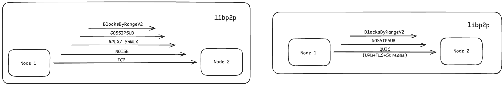
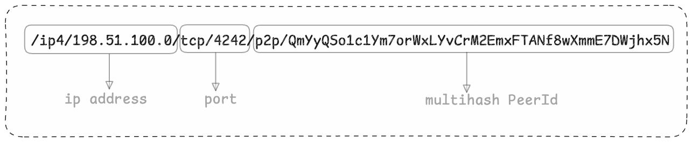
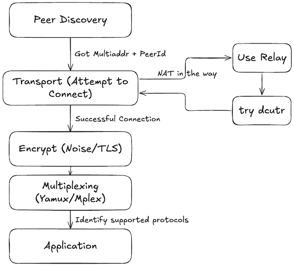
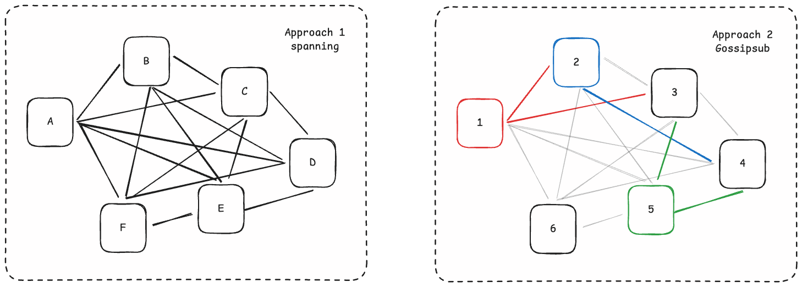
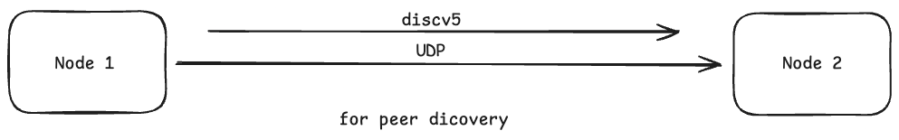

# 网络

共识客户端使用 [libp2p][libp2p-docs] 作为点对点协议，[libp2p-noise][libp2p-noise] 用于加密，[discv5][discv5] 用于对等节点发现， [SSZ][ssz] 用于编码，并且可选地 [Snappy][snappy] 用于压缩。

对于那些希望加深对 libp2p 的理解的人，Dapplion 的学习小组第 5 周会议，[第 19 讲](https://epf.wiki/#/eps/day19) 是一个很好的资源。

## 规范

[阶段 0 -- 网络][consensus-networking] 页面指定网络基础知识、协议和基本原理/设计选择。随后的分叉还指定在相应分叉中完成的更改。

## libp2p - P2P 协议

[libp2p][libp2p-docs] 是对等节点到 对等节点通信的协议，最初是为 [IPFS](https://ipfs.io) 开发的。 [libp2p 和 Ethereum][libp2p-and-eth] 是一篇深入探讨 libp2p 历史及其在 Consensus Layer 中采用的好文章。它允许通过多种传输协议进行通信，例如 TCP、QUIC、WebRTC 等。

<figure class="diagram" style="text-align:center">

<figcaption>

_作为 libp2p 一部分的各种协议。左：当前右：使用 QUIC_

</figcaption>
</figure>

libp2p 协议是一个多传输堆栈。

1. **传输**：它必须支持 TCP (传输控制协议)，可能支持 [QUIC][quic](快速 UDP Internet 连接)，它必须允许传入和传出连接。 TCP 和 QUIC 都支持 IPv4 和 IPv6，但为了更好的兼容性，需要 IPv4 支持。
2. **加密和识别**：[libp2p-noise][libp2p-noise]安全通道用于加密，并使用[multiaddress][multiaddr](通常缩写为 multiaddr) 是将多层寻址编码为单个“面向未来”路径结构的约定。

- **多地址**：多地址定义了常见传输和覆盖协议的人类可读和机器优化的编码，并允许多层寻址组合在一起并使用。  例如：下面给出的寻址格式是“位置多地址”(ip 和端口) 和身份多地址 (libp2p 对等节点 id) 的组合。

<figure class="diagram" style="text-align:center">

<figcaption>

_多地址格式_

</figcaption>
</figure>

3. **多路复用**：多路复用允许多个独立的通信流在单个网络连接上同时运行。 libp2p 实现中常见两个多路复用器：[mplex][mplex] 和 [yamux][yamux]。它们的协议 ID 分别为：`/mplex/6.7.0`和`/yamux/1.0.0`。 客户端必须支持 mplex，并且可以支持 yamux，并优先考虑后者。
4. **消息传递**：为了通过网络传递消息，libp2p 实现了 [Gossipsub][gossipsub](PubSub) 和 [Req/Resp][req-resp](Request/Response)。 Gossipsub 使用主题进行通信，Req/Resp 使用消息进行通信。

### **libp2p 协议栈**

| **层** | **协议** | **目的** |
| ------------------------- | ------------------------------------------------------------------------------------- | ----------------------------------------------------------------------- |
| 🧠 **应用层** | `pubsub`、`gossipsub`、`ping`、自定义协议 | 运行用户定义或内置逻辑 (聊天、文件传输、发布-订阅等) |
| 🔀 **复用层** | `yamux`, `mplex` | 允许单个连接上的多个逻辑流 |
| 🔐 **安全层** | `noise`、`tls`、`secio`(已弃用) | 加密和验证对等节点连接 |
| 🔌 **传输层** | `tcp`、`websockets`、`quic`(具有多路复用和安全性)、`webrtc`、`webtransport` | 处理机器之间的物理或虚拟数据传输 |
| 🌍 **NAT/ 中继层** | `relay`、`dcutr`、`autonat`、`pnet` | 通过 NAT/ 防火墙或专用网络启用连接 |
| 📡 **发现层** | `mdns`、`kademlia`、`rendezvous`、`identify` | 在网络上查找并了解对等节点 |

### 注意事项：

- **并非所有协议都是必需的** — libp2p 是模块化的，您可以仅选择您需要的协议。
- 最小连接至少包括：`transport` + `security` + `multiplexing` + `application protocol`。
- 当 NAT 阻止直接连接时，使用 `relay` 和 `dcutr`。

libp2p 的主要特点：

1. **协议 ID：** 是用于协议协商的唯一字符串标识符。它们的基本结构是：`/app/protocol/version`。一些常见的协议，都是使用 protobuf 来定义消息方案，定义有：

- Ping：`/ipfs/ping/1.0.0` 是一个简单的协议，用于测试已连接对等节点的连接性和性能
- 识别：`/ipfs/id/1.0.0` 允许对等节点交换彼此的信息，主要是公钥和知道网络地址。使用以下 protobuf 属性：
  | 领域 | 类型 | 目的 |
  |-------------------|-----------|-------------------------------------------------------------------------|
  | `protocolVersion` | `string` | libp2p 协议版本 (例如 `ipfs/1.0.0`) |
  | `agentVersion` | `string` | 客户端信息 (如浏览器的用户代理，例如 `go-ipfs/0.1.0`) |
  | `publicKey` | `bytes` | 节点的公钥 (用于身份，如果使用安全通道则可选) |
  | `listenAddrs` | `bytes[]` | 对等节点正在监听的多地址 |
  | `observedAddr` | `bytes` | 对等节点看到的您的 IP 地址 (有助于 NAT 检测) |
  | `protocols` | `string[]` | 支持的应用程序协议列表 (例如 `/chat/1.0.0`) |
  | `signedPeerRecord` | `bytes` | `listenAddrs` 的认证版本，可与其他对等节点共享 |

- 识别/推送：`/ipfs/id/push/1.0.0` 与“识别”相同，只是这是主动发送的，而不是响应请求。将新地址推送到其连接的对等节点很有用。

**kad-dht**：libp2p 使用基于 [Kademlia][kademlia] 路由算法的分布式哈希表 (DHT) 来实现其路由功能。

2. **处理函数：** 在传入流期间调用
3. **双向二进制流：** libp2p 协议发生的介质

### **对等节点**

#### 对等节点 ID

[对等节点 Identity][peer-identity] 是对网络中特定对等节点的唯一引用，并且只要对等节点存在就保持不变。 对等节点 Id 为 [multihashes][multihash]，它们是具有以下格式的自描述值： 

`<varint hash function code><varint digest size in bytes><hash function output>`

<figure class="diagram" style="text-align:center">

<figcaption>

_多重哈希格式，十六进制_

</figcaption>
</figure>

- 密钥被编码在包含密钥类型和编码密钥的 protobuf 中。指定的编码方法有 4 种：RSA、Ed255199v (必须)、Secp256k1、ECDSA。
- 文本中对等节点 ID 的字符串表示有两种方式：`base58btc`(以 `QM` 或 `1` 开头) 和作为多库编码的 CID，libp2p 慢慢转向后者。

### **如何建立连接？**

要了解设置连接的工作原理，请阅读[规范][libp2p-connection]。

<figure class="diagram" style="text-align:center">

<figcaption>

_建立连接的流程图_

</figcaption>
</figure>

1. **发现**：如何找到另一个对等节点？

- `mdns`(多播 DNS)：零配置发现同一本地网络上的对等节点，非常简单。发送对所有对等节点的查询，接收响应和其他对等节点的信息到本地数据库中。
- `rendezvous`：对等节点在共享的公共对等节点或服务器 (集合点) 上注册自己，其他人查询同一点以获取对等节点信息
- `kademlia` (DHT)：用于全局发现的分布式哈希表。 对等节点使用对等节点 ID 查询 DHT 以获取其最新的多地址。
- `identify`：允许对等节点在连接后交换元数据 (地址、支持的协议、版本等) 的协议

结果：我们现在有了一个可以通过对等节点 ID 识别的对等节点列表，并且可以通过 multiaddrs 访问 (IP + 端口 + 协议栈)

2. **交通**：如何连接对等节点？

- `TCP`：最基本的传输，可靠，但可能被 NAT/ 防火墙阻止
- `WebSockets`：TCP 超过 HTTP，NAT/ 防火墙友好
- `QUIC`：基于 UDP，更快的连接设置，原生支持多路复用和加密 (TLS 1.3)
- `WebRTC`：启用两个私有节点 (例如两个浏览器) 建立直接连接
- `WebTransport`：建立到服务器的流复用和双向连接，在 HTTP/3 连接之上运行，并使用 HTTP/2 进行回退

如果对等节点在 NAT 后面 (直接连接失败时)：

- `relay`：它就像 TURN，通过另一个对等节点路由
- `dcutr`(通过中继直接连接升级)：用于尝试使用[打孔][hole-punching]将中继连接替换为直接连接。它涉及来自对等节点的同时拨号尝试。

3. **加密**：如何使连接私密并经过身份验证？

- `noise`：用于构建安全协议的框架，快速，许多默认选择，Noise XX 握手用于相互身份验证。
- `tls`(传输层安全)：强大的安全保证，使用对等节点的密钥完成相互验证
- `secio`：由于复杂性和与 Noise/TLS 相比较低的保证而被弃用。

4. **多路复用**：如何通过同一连接打开多个逻辑流？

- `yamux`：简单、快速，目前是许多实现中的默认值。
- `mplex`：轻量级且较旧

5. **应用程序**：在上述设置上运行应用程序协议

- `ping`：基本活跃度检查，测量往返时间
- `pubsub`、`gossipsub`、`episub`：用于广播消息
- 实现定义的自定义协议

### GossipSub 提供了哪些优化？

**方法 1：** 维护完全连接的网格 (所有对等节点彼此连接为 1:1)，其扩展性很差 (O (n^2))。为什么它的扩展性很差？每个节点可能会从其他 (n-1) 个节点接收相同的消息，因此浪费大量带宽。如果消息是区块数据，那么浪费的带宽是指数级的大。

**方法 2：** Pubsub (发布-订阅模型) 消息传递模式用于发送者 (发布者) 不直接向接收者 (订阅者) 发送消息的情况。相反，消息被发布到公共通道 (或主题)，订阅者从该通道接收消息，而无需与发布者直接交互。 节点与某个主题的特定数量的其他节点网格，以及与其他节点的网格。因此，允许更有效的消息传递。

<figure class="diagram" style="text-align:center">

<figcaption>

_Gossipsub 优化_

</figcaption>
</figure>

###### **八卦子：TODO**

###### **请求/回复：TODO**

###### **QUIC: TODO**

## libp2p- 噪声 - 加密

[Noise 框架][noise-framework]本身并不是一个协议，而是一个用于设计密钥交换协议的框架。 [规范][noise-specification]是一个很好的起点。

有许多[模式][noise-patterns]描述了密钥交换过程。共识客户端中使用的模式是 [`XX`][noise-xx](传输-传输)，这意味着发起者和响应者都在密钥交换的初始阶段传输其公钥。

## ENR (Ethereum 节点记录)

[Ethereum 节点记录][ENR] 提供一种结构化、灵活的方式来存储和共享 Ethereum 的 点对点网络中的节点身份和连接详细信息。它是一种面向未来的格式，允许在新的对等节点之间更轻松地交换标识信息，并且是 Ethereum 节点的首选[网络地址格式][network-add-format]。

其核心组件是：

1. **签名**：每条记录都使用身份方案 (例如 secp256k1) 进行签名，以确保真实性。
2. **序列号** (seq)：一个 64 位无符号整数，每当记录更新时都会递增，允许对等节点确定最新版本。
3. **键/值对**：记录将各种连接详细信息保存为键值对。

在其文本形式中，ENR 的 RLP 以 Base64 编码，并且可以作为字符串在客户端之间共享，例如：
`
enr:-Jq4QOXd31zNJBTBAT0ZZIRWH4z_NmRhnmAFfwNan0zr_-IUUAsOTbU_Lhzh4BSq8UknFGvr1rXQUYK0P-_ZUVenXkABhGV0aDKQaGGQMVAAEBv__ ________4JpZIJ2NIJpcIRBbZouiXNly3AyNTZrMaEDxEARICqVUZNxhUxBYHZjzsm4KxqraeSION3yYorLZSuDdWRwgiMp
`
## 光盘 v5

发现版本 5 [(discv5)][discv5](协议版本 v5.1) 是基于 UDP 的节点发现协议。在协议级别，它是一个受 Kademlia 启发的 DHT，用于存储和中继签名的 Ethereum 节点记录 (ENR) 而不是任意键值对。每个节点通过 k-buckets 路由表中节点 ID 之间的 XOR 距离来组织其他节点，使其能够跟踪地址空间中附近的对等节点并逐步改善其网络视图。

Discv5 中的对等节点发现是通过迭代查找进行的。 节点从它已知的最接近的对等节点开始，发送 `FINDNODE` 查询，接收 `NODES` 响应，并继续查询更接近的结果，直到查找收敛于目标的最近可到达的节点。同样的查找机制支持网络采样、服务发现和 ENR 解析。与负责维护对等节点连接并承载协议流量的 libp2p 不同，discv5 专注于维护实时节点的可搜索发现索引及其宣传的功能。

其三大核心功能是：

- 通过遍历发现 DHT 并随着时间的推移刷新本地路由表，对所有实时参与者的集合进行采样
- 通过围绕主题哈希的主题广告和查找来搜索提供某种服务的参与者
- 通过检索已知节点 ID 的最新 ENR 并比较 ENR 序列号，对节点记录进行权威解析

在 Ethereum 共识客户端中，discv5 通常与 libp2p 一起运行，后者处理对等节点连接和协议流量。

<figure class="diagram" style="text-align:center">

<figcaption>

_discv5_

</figcaption>
</figure>

### 查找流程

Discv5 查找是对节点 ID 空间的迭代搜索，而不是向整个网络广播。发起者反复询问已经接近目标的节点以获得更接近的节点，这为 Kademlia 提供了对数扩展属性，并让发现表作为正常操作的副作用得到改善。

1. 节点从其本地路由表中选择与目标节点 ID 最接近的已知对等节点。
2. 它将 `FINDNODE` 请求发送到对等节点的一小部分并发请求。
3. 响应对等节点返回 `NODES` 消息，其中包含查询距离附近的 ENR。
4. 发起者将返回的 ENR 合并到其本地视图中，按 XOR 到目标的距离对它们进行排序，并继续查询更接近的候选者。
5. 一旦节点查询了它所了解的最接近的候选者，查找就会收敛。

这个相同的模式可以重复用于多个任务。随机目标让节点行走 DHT 并对现场参与者进行采样。已知的节点 ID 可以让调用者解析该节点的最新 ENR。基于主题的发现重用 Kademlia 围绕主题的哈希查找，因此节点可以找到广告特定服务的对等节点。

### Discv5 和 libp2p

在共识客户端中，discv5 和 libp2p 解决了相邻但不同的问题。 Discv5 是发现平面：它维护签名节点记录的可搜索索引，验证活跃性，并帮助节点了解谁存在以及如何联系他们。 libp2p 是传输和消息传递平面：一旦知道有用的对等节点，客户端就会通过 libp2p 拨打它们，然后通过八卦和请求/响应协议交换 Beacon Chain 流量。

这种分离很重要，因为发现和传输有不同的限制。 Discv5 使用 UDP 和加密握手，该握手针对与大量远程节点的许多简短交互进行了优化。相比之下，libp2p 维护寿命较长的经过身份验证的连接，并承载实际的应用程序协议，例如 gossipsub、ping 和 req/resp。在实践中，discv5 会回答“接下来我应该尝试哪个对等节点？”而 libp2p 则回答“我如何与他们保持会话并交换协议消息？”

### 安全和握手

Discv5 不会以未经身份验证的普通 UDP 形式发送发现流量。普通数据包经过加密和身份验证，当节点无法解密来自端点的消息时，它会使用 `WHOAREYOU` 质询进行应答，而不是盲目地返回发现数据。这迫使发起者证明对其节点身份的控制，并在接收者接受诸如 `FINDNODE` 之类的请求之前建立新的会话密钥。

在较高层面上，交易所的运作方式如下：

1. 节点 A 向节点 B 发送普通请求，例如 `FINDNODE`。
2. 如果节点 B 没有该端点的有效会话，它会回复 `WHOAREYOU`，并携带一个随机数和它当前知道的 A 的 ENR 序列号。
3. 节点 A 以握手数据包的形式重新发送请求，其中包括身份签名、临时公钥以及 B 需要更新副本时的 ENR。
4. 双方都派生会话密钥，验证数据包，并继续加密请求/响应消息。

这种握手同时有几个目的。它降低了放大风险，因为未知的发送者首先仅收到一个小的质询数据包。它将会话状态与特定的节点 ID 和 UDP 端点联系起来，这使得欺骗和跨端点重放变得更加困难。它还为节点提供了用于 ENR 同步的内置路径：当接收方通告较旧的 `enr-seq` 时，发送方可以在握手期间附加其较新的记录，或稍后通过 `PING`/`PONG` 和显式 ENR 检索刷新它。

即使使用这种加密机制，UDP 仍然是一个经过深思熟虑的选择。发现流量包括与许多远程节点的许多短暂交互、频繁的表刷新和重复的活动检查。使用 UDP 可以使这些交换保持轻量级，并避免仅仅为了提出一些发现问题而建立完整传输会话的连接管理开销。代价是数据包可能会丢失或乱序到达，因此 Discv5 的设计围绕短超时、通过新查找重试以及不断刷新的路由表而不是假设在任何时刻都是完美的。

## SSZ - 编码

[简单序列化 (SSZ)][ssz] 替换了 Consensus Layer 上除对等节点发现协议之外的所有 Execution Layer 上使用的 [RLP][rlp] 序列化。 SSZ 的设计是确定性的，并且可以有效地 Merkleize。 SSZ 可以被认为具有两个组件：序列化方案和 Merkleization 方案，该方案旨在与序列化数据结构有效地配合使用。

## Snappy - 压缩

[Snappy][snappy]是 Google 工程师于 2011 年创建的压缩方案。其主要设计考虑优先考虑压缩/解压缩速度，同时仍具有合理的压缩比。

## 相关研发

- [EIP-7594][peerdas-eip] - 对等节点 Data Availability Sampling (PeerDAS)

  允许 Beacon node 执行数据可用性的网络协议
  采样 (DAS) 以确保 blob 数据在
  仅下载数据的子集。

  - [共识规范][peerdas-specs]
  - [ETH 研究][peerdas-ethresearch]

## 资源

- [ENR rust 文档][enr-rust-docs]
- [Eth1+Eth2 客户端关系][eth1+2-client]
- Libp2p，[“文档”][libp2p-docs] 和 [“规范”][libp2p-specs]
- 技术报告，[“Gossipsub-v1.1 评估报告”][gossipsub-report]
- [Libp2p 资源][PLN-launchpad]
- [Libp2p 教程][libp2p-tutorial]
- [打孔][hole-punching]

[consensus-networking]: https://github.com/ethereum/consensus-specs/blob/dev/specs/phase0/p2p-interface.md
[libp2p-and-eth]: https://blog.libp2p.io/libp2p-and-ethereum/
[libp2p-noise]: https://github.com/libp2p/specs/tree/master/noise
[libp2p-docs]: https://docs.libp2p.io/
[libp2p-specs]: https://github.com/libp2p/specs
[noise-framework]: https://noiseprotocol.org/
[noise-patterns]: https://noiseexplorer.com/patterns/
[noise-specification]: https://noiseprotocol.org/noise.html
[noise-xx]: https://noiseexplorer.com/patterns/XX/
[discv5]: https://github.com/ethereum/devp2p/blob/master/discv5/discv5.md
[peerdas-eip]: https://github.com/ethereum/EIPs/pull/8105
[peerdas-ethresearch]: https://ethresear.ch/t/peerdas-a-simpler-das-approach-using-battle-tested-p2p-components/16541
[peerdas-specs]: https://github.com/ethereum/consensus-specs/pull/3574
[rlp]: https://ethereum.org/developers/docs/data-structures-and-encoding/rlp
[snappy]: https://en.wikipedia.org/wiki/Snappy_(compression)
[ssz]: https://ethereum.org/developers/docs/data-structures-and-encoding/ssz
[blog]: https://medium.com/coinmonks/dissecting-the-ethereum-networking-stack-node-discovery-4b3f7895f83f
[enr-rust-docs]: https://docs.rs/enr/latest/enr
[eth1+2-client]: https://ethresear.ch/t/eth1-eth2-client-relationship/7248
[gossipsub-report]: https://research.protocol.ai/publications/gossipsub-v1.1-evaluation-report/vyzovitis2020.pdf
[ENR]: https://eips.ethereum.org/EIPS/eip-778
[network-add-format]: https://dean.eigenmann.me/blog/2020/01/21/network-addresses-in-ethereum/
[quic]: https://datatracker.ietf.org/doc/rfc9000/
[yamux]: https://github.com/libp2p/specs/blob/master/yamux/README.md
[mplex]: https://github.com/libp2p/specs/tree/master/mplex
[gossipsub]: https://github.com/libp2p/specs/tree/master/pubsub/gossipsub
[req-resp]: https://github.com/ethereum/consensus-specs/blob/dev/specs/phase0/p2p-interface.md#the-reqresp-domain
[multiaddr]: https://github.com/libp2p/specs/blob/master/addressing/README.md
[PLN-launchpad]: https://pl-launchpad.io/curriculum/libp2p/objectives/
[kademlia]: https://docs.ipfs.tech/concepts/dht/#kademlia
[libp2p-tutorial]: https://proto.school/introduction-to-libp2p
[multihash]: https://github.com/multiformats/multihash?tab=readme-ov-file
[multistream-select]: https://github.com/multiformats/multistream-select
[libp2p-connection]: https://github.com/libp2p/specs/blob/master/connections/README.md
[hole-punching]: https://github.com/libp2p/specs/blob/master/connections/hole-punching.md
[peer-identity]: https://github.com/libp2p/specs/blob/master/peer-ids/peer-ids.md
[hole-punching]: https://blog.ipfs.tech/2022-01-20-libp2p-hole-punching/
