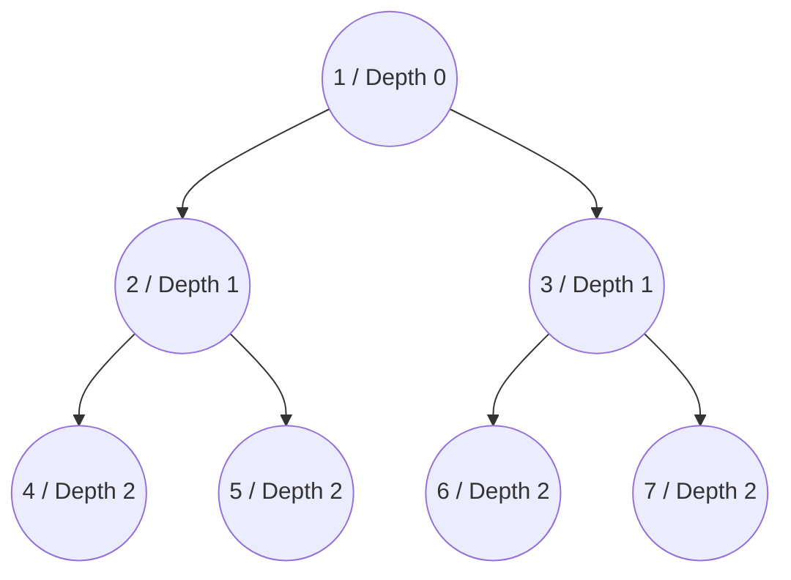
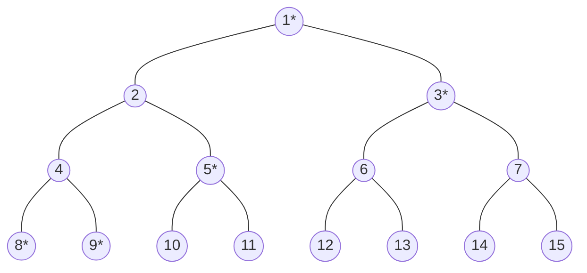
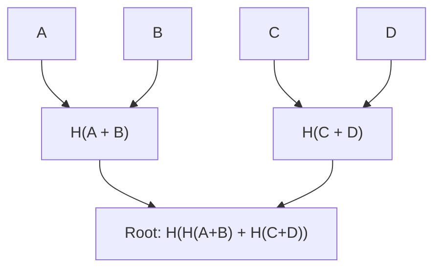

# Merkle 化和 哈希树根 


在以太坊共识机制中，所有参与节点的人一致有效地就系统状态达成一致至关重要。 [Simple Serialize (SSZ)](/wiki/CL/SSZ.md) 框架通过 Merkle 化来实现这一点，Merkle 化是一个将序列化数据转换为 Merkle 树结构的过程。 Merkle 化方案的目标是确保受限环境(轻客户端、执行环境等)可以访问轻量级证明，并使用这些证明来做出重要决策。此 wiki 页面讨论了 Merkle 化的复杂性及其在确保以可扩展和安全的方式跨节点共享状态方面的重要性。


## 术语和方法

- **Merkle 化:** 指构造一个Merkle 树并推导其根。
- **哈希树根：** Merkle 化的具体应用，用于计算复杂 SSZ 容器的根哈希。

## 需要 Merkle 化

加密哈希函数通过为信标状态生成数据集的紧凑、唯一表示来提供解决方案。通过对信标链的序列化状态进行哈希处理，节点可以通过交换这些小的哈希输出来快速有效地比较状态。

## Merkle 化的流程

Merkle 化涉及将序列化数据分解为 32 字节块，这些块充当 Merkle 树的叶子。然后，这些块被成对组合、散列在一起，并且该过程在树上重复，直到导出单个哈希(Merkle 根)。这个根哈希充当整个数据集的唯一指纹。关键步骤如下：

- **分块：** 将序列化数据分成 32 字节的块。
- **树构建：** 将块和每对哈希配对以形成树的下一层。重复此步骤，直到只剩下一个哈希：Merkle 根。
- **填充：** 如果块的数量不是 2 的幂，则会添加额外的零值块来四舍五入树，确保树平衡。

## Merkle 化的好处

- **性能效率：** 虽然树需要散列大约两倍于原始数据量，但缓存机制可以存储不经常更改的子树的根。这显着减少了计算开销，因为只有数据的更改部分需要重新散列。
- **轻客户端支持：** Merkle 树结构支持创建 Merkle 证明——无需整个数据集即可证明状态特定部分的包含性和完整性的小数据片段。此功能对于轻客户端至关重要，因为轻客户端的运行资源有限，并依赖这些证明与以太坊安全地交互。

如果你想了解更多关于Merkle 树结构的信息，可以参考[这里](https://eth2book.info/capella/part2/building_blocks/merkleization/)和[这里](https://github.com/protolambda/eth2-docs?tab=readme-ov-file#ssz-hash-tree-root-and-merkleization)。 

## 广义指数

为了便于在树内直接引用和验证，每个节点(叶子和内部)都分配有一个通用索引。该索引源自节点在树中的位置：



_图：Merkle 树广义指数和深度级别._

- **根索引：** 1(深度 = 0)
- **后续级别：** $2^{depth} + index$，其中索引是节点在该深度的零索引位置。

## 使用广义索引的多重证明

使用广义索引的多重证明提供了一种有效的方法来验证 Merkle 树中的特定元素，而无需知道整个树结构。这个概念在以太坊和加密应用程序中至关重要，因为数据完整性和验证速度至关重要。让我们用一个例子来分解这个过程来理解多重证明是如何工作的：

**了解结构**
- Merkle 树是分层结构的，其中每个节点要么是叶节点(包含实际数据)，要么是内部节点(包含其子节点的 哈希)。
- 广义索引以数字方式表示树中每个节点的位置，计算为 $2^{depth} + index$，从根(索引 1)开始。

**示例的树形布局**
- 该树的结构如下，其中 `*` 表示为索引 9 处的元素生成证明所需的节点：



_图：Merkle 树布局_

**确定所需的节点**
- **识别所需的哈希**：要验证索引 9 处的数据，您需要索引 8、9、5、3 和 1 处数据的哈希。
- **成对哈希**：组合索引 8 和 9 的哈希来计算与其父节点对应的哈希，该哈希应该是 `hash(4)`。
- **更多哈希组合**：
  - 然后将 `hash(4)` 与索引 5 中的哈希组合，生成其父节点、`hash(2)` 的哈希。
  - 该结果与索引 3 中的哈希相结合，以上升到下一个级别。
- **最终验证**：将上一步的组合结果与相反分支(索引 3)的根进行散列，以产生最终的树根(`hash 1`)。
- **完整性检查**：如果计算出的根与已知的好根 (`hash 1`) 匹配，则索引 9 处的数据被验证为准确。如果数据不正确，生成的根会有所不同，表明存在错误或篡改。

共识规范中有辅助函数来计算多重证明和广义指数。您可以在[这里](https://github.com/ethereum/consensus-specs/blob/dev/ssz/merkle-proofs.md#merkle-multiproofs)找到

## 计算哈希树根

SSZ 对象的哈希树根是递归计算的。对于基本类型和基本类型的集合，数据被打包成块并直接 Merkleized。对于像容器这样的复合类型，该过程涉及对每个组件的树根进行哈希处理。在下面的部分中，我们将看到工作示例以了解该过程。

### 包装和分块

打包和分块通过格式化序列化数据并将其分成几部分，然后将其哈希为 Merkle 树，从而启用 Merkle 化和 SSZ。该过程的工作原理如下：

**序列化数据**
- **序列化** 涉及使用 SSZ 序列化规则将数据结构(基本类型、列表、向量或位列表/位向量)转换为线性字节数组。
- 每个元素都根据其类型进行序列化。 

**填充序列化**
- 在序列化之后，字节数组可能无法与 Merkle 树中使用的 32 字节块大小完全一致。
- **填充** 添加到序列化数据中，以将最后一个段扩展为完整的 32 字节块。该填充由零字节 (0x00) 组成。

**分成块**
- 然后，填充的序列化数据被分成多个 32 字节段或“块”。
- 这些块是 Merkle 化进程中使用的基本单位。

**填充到完整二叉树**
- 上一步中的块数量可能不是 2 的幂，这是形成平衡二叉树(满二叉树)所必需的。
- 根据需要添加额外的零块(完全填充零字节的块)，以使总计数达到最接近的 2 的幂。
- 这可确保生成的 Merkle 树完整且平衡，从而促进高效的加密操作。

**应用 Merkle 化流程**
- 准备好块后，它们被排列为二进制 Merkle 树的叶子。
- Merkle 化通过将成对的块逐层散列在一起，直到保留单个哈希为止。最后的哈希被称为 Merkle 根。

**实际例子：**
假设我们有一个需要打包和分块的整数列表：
- **整数**：[10,20,30,40](假设每个整数占用8个字节)。
- **序列化数据**：从这些整数创建的连续字节数组。
- **填充**：如果序列化总长度不是 32 的倍数，则添加填充字节。
- **Chunks**：数据被分为32字节的块。
- **树的零填充**：如果块的数量不是 2 的幂，则附加额外的零填充块。
- **Merkle 化**：然后将这些块用作 Merkle 树中的叶子来计算根。

### 混合长度

混合长度是 Merkle 化过程中的关键步骤，特别是在处理列表和向量时。此步骤确保最终的哈希树根准确反映数据的内容和结构，包括其长度。让我们来分析一下这个概念的应用方式以及它的重要性。

**混合长度的目的**

长度混合用于确保两个不同的列表或具有相似内容但不同长度的向量生成不同的哈希树根。这一点至关重要，因为如果不将长度合并到哈希中，则如果仅对内容进行哈希处理，则两个列表(其中一个比另一个长，但在较短列表的长度上相同)将具有相同的哈希树根。这可能会导致数据验证过程中潜在的安全漏洞和不一致。

**长度混合的示例**

下面的示例说明，在不包括列表长度的情况下，`a_root_hash` 和 `b_root_hash` 的 Merkle 根哈希保持相同，尽管代表两个不同长度的列表。然而，当合并长度时，Merkle 根哈希 `a_mix_len_root_hash` 与 `a_root_hash` 和 `b_root_hash` 都不同。在处理 Merkle 化中不同长度的列表或向量时，这种区别至关重要。


```python
>>> from eth2spec.utils.ssz.ssz_typing import uint256, List
>>> from eth2spec.utils.merkle_minimal import merkleize_chunks
>>> a = List[uint256, 4](33652, 59750, 92360)
>>> a_len = a.length()
>>> a = List[uint256, 4](33652, 59750, 92360).encode_bytes()
>>> b = List[uint256, 4](33652, 59750, 92360, 0).encode_bytes()
>>> a_root_hash = merkleize_chunks([a[0:32], a[32:64], a[64:96]])
>>> b_root_hash = merkleize_chunks([b[0:32], b[32:64], b[64:96], b[96:128]])
>>> a_mix_len_root_hash = merkleize_chunks([merkleize_chunks([a[0:32], a[32:64], a[64:96]]), a_len.to_bytes(32, 'little')])
>>> print('a_root_hash = ', a_root_hash)
a_root_hash =  0x3effe553b6091b1982a6850fd2a788943363e6f879ff796057503b76802edd9d
>>> print('b_root_hash = ', b_root_hash)
b_root_hash =  0x3effe553b6091b1982a6850fd2a788943363e6f879ff796057503b76802edd9d
>>> print('a_mix_len_root_hash = ', a_mix_len_root_hash)
a_mix_len_root_hash =  0xeca15347139a6ad6e7eabfbcfd3eb3bf463af2a8194c94aef742eadfcc3f1912
>>> 
```

## SSZ 中的总结和扩展 Merkle 化

在以太坊 PoS 中，摘要和扩展的概念对于有效管理状态数据是不可或缺的。摘要提供了数据结构的紧凑表示，封装了基本的验证信息，但没有完整的细节。另一方面，扩展可提供完整的数据集以进行彻底处理或需要详细信息时。以下是他们的好处：

- **效率和速度**：通过使用摘要，验证者可以快速验证状态更改或验证交易，而无需处理整个数据集。该方法显着加快了验证速度并减少了计算开销。  
- **减少数据负载**：摘要最大限度地减少存储和传输的数据量，从而节省带宽和存储资源。这对于容量有限的节点尤其有利，例如轻客户端依赖摘要来提高运行效率。
- **安全增强**：摘要中包含的加密哈希可确保数据的完整性，从而无需访问完整数据集即可实现安全可靠的验证过程。
- **示例**：
  - **BeaconBlock 和 BeaconBlockHeader**：`BeaconBlockHeader` 容器充当摘要，允许节点快速验证区块的完整性，而无需 `BeaconBlock` 容器中的完整区块数据。 `BeaconBlock` 是扩展。
  - **提议者削减**：验证者使用区块摘要来有效识别和处理冲突的区块提案，从而促进快速、准确的削减决策。

## Merkle 化基本类型

让我们通过一个例子来了解基本类型的Merkle 化。下面是一个简单的Merkle 树，我们将按照Merkle 化的过程得到默克尔根哈希。



_图：样本 Merkle 树._

在上面的Merkle 树中，树的叶子是数据的四个blob，A、B、C、D。

- **定义数据：**
  - 在此示例中，我们处理四个基本数据项：A、B、C 和 D。它们被概念化为数字(分别为 `10`、`20`、`30` 和 `40`)，并将在 Merkle 树中表示为 32 字节块。
- **将数据转换为 32 字节块：**
  - 每个数据项都使用 SSZ 打字系统中的 `uint256` 类型序列化为 32 字节格式。 序列化涉及将数据转换为一致的格式并进行填充，以确保每个项目的长度为 32 字节。
- **配对并哈希叶子：**
  - 接下来，这些序列化数据块对被连接并散列。
- **哈希形成根的结果：**
  - 最后，将上一步中的哈希(`ab` 和 `cd`)连接并散列以形成 Merkle 根。
- **输出默克尔根：**
  - 然后将 Merkle 根转换为十六进制字符串以使其可读。

最终的 Merkle 根是数据 `A`、`B`、`C` 和 `D` 的唯一表示。输入数据的任何变化都会导致不同的 Merkle 根，说明哈希函数对输入数据的敏感性。此特性对于确保以太坊中的数据完整性至关重要。


```python
>>> from eth2spec.utils.ssz.ssz_typing import uint256
>>> from eth2spec.utils.hash_function import hash
>>> a = uint256(10).to_bytes(length = 32, byteorder='little')
>>> b = uint256(20).to_bytes(length = 32, byteorder='little')
>>> c = uint256(30).to_bytes(length = 32, byteorder='little')
>>> d = uint256(40).to_bytes(length = 32, byteorder='little')
>>> ab = hash(a + b)
>>> cd = hash(c + d)
>>> abcd = hash(ab + cd)
>>> abcd.hex()
'1e3bd033dcaa8b7e8fa116cdd0469615b29b09642ed1cb5b4a8ea949fc7eee03'
```

## Merkle 化用于复合类型

在本节中，我们将学习 `IndexedAttestation` 复合类型是如何 Merkleized 的，并使用详细的示例来说明该过程。此示例提供了应用于复合、列表和向量类型的 Merkle 化过程的清晰实例。它还展示了如何通过此过程有效地演示摘要和扩展。

**定义和结构**

`IndexedAttestation` 是一个复合类型，定义如下：

```python
class IndexedAttestation(Container):
    attesting_indices: List[ValidatorIndex, MAX_VALIDATORS_PER_COMMITTEE]
    data: AttestationData
    signature: BLSSignature
```

`IndexedAttestation` 由三个主要组件组成：

  - **attesting_indices：** `ValidatorIndex` 的列表，代表正在证明的验证者。
  - **数据：** `AttestationData` 容器，保存与证明相关的各种数据。
  - **签名：** `BLSSignature`，它是证明上的签名。

**Merkle 化进程**

`IndexedAttestation` 的 Merkle 化涉及计算每个组件的哈希树根，并将这些根组合起来形成容器的整体哈希树根。 

**默克尔化`attesting_indices`：**

- **序列化和 Padding：** 首先，索引列表被序列化。考虑到此列表的潜在长度(最多 `MAX_VALIDATORS_PER_COMMITTEE`)，它通常需要填充以与哈希所需的 32 字节块对齐。
- **哈希：** 使用 `merkleize_chunks` 函数对序列化数据进行哈希处理，该函数处理填充并构造多层 Merkle 树。
- **混合长度：** 由于 SSZ 中的列表长度可能不同，但具有相同的类型结构，因此列表的长度也会被散列(混合)，以确保不同大小的列表具有唯一的哈希表示形式。

```python
attesting_indices_root = merkleize_chunks(
           [
               merkleize_chunks([a.attesting_indices.encode_bytes() + bytearray(8)], 512),
               a.attesting_indices.length().to_bytes(32, 'little')
           ])
```

**默克尔化数据(`AttestationData`)：**
- **处理嵌套结构：** `AttestationData` 本身包含多个字段(如 `slot`、`index`、`beacon_block_root`、`source` 和 `target`)，每个字段都单独序列化和 Merkleized。
- **组合哈希：** 然后将这些字段的哈希组合起来，生成 `AttestationData` 的根哈希。

```python
data_root = merkleize_chunks(
    [
        a.data.slot.to_bytes(32, 'little'),
        a.data.index.to_bytes(32, 'little'),
        a.data.beacon_block_root,
        merkleize_chunks([a.data.source.epoch.to_bytes(32, 'little'), a.data.source.root]),
        merkleize_chunks([a.data.target.epoch.to_bytes(32, 'little'), a.data.target.root]),
    ])
```

**默克尔化签名：**

- **简单哈希：** `BLSSignature` 是一个固定长度的字段，直接哈希为三个 32 字节的块，然后将其默克尔化以获得签名的根。

```python
signature_root = merkleize_chunks([a.signature[0:32], a.signature[32:64], a.signature[64:96]])
```

**组合组件根：**

- 然后将从每个组件计算出的根组合起来，计算整个 `IndexedAttestation` 容器的哈希树根。
```python
indexed_attestation_root = merkleize_chunks([attesting_indices_root, data_root, signature_root])
```

**最终根验证：**

- Merkle 化或 `IndexedAttestation` 的正确实现可确保数据结构任何部分的更改都反映在最终根哈希中，从而提供强大的机制来检测差异并确保网络中所有节点之间的数据一致性。

```python
assert a.hash_tree_root() == indexed_attestation_root
```

现在，您可以看到 `IndexedAttestation` 的 Merkle 化的完整图片：


**IndexedAttestation 的 Merkle 化**

这是完整的工作代码：

```python
from eth2spec.capella import mainnet
from eth2spec.capella.mainnet import *
from eth2spec.utils.ssz.ssz_typing import *
from eth2spec.utils.merkle_minimal import merkleize_chunks

# Initialise an IndexedAttestation type
a = IndexedAttestation(
    attesting_indices = [33652, 59750, 92360],
    data = AttestationData(
        slot = 3080829,
        index = 9,
        beacon_block_root = '0x4f4250c05956f5c2b87129cf7372f14dd576fc152543bf7042e963196b843fe6',
        source = Checkpoint (
            epoch = 96274,
            root = '0xd24639f2e661bc1adcbe7157280776cf76670fff0fee0691f146ab827f4f1ade'
        ),
        target = Checkpoint(
            epoch = 96275,
            root = '0x9bcd31881817ddeab686f878c8619d664e8bfa4f8948707cba5bc25c8d74915d'
        )
    ),
    signature = '0xaaf504503ff15ae86723c906b4b6bac91ad728e4431aea3be2e8e3acc888d8af'
                + '5dffbbcf53b234ea8e3fde67fbb09120027335ec63cf23f0213cc439e8d1b856'
                + 'c2ddfc1a78ed3326fb9b4fe333af4ad3702159dbf9caeb1a4633b752991ac437'
)

# A container's root is the merkleization of the roots of its fields.
# This is IndexedAttestation.
assert(a.hash_tree_root() == merkleize_chunks(
    [
        a.attesting_indices.hash_tree_root(),
        a.data.hash_tree_root(),
        a.signature.hash_tree_root()
    ]))

# A list is serialised then (virtually) padded to its full number of chunks before Merkleization.
# Finally its actual length is mixed in via a further hash/merkleization.
assert(a.attesting_indices.hash_tree_root() ==
       merkleize_chunks(
           [
               merkleize_chunks([a.attesting_indices.encode_bytes() + bytearray(8)], 512),
               a.attesting_indices.length().to_bytes(32, 'little')
           ]))

# A container's root is the merkleization of the roots of its fields.
# This is AttestationData.
assert(a.data.hash_tree_root() == merkleize_chunks(
    [
        a.data.slot.hash_tree_root(),
        a.data.index.hash_tree_root(),
        a.data.beacon_block_root.hash_tree_root(),
        a.data.source.hash_tree_root(),
        a.data.target.hash_tree_root()
    ]))

# Expanding the above AttestationData roots by "manually" calculating the roots of its fields.
assert(a.data.hash_tree_root() == merkleize_chunks(
    [
        a.data.slot.to_bytes(32, 'little'),
        a.data.index.to_bytes(32, 'little'),
        a.data.beacon_block_root,
        merkleize_chunks([a.data.source.epoch.to_bytes(32, 'little'), a.data.source.root]),
        merkleize_chunks([a.data.target.epoch.to_bytes(32, 'little'), a.data.target.root]),
    ]))

# The Signature type has a simple Merkleization.
assert(a.signature.hash_tree_root() ==
       merkleize_chunks([a.signature[0:32], a.signature[32:64], a.signature[64:96]]))

# Putting everything together, we have a "by-hand" Merkleization of the IndexedAttestation.
assert(a.hash_tree_root() == merkleize_chunks(
    [
        # a.attesting_indices.hash_tree_root()
        merkleize_chunks(
            [
                merkleize_chunks([a.attesting_indices.encode_bytes() + bytearray(8)], 512),
                a.attesting_indices.length().to_bytes(32, 'little')
            ]),
        # a.data.hash_tree_root()
        merkleize_chunks(
            [
                a.data.slot.to_bytes(32, 'little'),
                a.data.index.to_bytes(32, 'little'),
                a.data.beacon_block_root,
                merkleize_chunks([a.data.source.epoch.to_bytes(32, 'little'), a.data.source.root]),
                merkleize_chunks([a.data.target.epoch.to_bytes(32, 'little'), a.data.target.root]),
            ]),
        # a.signature.hash_tree_root()
        merkleize_chunks([a.signature[0:32], a.signature[32:64], a.signature[64:96]])
    ]))

print("Success!")
```

您可以按照[运行规范](https://eth2book.info/capella/appendices/running/)中的说明来执行上述代码。

## 资源

- [哈希树根和 Merkle 化](https://eth2book.info/capella/part2/building_blocks/merkleization/)
- [SSZ](https://ethereum.org/en/developers/docs/data-structures-and-encoding/ssz/)
- [Merkle 化上的 Protolambda](https://github.com/protolambda/eth2-docs?tab=readme-ov-file#ssz-hash-tree-root-and-merkleization)
- [运行规范](https://eth2book.info/capella/appendices/running/)