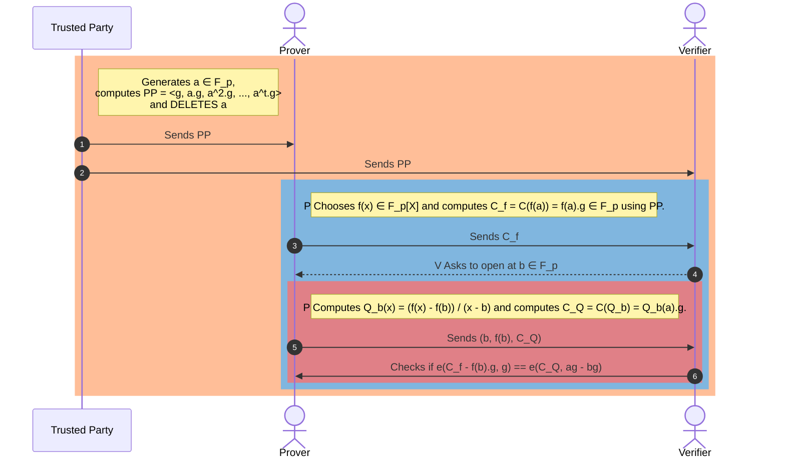

# KZG 多项式承诺方案

## [TLDR](#tldr)
KZG(Kate、Zaverucha 和 Goldwasser)承诺方案就像一个加密保险库，用于安全地锁定多项式(数学方程)，以便您以后可以证明您拥有它们，而不会泄露它们的秘密。这就像做出一个密封的承诺，您无需打开它并显示内容即可验证它。使用基于椭圆曲线的高级数学，它可以实现高效、可验证的承诺，这是使区块链交易更加私密和可扩展的关键部分。该方案对于以太坊的升级尤其重要，它有助于在不损害隐私的情况下快速安全地验证交易。

KZG 是一款功能强大的加密工具，支持以太坊生态系统内的广泛应用程序和其他加密应用程序。其独特的功能被用于证明方案中，以增强各种应用程序的可扩展性和隐私性。

## [动机](#motivation)

### [ZKSNARKs](#zksnarks)
了解多项式承诺方案 (PCS) 很重要，因为它们在创建零知识简洁非交互式知识论证 (ZKSNARK) 方面发挥着关键作用。 ZKSNARK 是一种特殊的加密方法，允许某人(证明者)向其他人(验证者)表明他们知道某条特定信息(例如数字)，而无需透露该信息。这是通过结合使用 PCS 和 Interactive Oracle Proofs (IOP) 来完成的。

*现代 ZKSNARK = 功能性承诺方案 + 兼容的交互式 Oracle 证明 (IOP)*

### [以太坊生态系统中的用例](#use-cases-in-ethereum-ecosystem)
KZG 承诺方案已成为以太坊生态系统中的关键技术，特别是在 Proto-Danksharding 及其预期演变为 Danksharding 的背景下。 承诺方案是以太坊中许多零知识 (ZK) 相关应用程序的基石，可在不泄露底层信息的情况下实现高效、安全的数据验证。

利用 KZG(Kate、Zaverucha 和 Goldberg)方案的基于以太坊的应用程序包括：

- **Proto-Danksharding (EIP-4844)**：该提案旨在通过将 KZG 用于其多项式承诺方案，降低在以太坊的第 1 层上发布 Rollup 数据的成本。它引入了“blob-carrying 交易”类型来容纳大量数据blob，仅可以从执行层访问数据blob的承诺。

- **数据可用性采样**：PCS 在以太坊路线图中启用称为数据可用性采样 (DAS) 的关键功能，该功能允许验证者确认数据 blob 的正确性和可用性，而无需下载整个数据。 PCS 的独特属性促进了此功能，从而在区块链应用程序(例如以太坊的 Danksharding)中实现高效的验证过程。

- **PSE 的 Summa，偿付能力证明协议**：以太坊基金会的 PSE 小组项目 Summa 在其偿付能力证明协议中利用了 KZG 承诺。这使得中心化交易所和托管人能够证明他们的总资产超过了负债，同时保持用户余额信息的私密性。
  
- **Scroll 的 zkRollups**：Scroll 是以太坊的原生 zkEVM 第 2 层，使用 KZG 生成承诺到封装计算的多项式集合。这允许验证者请求在随机点进行评估，以验证多项式表示的计算的准确性。

- **Jellyfish**：Jellyfish 在承诺阶段采用 KZG 承诺方案生成承诺到 多项式。它利用 KZG 的同态属性在任何点对多项式进行有效评估，而不会泄露其系数。

- **Hyperplonk**：Hyperplonk使用了多线性KZG 承诺，表明其应用于需要多线性多项式承诺的场景。

## [目标](#goal)
现在我们有学习 PCS 的动力，让我们开始定义我们的目标是什么，即我们想要用 KZG 方案解决的确切问题是什么。 

假设我们有一个函数多项式 $f(x)$ 定义为 $f(x) = f_0 + f_1x + f_2x^2 + \ldots + f_dx^t$。 $f(x)$ 的度数为 $t$。

我们使用 KZG 方案的主要目标是，我们想向某人证明我们知道这个多项式，而不泄露多项式，即多项式的系数。

在实践中，我们确切要做的是证明我们知道在点 $x=a$ 处对这个多项式的具体评估。 

我们为某些 $x=a$ 编写 $f(a)$。 

## [必备知识](#prerequisite-knowledge)
在我们进一步理解 KZG 方案之前，我们需要了解一些重要的概念。幸运的是，我们可以从高中数学中获得对 KZG 方案的工程级别的理解。我们将尝试在不深入了解高级概念及其重要属性的情况下获得一些直觉。这可以帮助我们了解 KZG 协议流程，而不会陷入高等数学的困境。

我们需要知道：

### [模运算](#modular-arithmetic)
模拟时钟说明了模块化算术，因为小时在达到极限后会循环回来。对于 KZG，了解简单的算术(加、减、乘、除)以及使用模运算就足够了，就像时钟在 12 或 24 小时后重置一样。

### [素数 p 的有限域](#finite-field-of-order-prime)
素数 $p$ 阶的有限域(我们用 $\mathbb F_p$ 表示)是一组特殊的数字 { $\{1, 2, 3, \ldots, p-1\}$ }，您可以在其中执行所有常见的数学运算(加法、减法、乘法和除法，除零)，并且仍然遵循算术规则。 

这个集合的“阶”是它包含的元素的数量，对于素数 $p$ 的有限域，这个数字是一个素数。创建 $\mathbb F_p$ 的最常见方法是获取大于或等于 $0$ 的所有整数的集合，并将它们除以 $p$，仅保留余数。这给了我们一组从 $0$ 到 $p-1$ 的数字，可用于算术运算。例如，如果 $p = 5$，则该集合将为 {0, 1, 2, 3, 4}，您可以按照算术规则对这些数字进行加、减、乘、除运算。这个集合是一个 5 阶有限域，我们用 $\mathbb F_5$ 表示，因为它恰好有 5 个元素，而且是一个素数。

当我们在有限域 $\mathbb F_p$ 中进行模算术运算时，我们有一个很好的“环绕”属性，即该域的行为就像在到达 $(p - 1)$ 后“环绕”一样。 

一般来说，当我们定义一个有限域时，我们会定义该域的阶 $p$ 以及加法或乘法等算术运算。如果是加法，我们用 $(\mathbb F_p, +)$ 来表示该字段。如果是乘法，我们记为$(\mathbb F^*_p, +)$。 `*` 告诉我们从域中排除零元素，以便我们可以满足有限域的所有所需属性，即主要我们可以除以数字并找到所有元素的逆。如果我们包含零元素，我们就找不到零元素的逆。

在下一节中，我们将了解组的生成器如何使 KZG 承诺方案成为一种高效、安全且可验证的提交多项式的方法，使其成为加密协议的强大工具，特别是在这些属性非常重要的区块链技术中。

### [群](#group)
群在概念上类似于有限域，尽管有一些细微的变化。  一个重要的区别是，在群中，我们在集合上只有一个算术运算，通常是加法或乘法，而不是同时具有加法和乘法的有限域。与有限域类似，群元素必须有逆元并满足其所有要求，如下例所示。

符号为 ($\mathbb G, +)$ 表示以加法作为群运算的群，($\mathbb G^*, .)$ 表示以乘法运算的群；`*` 表示排除零元素以避免被零除。

在下一节中，我们将使用一个示例来定义组。这将有助于培养我们何时将一组数字称为“组”的直觉。

### [群组生成器](#generator-of-a-group)
生成器是组中的一个元素，当通过组的操作反复与其自身组合时，最终可以生成组中的所有其他元素。 

在数学意义上，如果有一个群 ($\mathbb G, .)$ 和 $\mathbb G$ 中的元素 $g$，如果 $g$、$(g, g^2, g^3, ...)$ 的所有幂的集合相等，则我们说 $g$ 是 $\mathbb G$ 的生成器对于有限群，到$\mathbb G$，或者对于无限群，通过这种重复操作覆盖$\mathbb G$的所有元素。

这个概念最好用一个例子来解释。

我们将使用组元素 { ${0,1,2,3,4,5,6}$ } 的 ($\mathbb G_7, +)$ 和组元素 { ${1,2,3,4,5,6}$ } 的 ($\mathbb G^*_7, .)$ ) 对 $7$ 进行模运算来找到组的生成器。

**添加剂组的生成器**

我们的集合(带有元素 { ${0,1,2,3,4,5,6}$ } 的 $\mathbb G_7, +)$ 是一个 Group，因为它满足 Group 的定义。

- **闭包：** 当您将集合中的任意两个数字相加并除以 $7$ 时取余数，您最终会得到仍在集合中的结果。
- **关联性：** 对于集合中的任何数字 $a, b$ 和 $c$，$(a+b)+c$ 始终与 $a+(b+c)$ 相同，即使对 $7$ 进行模运算也是如此。
- **标识元素：** 数字 $0$ 充当标识元素，因为当您将 $0$ 添加到集合中的任何数字时，您会得到相同的数字。
- **逆元素：** 集合中的每个数字都有一个逆元素，这样当您将它们加在一起时，您最终会回到单位元素 $0$。例如，$3$ 的逆是 $4$，因为 $3 + 4 = 7$ 是 $0$ 模 $7$。

现在，对于发电机。由于我们的群具有素数阶 $7$，因此除了单位元素 $0$ 之外的任何元素都是生成器。让我们选择元素 $1$ 作为我们的生成器，即 $g = 1$。由于我们正在使用加性群，因此具有生成器 g 的群元素将是 $\{0, g, 2g, 3g, 4g, 5g, 6g\}$。

从 $1$ 开始，并将其与自身模 $7$ 相加，我们得到：
- $1 + 1 = 2$($2*1$ 模 7)
- $1 + 1 + 1 = 3$($3*1$ 模 7)
- $1 + 1 + 1 + 1 = 4$($4*1$ 模 7)
- $1 + 1 + 1 + 1 + 1 = 5$($5*1$ 模 7)
- $1 + 1 + 1 + 1 + 1 + 1 = 6$($6*1$ 模 7)
- $1 + 1 + 1 + 1 + 1 + 1 + 1 = 7$，即 $0$ 模 7(即 $7*1$ 模 7)

正如您所看到的，通过重复添加 $1$ 模 $7$，我们可以生成组中的所有其他元素。因此，$1$是群($\mathbb G_7, +)$)的生成器。类似地，我们可以选择$2, 3, 4, 5, 6$中的任何数字作为生成器，并且通过重复对$7$取模进行加法，我们仍然会生成整个群。这是具有素数元素的群的特殊性质。

**乘法群的生成元**
对于以素数 $p$ 为模的整数乘法群，群 ($\mathbb G_p, .$) 由整数 { ${1, 2, 3, \ldots, p-1}$ } 组成，其中运算为以 $p$ 为模的乘法。为了简单起见，我们将选择一个小素数，例如 $p = 7$。因此，我们的组 ($\mathbb G^*_7, .)$ 在乘法 $7$ 下由元素 { ${1, 2, 3, 4, 5, 6}$ } 组成。记住，除以零元素被排除在外，这就是为什么我们在符号中包含 `*`。

这是组结构：

- **闭包：** 任何两个元素的乘积，当以 $7$ 为模减少时，仍然是集合的一个元素。
- **关联性：** 对于集合中的任何数字 $a, b, c$，$(a \cdot b) \cdot c$ 始终与 $a \cdot (b \cdot c)$ 相同，即使考虑模 $7$ 时也是如此。
- **单位元素：** 数字 $1$ 充当单位元素，因为当您将集合中的任何数字乘以 $1$ 时，您会得到相同的数字。
- **逆元素：** 集合中的每个数字在集合中都有一个乘法逆元素，这样当您将它们相乘时，您将得到单位元素 $1$。例如，$3$ 的乘法逆元是 $5$，因为 $3 \cdot 5 = 15$ 是 $1$ 模 $7$。

让我们通过反复乘以模 $7$ 来验证每个元素确实是生成器：

- 从 $2$ 开始，每次乘以 $2$ 并对结果取模 $7$：
  - $2^1 = 2$
  - $2^2 = 4$
  - $2^3 = 8 \equiv 1 \mod 7$
  - $2^4 = 16 \equiv 2 \mod 7$ (这里我们循环回到开头，表明 $2$ 不是生成器)

- 让我们试试 $3$：
  - $3^1 = 3$
  - $3^2 = 9 \equiv 2 \mod 7$
  - $3^3 = 27 \equiv 6 \mod 7$
  - $3^4 = 81 \equiv 4 \mod 7$
  - $3^5 = 243 \equiv 5 \mod 7$
  - $3^6 = 729 \equiv 1 \mod 7$ (因为我们在击中所有元素后就达到了恒等式，所以 $3$ 是一个生成器)

您可以验证 $5$ 也是我们乘法群的生成器($\mathbb G^*_7, .)$ modulo $7$. 

### [为什么域中的模运算需要质数](#why-primes-for-modulo-operations-in-fields)
选择素数作为有限域中运算的模数有几个好处，并简化了域算术的各个方面：

1. **明确定义的除法：** 在有限域中，每个非零元素必须有一个乘法逆元。如果模是质数，则集合 { ${1, 2, 3, \ldots, p-1}$ } 中的每个数字都有一个乘法逆模 $p$。此属性允许在域内进行明确定义的除法运算，如果模数不是素数，则这是不可能的(除了特殊情况，例如阶数为 $p^n$ 的伽罗瓦域，其中 $p$ 是素数)。

2. **构造简单：** 当模数是素数时，域的构造很简单。该字段的元素只是整数集 { ${1, 2, 3, \ldots, p-1}$ }，并且字段运算(加法、减法、乘法和除法)以 $p$ 为模进行执行。对于非素数模，构造域需要更复杂的结构，例如多项式环。

3. **保证场属性：** 使用质数模可以保证满足所需的场属性。这些包括 - 加法和乘法恒等式的存在，每个元素的加法和乘法逆元的存在，以及加法和乘法的交换律、结合律和分配律。质数模量可确保满足所有这些属性。

4. **非零元素的均匀分布：** 在具有素数模的有限域中，非零元素对于乘法具有均匀分布。这意味着该字段的乘法表没有任何“间隙”，并且每个元素在乘法表的每一行和每一列中都恰好出现一次(零元素的行和列除外)。

5. **简化算法：** 数论和密码学中的许多算法在处理素数域时更简单、更高效。例如，使用扩展欧几里得算法可以有效地找到乘法逆元，并且不需要非素数域中必需的复杂的多项式算术。

6. **密码安全性：** 在密码学背景下，某些问题(例如离散对数问题)的难度在素数域中是众所周知的。这个困难对于密码系统的安全至关重要。对于复合模量(特别是当因素未知时)，结构可能会引入漏洞或使问题的难度难以预测。
7. **计算优化：** 一些素数，例如 31 或 $2^n - 1$ 形式的素数，很容易被 CPU 优化以进行乘法运算。这种优化可以缩短计算时间，这对于性能是关键因素的应用程序是有益的。

使用素数作为有限域的模可以简化域运算并确保满足所有域属性，这对于理论和实际应用(特别是在密码学中)至关重要。

### [密码学假设](#cryptographic-assumptions)
为了使用 KZG 承诺方案，我们需要两个额外的假设。我们不会深入探讨为什么需要这些假设，但我们会直观地解释为什么需要这些加密假设来使 KZG 更安全。

**离散对数**

假设我们在群 $\mathbb G^\*_p$ 中有一个生成器 $g$，而 $a$ 是有限域 $\mathbb F^*_p$ 中的任何元素，而 $g^a$ 是群 $\mathbb G^\*_p$ 中的某个元素。离散对数假设表明，对于给定的 $g$ 和 $g^a$，实际上不可能找到 $a$。这意味着我们无法轻松找到指数 $a$ 来提供这些元素。

**培养离散对数问题的直觉**

想象一下，您有一种与数字一起使用的特殊锁(我们将此锁称为“生成器”，我们将其命名为 $g$)。这把锁是一套神奇的锁和钥匙的一部分，它们都生活在一个名为 $\mathbb G^\*_p$ 的神奇土地上。现在，您选择一个秘密数字 $a$ 并用它来转动您的锁 $g$ 一定次数。锁最终到达一个新位置，我们称之为 $g^a$。

如果有人走过并看到你的锁位于 $g^a$，即使他们知道它始于 $g$ 以及它所属的神奇土地，要弄清楚你转动了它多少次(找到你的秘密号码 $a$)是非常困难的。 

简单地说，离散对数问题告诉我们，尽管如果你知道你的秘密数字，就可以很容易地打开锁，但倒退——看到结果并试图猜测秘密数字——就像大海捞针一样。这个概念在密码学中至关重要，它确保某些秘密极难被发现。

**强迪菲-赫尔曼**

假设我们在群 $\mathbb G^\*_p$ 中有一个生成器 $g$，$a, b$ 是有限域 $\mathbb F^*_p$ 中的任何元素，而 $g^a$、$g^b$ 是群 $\mathbb G^\*_p$ 中的一些元素。强 Diffie-Hellman 假设表明 $g^a$ 和 $g^b$ 与 $g^{ab}$ 无法区分。这意味着我们无法在给定 $g^a$ 和 $g^b$ 的情况下提取有关 $g^{ab}$ 的任何额外信息。

**培养强大的迪菲-赫尔曼直觉**

想象一下，您身处一个以其神奇饼干而闻名的世界，并且有一种秘密成分(我们的“生成器”，$g$)使它们变得特别。两位烘焙大师，爱丽丝和鲍勃，每个人都知道使用这种成分的独特技巧，分别以他们自己的秘方 $a$ 和 $b$ 为代表。

当爱丽丝使用她的秘方烘焙饼干时，她创建了一个特殊批次 $g^a$。 Bob 对他的配方做了同样的事情，产生了另一个独特的批次 $g^b$。

现在，假设爱丽丝和鲍勃决定合作并结合他们的秘密食谱来创建一批超级秘密的饼干 $g^{ab}$。强迪菲-赫尔曼假设是说，即使有人品尝了爱丽丝和鲍勃的单独批次，他们也无法破译他们的超级秘密批次的组合会是什么样子。如果不知道爱丽丝和鲍勃的食谱的确切组合，则组合食谱的味道与任何其他批次都没有区别。

因此，本质上，强迪菲-赫尔曼假设告诉我们，仅仅知道单个秘密(配方)的结果并不能帮助任何人破解组合这些秘密的结果。这是安全通信的基石，确保即使有人知道各个部分，组合后的秘密仍然安全且不可猜测。

### [配对功能](#pairing-function)
假设我们在群 $\mathbb G^\*_p$ 中有一个生成器 $g$，$a, b$ 是有限域 $\mathbb F^*_p$ 中的任何元素，而 $g^a$、$g^b$ 是群 $\mathbb G^\*_p$ 中的一些元素。 

配对函数是一种数学函数，它接受两个输入并通过将不同的输入对映射到不同的值来产生单个输出。它有两个重要的性质，双线性和非简并性。 

- 双线性意味着，我们可以以可逆的方式移动。 
- 非简并性意味着，如果我们将配对函数应用于同一元素，则不会产生群的单位元。

让我们更严格地定义这些属性。

配对函数 $e:$ $\mathbb G_1 X \mathbb G_2 \rightarrow \mathbb G_T$ 满足，

双线性属性：$e(g^a, g^b) = e(g, g^{ab}) = e(g^{ab}, g) = e(g,g)^{ab}$

非简并性质：$e(g,g) \neq 1$，表示输出不是单位元。

当$\mathbb G_1$和$\mathbb G_2$是同一个Group时，我们称这个对称配对函数。否则，它是一个不对称配对函数。 

这里有一些很棒的资源，可以从实用的 POV[^3][^8][^9] 中了解有关配对函数的更多信息。

**培养配对功能的直觉**

想象一下两个独立的岛屿，每个岛屿上都居住着一种独特的魔法生物。第一个岛是独角兽的家园，每只独角兽都有独特的颜色，第二个岛则居住着龙，每只龙都有独特的火色。配对功能就像一座神奇的桥梁，连接着独角兽和龙，创造出一种独特的、新的神奇生物——龙兽，它体现了两者的特性。

以下是如何考虑这个配对功能而不被技术细节所困扰：

- **两个组：** 将独角兽和龙视为属于两个不同的组(在数学术语中，这些通常称为组 $\mathbb G_1$ 和 $\mathbb G_2$)。
- **配对功能：** 神奇的桥起到配对功能。当独角兽和龙在这座桥上相遇时，配对功能会将它们结合成龙兽。该龙兽具有特殊的光芒，独特地对应于特定的独角兽和龙的组合(可逆)。
- **独特的结果：** 就像每对独角兽和龙都会产生具有独特光芒的龙，在数学中，配对函数从每组中获取一个元素，并在第三组中产生独特的输出(通常表示为 $\mathbb G_T$)。

**为什么这很神奇？** 因为尽管独角兽和龙有无数种可能的组合，但每种组合(配对)都会产生独特的龙兽。这在密码学中非常强大，因为它允许支持许多安全协议的复杂操作，确保每个组合都是独特的并且可追溯到其原始组合。

**简单地说，**想象你有两套钥匙(独角兽和龙)，当你组合每套钥匙时，你会得到一把独特的锁(龙)。神奇之处在于这种组合的可预测性和安全性，允许依赖这些独特结果的确定性进行安全交互，而无需透露原始密钥。

配对功能通过允许安全且可预测地发生这种“跨组”交互，实现了先进的加密技术，例如某些类型的数字签名和加密中使用的技术。

## [承诺的属性](#properties-of-commitments)
承诺方案就像数字世界的保密巫师。他们让某人对一条信息做出承诺(我们将其称为秘密消息)，从而将他们与自己的承诺联系起来，而不让其他任何人知道秘密是什么。它的工作原理如下：

- **做出承诺(承诺)：** 你决定一条秘密消息并使用特殊咒语(承诺方案)来创建一个魔法封印(承诺)。这个印章证明你有一个秘密，但它却隐藏着这个秘密。
- **保密(隐藏)：** 即使您已经制作了此封印，其他人也无法看到您的秘密信息是什么。这就像你把它锁在一个箱子里，只有你有钥匙。
- **证明您是诚实的(绑定)：** 承诺的神奇之处在于，您以后无法在不破坏密封的情况下更改您的秘密消息。这意味着一旦您创建了承诺，您就必须遵守它。

稍后，当需要透露您的秘密时，您可以出示原始消息并证明它与您之前制作的印章相符。这可以让其他人(验证者)检查并确认您的秘密消息与您一开始承诺的消息相同，证明您信守诺言。

绑定和隐藏属性非常重要，它们与我们使用离散对数和强 Diffie-Hellman 假设所做的上述密码学假设相关。

但现在，我们不需要深入探讨技术细节。如果您想了解更多信息，这里有来自 Dan Boneh 教授的 PCS 的优质资源[^4]。

有了这个背景，我们准备解释 KZG 协议流程并了解其构造。

## [KZG协议流程](#kzg-protocol-flow)
让我们重申一下我们正在使用 KZG 协议解决的问题是什么。

我们想要证明我们知道函数或多项式在点 $x=a$ 的具体评估而不透露它。

在KZG 承诺方案中，可信第三方、证明者和验证者的角色对其功能和安全性至关重要。以下是每个人对该过程的贡献：

1. **受信任的第三方(设置机构)：** 该实体负责 KZG 方案的初始设置阶段。他们基于只有他们知道的秘密，生成将在承诺和证明中使用的公共参数 (PP) 或公共参考字符串 (CRS)。这个秘密对于承诺的构建至关重要，但在设置后必须丢弃(或保持极其安全)以确保系统的完整性。对这一方的信任至关重要，因为如果秘密处理不当或泄露，可能会危及整个系统。一旦生成了 CRS 并将其分发给证明者和验证者，该方的角色就结束了。此后，他们不再参与协议的任何进一步步骤，无论是证明还是验证。

2. **证明者：** 证明者是想要提交某一数据片段(例如多项式)而不泄露它的人。使用可信第三方提供的 CRS，证明者为其数据计算承诺。当需要证明其数据的某些属性时(例如在特定点进行多项式评估)，证明者可以根据其承诺生成证明。该证明表明他们的数据具有某些属性，而无需透露数据本身。

3. **验证者：** 验证者是有兴趣检查证明者关于其秘密数据的声明的一方。验证者使用证明者提供的证明以及来自受信任第三方的 CRS 来验证证明者关于其数据的声明是否真实。这是在验证者不直接访问秘密数据的情况下完成的。 KZG 方案的优势确保，如果证明验证正确，验证者可以对证明者的声明充满信心，假设受信任的第三方已正确履行其角色并且秘密没有被泄露。

三方之间的这种交互允许在各种加密应用程序中安全高效地验证数据属性，包括区块链协议和安全计算，从而在透明度和隐私之间提供平衡。

下面是详细的序列图，解释了典型 KZG 协议中的流程。

### [可信设置](#trusted-setup)
受信任的第三方选择一个随机元素 $a \in \mathbb{F}_p$。它们计算公共参数 (PP) 或公共引用字符串 (CRS)，如 < $g, {a^1}.g, {a^2}.g, \ldots, {a^t}.g$ >。然后，他们**删除** $a$。删除 $a$ 这一步对于确保系统安全极其重要。

然后，可信方将CRS发送给Prover和Verifier。

在实践中，这个过程围绕多方计算(MPC)进行，其中秘密的生成方式是，只要至少一个参与者保持诚实，就可以保证秘密的随机性。 

可信设置是一个一次性过程，它生成加密协议运行所需的一段数据。每次运行协议时都必须使用这些数据，但一旦生成并且秘密被遗忘，则不需要仪式创建者的进一步参与。对设置的信任来自于这样一个事实：用于生成数据的秘密在设置后被安全地丢弃，确保数据保持安全以供将来使用。

现代协议通常使用 tau 幂设置，甚至涉及数千名参与者。最终输出的安全性取决于至少一名未公开其秘密的参与者的诚实性。这种方法在实践中被认为“足够接近去信任”，使其成为需要可信设置的加密协议的实用解决方案。 

以太坊有一份非常详细的可信设置仪式文档，以了解更多详细信息[^2]。

### [初始配置](#initial-configuration)
假设证明者有一个函数多项式 $f(x)$ 在有限域 $\mathbb F_p$ 中定义为 $f(x) = f_0 + f_1x + f_2x^2 + \ldots + f_dx^t$。 $f(x)$ 的阶数为 $t$，小于有限域 $\mathbb F_p$ 的阶数 $p$。

我们通常将其表示为 $f(x) \in \mathbb{F}_p[x]$。

$\mathbb{G}_p$ 是阶 $p$ 的椭圆曲线群，具有生成器 $g$。

通常，对于某些安全参数 k，选择素数阶 $p$，使得 $p \gt 2^k$。素数 $p$ 在实际中非常大。

证明者还选择一个满足双线性和非简并属性的配对函数。配对表示如下：

$e:$ $\mathbb G_1 X \mathbb G_2 \rightarrow \mathbb G_T$ 

为了简化这一步，Prover选择一个多项式 $f(x) \in \mathbb{F}_p[x]$，$f(x)$的次数最多为$t$，小于有限域$\mathbb{F}_p$的阶数$p$。 Prover还在椭圆曲线组$\mathbb{G}_p$上选择配对函数$e$。

### [多项式的 承诺](#commitment-of-the-polynomial)
比如说，多项式 $f(x)$ 的承诺被表示为$C_f$。 承诺就像哈希函数。 

所以$C_f = {f(a)} \cdot g  = {(f_0 + f_1a + f_2a^2 + \ldots + f_ta^t)} \cdot g$。这里 $f(a)$ 是在 $x=a$ 处评估的多项式。

虽然证明者不知道 $a$，但他或她仍然可以计算多项式在 $x=a$ 处的承诺。

所以我们有，$C_f = {f(a)} \cdot g  = {(f_0 + f_1a + f_2a^2 + \ldots + f_ta^t)} \cdot g$。

$C_f =  {f_0} \cdot g + {f_1a} \cdot g + {f_2a^2} \cdot g + \ldots + {f_ta^t} \cdot g $。

$C_f =  {f_0} \cdot g +  {f_1} \cdot (ag) + {f_2} \cdot ({a^2}g) + \ldots  + {f_t} \cdot ({a^t}g)$。

从 CRS 中，证明者知道这些值 < $g, {a^1}.g, {a^2}.g, \ldots, {a^t}.g$ >，他或她可以将该值计算为多项式、$C_f$ 的承诺并将其发送给验证者。

### [开通多项式](#opening-of-the-polynomial)
从证明者处接收到承诺到 多项式(由 $C_f$ 表示)后，验证者通过从字段 $\mathbb F_p$ 中选择一个随机点(我们将其称为 $b$)来执行协议中的下一步。然后，验证者请求证明者在该特定点打开或揭示多项式的值。

**“打开多项式”是什么意思？**
在 $x=b$ 处打开多项式需要计算该点的多项式值，数学上表示为 $f(b)$。这是通过使用所选点 $b$ 评估多项式来完成的：

$f(b) = f_0 + f_1b + f_2b^2 + \ldots + f_tb^t$。

我们假设此计算结果为 $f(b) = d$。证明者现在的任务是向验证者提供评估证明，这是 $f(b)$ 确实等于 $d$ 的证据。

让我们一步步解开这个包。 

**计算评估证明：**
证明者确定商多项式，我们将其表示为 $Q(x)$，并为其计算承诺。此步骤对于创建可验证的证明至关重要。因为我们知道 $f(b)=d$，所以多项式 $(f(x)−d)$ 的根在 $x=b$，这意味着 $(f(x)−d)$ 可以被 $x−b$ 整除，没有余数——这是 Little Bezout 定理的结果[^1]。

用数学术语表达，商多项式为：
$Q(x) = \frac{f(x) - f(b)}{x - b} = \frac{f(x) - d}{x - b}$

承诺与 多项式的商 $Q(x)$ 由 $C_Q$ 表示。使用可信设置期间提供的通用参考字符串 (CRS)，证明者计算 $C_Q$：
$C_Q = {Q(a)} \cdot g$。

只要$(f(x) - f(b))$能被$(x−b)$整除，Prover就可以计算出$C_Q$。如果不是这种情况，则 $Q(x)$ 将不是正确的多项式，即商多项式将具有分母和一些负指数，并且证明者无法仅使用 CRS 来计算评估证明 $C_Q$。

最后，Prover将元组< $b, f(b), C_Q$ >发送给Verifier，完成该阶段的协议。

### [验证证明](#verification-proof)
让我们首先总结一下验证者到目前为止在协议中拥有哪些数据。 

**手头数据：** 验证者知道：
- 承诺多项式，$C_f$。
- 开盘点$b$。
- $b$处的多项式的值，表示为$f(b)$。
- 承诺与 $b$ 处的商多项式，表示为 $C_Q = {Q(a)} \cdot g$。

** 承诺方案的属性：**
- **完整性：**如果任何真实的事情都可以证明，则承诺方案被认为是**完整的**。 
- **健全性：**如果所有可证明的东西都是真的，那么就被认为是**健全的** - 即任何错误的东西都不能被该方案证明。

**商多项式并验证：**

回想一下，商多项式的计算公式为
$Q(x) = \frac{f(x) - f(b)}{x - b} = \frac{f(x) - d}{x - b}$。

所以，$(x - b) \cdot Q(x) = f(x) - d$

在 $x=a$ 上对此进行评估，我们得到
$(a - b) \cdot Q(a) = f(a) - d$

两边乘以生成器 $g$，我们得到

$(a−b) \cdot Q(a) \cdot g = f(a) \cdot g − d \cdot g$

现在，验证者知道 $C_Q = Q(a) \cdot g$ 和 $C_f = f(a) \cdot g$。

所以代入，我们得到

$(a−b) \cdot C_Q = C_f − d \cdot g$

如果验证者能够确认上述等式的有效性，则说明承诺已经被验证。然而，由于验证者不知道 $a$ 的值，因此他们无法直接验证这个等式的真实性。

然而，即使不知道 $a$，验证者也可以使用上面概述的椭圆曲线配对来验证等式约束。请记住，配对函数表示为：

$e:$ $\mathbb G_1 X \mathbb G_2 \rightarrow \mathbb G_T$ 使得它满足，

双线性属性：$e(g^a, g^b) = e(g, g^{ab}) = e(g^{ab}, g) = e(g,g)^{ab}$

非简并性质：$e(g,g) \neq 1$，表示输出不是单位元。

现在让我们使用对称配对函数，其中 $e:$ $\mathbb G X \mathbb G \rightarrow \mathbb G_T$ 

证明者必须检查是否相等 $(a−b) \cdot C_Q = C_f − d \cdot g$。

配对函数从组 $\mathbb G$ 中获取任意两个元素，并将其映射到 $\mathbb G_T$ 中的元素。 

- 承诺与 $C_f$ 或 $C_Q$ 一样，是通过将数字(标量)与组的生成器 $g$ 相乘获得的。
- 由于$C_f$和$C_Q$都是该操作的结果，因此它们属于组$\mathbb G$。
- 当我们将 $C_Q$ 乘以两个数字 $a$ 和 $b$(也是一个标量)的差值时，结果 $(a−b) \cdot C_Q$ 保留在 $\mathbb G$ 组内。
- 同样，$C_f$ 是群元素，$d \cdot g$ 也是群元素，因为它是生成器乘以标量。
- 从 $C_f$ 中减去 $d \cdot g$ 得到该组中的另一个元素 $C_f − d \cdot g$。
- 所有这些结果元素都是 $\mathbb G$ 组的一部分，并且可以在配对函数中使用。

因此，使用生成器 $g$ 作为第二个参数在两侧应用配对函数，等式约束变为， 

$e((a−b) \cdot C_Q, g) = e(C_f − d \cdot g, g)$

我们仍然无法计算 $a-b$，因为没有人知道 $a$。但我们可以利用配对函数的双线性性质 

$e(g^a, g^b) = e(g, g^{ab}) = e(g^{ab}, g) = e(g,g)^{ab}$

所以我们可以将等式约束重写为

$e(C_Q, (a−b) \cdot g) = e(C_f − d \cdot g, g)$

$e(C_Q, a \cdot g − b \cdot g) = e(C_f − d \cdot g, g)$

尽管验证者不知道 $a$，但他或她从公共参考字符串中知道 $a \cdot g$。现在验证者可以检查上述等式是否成立。至此，评估证明的验证结束。

**完全打开VS 部分打开多项式**

- **完整开放流程：**
  - Prover将完整的多项式发送给Verifier。
  - 使用 CRS，验证者独立计算多项式的 承诺。
  - 然后验证者检查这个独立计算的承诺是否与证明者最初发送的相符。

- **KZG 中的部分开放进程：**
  - 证明者可以选择部分打开，而不是打开整个多项式。
  - 这意味着证明者揭示了多项式在单个特定点的值。
  - 这种部分揭示被称为评估证明。

## [KZG 手工制作](#kzg-by-hands)
现在，让我们使用一个小的有限域实际推导 KZG 协议中的步骤。我们可以手动计算所有有限域运算和配对运算，感受 KZG 协议流程并验证多项式承诺。

### [KZG 手工制作 - 初始配置](#kzg-by-hands---initial-configuration)
- 我们将使用有限域 $(\mathbb F_{11}, + )$。所以，素数阶 $p = 11$。这意味着所有有限域运算均以 11 为模进行。 
- 有限域集合为{0,1,2,3,4,5,6,7,8,9,10}。 
- $(\mathbb G_{11}, +)$ 中的生成器 $g = 2$。 
- 这意味着群运算是模 11 的加法。
- 证明者选择多项式 $f(x) = 3x^2 + 5x + 7$。 
- 那么我们得到多项式 $f(x)$ 的度数为 $t = 2$。
- $e(x, y) = xy$ 与 $(\mathbb G_{11}, +)$ 的配对函数。

### [KZG by Hands - 可信设置](#kzg-by-hands---trusted-setup)
- 受信任方随机选择一个秘密号码。假设 $a = 3$ 是秘密号码。
- 它们生成公共参数或公共引用字符串 (CRS) < $g, {a^1}.g, {a^2}.g, \ldots, {a^t}.g$ >。
- 这等于 < $2, 3 \cdot 2, {3^2} \cdot 2$ >，在应用模 11 后等于 < $2, 6, 7$ >。
- 受信任方 **删除** 秘密号码 $a$。
- 可信方将 CRS 发送给证明者和验证者。 

### [KZG by Hands - 多项式的 承诺](#kzg-by-hands---commitment-of-the-polynomial)
- Prover计算多项式、$C_f$的承诺。
- $C_f = f(a) \cdot g = {f_0} \cdot g +  {f_1} \cdot (ag) + {f_2} \cdot ({a^2}g) $。
- $C_f = 7 \cdot g + 5 \cdot (ag) + 3 \cdot a^2g = 7.2 + 5.6 + 3.7 = 65 = 10$(模 11)。
- Provers将多项式 $C_f = 10$的承诺发送给Verifier。

### [KZG by Hands - 多项式开幕](#kzg-by-hands---opening-of-the-polynomial)
- 验证者要求证明者打开位于 $x = 1$ 的多项式。
- 证明者计算商多项式 $Q(x) = \frac{f(x) - f(1)}{x - 1} = \frac{f(x) - d}{x - b}$。
- 计算 $f(1) = d = 3.1^2 + 5.1 + 7 = 4$ (mod $11$)。
- $Q(x) = \frac{3x^2 + 5x + 7 - 4}{x - 1} = \frac{3x^2 + 5x + 3}{x - 1}$。
- 除首项：$3x^2$ 除以 $x$ 得到 $3x$。我们在除号栏上方写上 $3x$。
- 将除数乘以商的首项：将 $x - 1$ 乘以 $3x$ 得到 $3x^2 - 3x$。
- 从多项式中减去：从$3x^2 + 5x$中减去$3x^2 - 3x$，得到$8x$。
- 降低下一项：降低 $+3$ 以获得 $8x + 3$。
- 除下一项：$8x$ 除以 $x$ 为 $8$。在 $3x$ 旁边的除号栏上方写上 $+8$。
- 再次相乘：将 $x - 1$ 乘以 $8$ 得到 $8x - 8$。
- 从 $8x + 3$ 中减去 $8x - 8$ 得到 $11$。
- 应用 $11$ 模：我们减少每一项 $11$ 模。由于 $11$ 是 $0$ 对 $11$ 取模，因此余数为 $0$。
- 证明者计算 $C_Q = Q(a) \cdot g = 3 \cdot ag + 8 \cdot g = 3.6 + 8.2 = 34 = 1$ (mod 11) 的承诺。
- 证明者发送给验证者 < $1, f(1), C_Q$ > = < $1, 4, 1$ >。

### [KZG 手工验证](#kzg-by-hands---verification)
- 验证者必须检查配对约束 $e(C_Q, a \cdot g − b \cdot g) = e(C_f − d \cdot g, g)$
- L.H.S(左侧)：$e(1, 6 - 1.2) = e(1, 4) = 1.4 = 4 (mod 11)$
- R.H.S(右侧)：$e(10 - 4.2, 2) = e(2, 2) = 2.2 = 4 (mod 11)$。
- 这证明了等式约束成立，从而验证了评估证明。

## [KZG的安全](#security-of-kzg)
**在可信设置仪式期间删除有毒废物**

- 想象一下，证明者以某种方式发现了秘密号码 $a$ 或者可信方将 $a$ 泄露给了恶意证明者。
- 证明者在 $x=3$ 处计算 $f_1(x) = 3x^2 + 5x + 7$。所以我们得到，$f_1(2) = 3.3^2 + 5.3 + 7 = 49 = 5 mod(11)$
- 证明者在 $x=3$ 处计算 $f_2(x) = 2x^2 + 7x + 10$。所以我们得到，$f_2(2) = 2.3^2 + 7.3 + 10 = 49 = 5 mod(11)$
- 这破坏了承诺方案的绑定属性，导致恶意证明者进行欺诈性证明。
- 因此，在生成 CRS 后，受信任方**删除**秘密号码 $a$ 是极其重要的。

## [非对称配对功能](#asymmetric-pairing-functions)
不对称配对函数表示为：

$e:$ $\mathbb G_1 X \mathbb G_2 \rightarrow \mathbb G_T$。

令 $\mathbb G_1$ 的生成器为 $g_1$，$\mathbb G_2$ 为 $g_2$。 

证明者必须检查 $(a−b) \cdot Q(a) = f(a) − d$ 是否相等。

两边同时乘以 $g_1$，我们得到

$(a−b) \cdot Q(a) \cdot g_1 = f(a) \cdot g_1 − d \cdot g_1$

$(a−b) \cdot C_Q = C_f − d \cdot g_1$

在两侧应用不对称配对函数，我们得到

$e((a−b) \cdot C_Q, g_2) = e(C_f − d \cdot g_1, g_2)$

利用双线性性质，我们得到

$e(C_Q, (a−b) \cdot g_2) = e(C_f − d \cdot g_1, g_2)$

$e(C_Q, a \cdot g_2 − b \cdot g_2 ) = e(C_f − d \cdot g_1, g_2)$

这里 $a \cdot g_2$ 将是 $\mathbb G_2$ 的 CRS 的一部分，其他所有内容都可以计算或 $\mathbb G_1$ 的 CRS 的一部分。

## [坚定不移的紧凑](#unwavering-compactness)
KZG 多项式承诺方案确保承诺和评估证明都具有固定大小，无论多项式的长度如何，提供一致且节省空间的加密操作[^5][^6][^7]。

KZG 多项式承诺方案的一项主要优势是有效利用空间。无论我们正在使用的多项式的长度或复杂性如何，多项式的 承诺(本质上是其加密“足迹”)始终是数学组 $\mathbb G$ 中的单个固定大小元素。这意味着，随着多项式度数的增加，承诺的大小不会增加。同样的原理也适用于评估证明，也就是我们提供的证明我们的承诺是准确的证据。无论我们只验证一个值还是一次验证多个值(以批处理模式)，证明的大小始终一致。这种大小的一致性转化为可预测和高效的存储需求，这是密码学实际应用的一个重要特征。

## [KZG 批处理模式](#kzg-batch-mode)
KZG 承诺还可以在多个点或使用多个多项式或它们的任意组合打开和验证。这在实践中称为批处理模式。

### [单点多项式、多点](#single-polynomial-multiple-points)
在批处理模式下，验证者请求证明者使用 $n < t$ 验证一组点 $B =$ { $b_1, b_2, b_3, \ldots, b_n$ }，其中 $t$ 是多项式 $f(x)$ 的度数。对于这些点，证明者计算值 $f(b_1) = d_1, f(b_2) = d_2, \ldots, f(b_n) = d_n$ 并形成集合 $D =$ { $d_1, d_2, d_3, \ldots, d_n$ }。

然后证明者创建一个多项式 $P(x) = (x - b_1)(x - b_2)\ldots(x - b_n)$。给定 $n < t$，可以将 $f(x)$ 除以 $P(x)$，得到 $f(x) = P(x)Q(x) + R(x)$，其中 $Q(x)$ 是商多项式，$R(x)$ 是余数。这种除法表明 $f(x)$ 可以这样表示，并不意味着可以被 $Q(x)$ 直接整除。

$Q(x)$ 的承诺表示为 $C_Q$，与集合 $B$ 一起由证明者发送给验证者。可选地，Prover也可以将剩余的多项式 $R(x)$发送给Verifier。然而，验证者有能力独立计算 $R(x)$，考虑到对于 $B$ 中的任何 $b_i$，$P(x)$ 的计算结果为零，导致 $f(x) = R(x)$ 对于 $B$ 中的所有 $b_i$。

由于 $Q(x)$ 的度为 $n$ 并且 $R(x)$ 的度小于 $n$，因此验证者知道 $R(x)$ 在 $n$ 点的评估，可以通过拉格朗日确定 $R(x)$插值[^10]。

验证者还计算多项式 $P(x)$ 和 $R(x)$，以及它们的承诺 $C_P = P(a) \cdot g$ 和 $C_R = R(a) \cdot g$。他们继续通过确保 $B$ 中的所有 $b_i$ 的 $f(b_i) = R(b_i)$ 以及 $f(x) = P(x)Q(x) + R(x)$ 等式成立来验证批量评估。

验证者需要评估上述约束来验证证明。然而，由于$x = a$的秘密开口是未知的，因此她或他不能直接评估它。但和以前一样，验证者可以使用配对来解决这个问题。

为了验证，验证者检查：
- $f(b_i) = R(b_i)$ 对于 $B$ 中的每个 $b_i$，将证明者提供的 $D$ 值与其在每个 $b_i$ 处的 $R(x)$ 计算结果进行比较。

- 当在 $x = a$ 处求值时，相等 $f(x) \cdot g - R(x) \cdot g = P(x)Q(x) \cdot g$，使用已知的承诺和秘密 $a$ 简化为 $C_f - C_R = P(a) \cdot C_Q$。

尽管不知道 $a$，验证者还是利用配对来评估证明：
- 由于 $C_f$ 和 $C_R$ 都属于 $\mathbb G$，因此它们的区别也是如此。
- 假设 $C_Q$ 在 $\mathbb G$ 和 $P(a)$ 中的成员资格为标量，则 $P(a) \cdot C_Q$ 仍位于 $\mathbb G$ 内。

应用配对函数产生：

$e(C_f − C_R, g) = e(P(a) \cdot C_Q, g)$

应用双线性性质，我们得到 

$e(C_f - C_R, g) = e(C_Q, C_P)$

其中 $C_P = P(a) \cdot g$。鉴于此，验证者可以确认相等性的真实性，从而验证证明。

## [参考文献](#references)
[^1]: https://en.wikipedia.org/wiki/Polynomial_remainder_theorem
[^2]: https://github.com/ethereum/kzg-ceremony 
[^3]: https://www.rareskills.io/post/bilinear-pairing
[^4]: https://www.youtube.com/watch?v=WyT5KkKBJUw
[^5]: https://www.iacr.org/archive/asiacrypt2010/6477178/6477178.pdf 
[^6]: https://dankradfeist.de/ethereum/2020/06/16/kate-polynomial-commitments.html 
[^7]: https://www.youtube.com/watch?v=uGeIDNEwHjs&t=520s
[^8]: https://www.youtube.com/watch?v=8WDOpzxpnTE 
[^9]: https://vitalik.eth.limo/general/2017/01/14/exploring_ecp.html
[^10]: https://en.wikipedia.org/wiki/Lagrange_polynomial 