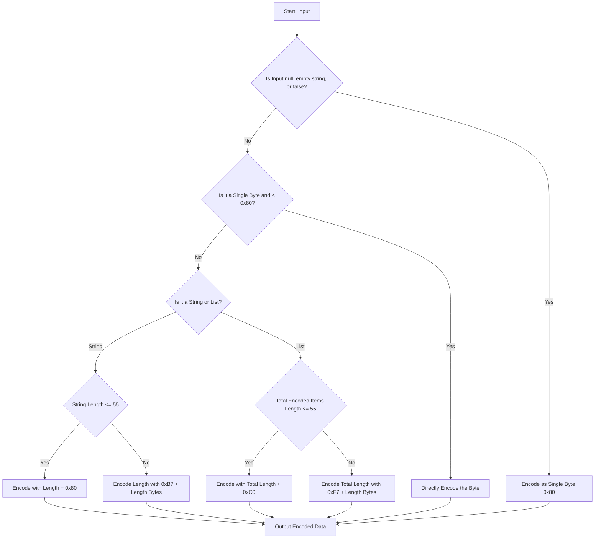
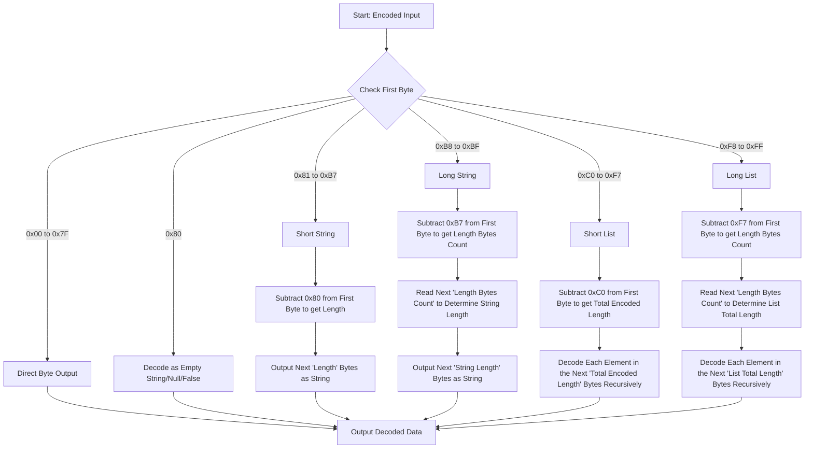

# 递归长度前缀 (RLP) 序列化

递归长度前缀 (RLP) 是序列化协议的核心，在 Execution Layer 中使用，用于编码和解析数据。它旨在序列化数据并生成所有客户端软件都可读的结构。它用于从交易数据到区块链的整个状态的所有内容。此 wiki 页面探讨了 RLP 的内部结构、其编码/解码规则、可用工具及其在 Ethereum 功能中的作用。

## Ethereum 中的数据序列化

数据序列化是将数据结构或对象转换为字节流以进行存储、传输或以后重建的过程。在 Ethereum 这样的分布式系统中，序列化对于通过网络节点可靠且高效地传输数据至关重要。 客户端用不同的语言编写需要能够以相同的方式处理数据。与其他节点通信或由客户端导出的数据需要具有标准格式。虽然有常见的序列化格式，如 JSON、XML 或 Protobuf，但 Ethereum 使用自己的协议，以实现对嵌套字节数组进行编码的简单性和有效性。

> Ethereum 实际上使用 2 种格式：RLP 和简单序列化 (SSZ)，这是 Consensus Layer 使用的更现代的标准。

## RLP 算法如何工作

**RLP 编码算法**

这是描述 RLP 编码算法如何工作的流程图。

_请注意，在某些 RLP 工具中，某些客户端可能会向流程添加额外的条件情况。这些附加情况不是标准规范的一部分，但它们对于客户端的正确数据序列化很有用，例如 geth 客户端节点与 Nethermind 通信客户端节点._

_图：RLP 编码流程_

**RLP 解码算法**

这是描述 RLP 解码算法如何工作的流程图。

_图：RLP 解码流程_

## RLP 编码规则

了解 RLP 编码是如何导出的，需要掌握根据数据的类型和大小应用的具体规则。让我们通过一个示例来探索这些规则，以演示如何对不同类型的数据进行编码。

如果您不熟悉将字符串转换为十六进制，您可以参考这个 [ASCII 图表](https://www.asciitable.com/)。 

### RLP 编码规则详解并举例

递归长度前缀 (RLP) 是 Ethereum 中使用的基本数据序列化技术，用于将结构化数据编码为字节序列。了解 RLP 编码是如何导出的，需要掌握根据数据的类型和大小应用的具体规则。让我们使用示例逐步探索这些规则，以演示如何对不同类型的数据进行编码。

**单字节编码**
  - **条件**：如果输入为单字节且其值在`0x00`和`0x7F`(含) 之间。
  - **编码**：字节直接编码，不变。
  - **示例**：对字节 `0x2a` 进行编码直接生成 `0x2a`。

**短字符串编码 (1-55 字节)**
  - **条件**：如果字符串 (或字节数组) 长度在 1 到 55 个字节之间。
  - **编码**：输出是字符串的长度加上`0x80`，后跟字符串本身。
  - **示例**：对字符串“dog”(`0x64, 0x6f, 0x67`) 进行编码会得到 `0x83, 0x64, 0x6f, 0x67`。这里，`0x83`是`0x80 + 3`(“dog”的长度)。

**长字符串编码 (超过 55 个字节)**
  - **条件**：如果字符串长度超过 55 字节。
  - **编码**：字符串的长度被编码为 big-endian 格式的字节数组，前缀为`0xb7`加上这个长度数组的长度。
  - **示例**：对于长度为 56 的字符串，编码长度为`0x38`，前面是`0xb8`(`0xb7 + 1`)。生成的编码以 `0xb8, 0x38` 开头，后跟字符串的字节。

**短列表编码 (总计载荷 1-55 字节)**
  - **条件**：如果列表项的总编码载荷介于 1 到 55 字节之间。
  - **编码**：列表以 `0xc0` 加上编码项的总长度为前缀。
  - **示例**：对于列表 `["cat", "dog"]`，每个项目首先编码为 `0x83, 0x63, 0x61, 0x74` 和 `0x83, 0x64, 0x6f, 0x67`。总长度为 8，因此前缀为 `0xc8` (`0xc0` + 8 = `0xc8`)。整个编码为`0xc8, 0x83, 0x63, 0x61, 0x74, 0x83, 0x64, 0x6f, 0x67`。

**长列表编码 (总计载荷超过 55 个字节)**
  - **条件**：如果列表项的总编码载荷超过 55 个字节。
  - **编码**：与长字符串类似，载荷的长度以 big-endian 格式编码，前缀为`0xf7`加上这个 length 数组的长度。
  - **示例**：对于超过 55 个字节的列表 `["apple", "bread", ...]`，假设载荷长度为 57。对长度 `0x39` 进行编码，前面是 `0xf8` (`0xf7 + 1`)，后面是编码后的列表项。

**Null、空字符串、空列表和 False**
  - 空字符串、Null 和 False 的规则：编码为单字节 `0x80`。
  - 空列表规则：编码为 `0xc0`。
  - 示例：
    - 对空字符串或 null 值或 false(` `、`null`、`false`) 进行编码，结果为 `0x80`。
    - 对空列表 `[]` 进行编码会产生 `0xc0`。

## RLP 解码规则 

RLP 解码过程基于编码数据的结构和细节：

**确定数据类型**：
  - 编码数据的第一个字节 (前缀) 决定了后续数据的类型和长度。该字节对于指导解码过程至关重要。
**解码单字节**：
  - 如果前缀字节在 `0x00` 到 `0x7F` 范围内，则该字节本身表示解码后的数据。这种情况很简单，因为字节是直接编码的。
**解码字符串和列表**：
  - 解码的复杂性随字符串和列表而增加，它们具有不同的长度并且可能包含嵌套结构。
**短字符串 (0x80 至 0xB7)**：
  - 如果前缀字节在`0x80`和`0xB7`之间，则表示一个字符串，其长度可以通过前缀减去`0x80`直接确定。接下来的字节长度等于字符串。
**长字符串 (0xB8 至 0xBF)**：
  - 对于较长的字符串，如果前缀字节在 `0xB8` 和 `0xBF` 之间，则长度字节数由前缀减去 `0xB7` 确定。后面的字节表示字符串的长度，后面的字节表示字符串本身。
**简短列表 (0xC0 至 0xF7)**：
  - 与短字符串类似，`0xC0` 和 `0xF7` 之间的前缀表示列表。列表的编码数据的长度可以通过从前缀中减去`0xC0`来确定。随后的字节必须递归解码为单独的 RLP 编码项。
**长列表 (0xF8 到 0xFF)**：
  - 对于较长的列表，`0xF8` 和 `0xFF` 之间的前缀表示接下来的几个字节 (通过从前缀中减去 `0xF7` 确定) 将告诉列表编码数据的长度。然后，这些长度字节后面的数据被递归解码为 RLP 项。

**RLP 的示例 `[0xc8, 0x83, 0x63, 0x61, 0x74, 0x83, 0x64, 0x6f, 0x67]` 的解码**

- **识别前缀**
  - 该序列以字节 `0xc8` 开始。在 RLP 中，列表的长度前缀从 `0xc0` 开始。 `0xc8` 和 `0xc0` 之间的差异为我们提供了列表内容的长度。
    - `0xc8 - 0xc0 = 8`
  - 这告诉我们接下来的 8 个字节是列表的一部分。
- **解码列表内容**
  - 本例中的列表内容为`[0x83, 0x63, 0x61, 0x74, 0x83, 0x64, 0x6f, 0x67]`。
  - 我们将逐字节解码该内容以提取各个项目。
- **解码第一个项目**
  - 列表内容的第一个字节是`0x83`。在 RLP 中，对于长度在 1 到 55 个字节之间的字符串，长度前缀从 `0x80` 开始。因此：
    - `0x83 - 0x80 = 3`
  - 这告诉我们第一个字符串的长度为 `3` 字节。
  - 接下来的三个字节是 `0x63, 0x61, 0x74`，对应于“cat”的 ASCII 值。
  - 我们现在已经解码了第一项：“猫”。
- **解码第二项**
  - 解码第一项后，序列中的下一个字节是另一个 `0x83`。
  - 遵循与之前相同的规则：
    - `0x83 - 0x80 = 3`
  - 这表明下一个字符串的长度也为 3 个字节。
  - 接下来的三个字节是`0x64, 0x6f, 0x67`，对应“dog”。
  - 现在我们已经解码了第二项：“狗”。
- 解码输出为`["cat", "dog"]`。

## Ethereum 中需要 RLP

> RLP 旨在成为高度简约的序列化格式；它的唯一目的是存储嵌套的字节数组。与 protobuf、BSON 和其他现有解决方案不同，RLP 不会尝试定义任何特定的数据类型，例如布尔值、浮点数、双精度数甚至整数；相反，它只是以嵌套数组的形式存储结构，并将其留给协议来确定数组的含义。
> -- Ethereum 的设计原理

RLP 是用 Ethereum 创建的，并经过定制以满足其特定需求：
- 简约设计：它纯粹专注于存储结构，而不强加数据类型定义。
- 一致性：它保证不同实现之间的字节完美一致性，这对于区块链操作所需的确定性至关重要。

## RLP 工具

Ethereum 中有许多可用于 RLP 实现的库。这里有一些工具：
- [Geth RLP](https://github.com/ethereum/go-ethereum/tree/master/rlp)
- [RLP 转储](https://github.com/ethereum/go-ethereum/tree/master/cmd/rlpdump)
- [RLP 用于节点.js 和浏览器。](https://github.com/ethereumjs/ethereumjs-monorepo/tree/master/packages/rlp)
- [Python RLP 序列化库。](https://github.com/ethereum/pyrlp)
- [Rust 的 RLP](https://docs.rs/ethereum-rlp/latest/rlp/)
- [Nethermind RLP 序列化](https://github.com/NethermindEth/nethermind/tree/master/src/Nethermind/Nethermind.Serialization.Rlp)

## 资源
- [Ethereum 黄皮书](https://ethereum.github.io/yellowpaper/paper.pdf)
- [Ethereum RLP 文档](https://ethereum.org/vi/developers/docs/data-structures-and-encoding/rlp/)
- [Mark Odayan 编写的 RLP 编码综合指南](https://medium.com/@markodayansa/a-comprehensive-guide-to-rlp-encoding-in-ethereum-6bd75c126de0)
- [Elixir 中的 Ethereum 的 RLP 序列化](https://www.badykov.com/elixir/rlp/)
- [Ethereum 揭秘第 3 部分 (RLP 解码)](https://medium.com/coinmonks/ethereum-under-the-hood-part-3-rlp-decoding-df236dc13e58)
- [Ethereum 在 ACL2 中的递归长度前缀](https://arxiv.org/abs/2009.13769)

