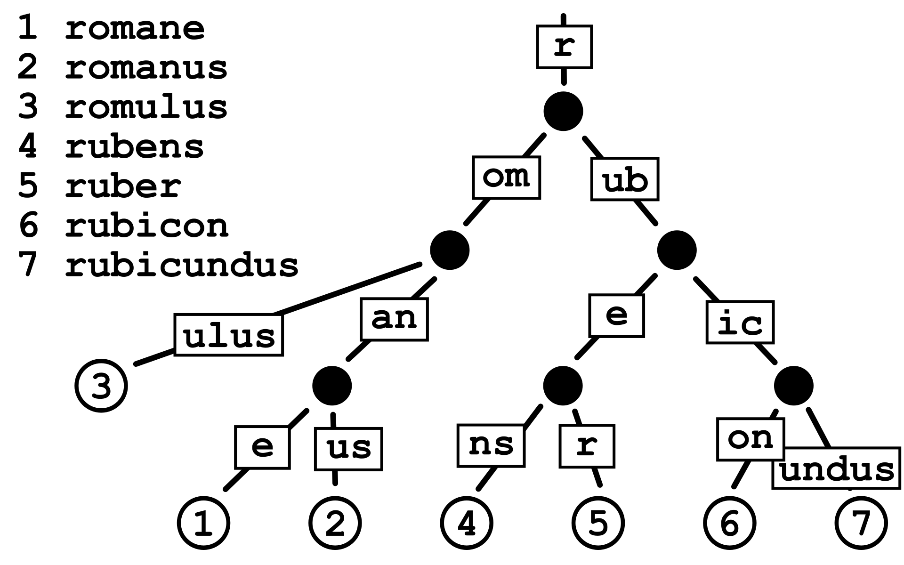
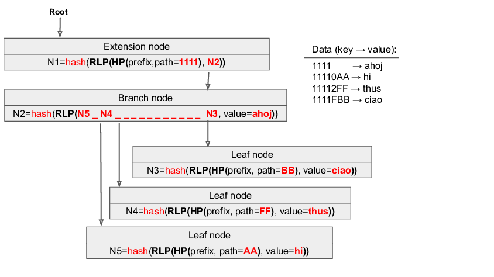
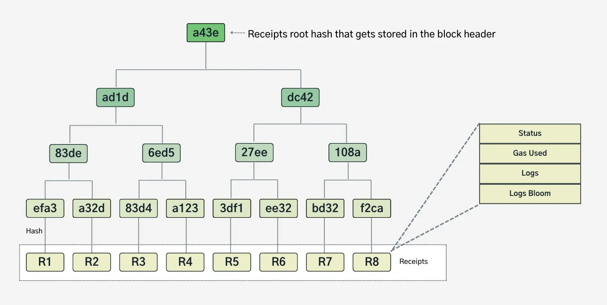

# 执行层中的数据结构

执行客户端存储当前状态和历史区块链数据。在实践中，以太坊数据存储在Trie类似的结构中，主要是Merkle Patricia Tree。

## RLP

[维基-RLP](/wiki/EL/RLP.md)

## Merkle 树上的底漆

Merkle 树是一个基于哈希的数据结构，在数据完整性和验证方面非常有效。它是一个基于树的结构，其中叶子节点保存数据值，每个非叶子节点都是其子节点的 哈希。

Merkle 树通过产生整组交易的数字指纹，将所有交易存储在区块中。它允许用户验证交易是否包含在区块中。 Merkle 树是通过重复计算节点的哈希对创建的，直到只剩下一个哈希。这个哈希被称为 **Merkle Root**，或者 Root 哈希。 Merkle 树是以自下而上的方法构建的。

需要注意的是，Merkle 树是**二叉树**，因此它需要偶数个叶子节点。如果交易的个数为奇数，则最后一个哈希将被复制一次，以创建偶数个叶子节点。

Merkle Trees 提供了防篡改结构来存储交易数据。 哈希函数具有雪崩效应，即数据的微小变化将导致生成的哈希发生巨大变化。因此，如果叶节点中的数据被修改，根哈希将与预期值不匹配。
您也可以自己尝试 [SHA-256](https://emn178.github.io/online-tools/sha256.html) 哈希函数。
要了解有关哈希的更多信息，您可以参考[此](https://github.com/ethereumbook/ethereumbook/blob/develop/04keys-addresses.asciidoc)。

Merkle Root 存储在**区块标头**中。阅读有关以太坊内部区块结构的更多信息(_一旦准备好，将将此链接到相关文档_)

主父级节点被称为 Root，因此里面的哈希就是 Root 哈希。有一个无限小的机会(对于单个 SHA-256 哈希，为 1.16x10^77 中的 1)创建具有相同根哈希的两个不同状态，并且任何使用不同值修改状态的尝试都将导致不同的状态根哈希。

下图描述了 Merkle 树工作的简化版本：

- 叶子节点包含实际数据(为了简单起见，我们采用了数字)。
- 每个非叶子节点都是其子级的哈希。
- 非叶节点的第一层包含其子叶节点的 哈希。
  `Hash(1,2)`
- 继续相同的过程，直到到达树的顶部，即所有先前哈希的 哈希。
  `Hash[Hash[Hash(1,2),Hash(3,4)],Hash[Hash(5,6),Hash(7,8)]]`

更多关于 [以太坊中的 Merkle 树](https://blog.ethereum.org/2015/11/15/merkling-in-ethereum)

## 帕特里夏树入门

Patricia Tries(也称为基数树)是 n 元树，与 Merkle 树不同，它用于有效存储数据而不是验证。

简而言之，Patricia Tries 是一个树形数据结构，其中：
 - 每个节点的子级数量最多为基数 Trie 的基数 r，其中对于某个整数 x ≥ 1，r = 2^x。
 - 与常规树不同，边缘可以用字符序列进行标记，从而使结构更加节省空间。
 - 作为唯一子项的每个节点都会与其父项合并，例如，与 Merkle 树相比，这也更节省空间。

一个简单的图表将显示 Patricia Trie 遍历的工作原理。假设我们正在搜索与键“romulus”关联的值。该值将保存在叶子节点中。
- 与常规 Trie(其中数据可能存储在中间节点中)不同，Patricia 尝试仅将值存储在叶节点中。这提高了空间效率并使密码验证更容易。

1. 从根节点开始，它作为入口点，并包含“r”，它将成为所有存储密钥的起始前缀。
2. 遵循边缘标签(压缩路径表示)，例如“om”。  Patricia Trie 将公共前缀合并到单个边缘中，而不是标准 Trie 将每个字符存储在单独的节点中。  这种前缀压缩使 Trie 更加紧凑，从而提高存储效率和高效查找。
3. 继续遍历，直到到达键“romulus”的叶子节点，获取值。

## 默克尔·帕特里夏 Trie

现在我们对 Merkle 树和 Patricia Tries 有了一定的了解，我们可以深入了解以太坊用于存储执行层状态的主要数据结构，**Merkle Patricia Trie**(发音为“try”)。之所以如此命名，是因为它是使用 PATRICIA(检索以字母数字编码的信息的实用算法)功能的 Merkle 树，并且因为它设计用于对包含以太坊状态的项目进行有效的数据检索。

- 它从默克尔树继承了加密验证属性，其中每个节点包含其子级的哈希。
- 它从 Patricia Tries 继承了高效的键值存储和检索能力，通过基于前缀的节点组织。

MPT 内的节点分为三种类型：

- **分支节点**：分支节点由17个元素的数组组成，其中包括1个节点值和16个分支。 节点类型是在 Trie 中进行分支和导航的主要机制。
- **扩展节点**：这些节点在 MPT 中充当优化的节点。当分支节点只有一个子分支节点时，它们就会发挥作用。 MPT 不是为每个分支复制路径，而是将其压缩为扩展节点，其中包含路径和子级的哈希。
- **叶子节点**：叶子节点代表一个键值对。值是MPT 节点的内容，而键是节点的哈希。叶子节点存储特定的键值数据。

每个节点都有一个哈希值。 节点的 哈希计算为其内容的 SHA-3 哈希值。此哈希还充当引用该特定节点的键。
半字节用作 MPT 中键值的区分单位。它代表一个十六进制数字。每个 Trie 节点可以分支出多达 16 个分支，确保简洁的表示和高效的内存使用。

下图说明了遍历和散列如何在 MPT 中协同工作。作为从叶子节点检索数据的示例，让我们使用键 `11110AA` 获取值 `hi`。

### 1. 从根开始(本场景中的扩展名节点)
- 我们正在搜索的密钥是 `11110AA`。
- 根节点是 **扩展节点** 因为此 Trie 中的所有键共享公共前缀 `1111`。
  - 它不是跨多个分支节点存储 `1111`，而是被压缩到单个边缘，从而使查找更加高效。
- 扩展名节点的 哈希是根哈希，计算如下：
  `N1 = hash(RLP(HP(prefix, path=1111), N2))`。
  - 由于 `N1` 依赖于 `N2`，因此 `N2` 中的任何更改都会改变根哈希。

### **2.导航至分支节点 (N2)**
- 在 `1111` 之后，密钥 (`11110AA`) 中的下一个十六进制字符是 `0`，因此我们从 `N2` 获取 `0` 分支，这将导致我们到**叶节点 (`N5`)**。
- 分支节点的 哈希计算如下：
  `N2 = hash(RLP(N5, ...))`。
  - 由于 `N2` 依赖于 `N5`，因此对 `N5` 的任何修改都会影响 `N2`，而 `N2` 又会影响 `N1`。

### **3.到达叶子节点 (N5)**
- `N5` 是搜索结束的**叶节点**。
- 叶子节点存储：
  - **前缀**：`AA`(`11110` 之后密钥的剩余唯一部分)。
  - **值**：`"hi"`。

> 这篇[优秀文章](https://easythereentropy.wordpress.com/2014/06/04/understanding-the-ethereum-trie/)详细解释了PATRICIA Trie以及用于练习的[python实现](https://github.com/ebuchman/understanding_ethereum_trie)。

# 以太坊

以太坊状态存储在四个不同的修改后的 Merkle Patricia Tries (MMPT) 中：

- 交易 Trie
- 收据Trie
- 世界状态 Trie
- 账户状态 Trie

每个区块都有一个交易、收据和状态 Trie，它们由区块标头中的根哈希引用。
对于部署在以太坊上的每个合约，都有一个存储 Trie 用于保存该合约的持久变量，每个存储 Trie 都由存储在与该合约地址对应的状态 Trie 叶节点中的状态帐户对象中的根哈希引用。

## 交易 Trie

交易 Trie 是一个数据结构，负责存储特定区块内的所有交易。每个区块都有自己的交易 Trie，对应于该区块中包含的相应交易。
以太坊是基于交易的状态机。这意味着以太坊中的每个操作或更改都是由交易引起的。每个区块都由区块标头和交易列表(除其他外)组成。因此，一旦执行了交易并最终确定了区块，则该区块的 交易 Trie 就永远不能更改。(与世界状态 Trie 相比)。

交易映射到 Trie 中，因此键是交易索引，值是交易 T。两者都
交易索引和交易本身是 RLP 编码的。它组成一个键值对，存储在Trie中：
`𝑅𝐿𝑃 (𝑖𝑛𝑑𝑒𝑥) → 𝑅𝐿𝑃 (𝑇)`

请参阅[摘要](/wiki/EL/el-data-structures-summary?id=transaction-trie)，了解交易 Trie 中不同交易类型的字段定义。

##  收据Trie

收据 Trie 与交易 Trie 类似，因为它是区块级别的数据结构，并且 Trie 的每个叶子代表与该收据相关的一些 RLP 编码数据。 交易。然而，收据 Trie 用于验证每个交易中的指令是否实际执行。  此验证数据保存在叶子节点中，并包含一些字段，这些字段在 wiki 的 [交易解剖](/wiki/EL/transaction.md#receipts) 部分中进行了描述。

在本节中，我们将重点关注 `Receipt Trie` 本身。

`Receipt Trie` 的 `ReceiptRoot` 是根节点的 keccak 256 位哈希。

下面是收据 Trie 的简单图，它遵循 Merkle Patricia Trie 流程进行值查找。

如果您知道交易在 区块中的索引，您可以轻松地在 `Receipt Trie` 中找到它对应的收据。  这是因为交易在 区块中的位置(索引)被用作包含该交易收据的 `Receipt Trie` 叶节点中的键。  使用交易的索引作为收据的键可以带来一些好处，例如避免需要计算或查找交易哈希来在 Trie 中查找收据。

收据 Trie 的主要作用是提供交易结果的规范的、经过验证的记录，主要用于索引历史数据，而无需重新执行交易。在快照同步期间，全节点下载区块主体(其中包含交易及其相应的收据)，并在本地为每个区块重建收据 Trie。然后根据区块标头中的收据根验证重建的 Trie。快照同步无需全节点重新执行历史交易来重新生成收据，从而显着加快了同步过程。

虽然收据使轻客户端能够通过针对receiptsRoot 的 Merkle 证明来验证交易结果，但这是二次使用。由于轻客户端仅存储区块标头，因此它们依赖全节点来查询这些证明和 `receiptsRoot`。  这种结构允许轻客户端独立验证数据的合法性，而无需存储完整的交易历史记录。

收据的字段定义请参见[摘要](/wiki/EL/el-data-structures-summary?id=receipts-trie)。

## 世界状态 Trie

**世界状态 Trie** 是表示以太坊当前状态的核心数据结构。它利用 **Merkle Patricia Trie** 将 keccak-256 散列 20 字节帐户地址映射到其 RLP 编码状态，其中键值对作为字节数组存储到 Trie 叶子中的字节数组。

帐户可分为带有代码的智能合约帐户或与私钥关联的外部拥有帐户 (EOA)。 EOA用于与其他EOA或智能合约账户发起交易，触发相关合约代码的执行。

**世界状态 Trie** 不存储在链中，但是 Trie 的 32 字节 keccak-256 **状态根** 存储在每个区块头中，位于 a 中所有交易之后。 区块已处理。  **状态根** 用作整个系统状态的加密承诺，因为它在加密上依赖于 Trie 中的所有数据。  例如，在给定 **状态根** 和包含该帐户的 **Merkle 证明** 的情况下，节点可以证明帐户的存在以及重新创建 **状态根** 所需的同级节点。  此外，每个区块中的**状态根**锚定了以太坊的共识：任何节点都可以通过将区块的交易应用于先前的状态Trie来独立计算或验证该根。

下面是 ***世界状态 Trie*** 的简化图。

我们遍历 Trie 来查找余额为 **45 ETH** 的账户。该帐户的密钥显示为 `a711355`，这意味着这七个十六进制数字引导我们从根节点向下到叶节点。

> 这个短密钥 `a711355` 仅用于演示。 以太坊中的实际地址经过哈希处理(32 字节)，因此通常在 Trie 中产生最多 64 个半字节。但遍历步骤是相同的​​ - 每个半字节选择下一个分支/扩展节点，直到到达存储最终帐户数据的叶子节点。

1. **小咬的关键**
   - 密钥字符串 `a711355` 代表七个十六进制数字：`a`、`7`、`1`、`1`、`3`、`5`、`5`。
   - 每个数字都是一个半字节(4 位)，因此整个密钥是七个半字节的序列。

2. **通过 Trie 的路径**
   - **根目录下的扩展节点** 可能会存储像 `a7` 这样的前缀，消耗前两个半字节。
   - **分支节点** 随后，允许通过每个后续半字节进行导航(`1`、`1`、`3`、`5`、`5`)。

3. **叶节点**
   - 消耗完所有的半字节后，我们就得到了 **叶子节点**。在我们的简化示例中，其存储值为**“45 ETH”**。
   - 在以太坊的真实MPT中，这个叶子节点实际上保存着RLP编码的账户对象`[nonce, balance, storageRoot, codeHash]`。

Trie 状态账户的字段定义请参见[摘要](/wiki/EL/el-data-structures-summary?id=state-trie)。

### 持久存储

**世界状态 Trie** 是一个随每个区块一起演化的活体结构，这与交易和收据 Trie 不同，它们是为每个区块从头开始重建的。  以太坊作为状态机运行，其中当前状态通过在区块中执行交易来更新。每个节点必须跟踪此当前状态以验证交易并相应地更新它。因此，在区块处理期间存在中间状态，但节点仅保留最终的区块后状态。  全节点将跟踪 **世界状态 Trie** 的当前状态以及在重组期间倒回所需的足够的 Trie 节点。  存档节点将跟踪自创世以来的所有先前状态。

总之，以太坊的 世界状态是给定区块高度下所有帐户当前状态的安全且可验证的表示。

## 存储Trie

在上一节中，我们描述了 **世界状态 Trie** 中的每个帐户叶子如何包含一个 `storageRoot`，它是一个单独的 Merkle Patricia Trie 的根节点的 keccak-256 哈希， **存储Trie**。此 Trie 未嵌入 **世界状态 Trie** 中，而是通过 `storageRoot` 引用，从而使存储能够独立更新和验证，同时仍为全局状态根做出贡献。

**存储 Trie** 将合约的持久状态表示为 256 位存储槽索引(键)到 256 位 RLP 编码值的映射。  每个这样的键值对都称为存储槽。  与 **世界状态 Trie** 一样，它使用安全密钥方案，其中每个时隙索引在插入之前都使用 keccak-256 进行哈希处理。  这可以防止攻击者制作导致长遍历路径或高度不平衡的 Trie 结构的密钥，否则可能通过在 Trie 查找或更新期间引发过多计算来利用这些密钥进行 DOS 攻击。

> 虽然高级语言(例如 Solidity)定义了如何在存储槽上布局合约变量，但这种布局抽象源于语言本身。  执行层只是实现了这个抽象。在 EL 层级别，Trie 将所有时隙视为统一的键值条目。

每个帐户都有自己的 **存储 Trie**，它以空 Trie 开头。 Trie 通过 `SSTORE` 操作码修改，并在合约执行期间通过 `SLOAD` 读取。对于 EOA，存储 Trie 保持为空并且永远不会被访问。这些操作码在 EVM 中定义，并在 [EVM 文档的存储部分](wiki/EL/evm.md#evm-data-locations) 中进一步描述。

要从 **Storage Trie** 的叶子检索存储槽的值(例如索引 `0x00`)：
1. RLP 对时隙索引进行编码，并对结果进行 keccak-256 哈希编码。
2. 使用生成的哈希作为键来遍历 Trie，从 `storageRoot` 开始。
3. 沿着使用哈希的半字节的路径到达相应的叶节点。
4. 提取并解码存储在叶子中的 RLP 编码值。

可以沿着该路径从节点构造证明，以根据 `storageRoot` 验证时隙的值。

综上所述，**存储Trie**是以太坊账户模型的基础，为每个合约提供了自己隔离且可验证的存储空间。与将地址映射到账户元数据的 **世界状态 Trie** 不同，**存储 Trie** 在区块上维护合约特定的键值状态。

## 未来的实施

## 韦尔克尔树

[Verkle 树](https://verkle.info/) 是一种新的数据结构，旨在取代当前的 Merkle Patricia Trie。它由“Vector 承诺”和“Merkle 树”组合命名，其设计比当前的MPT更加高效和可扩展。它是一个基于 Trie 的数据结构，用轻量级见证替换了 MPT 中使用的重型见证。 Verkle 树是 The Verge 升级 [以太坊路线图](https://ethereum.org/en/roadmap/#what-about-the-verge-splurge-etc) 的关键部分。它们可以使 [无状态](https://ethereum.org/en/roadmap/statelessness/#statelessness) 客户端更加高效和可扩展。

### Verkle 树的结构

Verkle 树的布局结构与 MPT 类似，但树的基础不同，即子级的数量。就像[MPT](https://ethereum.org/en/developers/docs/data-structures-and-encoding/patricia-merkle-trie/#optimization)一样，它有根节点，内部节点，扩展节点和叶节点。生成树的密钥大小略有不同。 MPT 使用 20 字节密钥，而 Verkle 树使用 32 字节密钥，其中 31 个字节用作树的主干，而最后 1 个字节用于存储几乎相同的主干地址或相邻代码块(打开相同的承诺更便宜)。另外，由于算法在计算见证数据时采用 252 位作为字段元素，因此使用 31 字节作为树的后缀很方便。使用此功能，主干数据可以提交范围为 0-127 和 128-255 的两个差异承诺，即同一键的下限值和上限值，从而覆盖整个后缀空间。有关此内容的更多信息，请参阅[此处](https://blog.ethereum.org/2021/12/02/verkle-tree-structure)。

### MPT 和 Verkle 树之间的主要区别

Merkle/MP 树具有很大的深度，因为每个节点的树结构都是二叉(2/16 树)。这意味着叶子节点的见证数据是从根到叶子的路径。由于每个级别都需要同级哈希数据，这使得见证数据对于大树来说非常大。 Verkle 树具有很大的宽度，因为每个节点的树结构都是 n 元的。这意味着叶子节点的见证数据是从叶子到根的路径。对于一棵大树来说这可能非常小。目前，Verkle 树建议每个节点有 256 个子级。更多相关信息[此处](https://ethereum.org/en/roadmap/verkle-trees/)

Merkle/MP 树的中间节点是子节点哈希。 Verkle 树的 节点携带一种特殊类型的哈希，称为“向量承诺”，以提交给其子级。这意味着 Verkle 树中的叶节点的见证数据是从叶到根的路径的子项承诺。除此之外，通过聚合承诺来计算证明，这使得验证过程非常紧凑。更多关于[证明系统](https://dankradfeist.de/ethereum/2021/06/18/pcs-multiproofs.html?ref=hackernoon.com)。

### 为什么选择 Verkle 树？

要使客户端无状态，验证区块至关重要，客户端不必存储整个/先前的区块链状态。传入的区块应该能够为客户端提供验证区块所需的数据。这些额外的证明数据称为_witness_，启用无状态客户端在没有完整状态的情况下验证数据。
使用区块内部的信息，客户端还应该能够通过每个传入的区块维护/增长本地状态。使用此客户端可以保证当前区块 (以及它验证的后续区块)状态转换是正确的。它不能保证当前区块引用的先前区块的状态是正确的，因为区块生产者可以在无效或非规范的区块上构建。

Verkle 树的设计目的是在存储和通信成本方面更加高效。对于 1000 个叶子/数据，二进制 Merkle 树需要大约 4MB 的见证数据，Verkle 树将其减少到 150 kB。如果我们将见证数据包含在区块中，那么它不会对块大小产生太大影响，但会使无状态客户端更加高效和可扩展。使用此无状态客户端将能够信任完成的计算，而无需存储整个状态。

过渡到新的 Verkle 树数据库带来了重大挑战。为了安全地创建新的 verkle 数据，客户端需要从现有的 MPT 生成它们，这需要大量的计算和空间。目前正在研究verkled数据库的分发和验证。

## 资源

- [以太坊中的默克尔](https://blog.ethereum.org/2015/11/15/merkling-in-ethereum)
- [更多关于默克尔·帕特里夏 Trie](https://ethereum.org/developers/docs/data-structures-and-encoding/patricia-merkle-trie)
- [更多关于 Verkle 树](https://notes.ethereum.org/@vbuterin/verkle_tree_eip#Simple-Summary)
- [边缘过渡](https://notes.ethereum.org/@parithosh/verkle-transition)
- [实施 Merkle 树和 Patricia Trie](https://medium.com/coinmonks/implementing-merkle-tree-and-patricia-trie-b8badd6d9591) • [已存档](https://web.archive.org/web/20210118071101/https://medium.com/coinmonks/implementing-merkle-tree-and-patricia-trie-b8badd6d9591)
- [基数 Trie](https://en.wikipedia.org/wiki/Radix_tree#) • [已存档](https://web.archive.org/web/20250105072609/https://en.wikipedia.org/wiki/Radix_tree)
- [基数 Trie 图](https://samczsun.com/content/images/2021/05/1920px-Patricia_trie.svg-1-.png) • [已存档](https://web.archive.org/web/20231209235318/https://samczsun.com/content/images/2021/05/1920px-Patricia_trie.svg-1-.png)
- [Merkle Patricia Trie 图](https://www.researchgate.net/publication/353863430/figure/fig2/AS:1056193841741826@1628827643578/Ethereum-Encoded-Merkle-Patricia-Trie.png)
- [Merkle Patricia Trie 图解说明](https://www.researchgate.net/publication/353863430_Ethereum_Data_Structures)
- [收据 Trie 包括图表](https://medium.com/coinmonks/ethereum-data-transaction-receipt-trie-and-logs-simplified-30e3ae8dc3cf) • [已存档](https://web.archive.org/web/20250000000000/https://medium.com/coinmonks/ethereum-data-transaction-receipt-trie-and-logs-simplified-30e3ae8dc3cf)
- [以太坊数据结构](https://arxiv.org/pdf/2108.05513/1000) • [已存档](https://web.archive.org/web/20240430050355/https://arxiv.org/pdf/2108.05513/1000)
- [DevP2P 有线协议](https://github.com/ethereum/devp2p/blob/master/caps/eth.md) • [已存档](https://web.archive.org/web/20250328095848/https://github.com/ethereum/devp2p/blob/master/caps/eth.md)
- [快照同步](https://geth.ethereum.org/docs/fundamentals/sync-modes) • [已存档](https://web.archive.org/web/20250228111146/https://geth.ethereum.org/docs/fundamentals/sync-modes)
- [更多关于默克尔·帕特里夏 Trie](https://ethereum.org/developers/docs/data-structures-and-encoding/patricia-merkle-trie)
- [以太坊黄皮书](https://ethereum.github.io/yellowpaper/paper.pdf) • [已存档](https://web.archive.org/web/20250228142704/https://ethereum.github.io/yellowpaper/paper.pdf)
- [状态 Trie 密钥](https://medium.com/codechain/secure-tree-why-state-tries-key-is-256-bits-1276beb68485#:~:text=This%20is%20because%20when%20Ethereum,the%20secure%20tree%20in%20Ethereum) • [已存档](https://web.archive.org/web/20230524084537/https://medium.com/codechain/secure-tree-why-state-tries-key-is-256-bits-1276beb68485)
