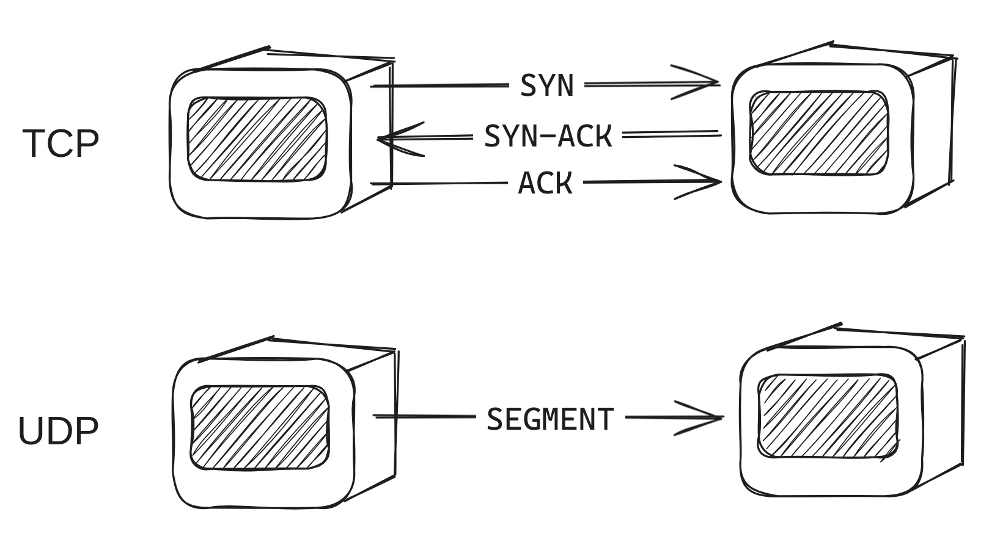
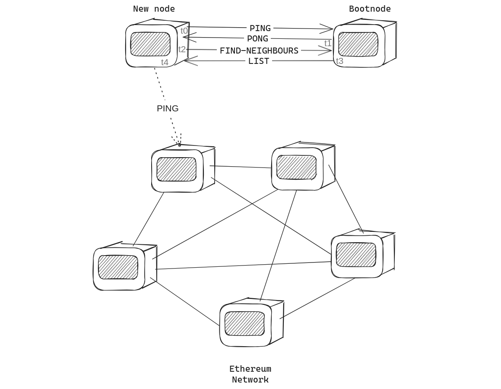
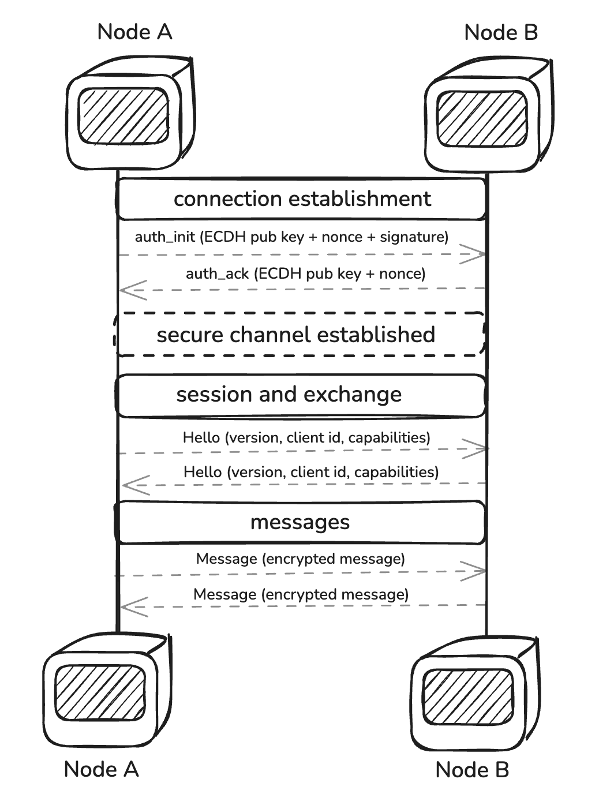

# DevP2P

本节将介绍执行层 (EL) 使用的网络协议。
首先，正如[网络部分](../dev/cs-resources.md?id=networking)中提到的，重点关注传输层，DevP2P使用的两个协议是TCP(传输控制协议)和UDP(用户数据报协议)。
这两种协议都用于通过互联网发送数据，但它们具有不同的特征。正如 Tanenbaum 指出的那样(2021)，TCP 是一种面向连接的协议，这意味着它在发送数据之前在发送方和接收方之间建立连接。
它是可靠的，因为它确保数据以正确的顺序交付且没有错误。 UDP 是无连接协议，这意味着它在发送数据之前不建立连接。
它比 TCP 更快，因为它在发送数据之前不必建立连接，但可靠性较差，因为它不能确保数据以正确的顺序传递或没有错误。




## EL 的网络规范
作为点对点网络以太坊意味着一系列规则以实现其参与者节点之间的通信。本节将解释这些规则以及它们如何在 EL 中实现。
考虑到每个以太坊节点都是基于两个不同的组件构建的：执行客户端和共识客户端，它们每个组件都有自己的点对点网络，具有自己的用途。
执行客户端负责八卦交易，而共识客户端负责八卦区块。
>  不同的CL/EL p2p网络及其底层技术有历史原因。 以太坊最初是在 devp2p 上构建的，作为它自己的自定义网络堆栈。当信标链创建时，libp2p 已准备好用于生产并在那里采用。
记住这一点，EL 网络的范围涵盖两个并行工作的不同堆栈：发现堆栈和信息传输本身。 
发现堆栈负责查找节点对等节点，而传输堆栈负责在它们之间发送和接收消息。
考虑到计算机网络背景，我们可以推断发现堆栈依赖于UDP协议，而信息交换堆栈依赖于TCP协议。
这背后的原因是信息交换需要节点之间的可靠连接，
因此他们能够在发送数据之前确认连接，并有办法确保数据以正确的顺序传送并且没有错误(或者至少有办法检测和纠正它们)，
而发现过程并不需要可靠的连接，因为只要让其他人知道节点可以进行通信就足够了。

### Discv协议(发现)
节点如何在网络中找到彼此的过程从[规范中列出的硬编码启动节点](https://github.com/ethereum/go-ethereum/blob/master/params/bootnodes.go)开始。
引导节点是节点，网络中的所有其他节点(主网和测试网)都知道它们，它们用于引导发现对等节点进程。
使用类似 Kademlia 的 DHT(分布式哈希表)算法，节点能够通过引用列出启动节点的路由表在网络中找到彼此。
Kademlia 的 TLDR 在于，它是一个点对点协议，使得节点通过使用分布式哈希表在网络中找到对方，正如 Leffew 在他的文章(2019)中提到的。

也就是说，连接过程从 PING-PONG 游戏开始，其中新的节点向 bootnode 发送 PING 消息，bootnode 响应 PONG 哈希消息。
如果两条消息匹配，则新的节点能够与 bootnode 绑定。除此之外，新的节点向 bootnode 发送 FIND-NEIGHBOURS 请求，因此它可以接收能够连接的邻居列表，
所以它可以与他们重复 PING-PONG 游戏并与他们建立联系。



#### 有线协议
PING/PONG 游戏更广为人知的名称是“wire 子协议”，它包含以下规范：

**PING数据包结构**
```
version = 4
from = [sender-ip, sender-udp-port, sender-tcp-port]
to = [recipient-ip, recipient-udp-port, 0]
packet-data = [version, from, to, expiration, enr-seq ...]
```

**PONG 数据包结构**
```
packet-data = [to, ping-hash, expiration, enr-seq, ...]
```

数据包数据与标头一起包装在 1280 字节 UDP 数据报中：
```
packet-header = hash || signature || packet-type
hash = keccak256(signature || packet-type || packet-data)
signature = sign(packet-type || packet-data)
packet = packet-header || packet-data
```

**FindNode数据包结构**(上面称为FIND-NEIGHBOURS)
```
packet-data = [target, expiration, ...]
```
其中目标是 64 字节 secp256k1 节点的公钥。

**邻居数据包结构**
```
packet-data = [expiration, neighbours, ...]
neighbours = [ip, udp-port, tcp-port, node-id, ...]
```
其中邻居是能够与新节点连接的 16 个节点的列表。

**ENR 请求数据包结构**
```
packet-data = [expiration]
```

**ENR 响应包结构**
```
packet-data = [request-hash, ENR]
```
其中 ENR 是以太坊节点记录，是节点连接的标准格式。下面对此进行解释。

---


这个类似 Kademlia 的协议包括路由表，它保存由 *k-buckets* 组成的邻域中其他节点的信息(其中 *k* 是桶中节点的数量，当前定义为 16)。
值得一提的是，所有表条目均按头部“最后一次查看/最近最少查看”排序，最近一次查看在尾部排序。
如果其中一个实体在 12 小时内没有得到响应，则会将其从表中删除，并将下一个遇到的节点添加到列表的尾部。


#### 发现协议(Discv4 和 Discv5)
目前，大多数执行客户端已采用 [Discv5 协议](https://github.com/ethereum/devp2p/blob/master/discv5/discv5.md) 进行发现过程，而有些仍在从 [Discv4](https://github.com/ethereum/devp2p/blob/master/discv4.md) 过渡。下表是根据 Discv5 支持状态(截至 2025 年 5 月)执行客户端的分类表。

| **类别** | **执行客户端** |
|---------------------|-------------------------------------------|
| **支持 Discv5** | [Geth](https://github.com/search?q=repo%3Aethereum%2Fgo-ethereum%20discv5&type=code)、[Nethermind](https://github.com/search?q=repo%3ANethermindEth%2Fnethermind+discv5&type=issues)、[Reth](https://github.com/search?q=repo%3Aparadigmxyz%2Freth%20discv5&type=code) |
| **待迁移** | [Besu](https://github.com/search?q=repo%3Ahyperledger%2Fbesu+discv5&type=issues)、[Ethereumjs](https://github.com/ethereumjs/ethereumjs-monorepo/tree/master/packages/devp2p)、[Erigon](https://github.com/search?q=repo%3Aerigontech%2Ferigon+discv4&type=code) |
##### 光盘v4
一个结构化的分布式系统，允许以太坊节点无需中央协调即可发现对等节点。  

- **节点身份**  
  - 每个节点由 secp256k1 密钥对标识。  
  - 公钥用作节点的唯一标识符 (节点 ID)。  
  - 节点之间的距离是使用散列公钥的 XOR 计算的。  

- **节点记录 (ENR)**  
  - 节点使用以太坊节点记录 (ENR) 存储和共享连接详细信息。  
  - “v4”身份方案用于验证节点的真实性。  
  - 对等节点可以通过 **ENRRequest** 数据包请求节点的最新 ENR。  

- **[Kademlia 表](https://en.wikipedia.org/wiki/Kademlia)**  
  - 节点维护一个包含 256 个 **[k-buckets](https://en.wikipedia.org/wiki/Kademlia#Fixed-size_routing_tables)** 的 **路由表** (每个路由表最多包含 16 个条目)。  
  - 桶存储特定距离范围内的节点(例如`[2^i, 2^(i+1))`)。  
  - 节点按上次查看时间排序，确保表满时替换陈旧的节点。  

- **端点验证(参与证明)**  
  - 通过在响应查询之前验证节点来防止放大攻击。  
  - 如果节点已向最近的 **Ping** 请求发送有效的 **Pong** 响应，则视为已验证。  

- **递归查找算法**  
  - 查找最接近目标的 `k`(通常为 16)。  
  - 搜索首先查询最接近的已知节点(`α`，通常设置为 3)的一小部分选定子集。  
  - 查找是迭代的，查询在前面的步骤中找到的新的节点，直到没有发现更接近的节点。  

- **有线协议和消息类型**  
  - 消息通过 **UDP** 发送。  
  - 每个数据包包含一个标头(`hash`、`signature`、`packet-type`)，后跟编码数据。  
  - 核心消息类型：  
    - **Ping (0x01)：** 验证节点可用性。  
    - **Pong (0x02)：** 对 Ping 的响应，证明可达性。  
    - **FindNode (0x03):** 请求目标 ID 附近的节点。  
    - **邻居 (0x04)：** 使用最接近的已知对等节点回复 FindNode。  
    - **ENRRequest (0x05):** 请求节点的最新 ENR。  
    - **ENRResponse (0x06)：** 提供 ENR 以响应请求。  


##### 光盘v5

Discv5 是以太坊改进的去中心化对等节点发现协议，建立在 Discv4 的基础上，具有增强的服务发现和安全机制。与其前身一样，Discv5 使节点能够以分散的方式定位并连接对等节点，而不依赖于集中式目录。然而，它引入了加密通信、服务发现和自适应路由。

受 Kademlia DHT 的启发，discv5 的不同之处在于仅存储签名的节点记录 (ENR)，而不是任意键值对。这确保了对等节点发现的真实性和完整性。这确保了对等节点发现的真实性和完整性，同时保持了协议扩展的灵活性。

- **以太坊节点记录 (ENR)**
  - 每个节点维护一个 **以太坊节点记录 (ENR)**，存储**连接详细信息、加密密钥和元数据**。
  - ENR 已签名、独立且动态更新。
  - 对等节点可以使用 **ENRRequest 数据包** 请求最新的 ENR。

- **加密有线协议**
  - 使用 **[AES-GCM 加密](https://en.wikipedia.org/wiki/AES-GCM-SIV)** 来保证机密性和真实性。
  - 通过 ECDH** ([椭圆曲线 Diffie-Hellman](https://en.wikipedia.org/wiki/Elliptic-curve_Diffie%E2%80%93Hellman)) 建立 **会话密钥。
  - 实施 **WHOAREYOU 质询-响应机制**以防止欺骗。

- **基于 Kademlia 的路由和节点表**
  - 节点维护一个**路由表(k-buckets)**，其中对等节点按 XOR 距离排序。
  - 查找过程递归地查询最接近的已知节点。
  - 该协议支持**自适应路由和自我修复**。

- **递归节点查找和对等节点发现**
  - 节点通过**基于 Kademlia 的迭代查找**找到对等节点。
  - 使用并行查询**提高针对对手的弹性**。
  - Bootstrap 节点有助于新的节点条目。

- **主题广告和服务发现**
  - 节点通过**主题广告**发布服务广告。
  - 搜索提供服务的节点使用**主题半径内的 Kademlia 查找**。
  - 自适应**半径估计**可确保高效搜索。

- **有线协议和消息类型**
  | **留言** | **功能** |
  |---------------|-------------|
  | **平** (0x01) |检查节点是否还活着。 |
  | **乒乓** (0x02) |对 Ping 的响应，确认可达性。 |
  | **查找节点** (0x03) |请求目标 ID 附近的对等节点。 |
  | **节点** (0x04) |使用已知的对等节点响应 FindNode。 |
  | **ENR请求** (0x05) |请求节点的最新 ENR。 |
  | **ENR响应** (0x06) |提供请求的 ENR。 |
  | **你是谁** (0x07) |身份验证质询。 |
  | **握手** (0x08) |建立加密会话。 |
  | **TalkReq / TalkResp** (0x09/0x0A) |启用自定义应用程序协议。 |


##### 比较：Discv4 与 Discv5
|特色|光盘v4 |光盘v5 |
|-------------------------|--------|--------|
| **节点记录** |基本 ENR |可扩展的 ENR 与元数据 |
| **安全** |明文| AES-GCM 已加密 |
| **握手** |无 |安全会话建立|
| **服务发现** |有限公司|基于主题的查找 |
| **可扩展性** |静态|支持多种身份方案 |
| **时钟依赖性** |必填|已淘汰 |
| **可扩展性** |中等|针对大型网络进行优化 |

### ENR: 以太坊节点记录
ENR 是 p2p 连接的标准格式，最初是在 [EIP-778](https://eips.ethereum.org/EIPS/eip-778) 中提出的。
节点记录包含节点的网络端点，例如 IP 地址和端口，以及节点的公钥和记录的序列号。

记录内容结构如下：

|关键|价值|
| --- |-------------------------------------------|
|编号 | id 方案，例如“v4” |
| secp256k1 |压缩公钥，33 字节 |
| ip | IPv4 地址，4 字节 |
| TCP | TCP 端口，大端整数 |
| UDP | UDP 端口，大端整数 |
| IP6 | IPv6 地址，16 字节 |
| TCP6 | IPv6 特定 TCP 端口，大端整数 |
| UDP6 | IPv6 特定的 UDP 端口，大端整数 |

除 `id` 字段为必填字段外，所有字段都是可选的。如果未提供 `tcp6`/`udp6` 端口，则 `tcp`/`udp` 端口同时用于 IPv4 和 IPv6。

节点记录由 `signature`(记录内容的加密签名)和 `seq` 字段(记录的序列号(64 位无符号整数))组成。
#### 编码

该记录被编码为 `[signature, seq, k, v,...]` 的 RLP 列表，最大大小为 300 字节。
签名记录编码如下：
```
content = [seq, k, v, ...]
signature = sign(content)
record = [signature, seq, k, v, ...]
```
除了 RLP 编码之外，还有记录的文本表示，它是 RLP 编码的 Base64 编码。它的前缀为 `enr:`。
即 `enr:-IS4QHCYrYZbAKWCBRlAy5zzaDZXJBGkcnh4MHcBFZntXNFrdvJjX04jRzjzCBOonrkTfj499SZuOh8R33Ls8RRcy5wBgmlkgnY0gmlwhH8AAAGJc2VjcDI1NmsxoQPKY0yuDUmstAHYpMa2_oxVtw0RW_QAdpzBQA8yWM0xOIN1ZHCCdl8` 包含环回地址 `127.0.0.1` 和 UDP 端口 30303。 节点 ID 是 `a448f24c6d18e575453db13171562b71999873db5b286df957af199ec94617f7`。

尽管 ENR 是 p2p 连接的标准格式，但并不强制在以太坊网络中使用它。 节点可以使用任何其他格式来交换有关其连接性的信息。
以太坊节点还可以理解两种附加格式：multiaddr 和 enode。

* multiaddr 是最初的那个。例如，具有侦听 TCP 端口 30303 和节点 ID `a448f24c6d18e575453db13171562b71999873db5b286df957af199ec94617f7` 的环回 IP 的节点的多地址为 `/ip4/127.0.0.1/tcp/30303/a448f24c6d18e575453db13171562b71999873db5b286df957af199ec94617f7`。
* enode 是一种更易于人类阅读的格式。例如，同一个节点的enode是`enode://a448f24c6d18e575453db13171562b71999873db5b286df957af199ec94617f7@127.0.0.1:30303?discport=30301`。它是一种类似于 URL 的格式，描述了在设计 @ 符号之前编码的 URL、IP 地址、TCP 端口和指定为“discport”的 UDP 端口。

### RLPx 协议(传输)

到目前为止，本文仅涉及发现协议，但是安全信息交换过程又如何呢？那么，RLPx 是基于 TCP 的传输协议，可在 EL 中实现对等节点到 对等节点的安全通信。它处理连接建立以及以太坊节点之间的消息交换。该名称来自 [RLP 序列化格式](../EL/RLP.md)。

在深入研究该协议之前，这里是一个总结，后面是一张图：

* 通过加密身份验证确保连接安全
* 会话建立
* 消息框架和信息交换




#### 安全连接建立

一旦发现节点，RLPx 就会通过基于加密的握手相互验证，从而在它们之间建立安全连接。
此过程首先启动身份验证，其中启动器节点使用 secp256k1 椭圆曲线生成临时密钥对。这个临时密钥在为会话建立完美的前向保密性方面发挥着至关重要的作用。然后，发起方向接收方发送包含临时公钥和随机数的身份验证消息，接收方接受连接，使用通信期间交换的公钥解密并验证身份验证消息。

接收方将确认消息发送回发起方，然后发送第一个包含 [Hello 消息](https://github.com/ethereum/devp2p/blob/master/rlpx.md#hello-0x00) 的加密帧，其中包括端口、它们的 ID 和它们的客户端的 ID 以及协议信息。一旦节点相互验证了身份，他们就可以开始通信。

#### 会话和复用
一旦验证通过，他们就可以通过以下过程首先创建安全会话进行交互：
- RLPx 使用**椭圆曲线集成加密方案([ECIES](https://cryptobook.nakov.com/asymmetric-key-ciphers/ecies-public-key-encryption))**来实现安全的**握手和会话建立**。
- 密码系统包括：
  - **椭圆曲线**：secp256k1
  - **密钥导出函数 (KDF)**：NIST SP 800-56 连接 KDF
  - **消息验证码(MAC)**：HMAC-SHA-256
  - **加密算法**：AES-128-CTR

##### 加密过程

1. **发起者生成随机临时密钥对**。
2. 使用 **椭圆曲线 Diffie-Hellman (ECDH)** 计算 **共享秘密**。
3. 从 **共享密钥** 派生加密 (`kE`) 和 MAC (`kM`) 密钥。
4. 使用 **AES-128-CTR** 加密消息。
5. 对加密消息计算 **MAC** 以确保完整性。
6. 发送加密的载荷。

##### 解密过程

1. **接收者提取发送者的临时公钥**。
2. 使用 **ECDH** 计算 **共享秘密**。
3. 导出 `kE` 和 `kM`，然后验证 **MAC**。
4. **使用**AES-128-CTR**解密**消息。


##### 节点身份

- **以太坊节点维护持久的 secp256k1 密钥对**以进行身份验证。
- **公钥**充当**节点 ID**。
- **私钥安全存储**并且在会话之间保持不变。

##### 生成的秘密

|秘密|描述 |
|--------|------------|
| `static-shared-secret` | `ECDH(node-private-key, remote-node-pubkey)` |
| `ephemeral-key` | `ECDH(ephemeral-private-key, remote-ephemeral-pubkey)` |
| `shared-secret` | `keccak256(ephemeral-key || keccak256(nonce || initiator-nonce))` |
| `aes-secret` | `keccak256(ephemeral-key || shared-secret)` |
| `mac-secret` | `keccak256(ephemeral-key || aes-secret)` |

##### 静态共享秘密与临时密钥

###### 静态共享秘密

- 使用节点的长期(静态)私钥和对等节点的长期公钥之间的椭圆曲线 Diffie-Hellman (ECDH) 派生。
- 在具有相同对等节点的多个会话中保持不变。

如果攻击者泄露了节点的私钥，则与该对等节点过去和未来的通信都可以被解密，从而使其容易受到长期密钥暴露的影响。

###### 临时密钥(前向保密)

- 为每次握手生成的临时密钥对，用于派生新的会话密钥。
- 使用握手期间交换的临时私钥之间的 ECDH 进行计算。

由于临时密钥在会话结束后会被丢弃，因此即使攻击者后来获得了节点的长期私钥，过去的通信仍然是安全的。此属性称为前向保密性


##### 消息框架

- **帧封装加密消息**以实现高效、安全的通信。
- **多路复用**允许多个协议在单个 RLPx 连接上运行。

##### 框架结构

|领域|描述 |
|-------|------------|
| `header-ciphertext` | AES 加密的 **标头** 包含帧元数据。 |
| `header-mac` | **MAC** 通过标头进行完整性验证。 |
| `frame-ciphertext` | AES 加密的**消息数据**。 |
| `frame-mac` | **MAC** 加密的消息数据。 |

##### MAC 计算

- 使用 **两种 keccak256 MAC 状态**(一种用于 **入口**，一种用于 **出口**)。
- MAC 状态随着帧的发送或接收而更新。
- 确保**消息完整性**并防止**篡改**。


##### 能力消息传递

- **功能** 定义给定连接上支持的协议。
- **多路复用**支持同时使用多种功能。

##### 消息结构

|领域|描述 |
|-------|------------|
| `msg-id` |消息类型的唯一标识符。 |
| `msg-data` | **RLP 编码**消息载荷。 |
| `frame-size` | **压缩后的大小**为 `msg-data`。 |


#### P2P能力消息

- **“p2p”能力**是**强制性的**并用于初始协商。

#### 核心讯息

|留言 | ID |功能|
|---------|----|----------|
| `Hello` | `0x00` |宣布支持的功能。 |
| `Disconnect` | `0x01` |启动优雅的断开连接。 |
| `Ping` | `0x02` |检查对等节点是否存在。 |
| `Pong` | `0x03` |响应 `Ping`。 |

#### 断开连接原因

|代码|原因 |
|------|--------|
| `0x00` |请求断开连接。 |
| `0x02` |违反协议。 |
| `0x03` |没用对等节点。 |
| `0x05` |已经连接了。 |
| `0x06` |协议版本不兼容。 |
| `0x09` |意想不到的身份。 |


### 应用程序级子协议  

- **RLPx 支持多个应用程序级子协议**，可实现以太坊节点之间的专门通信。
- 这些子协议**构建在 RLPx 传输层之上**，用于数据交换、状态同步和轻客户端支持。

#### 常用以太坊子协议  

| **子协议** | **目的** |
|---------------|------------|
| **以太坊有线协议 (`eth`)** |处理 **区块链数据交换**，包括区块传播和交易中继。 |
| **以太坊快照协议 (`snap`)** |用于**状态同步**，允许节点下载状态 Trie 的部分内容。 |
| **轻以太坊子协议 (`les`)** |支持 **轻客户端**，使他们能够从全节点请求数据，而无需存储完整状态。 |
| **门户网(`portal`)** |用于轻量级客户端的去中心化**状态、区块和 交易检索网络**。 |


### 进一步阅读
* [Geth devp2p 文档](https://geth.ethereum.org/docs/tools/devp2p)
* [以太坊 devp2p GitHub](https://github.com/ethereum/devp2p)
* [以太坊网络层](https://ethereum.org/en/developers/docs/networking-layer/)
* [以太坊地址](https://ethereum.org/en/developers/docs/networking-layer/network-addresses/)
* 炼金术(2022)。 [以太坊交易如何传播(广播)？](https://www.alchemy.com/overviews/transaction-propagation)
* 安德鲁·S·塔南鲍姆、尼克·费姆斯特、大卫·J·韦瑟罗尔 (2021)。 *计算机网络*。第 6 版。皮尔逊.伦敦。
* 凯文·勒夫 (2019)。 “Kademlia 在以太坊协议中的使用”。 [*Kademlia 简要概述及其在各种去中心化平台中的使用*](https://medium.com/coinmonks/a-brief-overview-of-kademlia-and-its-use-in-various-decentralized-platforms-da08a7f72b8f)。中等的。
