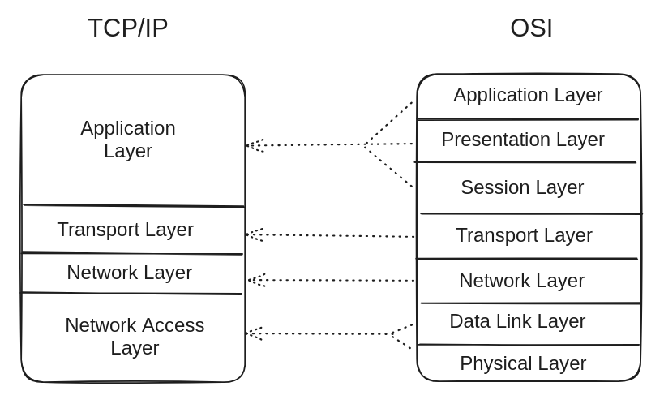

# 计算机科学资源

## 简介/基础知识

- 🎥 [计算机科学地图](https://www.youtube.com/watch?v=SzJ46YA_RaA)
- 🎥 [计算机科学速成班](https://www.youtube.com/playlist?list=PL8dPuuaLjXtNlUrzyH5r6jN9ulIgZBpdo)
- 🎥 [探索计算机的工作原理](https://www.youtube.com/playlist?list=PLFt_AvWsXl0dPhqVsKt1Ni_46ARyiCGSq)
- 从第一原理构建现代计算机，作者：Noam Nisan 和 Shimon Schocken
  - 🎥 [Nand 到俄罗斯方块第一部分](https://www.coursera.org/learn/build-a-computer)
  - 🎥 [Nand 到俄罗斯方块部分 II](https://www.coursera.org/learn/nand2tetris2)
  - 📘[书籍计算原理](https://mitpress.mit.edu/9780262640688/the-elements-of-computing-systems/)
- 📘 [代码：计算机软硬件的隐藏语言](https://www.amazon.com/Code-Language-Computer-Hardware-Software/dp/0137909101/)
- 📘 [计算机科学精华](https://www.amazon.com/Computer-Science-Distilled-Computational-Problems/dp/0997316020)
- 🎥 [信息论 | 可汗学院](https://www.khanacademy.org/computing/computer-science/informationtheory)

## 数学

- 🎥 [数学思维导论 | 斯坦福](https://www.coursera.org/learn/mathematical-thinking)
- 🎥 [线性代数精髓](https://www.youtube.com/playlist?list=PLZHQObOWTQDPD3MizzM2xVFitgF8hE_ab)
- 📄 [集合论](https://www.youtube.com/playlist?list=PL5KkMZvBpo5AH_5GpxMiryJT6Dkj32H6N)
- 📄[基础数论](https://www.codechef.com/wiki/tutorial-number-theory/)
- 🎥 [计算机科学数学 | MIT](https://openlearninglibrary.mit.edu/courses/course-v1:OCW+6.042J+2T2019/course/)
- 📘[离散数学及其应用](https://archive.org/download/schaums-outline-of-basic-mathematics-with-applications-to-science-and-technology-2ed/Discrete%20mathematics%20and%20its%20applications%E2%80%9D%20%288th%20ed%29.pdf)

## 密码学

- 🎥 [密码学 I |斯坦福](https://www.coursera.org/learn/crypto)
- 🎥 [密码学 |可汗学院](https://www.khanacademy.org/computing/computer-science/cryptography)

## 算法

- 🎥 [计算机科学：算法、理论和机器 |普林斯顿大学](https://www.coursera.org/learn/cs-algorithms-theory-machines)
- 📘 [摸索算法](https://www.amazon.com/Grokking-Algorithms-Second-Aditya-Bhargava/dp/1633438538/)
- 📘 [算法导论 | CLRS](https://www.goodreads.com/book/show/108986.Introduction_to_Algorithms) 
- 🎥 [算法导论 | 课程含作业+解答](https://ocw.mit.edu/courses/6-006-introduction-to-algorithms-spring-2020/)
- 📘 [C++ 中的数据结构和算法，第二版](https://www.amazon.com/Data-Structures-Algorithms-Michael-Goodrich/dp/0470383275)

## 编程

- 🎥 [CS50x：计算机科学简介 |哈佛大学](https://www.edx.org/learn/computer-science/harvard-university-cs50-s-introduction-to-computer-science)
- 🎥 [伯克利 CS 61A：计算机程序的结构与解释](https://cs61a.org/)
- 🎥 [并行编程](https://www.coursera.org/learn/scala-parallel-programming)
- 🎥 [编译器](https://www.edx.org/course/compilers)
- [掌握编程](https://tidyfirst.substack.com/p/mastering-programming)
- 📄 [很棒的 C++(或 C)](https://github.com/fffaraz/awesome-cpp)
- 📄 [棒极了](https://github.com/avelino/awesome-go)
- 📄 [很棒的 Rust](https://github.com/rust-unofficial/awesome-rust)
- 📄 [很棒的 javascript](https://github.com/sorrycc/awesome-javascript)
- 📄 [很棒的蟒蛇](https://github.com/vinta/awesome-python)
- 🎥 [乔治·霍兹 |编程|重写线性化器 (tinygrad)|软件工程师生命中的一天](https://www.youtube.com/watch?v=R-Xr1JRF6bY)

## 网络

本节简要概述 OSI (开放系统互连) 和 TCP/IP (传输控制协议/互联网协议) 模型之间的差异和相似之处，
以及 DevP2P 中使用的传输层涉及的协议：TCP 和 UDP。

在网络方面，两种模型都指的是相同的层间通信过程。
正如 Kurose 和 Ross 所解释的 (2020)，计算机网络分为不同的层，每一层都有特定的职责。 OSI 模型有七层，而 TCP/IP 模型有四层。 OSI 模型更理论化，TCP/IP 模型更实用。
OSI 模型是国际标准化组织 (ISO) 创建的参考模型，旨在提供理解网络的框架。 TCP/IP 模型由国防部 (DoD) 创建，以确保消息可以在计算机之间传输，无论所涉及的计算机类型如何。
TCP/IP 模型是 OSI 模型的简洁版本：

总之，OSI 模型层是：
1. 物理层：负责设备之间原始数据的传输和接收。
2. 数据链路层：负责节点-to- 节点消息的传递。
3. 网络层：负责将数据包从源传送到目的地。
4. 传输层：负责源和目的地之间数据的传递。
5. 会话层：负责应用程序之间连接的建立、管理和终止。
6. 表示层：负责数据的翻译、压缩、加密。
7. 应用层：负责直接向最终用户提供网络服务。

假设克劳德·香农 (Claude Shannon，1948) 提出的通信模式，每次通信都意味着发送者和接收者、它们之间要交换的消息、传输介质以及要遵循的协议。
值得一提的是，无论计算机体系结构如何，如果它遵循上述模型的通信和协议规范，它都可以成为网络的一部分。

- 🎥 [计算机网络入门](https://www.youtube.com/playlist?list=PLEAYkSg4uSQ2dr0XO_Nwa5OcdEcaaELSG)
- 🎥 [计算机和互联网 |可汗学院](https://www.khanacademy.org/computing/code-org/computers-and-the-internet)
- 🎥 [计算机网络：自上而下的方法](https://gaia.cs.umass.edu/kurose_ross/online_lectures.htm)
- 条款 E. 香农 (1948)。 “通信的数学理论”。 *贝尔系统技术杂志*。卷。 27.
- 吉姆·黑罗斯和基思·罗斯 (2020)。 *计算机网络：自上而下的方法*。第 8 版。皮尔逊.

## 分布式系统和区块链

- 🎥 [分布式系统 | MIT](https://pdos.csail.mit.edu/6.824/schedule.html)
- 📄 [分布式系统中的时间、时钟和事件排序 - Lamport 的论文，典型的分布式系统入门](http://research.microsoft.com/en-us/um/people/lamport/pubs/time-clocks.pdf)
- 📄[Byzantine Generals' Problem](https://lamport.azurewebsites.net/pubs/byz.pdf)
- 📄[实用 Byzantine Fault Tolerance](http://pmg.csail.mit.edu/papers/osdi99.pdf)
- 📄[Bitcoin 白皮书](https://bitcoin.org/bitcoin.pdf)
- 📄 [Ethereum 白皮书](https://ethereum.org/en/whitepaper/)
- 📄 [掌握 Ethereum，作者：Andreas M. Antonopoulos、Gavin Wood](https://github.com/ethereumbook/ethereumbook)
- 📄 [在 Go 中构建区块链](https://github.com/Jeiwan/blockchain_go)

## 安全性

- 🎥 [安全工程](https://www.cl.cam.ac.uk/~rja14/book.html)
- 🎥 [计算机系统安全](https://ocw.mit.edu/courses/6-858-computer-systems-security-fall-2014/)
- 🎥 [CS 161：计算机安全](https://sp21.cs161.org/)
- 🎥 [安全软件开发：需求、设计和重用](https://www.edx.org/course/secure-software-development-requirements-design-and-reuse)
- 🎥 [安全软件开发：实施](https://www.edx.org/course/secure-software-development-implementation)

## 终端、shell 脚本和版本控制

- 🎥 [你的 CS 教育中缺失的一个学期 | MIT](https://missing.csail.mit.edu/)
- 🎥 [Unix 工作台 |约翰霍普金斯大学](https://www.coursera.org/learn/unix)
- 📄 [Git 提示和技巧](https://blog.gitbutler.com/git-tips-and-tricks/)
- 📄 [流行的 Git 配置选项](https://jvns.ca/blog/2024/02/16/popular-git-config-options/)

## 杂项

- 📄 [程序员应该知道的事](https://github.com/mtdvio/every-programmer-should-know)
- 📄[每个程序员都应该了解的内存知识](https://akkadia.org/drepper/cpumemory.pdf)
- 📄 [每个计算机科学家应该了解的浮点运算](https://docs.oracle.com/cd/E19957-01/806-3568/ncg_goldberg.html)
- 🗣️ [大端和小端的内/外](https://www.youtube.com/watch?v=oBSuXP-1Tc0)
- 🎥 [完美依赖-SQLite 案例分析](https://www.youtube.com/watch?v=ZP7ef4eVnac)

## 资源

- [“自学计算机科学”](https://teachyourselfcs.com/)
- [《开源社会大学》](https://github.com/ossu/computer-science)
- [《编程面试大学》](https://github.com/jwasham/coding-interview-university)
- [“开源计算机科学学位”](https://github.com/ForrestKnight/open-source-cs)
