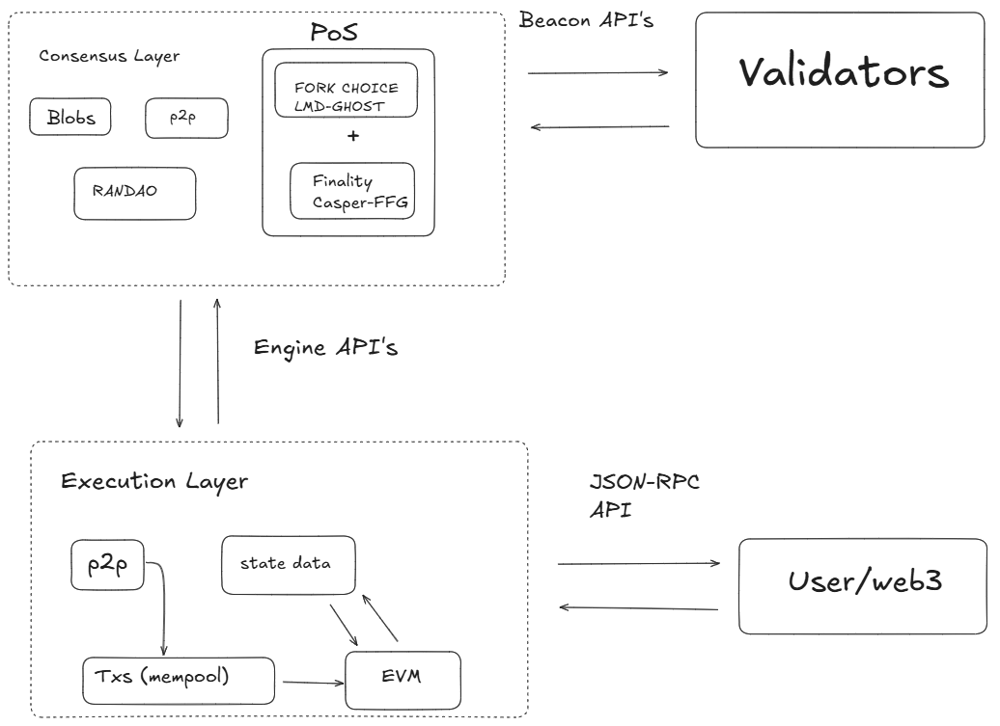

# 协议架构概述

> ：警告：本文是一个[存根](https://en.wikipedia.org/wiki/Wikipedia:Stub)，通过[贡献](/contributing.md) 和扩展它来帮助维基。

当前的协议架构是多年演变的结果。该协议由两个主要部分组成 - 执行层和 共识层。 执行层 (EL) 处理实际的交易和用户交互，它是全局计算机执行其程序的地方。 共识层 (CL) 提供了权益证明共识机制——一种加密经济安全机制，确保所有节点遵循相同的提示并驱动执行层的规范链。 

实际上，这些层是在通过 API 连接的自己的客户端中实现的。每个都有自己的 p2p 网络处理不同类型的数据。 

看看每个客户端的底层，它们包含许多基本功能： 

