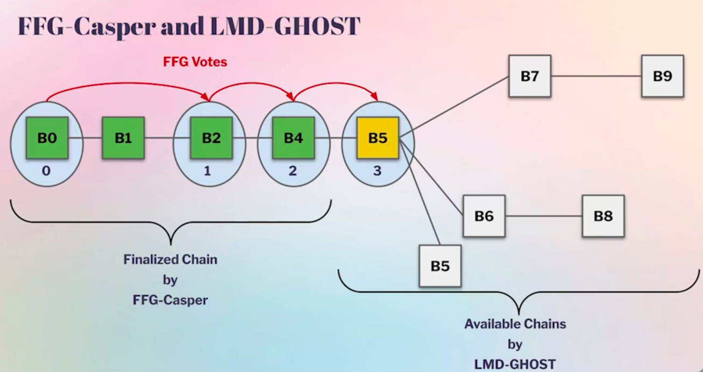

# 快速确认规则 (FCR)

# 概述

**快速确认规则 (FCR)**是一种算法，允许 Ethereum 节点确定区块是否**永远不会离开规范链**，假设网络条件良好。

FCR 输出一个简单的决定：
- 区块已**确认**
- 区块 **未确认**

FCR 旨在提供**快速、安全的区块确认**，早于 Ethereum 最终确定，并帮助弥合差距，直到 [Single Slot Finality (SSF)](https://ethereum.org/roadmap/single-slot-finality/) 已实施。

> 规范链是诚实的验证者所遵循的链。
---

# 动机

## 目前的确认机制

Ethereum 协议 [Gasper](https://ethereum.org/developers/docs/consensus-mechanisms/pos/gasper/) 目前唯一可用的 **确认规则** 是 **FFG 最终确定规则**。虽然此确认规则非常安全并且在**异步**网络条件下工作，但对于许多用例而言，最终确定速度**太慢**。 

- 最好的情况：~13 分钟  
- 平均：约 16 分钟  

最终确定的区块：
- 永远不会与任何诚实的验证者的规范链发生冲突
- 仅当 **> 1/3 的验证者被削减时才能恢复**

### UX 限制

- 支付日常用品 (例如咖啡) 需要等待约 16 分钟
- 在最终确定之前，存入 CEX 的资金无法使用
- 钱包通常一输入区块就将交易标记为“已确认”，这是**不安全**
- ...

---

>

>
<strong>如果我们无论如何都会有 SSF，为什么 FCR 存在</strong>

>
> Single Slot Finality：
> - 还很远
> - 仅在*之后*才会被考虑：
>   - 无状态 Ethereum
>   - 韦尔克尔树
>
> 在此之前，Ethereum 缺乏**安全快速的确认规则**。
>
> 这就是为什么**中心化交易所 (CEX)**和基础设施提供商对 FCR 感兴趣。

---

### 用户**应该 NOT 使用的危险替代方案 (启发式)**

<strong>依赖于区块深度的启发式 </strong>

- 在 `N` 后代之后确认区块

<strong>依赖于基于理由的启发式的启发式</strong>

- 比区块深度略好
- 仍缺乏确认信息

这两种方法都不满足 [安全属性](/wiki/research/FCR/FCR.md#properties-of-the-confirmation-rule)。

---

## FCR 保证什么

快速确认规则依赖于**同步**条件，但仅提供**12 秒**的**最佳情况确认时间**，大大改善了 FFG 最终确定规则的延迟。

**FCR 永远不会确认不规范的区块。**

它提供了带有正式保证的确认规则。

### 确认规则的属性

- **安全**：确认的区块一旦确认，就不会在诚实的情况下重新组织
- **单调性**：已确认的区块永远不会向后移动，除非触发“重置为最终”(假设失败信号)

### FCR 的实际意义

<strong>提高钱包可靠性</strong>

- FCR 提供**可证明安全的确认信号**

<strong>减少 CEX 风险交易逆转</strong>

- 对于允许存款后立即乐观交易的交易所

<strong>PBS 使用案例</strong>

- 区块构建者获得有关其区块是否不太可能被重组的指示

> 然后，用户可以根据他们对网络状况的看法以及快速响应的需要，依赖最适合他们需求的确认规则。

---

# 加斯帕概述

Ethereum PoS 共识由 [Gasper](https://ethereum.org/developers/docs/consensus-mechanisms/pos/gasper/) 定义，其中：
- 时间单位为**时隙**：12 秒 (当前)
- **epoch**：32 时隙  
- 每个 epoch 将一组验证者分为 32 个委员会

Gasper 由两个子协议组成：

### LMD-GHOST
- 分叉选择算法
- 确定规范链头

### FFG-Casper
- 最终确定 LMD-GHOST 选择的检查点

---
### 区块生产流程

1. 在每个时隙的开头：
   - 委员会随机抽取一个提议者
2. 提议者在规范头部顶部提出了一个区块
3. 委员会内其他验证者：
   - 证明提议的区块
4. 分叉选择规则：
   - 确定链的规范头

> 在正常情况下，分叉选择规则是不必要的 - 每个时隙都有一个区块提议者，并且诚实的验证者证明了这一点。只有在大型网络异步的情况下或者当不诚实的区块提议者模棱两可时才需要分叉选择算法。然而，当这些情况确实出现时，分叉选择算法是确保正确 ChainSafe 的关键防御措施。

---

## LMD-GHOST 的确认规则

确认算法需要以下**假设**：

1. 同步：假设网络健康。 证明由 时隙中的诚实验证者发送，由任何其他诚实验证者在该时隙末尾接收
2. 任何一组委员会的股份最大比例 **β** 是不诚实的
    - **β** = 20-25%(可配置)

目标是提供在上述假设下安全的**快速确认规则**。

这些假设在大多数情况下都成立，使得协议能够为用户提供比最终确定更快的方式来确认区块。

---

### 规范概览

⚙️ 当前规范可在 [共识规范 PR](https://github.com/ethereum/consensus-specs/pull/4747) 中找到

---

确认规则的**输入**是之前确认的区块 (存储在`store.confirmed_block`中)，算法尝试沿着当前规范链推进确认。

`get_latest_confirmed`函数是确认规则的入口点，由两个阶段组成：

1. **假设检验**
    - 验证所需的假设是否仍然成立
    
2. **确认进展**
   - 沿着规范链查找最新确认的后代，允许算法相对于先前确认的区块快速确认新的区块。

根据执行函数的时间，应用特定版本的逻辑。

---

`isOneConfirmed` 谓词 

- 该算法搜索 `isOneConfirmed` 计算结果为 `true` 的规范链的最长前缀。

- 如果区块通过了此检查，则它有足够的 **LMD-GHOST** 支持来击败任何潜在的同级接管。
    - 该谓词考虑了可能将分叉选择转向冲突链的所有可能情况，包括：
        - 提议者升压
        - 对抗性预算β
        - 模棱两可
        - 空时隙折扣

该检查沿着链的后缀迭代地应用，从最新确认的区块开始，并在 `isOneConfirmed` 不再成立时停止。

---

🧩 **确认规则的复杂性源于需要正确处理所有 The Verge 情况。**

---

# 总结

FCR 提供：
- 快速确认，具有强大的安全保证 (1-2 时隙最佳情况延迟)
- 更好的 UX，无需等待最终确定
- 钱包和交易所的可靠性更高

在 Single Slot Finality 可用之前，**FCR 填补了 Ethereum 确认模型**中的关键空白。

# 文档

- [html 论文：Ethereum 共识协议的快速确认规则 (又名快速同步最终确定性)](https://arxiv.org/html/2405.00549v3)
- [快速确认规则 (FCR) 分组讨论室播放列表](https://www.youtube.com/watch?v=y5_75Y_09No&list=PLJqWcTqh_zKH4c_vgCCPZ33Ilb9SdEIcq)
- [快速确认规则规范](https://github.com/ethereum/consensus-specs/pull/4747)
- 草稿短 FCR 解释 - 完成后将添加链接 
- [快速确认规则 - <name>Roberto Saltini</name>(2025 视频)](https://www.youtube.com/watch?v=dZU-Ch22MKY&list=PLCGgAwcxXAWyHcMm0X57jVuHtJ6e8gwIP&index=25)
- [快速确认规则 - Devcon SEA - Roberto & Luca(2024 视频)](https://www.youtube.com/watch?v=p7JPRTELnJc&list=PLCGgAwcxXAWyHcMm0X57jVuHtJ6e8gwIP&index=25)

# 实施
- [Prysm PR #15164](https://github.com/OffchainLabs/prysm/pull/15164)
- [Lighthouse PoC EPF 由 <name>Harsh Pratap Singh</name> 工作](https://hackmd.io/6H_e-WqaQFyBENsifLiH6g)

