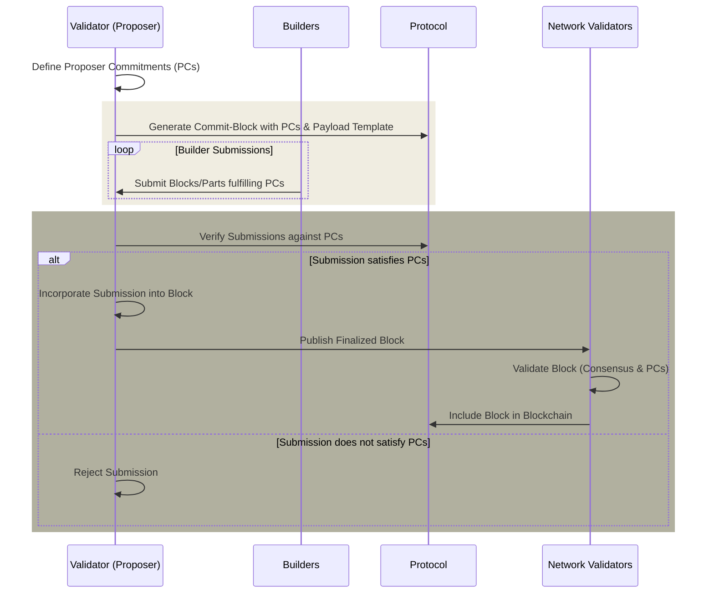

# 协议强制提议者承诺 (PEPC)

协议强制提议者承诺 (PEPC) 是 [PBS](/docs/wiki/research/PBS/pbs.md) 的概念扩展和泛化，为提议者 (验证者) 引入了一种更灵活、更安全的方式来承诺区块的建设。与现有的 [MEV-Boost](/docs/wiki/research/PBS/mev-boost.md) 机制不同，该机制依赖于提议者和 构建者/中继之间的协议外协议，PEPC 旨在将这些承诺纳入其中以太坊协议本身，为这些交互提供无需信任且无需许可的基础设施[^1][^2]。

## PEPC 的优点和相关权衡
- **增强的安全性和去信任性：**
  - **好处：** 执行协议内的协议，减少对外部各方的依赖并最大限度地减少操纵的可能性。
  - **权衡(安全性与开销)：**虽然安全性得到增强，但这种内部化增加了计算需求，可能会影响网络效率和可扩展性。

- **提高区块构造的灵活性：**
  - **好处：** 实现提议者和构建者之间的可编程合约，支持多种区块构建场景。
  - **权衡(灵活性与复杂性)：**这种灵活性带来了复杂性，这可能会限制技术高级用户的参与并提高进入壁垒。

- **MEV 机会的去中心化：**
  - **好处：** 促进 MEV 在验证者之间更公平的分配。
  - **权衡(MEV 的去中心化与中心化风险)：** 虽然旨在去中心化 MEV，但所需的复杂性可能仍然有利于更大、更复杂的运营商。

- **可扩展性和效率改进：**
  - **好处：** 简化区块构建和验证流程，增强整体网络可扩展性。
  - **权衡(长期可扩展性与短期性能)：**当验证者适应新的复杂性时，可能会对网络性能产生初步影响。

- **经济创新：**
  - **好处：** 通过允许新型交易和 区块结构来培育新颖的经济模型。
  - **权衡(经济创新与稳定)：**引入可能破坏现有收入结构并影响稳定性的经济模型。

## PEPC 如何工作？

_图 – PEPC 流程._

PEPC的运行涉及多个关键组件和步骤，这些组件和步骤共同确保其无缝集成到以太坊生态系统中。以下是 PEPC 在实践中如何工作的概述：

**第 1 步：提交阶段**

- **提案创建：** 验证者 (提议者) 准备通过定义一组承诺来创建区块。这些承诺代表指定如何构建区块的协议或合同。例如，这可以包括承诺以包含某些交易，而不包含其他区块，或者以特定方式构造区块。

- **提交区块生成：** 提议者生成一个 commit-区块，其中包括这些提议者承诺 (PC)以及常见的共识数据，例如证明。此 commit-区块尚未包含完整的执行载荷，但根据承诺为预期内容指定载荷模板或占位符。

**第 2 步：揭示阶段**

- **构建者提交：** 构建者，响应提议者发布的承诺，提交他们建议的区块或 区块部分来实现承诺。这可能涉及提交特定的交易、执行载荷或初始承诺定义的其他区块组件。

- **承诺验证：** 在收到来自构建者的提交后，提议者或协议本身会验证这些提交是否满足提议者承诺。此验证过程可确保仅考虑包含满足预定义标准的区块或 区块部件。

- **区块最终确定：** 一旦构建者的提交被验证满足提议者承诺，提议者通过将构建者的提交合并到载荷在提交阶段定义的模板或占位符。最终确定的区块然后发布到网络。

**第 3 步：验证和纳入**

- **网络验证：** 网络上的其他验证者验证最终的区块，确保其遵守以太坊协议规则和特定的提议者承诺。此步骤可能涉及标准区块验证程序，以及对承诺履行情况的附加检查。

- **区块包含：** 成功验证后，区块包含在区块链中。此包含取决于区块满足通常的以太坊共识规则和提交阶段中概述的特定提议者承诺。

**PEPC 的灵活性和安全性机制**

- **可编程合约：** PEPC 允许提议者与 构建者签订各种可编程合约，范围从完整的区块到部分区块，甚至未来的时隙拍卖。这种多功能性支持采用定制方法来构建区块，从而最大限度地提高效率并优化区块空间使用。

- **原子性和去信任性：** 提交-显示方案确保承诺的所有部分都得到满足，或者区块被拒绝，从而保持原子性。此过程由协议强制执行，减少对外部信任的依赖并最大限度地降低操纵风险。

- **动态区块构建：** 通过启用区块构建的动态方法，PEPC 允许根据网络条件、用户需求和新兴机会(例如 MEV 提取)实时调整区块内容。

## PEPC 用例

PEPC 提供了几个引人注目的用例[^2]：

**全区块拍卖**

- 验证者将整个区块的建造权拍卖给构建者。这反映了当前的 MEV-Boost 机制，但通过将拍卖嵌入以太坊协议中，增强了安全性和去信任性。
- 确保区块建设过程透明、公平，有可能为验证者带来更具竞争力的投标和更好的奖励。

**部分区块拍卖**

- 验证者可以将区块的部分空间拍卖给不同的构建者，允许多方为单个区块的建设做出贡献。
- 提高区块空间利用效率，鼓励交易包含的多样性，减轻区块建设中潜在的集中化。

**平行区块拍卖**

- 与部分区块拍卖类似，但拍卖侧重于区块空间的单独、并行组件，从而可以采用更细粒度的方法来构建区块。
- 为验证者提供对区块内容和结构的更多控制，可能针对 gas 使用、交易优先级和 MEV 提取等各种因素进行优化。

**时隙与 区块拍卖**

- 验证者提前承诺使用特定构建者中的区块或 区块部分，区分承诺到“时隙”(谁将构建)与“区块”(将构建什么)。
- 增强验证者和 构建者的可预测性和规划，有可能带来更具战略性的区块建设和 MEV 提取机会。

**未来时隙拍卖**

- 验证者拍卖为未来时隙构建区块的权利，本质上是为区块空间创建期货合约。
- 为市场参与者提供更多的投机和对冲工具，潜在稳定验证者的收入，并提供构建者先进的规划能力。

**包含列表**

- 验证者承诺通过直接列出或遵守第三方提供的列表，在其区块中包含特定的交易。
- 提高交易纳入的透明度和可预测性，有可能减少 gas 价格波动并改善用户体验。

**动态区块配置**

- 验证者使用 PEPC 动态调整区块配置，响应实时网络状况和需求。
- 增强网络响应能力和效率，有可能提高吞吐量并减少高峰期的拥塞。

**抗审查性**

- 通过使承诺包含某些交易或遵循特定的包含模式，验证者可以提供针对审查的保证。
- 加强以太坊的抗审查特性，确保网络保持开放并可供所有用户访问。

**协议升级和功能测试**

- 通过使承诺包含利用这些功能的交易，PEPC 可用于在实时环境中测试新协议功能或升级，而不会危及网络稳定性。
- 在以太坊协议中提供更安全的创新和进化途径，允许更多实验性的开发方法。

## 与 EigenLayer 的关系和区别

PEPC 和 Eigenlayer 具有互补关系，各自解决以太坊的可扩展性、安全性和去中心化的不同方面，同时也拥有增强网络效率和灵活性的共同目标[^3]。

- **安全分层：** Eigenlayer 引入了一种机制，将以太坊的安全性扩展到其他层和服务。相比之下，PEPC 专注于在以太坊协议本身中嵌入更复杂和灵活的承诺机制。 Eigenlayer 寻求从外部增强以太坊的安全模型，而 PEPC 旨在增强以太坊主链的内部运作，特别是围绕区块提案和交易包含过程。

- **验证者承诺：** PEPC 和 Eigenlayer 都涉及验证者制作某些承诺，但这些承诺的性质和范围有所不同。在 Eigenlayer 中，验证者可能会通过重新获取其 ETH 来承诺保护其他层或服务。在PEPC中，验证者使承诺关于区块的构造，例如包括某些交易或遵守特定的区块构造标准。

- **MEV 和交易包含：** 这两个项目都间接解决与 MEV 和交易包含公平性相关的问题。 Eigenlayer 可以促进解决方案，减轻 MEV 的负面影响，或通过额外的共识层改善交易的包容性。 PEPC，通过允许更动态和可编程的提议者-构建者协议，可以导致更公平地分配MEV机会和更透明的交易包含机制。

**Eigenlayer 中的经济与安全性**

原则上，如果 Eigenlayer 担保的活动或资产的权益价值超过了以太坊中权益 ETH 的价值，则经济激励可能会出现偏差，导致人们担心所提供的安全性是否充足 [^2]。

在更广泛的以太坊生态系统背景下，PEPC 和 Eigenlayer 可以被视为互补，Eigenlayer 将以太坊的安全性和实用性扩展到其核心协议之外，而 PEPC 则增强了核心协议本身的效率和灵活性。实现这两者可能会导致这样一种情况：以太坊不仅在处理交易和 区块构建方面变得更加高效和适应性强，而且还将其安全保证扩展到更广泛的去中心化应用程序和服务。

## 资源 
- [解除捆绑 PBS：转向协议强制提议者承诺 (PEPC)](https://ethresear.ch/t/unbundling-pbs-towards-protocol-enforced-proposer-commitments-pepc/13879/1)
- [PEPC FAQ](https://efdn.notion.site/PEPC-FAQ-0787ba2f77e14efba771ff2d903d67e4)
- [EigenLayer协议](https://docs.eigenlayer.xyz/eigenlayer/overview/whitepaper)
- [提议者-构建者分离 (PBS) 的注释](https://barnabe.substack.com/p/pbs)
- [迈克·诺伊德 - 走向神圣的提议者-构建者分离](https://www.youtube.com/watch?v=Ub8V7lILb_Q)
- [PBS 不完整指南 - Mike Neuder 和 Chris Hager](https://www.youtube.com/watch?v=mEbK9AX7X7o)
- [ePBS – 无限自助餐](https://notes.ethereum.org/@mikeneuder/infinite-buffet)

## 参考文献
[^1]: https://ethresear.ch/t/unbundling-pbs-towards-protocol-enforced-proposer-commitments-pepc/13879/1
[^2]: https://efdn.notion.site/PEPC-FAQ-0787ba2f77e14efba771ff2d903d67e4
[^3]: https://docs.eigenlayer.xyz/eigenlayer/overview/whitepaper
