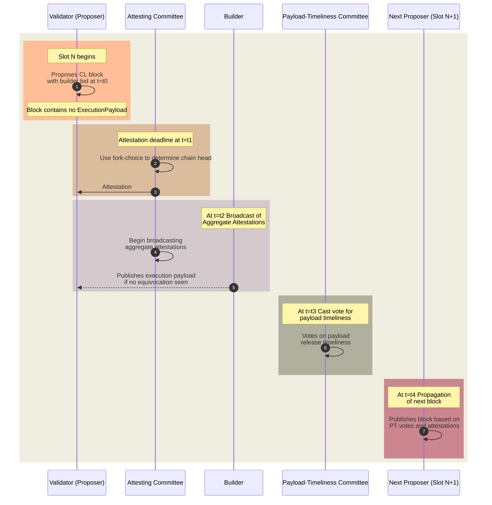

# 载荷-EPBS 的时效委员会 (PTC)

Payload Timeliness Committee (PTC) 提案是将 PBS (ePBS) 纳入 Ethereum 协议的设计。它代表了确定区块有效性的机制的演变，并包括验证者的子集，他们对区块的 载荷[^1][^2][^3] 的及时性进行投票。

## PTC 概述

_图 – Payload Timeliness Committee 流程._

该提案引入了新的时隙结构，并为载荷-及时性 (PT) 投票传播增加了一个阶段。其目的是细化提议者和构建者在区块创建过程中的角色，确保提议者保持轻量级和不复杂的实体以实现去中心化的目标，并且专门的构建者可以高效地创建高价值的区块。

1. **区块传播**：选举出来的 Proof-of-Stake (PoS) 验证者，称为提议者，在其时隙的开头广播 CL 区块 (`t=t0`)。此区块包含构建者的出价，但不包含实际的载荷 (即交易)。
2. **证明聚合**：在证明截止日期 (`t=t1`)，验证者 (称为证明者) 使用本地分叉选择规则对感知到的链头进行投票。

3. **聚合和载荷传播**：构建者看到 CL 区块并发布执行载荷。 验证者委员会开始广播聚合的证明。

4. **载荷-及时性投票传播**：在 (`t=t3`)，Payload Timeliness Committee 对载荷是否及时发布进行投票。

5. **下一个区块传播**：在 (`t=t4`)，下一个提议者发布他们的区块，根据他们观察到的 PT 投票决定在完整或空的区块上构建。

#### 诚实证明行为

诚实的证明者在投票时会考虑载荷-及时性。他们的行为围绕着 PT 投票，这会影响随后的区块选择。投票表明载荷是否存在、不可用，或者构建者是否含糊不清。分叉选择中赋予满或空区块的权重基于这些 PT 投票。

## 属性和潜在的新攻击向量

**属性**：

- **Honest- 构建者付款安全**：如果构建者的出价得到处理，则其载荷就会成为规范。

- **诚实-提议者安全**：如果提议者按时提交单个区块，他们将收到付款。

- **Honest- 构建者 Same- 时隙载荷安全**：诚实的构建者可以确保时隙的 载荷不能被同一载荷覆盖时隙。

**非财产**：

- **诚实-构建者载荷安全**：构建者无法确定他们的载荷会成为规范；该设计无法防止 next- 时隙分裂。

**潜在的新攻击向量**：

- **提议者-发起分裂**：提议者可以在接近截止日期时释放其区块，从而导致证明委员会的观点分裂。

- **构建者-发起的分裂**：构建者可以选择性地将载荷透露给委员会的一部分，以影响下一个提议者的 区块，如果委员会的投票差异很大，则可能导致它被孤立。

**构建者付款处理**：

- 如果构建者的 载荷标头是规范链的一部分并且没有提议者模棱两可的证据，则会处理付款。

## 与其他设计的差异*

- PT 投票影响分叉选择权重，但不会创建单独的分叉。
- 载荷视图通知随后的委员会投票，这些投票通常与提议者一致。
- 在当前的 ePBS 设计[^2][^3]中，构建者获得了提议者提升。他们没有在不同的分叉之间明确创建分叉选择权重。相反，他们通过揭示或保留当前的 ​​区块来增强或“降低”当前的区块。

[ePBS 设计规范](/docs/wiki/research/PBS/ePBS-Specs.md) 提供了有关实现规范和流程的更多详细信息。

## 资源 
- [Payload Timeliness Committee (PTC) – ePBS 设计](https://ethresear.ch/t/payload-timeliness-committee-ptc-an-epbs-design/16054)
- [考虑 ePBS](https://notes.ethereum.org/@mikeneuder/consider-the-epbs)
- [ePBS 分组讨论室](https://www.youtube.com/watch?v=63juNVzd1P4)
- [Proposer-Builder Separation (PBS) 的注释](https://barnabe.substack.com/p/pbs)
- [Mike Neuder - 走向神圣的 Proposer-Builder Separation](https://www.youtube.com/watch?v=Ub8V7lILb_Q)
- [ePBS 设计规范](/docs/wiki/research/PBS/ePBS-Specs.md)

## 参考文献
[^1]: https://ethresear.ch/t/payload-timeliness-committee-ptc-an-epbs-design/16054
[^2]: https://hackmd.io/@potuz/rJ9GCnT1C
[^3]: https://github.com/potuz/consensus-specs/pull/2
