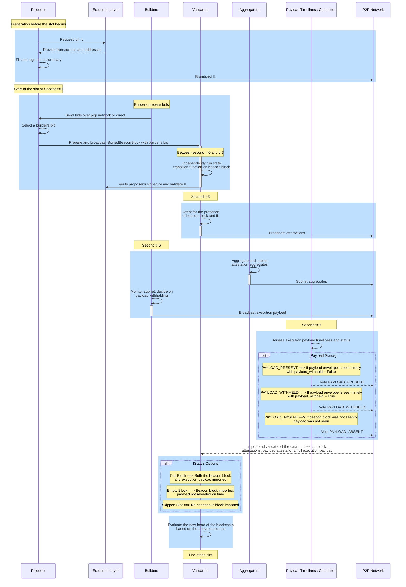

# ePBS 设计规范

[当前 ePBS 规范](https://hackmd.io/@potuz/rJ9GCnT1C) 和 [GitHub 仓库](https://github.com/potuz/consensus-specs/tree/epbs_stripped_out/specs/_features/epbs) 解决了 Ethereum 当前实现的 PBS[^1][^2][^11] 中的一个关键问题。传统上，提议者和 构建者都必须通过 [MEV-Boost](/docs/wiki/research/PBS/mev-boost.md) 依赖中介机构，这会引入 [ePBS 文档](/docs/wiki/research/PBS/ePBS.md) 中概述的信任和审查问题。 ePBS 规范框架通过将中介机构的必要性 (“必须”) 更改为选项 (“可能”) 来修改这种动态，从而允许 Ethereum 生态系统内进行更加无需信任的交互。 

## 规范概览

[ePBS 规范](https://github.com/potuz/consensus-specs/tree/epbs_stripped_out/specs/_features/epbs) 分为单独的组件，构建在 Ethereum 组件的现有规范之上。 
- `Beacon-chain.md`：本文档指定了 ePBS 功能的 Beacon Chain 规范[^6]。
- `Validator.md`：本文档指定了 ePBS 功能的诚实验证者行为规范[^7]。
- `Builder.md`：本文档指定了 ePBS 功能的诚实构建者规范[^8]。
- `Engine.md`：本文档指定由于 ePBS 分叉 [^9] 导致的引擎 APi 更改。
- `fork-choice.md`：本文档指定由于 ePBS 升级而对分叉选择所做的更改[^10]。


## ePBS 规范的主要改进

**信任最小化**：它允许提议者和 构建者更加独立地运行，从而最大限度地减少对中介机构信任的必要性，从而降低操纵和信任依赖的风险。

**最小的兼容性更改**：该设计实现了保持与当前共识和执行客户端操作的兼容性所需的最少更改。遵循现有的 12 秒时隙时间，保证网络运行的连续性和稳定性。

**抗审查性**：它通过按照 [EIP-7547](https://eips.ethereum.org/EIPS/eip-7547) 合并前向强制 Inclusion Lists 来增强抗审查性，确保必须包含某些交易，这有助于维护网络完整性。

**层增强**：更改主要在 Consensus Layer (CL) 中，对 Execution Layer (EL) 进行最少的调整，主要与 Inclusion Lists 的处理有关。

**安全保证**：

- **提议者安全性**：它通过提议者和 构建者串通，确保提议者免受 1- 时隙重组攻击，即使是那些控制网络拓扑的人最多拥有 20% 的股份。
- **构建者安全**：针对构建者的连续提议者串通和操纵提供了保证，包括确保隐匿和泄露载荷安全的措施。
- **分拆保证**：构建者在所有攻击场景下都受到保护，确保交易处理和执行的完整性。

**验证者的自建**：验证者保留自建载荷的能力，这对于保持独立性和灵活性至关重要。

**可组合性**：该规范旨在与时隙拍卖或执行票拍卖等其他机制可组合，从而增强灵活性和未来创新的潜力。


**实施细节：**

ePBS 规范引入了特定的角色和职责：

- **构建者**：验证者提交载荷承诺的出价。
- **PTC (Payload Timeliness Committee)**：一个新的委员会，验证载荷的及时性和有效性。

在每个时隙期间，提议者收集投标，并在选择投标后，他们提交带有来自构建者的签名承诺的 区块。 验证者然后根据这些承诺调整构建者和提议者之间的金融信用。 构建者后来透露了自己的执行载荷，履行了自己的义务。 时隙结果可能会有所不同 (错过、空或满)，具体取决于区块的产生和揭示，而 PTC 在确定时隙结论的性质方面发挥着关键作用。

该实现包括 [EIP-7251](https://eips.ethereum.org/EIPS/eip-7251) 和 [EIP-7002](https://eips.ethereum.org/EIPS/eip-7002)，它们对于 ePBS 功能至关重要。 EIP-7251 将 Ethereum 验证者的最大余额增加到 2048 ETH，保持最少 32 个 ETH 以减少验证者的数量而不损失安全性[^3]。 EIP-7002 允许验证者使用特殊提款凭证退出 Beacon Chain，从而增强质押灵活性和安全性[^4]。

## 时隙时间线剖析




_图 – 基于 ePBS 规范的新时隙解剖流程。_


基于 ePBS 规范的新时隙解剖流程的说明：

### 时隙之前的准备工作

- **提议者** 的准备工作是从 EL[^9] 请求完整的 Inclusion Lists，填写并签署摘要，然后将其广播到 p2p 网络。

**ePBS 中的新功能：** IL 是 EL 中的新组件，用于提议者，以保证网络的抗审查性。它们在前向包含的基础上运行，其中提议者和 验证者相互作用，以确保交易准确有效地结转[^5]。

**Inclusion Lists 容器：**
- **InclusionListSummary：** 包含提议者的索引、时隙和执行地址列表。
- **SignedInclusionListSummary：** 包括上述摘要以及提议者的 签名。
- **InclusionList：** 包含签名摘要、Beacon block 的父区块哈希以及交易的列表。

**从 EL 请求 IL:**
- 提议者通过调用函数 `get_execution_inclusion_list` 从 Execution Layer 中检索要包含在下一个区块中的交易，确保它们根据当前状态有效。响应是一个容器 `GetInclusionListResponse`，其中包含 `transactions`(EL 所需的交易对象列表) 和 `summary`(`transactions` 的摘要，包括“发件人”地址等基本标识符)。
**构建 IL：**
- 提议者调用函数 `build_inclusion_list` 将收到的交易组织成结构化格式，准备签名摘要，并确保符合网络标准。响应是一个容器 `InclusionList`，其中包含 `SignedInclusionListSummary`(用于验证真实性和完整性的签名交易摘要) 和 `transactions`(准备包含的已验证交易列表)。
**广播 IL:**
- 一旦 IL 准备好并签名，提议者就会通过 p2p 将其广播到整个网络。 


### 时隙在第二个 t=0 处开始

- **构建者** 准备他们的出价并通过 p2p 网络或直接将其发送到提议者。
- **提议者**选择构建者的出价，准备并广播包含构建者的出价的**SignedBeaconBlock**。

**ePBS 中的新增功能：** `inclusion_list_summary` 属性包含在 `ExecutionPayload` 中。该字段与区块中某些交易的包含摘要相关，提供对区块中包含的内容的控制。

**构建者：准备和发送投标**
- 构建者使用 `ExecutionPayloadHeader` 容器准备投标，其中包含基本详细信息，例如父级区块哈希、费用接收者和建议的交易费用等。 
- 构建者创建 `SignedExecutionPayloadHeader`，一个签名头 `ExecutionPayloadHeader` 并广播它。
- 出价直接发送到提议者或使用 `execution_payload_header` 主题通过 p2p 网络广播。

**提议者：选择出价并广播签名 Beacon block**
- 提议者根据多个标准评估投标，例如投标金额以及构建者的可靠性或过去的表现。选择出价。 
- 提议者构造一个 `BeaconBlockBody`，其中包括 `signed_execution_payload_header` 以及其他标准元素。
- 函数 `process_block_header` 处理区块标头，确保所有元素符合共识规则，并且区块在当前链上下文中有效。
- 区块现在包含选定的执行载荷标头，由提议者签名以生成 `SignedBeaconBlock`。 
- 然后使用 `beacon_block` 主题通过 p2p 网络广播签名的区块，使其可供所有网络参与者使用。
- 提议者准备的 `BeaconBlockBody` 内的 `ExecutionPayloadHeader` 包括链接到 Execution Layer 中的父区块的 区块，保证了链的连续性，`block_hash` 最终将链接到`ExecutionPayload` 的哈希是 构建者将产生的，对于验证者验证链的完整性和连续性至关重要。


### 在第二个 t=0 和 t=3 之间

- **验证者** 独立运行状态转换函数来验证 Beacon block，验证提议者的签名并验证 Inclusion Lists。

**验证者：验证 Beacon block 和 Inclusion Lists**
- 收到 `SignedBeaconBlock` 后，验证者调用 `process_block` 函数，该函数是处理区块处理的不同方面的综合函数，包括标头验证、RANDAO、提议者削减、证明等。 
- 对于 ePBS，要特别注意 `process_execution_payload_header`，它验证区块内的执行载荷标头。
- 验证者验证 `ExecutionPayloadHeader` 中引用的 IL。为此，他们使用 `verify_inclusion_list` 函数从交易有效性、签名摘要完整性以及与先前商定状态的一致性方面评估 IL 的正确性，并且 IL 内的提议者索引对应于预期提议者对于给定的时隙。 
- 如果区块和 IL 验证成功，则状态转换函数 `state_transition` 更新 Beacon state 以反映新的区块。这包括更新验证者状态、根据证明和削减调整余额以及轮换委员会。


### 大约第二个 t=3

- **验证者** 证明 Beacon block 和 IL 的存在，确保到目前为止一切正常。

**验证者：证明 Beacon 区块**
- 验证者调用函数 `process_attestation` 来验证和处理针对 Beacon block 发出的每个证明。这包括验证 Beacon block 的 时隙、证明委员会，并根据共识规则确保证明数据的正确性。


### 大约第二个 t=6

- **聚合器** 聚合并提交证明聚合。
- **构建者** 构建并广播他们的执行载荷。他们监控网络子网，并根据网络状况和投票决定是否保留其载荷。
- 构建者将 执行载荷 (包含交易执行所需的所有信息) 打包到容器 `ExecutionPayloadEnvelope` 中。这种封装确保载荷已准备好集成到 Beacon Chain 中。他们会将字段 `payload_withheld` 设置为 false。 
- 此外，如果诚实的构建者没有及时看到区块共识，则可以通过将 `payload_withheld` 设置为 true 来保留载荷。
- 他们运行函数 `process_execution_payload` 来根据当前状态处理执行载荷以确保其有效性。它涉及验证交易，确保状态转换正确，并检查载荷是否符合共识规则。
- 然后，他们对容器 `ExecutionPayloadEnvelope` 进行签名以生成 `SignedExecutionPayloadEnvelope`，然后通过 p2p 网络广播到主题 `execution_payload`。


### 大约第二个 t=9 - Payload Timeliness Committee (PTC)

- 在时隙的第二个 t=9，PTC 评估执行载荷的及时性。该委员会由 512 个验证者组成，根据他们对执行载荷的存在和相对于共识区块的时间的观察进行投票。

**ePBS 中的新增功能：** PTC 是此 epbs 规范中引入的新组件。 
- **成分及功能：**
  - **委员会组成：** PTC 成员从每个信标时隙委员会的第一批非构建者成员中选出。这确保了委员会仅由验证者组成，他们不同时担任构建者，从而最大限度地减少利益冲突。
  - **证明奖励和处罚：** PTC 成员因正确证明载荷的存在或不存在而获得标准证明奖励。准确的证明与实际载荷状态 (`full` 或 `empty`) 一致，为此验证者收到完整的证明积分 (目标、源和头及时)。不正确的证明会导致类似于错过证明的处罚。
  - **证明处理：** PTC 成员的证明 CL 区块被忽略，仅专注于载荷验证任务。
  - **将证明包含在区块中：** 时隙 `N+1` 的提议者负责包含时隙中的 PTC 证明 `N` 在区块中。包含不正确的证明没有直接的动机；因此，通常每个区块只需要一个 PTC 证明。
- **聚合和广播：** 存在两种导入 PTC 证明的方法。聚合的证明 (`PayloadAttestation`) 包含在前一个时隙的 区块中，而未聚合的证明 (`PayloadAttestationMessage`) 则针对当前的时隙进行实时广播和处理。

**PTC 验证者对 执行载荷及时性进行评估和投票**
- 每个 PTC 验证者独立检查它们是否已从构建者接收到有效的 `ExecutionPayload`，该构建者应该根据当前 Beacon block 中包含的签名 `ExecutionPayloadHeader` 来显示它。 PTC 验证者根据载荷的存在及其接收时间对其及时性进行投票。

**播出载荷时效性证明**
- 如果确认执行载荷存在且及时，则 PTC 验证者生成并广播载荷及时性证明，从而证实这些观察结果。 `PayloadAttestation` 容器捕获验证者' 证明关于载荷的及时性和存在性。
- `get_payload_attesting_indices` 函数通过检查 `PayloadAttestation` 中的聚合位来确定 PTC 中的哪些验证者证明了载荷的存在和及时性。 
- 证明通过 `payload_attestation_message` 主题在 p2p 网络上广播。

**在 Beacon 区块中聚合并包含载荷证明**
- 聚合器收集各个 `PayloadAttestation` 消息，聚合它们，并确保它们包含在即将到来的 Beacon block 中，以记录并最终确定验证者对 载荷及时性的共识。它们被聚合到一个 `IndexedPayloadAttestation` 容器中，其中包括已证明的验证者索引列表、载荷证明数据和集体签名。

**基于证明更新 Beacon Chain 状态**
- `process_payload_attestation` 函数由 Beacon Chain 调用来处理和验证传入的载荷证明。它确保证明数据正确并且签名有效，并将此信息集成到 Beacon state 中。 Beacon Chain 状态是根据载荷证明更新的。 
- 这些证明通过影响各种区块的权重来影响分叉选择，并可能导致基于执行载荷的感知及时性和存在性的不同链重组。

**奖励计算和分配**：对于每个正确证明载荷状态的验证者，它设置参与标志并根据预定义的权重 (`PARTICIPATION_FLAG_WEIGHTS`) 计算奖励。奖励进行 Rollup，按比例奖励证明的 提议者，计算时考虑协议规范中定义的各种权重和分母 (`WEIGHT_DENOMINATOR`、`PROPOSER_WEIGHT`)。

**提议者奖励**：该函数最终计算出提议者的奖励，并通过调用 `increase_balance` 方法更新提议者的余额。


### 完时隙

- 正如时隙的结论，验证者完成了几项关键任务：
  - **导入和验证**：验证者确保他们已导入并验证 Inclusion Lists、共识区块、所有单位和聚合证明、载荷证明以及完整的执行载荷。
  - **评估区块链的新头**：根据验证的数据，验证者对链的状态做出关键决策。他们确定时隙是否会导致：
    - **完整区块**：共识区块和对应的执行载荷均已成功导入。
    - **空区块**：共识区块已导入，但关联的执行载荷未按时透露。
    - **跳过时隙**：在时隙期间未导入共识区块，导致跳过时隙场景。
- 分叉选择函数 `get_head` 在考虑最新的区块提案、载荷证明以及任何其他相关信息 (例如证明的权重和余额) 后确定链头。
- 所有节点根据分叉选择的结果同步其状态，确保整个网络的一致性。此同步包括应用来自已证明的区块和 执行载荷的所有状态转换和更新。


## Inclusion Lists 时间轴

**八卦层检查：**
- Inclusion Lists 经过计时验证，确保与当前或下一个时隙相关。
- 每个提议者-时隙对仅限于在网络上广播一个 Inclusion Lists，尽管提议者可能会向不同的对等节点发送不同的列表。
- 交易的数量必须与 Rollup 计数匹配，并且不得超过 `MAX_TRANSACTIONS_PER_INCLUSION_LIST` 中设置的最大值。
- Inclusion Lists 签名根据提议者的密钥进行验证，确认其预定的时隙。

**风险和缓解措施：**
- 在换头之前广播 Inclusion Lists 来接收即将到来的时隙可能会导致可用性问题，尽管该列表仍然被认为是可用的。

**on_inclusion_list 处理程序：**
- 充当执行引擎 API 调用的桥梁，假设处理了相应的 Beacon block。
- 如果 Beacon block 的父级为空，则自动忽略任何新的 Inclusion Lists 以防止积压。

**Beacon state 跟踪：**
- 跟踪最近和之前的 IL 的提议者和 时隙，以管理新的有效区块的履行和更新。

**EL 验证：**
- 使用当前状态检查交易 `inclusion_list.transactions` 是否有效且可包含。
- 确保摘要 `inclusion_list.signed_summary.message.summary` 准确列出所包含交易的“发件人”地址。
- 验证交易的总 gas 限制不超过允许的最大值 `MAX_GAS_PER_INCLUSION_LIST`。
- 确保列出的账户有足够的资金来支付最大潜在 gas 费用 `(base_fee_per_gas + base_fee_per_gas / BASE_FEE_MAX_CHANGE_DENOMINATOR) * gas_limit`。


## 执行载荷的时间线

ePBS 系统中执行载荷的处理包括分布在八卦层、Consensus Layer 和 Execution Layer 的几个关键步骤：

**八卦** 执行载荷通过 `execution_payload` pubsub 主题共享，并进行关键验证：
- 确认与载荷关联的 Beacon block 有效。
- 根据 Beacon block 验证构建者索引和载荷哈希。
- 验证构建者的 签名。

**共识状态转换** 八卦后，载荷通过 `on_execution_payload` 分叉选择处理程序进行共识验证：
- **签名验证：** 确保载荷签名的完整性。
- **提款和 Inclusion Lists 验证：** 确认正确处理提款并遵守 Inclusion Lists 指定的 Beacon state。
- **载荷一致性和 EL 验证：** 检查所有载荷元素是否与 Beacon state 承诺对齐，并将载荷发送到 Execution Layer 进行进一步验证。
- **状态更新和验证：** 更新 Beacon state 记录并验证新的状态根以确认准确的状态转换 `latest_block_hash` 和 `latest_full_slot`。

**Execution Layer 状态转换** Execution Layer 扩展了其角色以验证 `InclusionListSummary` 满意度：
- **交易和余额验证：** 跟踪交易或余额变化涉及的地址。
- **Inclusion Lists 满意度：** 确保 `InclusionListSummary` 中的每个地址在载荷中处于活动状态，考虑交易以及当前和之前载荷的余额变化。
- **特殊情况处理：** 管理独特的场景，例如 [EIP-3074](https://github.com/ethereum/EIPs/blob/master/EIPS/eip-3074.md) 启用的交易。


## 载荷证明的时间线

**八卦** 载荷证明由 PTC 成员使用 `PAYLOAD_ATTESTATION_MESSAGE` 对象进行广播，并在传播前进行严格检查：
- **当前时隙验证：**仅当前时隙的证明被八卦。
- **载荷状态验证：** 证明必须具有有效的载荷状态才能进行八卦。
- **每个成员单个证明：** 每个 PTC 成员仅共享一个证明。
- **Beacon block 根存在：** 证明通过已知 Beacon block 根链接到时隙。
- **PTC 会员资格检查：** 验证者必须是 PTC 的确认成员。
- **签名验证：** 证明必须具有有效的签名。

**Forkchoice 处理程序** 通过八卦验证后，载荷证明通过 `on_payload_attestation_message` 处理程序在 forkchoice 中进行处理，其中包括：
- **Beacon block 验证：** 确认关联的 Beacon block 位于 forkchoice 存储中。
- **PTC 时隙验证：** 验证证明者是否在指定时隙的 PTC 中。
- **时隙匹配：** 检查 Beacon block 是否对应于证明时隙。
- **当前时隙和 签名检查 (如果不是来自区块)：** 对于直接广播，验证时隙是否为当前签名。
- **PTC 投票更新：** 更新给定区块根的 forkchoice 中跟踪的 PTC 投票。


## Beacon 区块的时间线

**八卦**
- **初始验证**：`SignedBeaconBlock` 通过 gossip 或 RPC 进入，关键验证集中于父 Beacon block 的合法性。

**on_block 处理程序**
- **Beacon block 验证**：基于两个父元素验证区块：Consensus Layer (通过 `block.parent_root`) 和从 `signed_execution_payload_header` 中的 `BeaconBlockBody` 条目派生的 Execution Layer。
- **BeaconBlockBody 调整**：`BeaconBlockBody` 中的修改包括删除执行载荷和 blob KZG 承诺、添加 `signed_execution_payload_header` 和新的 `payload_attestations`。

**状态转换**
- **修改功能**：`process_block` 现在针对 ePBS 更改进行调整，包括对提款处理和同步父载荷的修改。
- **提款**：分两个阶段管理；共识区块处理期间的扣除，以及执行载荷处理期间验证的履行。
- **执行载荷标头**：验证构建者的 签名、资金以及立即将出价金额转移到提议者，并在 Beacon state 中注明状态调整。

**载荷证明** 载荷证明 `PayloadAttestation` 表示 Beacon block 处理中的重要组成部分，通过以下方式为执行载荷添加一层验证 PTC。

- **PTC 委员会组建**
  - **委员会选择**：`get_ptc`函数旨在通过从现有信标委员会中选择验证者来组装 PTC，专门针对每个委员会列表末尾的验证者，形成 PTC。选择过程确保 PTC 有足够的人口，同时对标准信标委员会的结构和功能的影响最小。

- **正在处理载荷证明**
  - **证明要求**：载荷证明需要与之前的时隙相关并匹配父 Beacon block 根，确保它们及时准确地引用正确的 Beacon state。
  - **奖励和惩罚**：
    - **一致性检查**：根据 Beacon state 检查每个证明以确定一致性。一致的证明 (例如，当时隙确实已满时，`PAYLOAD_PRESENT`) 会导致提议者和证明验证者都获得奖励。这使他们的激励与准确、诚实地报告载荷状态保持一致。
    - **奖励计算**：为了保证证明的一致性，为证明验证者设置参与标志`PARTICIPATION_FLAG_WEIGHTS`，并且提议者获得根据证明者的基础奖励计算的奖励`proposer_reward`，确保验证者有动力积极、正确地参与 PTC。
    - **不一致的处罚**：如果发现证明不一致 (例如，当载荷存在时证明 `PAYLOAD_ABSENT`)，则会受到处罚。 提议者和 证明者均受到处罚，以阻止包含不正确或误导性的证明。对提议者 `proposer_penalty` 的惩罚明显加倍，以防止提议者和 证明者之间任何潜在的串通，它们可能会从包含一致和不一致的证明中受益。

- **实施和理由**
  - **避免削减条件**：没有专门针对 PTC 证明模棱两可的削减条件，以防止可能阻碍参与的过度惩罚性措施。然而，处罚的目的是确保提交模棱两可的证明不会带来净收益。
  - **将提议者惩罚加倍**：将提议者惩罚加倍的理由是确保不存在惩罚和奖励相互抵消的情况，从而保持对包含冲突的证明的威慑力。


## 诚实验证者行为

由于引入了新机制，例如分叉选择注意事项、执行载荷验证和 IL 计时，验证者的角色和行为得到了细化，特别是对于提议者和 PTC 成员。 

**提议者职责**
- **执行载荷和 Inclusion Lists 准备**：
  - 在指定时隙之前，提议者需要从构建者中选择一个`SignedExecutionPayloadHeader`，并请求或构造一个`InclusionList`。
  - 这些活动可以在时隙开始之前进行，以确保准备就绪和效率。
- **播出时间**：
  - 提议者被激励尽早广播他们的 IL，以增加他们的区块被证明的可能性，从而确保他们的区块在链中的位置。

- **构建者互动**：
  - 验证者可以充当自己的构建者 (自建) 或者可以与外部构建者接合。鼓励与构建者 (非协议方法) 直接交互，因为它们可能会实时产生最具竞争力的出价。

- **战略考虑**：
  - 由于潜在的 MEV 机会，提议者可能会策略性地延迟选择或请求构建者的出价，直到区块广播的最后一个可行时刻。此策略是从可用的交易池中获取 MEV。

**提议者的头部确定**
- **基本原理**：在时隙 `N`开始时，提议者必须确定链头才能有效地提出新的区块。这涉及评估各种场景，例如跳过的时隙、丢失的载荷和延迟的载荷，并根据最新的有效区块数据做出决策。

**PTC 会员职责**
- **载荷时效性证明**：
  - PTC 成员的任务是验证当前时隙的 执行载荷的及时性，并根据他们的观察铸造 `payload_attestation`：
    - `PAYLOAD_PRESENT`：如果同时观察到当前时隙的有效共识区块和相应的执行载荷。
    - `PAYLOAD_WITHHELD`：如果看到当前时隙的有效共识区块以及来自构建者的 `payload_withheld = true` 消息。
    - `PAYLOAD_ABSENT`：如果看到有效的共识区块而没有相应的执行载荷。
    - 如果没有观察到当前时隙的共识区块，则不会做出证明。

- **证明条件**：
  - PTC 成员仅导入他们观察到的第一个共识区块并以此为基础采取行动，确保每个时隙得到单一、一致的响应。

**构建载荷证明**
- **操作窗口**：
  - PTC 成员准备对时隙进行大约 9 秒的证明，评估执行载荷是否及时准确地与共识区块同步。
  - 这包括评估载荷是否被正确保留，并确保其证明反映载荷可用性或缺席的实际状态。

**验证者注意事项**
- 验证者必须熟练地处理自己的角色，无论是作为提议者、PTC 成员还是一般证明者，驾驭新 ePBS 机制的复杂性以维护网络完整性和安全性。这涉及战略决策、及时行动以及遵守协议，以优化其在网络内的影响力和奖励。

## 诚实的构建者行为

**准备多个载荷**
- **适应性**：构建者预计会为各种潜在的父头准备不同的载荷。这样的准备让他们能够在最后时刻适应分叉选择的变化。
- **多个投标**：构建者可以在其预期的时隙之前提交多个投标，从而增加提议者被选中的机会。

**投标提交策略**
- **广播投标**：构建者可以通过非协议服务直接向提议者提交投标。此策略允许构建者不断更新和完善其出价，而无需将其暴露给整个网络，这可能会导致包含次优的载荷。
- **首次看到的消息规则**：验证者只会传播特定组合 (构建者、时隙) 的第一个有效看到的消息，这鼓励构建者在此过程中尽早提交最佳出价。

**直接投标请求**
- **增强的 API 规范**：通过 `SignedBidRequest` 机制引入直接出价请求将允许验证者直接从构建者请求执行标头。对构建者 API 的这一微小修改可以利用现有的客户端代码并增强验证者和 构建者之间的直接交互。

```python
class BidRequest(container):
    slot: Slot
    proposer_index: Validator_index
    parent_hash: Hash32
    parent_block_root: Root

class SignedBidRequest(container):
    message: BidRequest
    signature: BLSSignature
```

- **加密绑定**：直接请求机制可以设计为将请求加密绑定到验证者，防止构建者根据其他人的出价调整自己的出价，从而降低构建者之间串通和卡特尔的风险。

**八卦作为后备**
- **后备机制**：尽管直接投标请求具有优势，但维持投标八卦的全球主题提供了至关重要的后备。该系统支持在低端硬件上运行的验证者或那些喜欢社区驱动的构建者的人，确保他们能够获得有竞争力的出价。
- **反审查和反卡特尔措施**：通过社区驱动的构建者设置公开最低出价，如果中心化的构建者希望审查某些交易，则系统会强制其出价高于这些公开出价。此功能可作为投标提交过程中竞争和透明度的基准。
- **垃圾邮件防护**：通过仅允许对给定父区块哈希收到的最高价值出价进行闲聊，并限制每个构建者每个时隙一条消息，可以保护全局主题免受垃圾邮件。


## 提议者和 构建者交互的安全分析

**构建者揭示安全**
- **场景**：提议者串通重组及时泄露其载荷的 构建者的 载荷。
- **结果**：安全设计确保只要攻击者控制的权益不超过特定阈值 (本例中最多为 40%)，构建者的 载荷就不会被后续的提议者重组。
- **关键方程**：如果 \(RB > PB\)，则显示的载荷保持安全，其中 \(RB\) 是构建者的显示增强，而 \(PB\) 是提议者升压。

**构建者扣押安全**
- **场景**：由于共识区块迟到，构建者决定扣留载荷，旨在避免处罚。
- **结果**：(区块，时隙) 投票机制支持构建者的决定，如果区块不是链头或迟到，则扣留载荷而不受处罚。
- **有效安全**：构建者受到保护，免受提议者操纵区块计时以强制载荷泄露的攻击，确保在不满足安全泄露的条件时，构建者不会被迫付费。

**提议者安全**
- **场景**：尝试通过构建者和下一个提议者之间的协作来重组链。
- **结果**：分析表明，只要攻击者控制的股份少于 20％，诚实行事并及时透露其区块的区块就可以保证被纳入链上。
- **详细分析**：展示系统针对反前和反后重组尝试的弹性，保持诚实提议者' 区块的完整性，抵御共谋和网络控制。

**一般安全注意事项**
- 所提出的设计通过确保投票仅支持与 PTC 决策一致的链来有效地处理不同的载荷状态。
- Inclusion Lists 可用性在确定规范头方面发挥着至关重要的作用，通过强调经过验证的内容来增强账本完整性。
- 载荷提升 (用于揭示和扣留) 在分叉选择期间调整权重计算方面发挥着关键作用，这可以影响基于载荷可用性和操作的链重组和稳定性。


## 分叉选择注意事项

ePBS 分叉的引入给分叉选择规则带来了复杂的变化，特别是针对构建者和 提议者的安全性。这些更改旨在适应网络延迟和载荷扣留等策略行为。

**ePBS Forkchoice 中的关键概念：**

- **(区块，时隙) 投票：**
  - 这一机制确保了如果区块迟到，验证者将支持最后一个及时的区块，而不是迟到的区块。
  - 始终如一，后期区块积累的权重较少，因为验证者继续支撑早期及时的区块。
- **载荷状态处理：**
  - 载荷的状态 (缺失、空、满) 影响验证者对链的支持。
  - 投票支持与 PTC 状态的 PTC 决策一致的链，确保根据及时可用性包含或排除载荷。
- **Inclusion Lists 可用性：**
  - IL 的存在和验证至关重要。 验证者可以根据最新的区块和经过充分验证的 IL 来确定其头部。
  - 这种考虑确保了基于正确包含的交易构建的区块受到青睐，从而增强了链的完整性。
- **载荷提升的安全分析：**
  - 构建者的揭示提升 (RB) 和扣留提升 (WB) 被引入，以根据揭示或扣留载荷的行为来奖励或保护构建者。
  - 这些提升通过改变权重计算来显着影响分叉选择，可能导致基于载荷可用性和完整性的链重组或稳定。

**实际例子：**
- **快乐的情况**显示正常运行，所有区块和 载荷按时到达并获得全力支持。
- **晚期的区块和 载荷** 说明了验证者将其支持转移到早期的区块的场景，从而影响了潜在链分叉的权重分布。
- **载荷状态场景** 演示投票如何根据载荷可用性支持或排除某些区块，与 PTC 投票保持一致。
- **Inclusion Lists 注意事项** 强调这些列表对确定规范头部的影响，特别是在丢失或延迟包含数据的情况下。


## 资源
- [ePBS 规范说明](https://hackmd.io/@potuz/rJ9GCnT1C)
- [没有最大 EB 和 7002 的最小 ePBS](https://github.com/potuz/consensus-specs/pull/2)
- [EIP-7251 最大有效余额 (MaxEB)](https://eips.ethereum.org/EIPS/eip-7251)
- [EIP-7002 Execution Layer 可触发提现](https://eips.ethereum.org/EIPS/eip-7002)
- [epbs - Beacon Chain 规范](https://github.com/potuz/consensus-specs/blob/epbs_stripped_out/specs/_features/epbs/beacon-chain.md)
- [epbs - 诚实的验证者规范](https://github.com/potuz/consensus-specs/blob/epbs_stripped_out/specs/_features/epbs/validator.md)
- [epbs - 诚实的构建者规范](https://github.com/potuz/consensus-specs/blob/epbs_stripped_out/specs/_features/epbs/builder.md)
- [epbs - Engine API 规范](https://github.com/potuz/consensus-specs/blob/epbs_stripped_out/specs/_features/epbs/engine.md)
- [epbs - 分叉选择规范](https://github.com/potuz/consensus-specs/blob/epbs_stripped_out/specs/_features/epbs/fork-choice.md)
- [EIP-7547 Inclusion Lists](https://eips.ethereum.org/EIPS/eip-7547)


## 参考文献
[^1]: https://hackmd.io/@potuz/rJ9GCnT1C
[^2]: https://github.com/potuz/consensus-specs/pull/2
[^3]: https://eips.ethereum.org/EIPS/eip-7251
[^4]: https://eips.ethereum.org/EIPS/eip-7002
[^5]: https://eips.ethereum.org/EIPS/eip-7547
[^6]: https://github.com/potuz/consensus-specs/blob/epbs_stripped_out/specs/_features/epbs/beacon-chain.md
[^7]: https://github.com/potuz/consensus-specs/blob/epbs_stripped_out/specs/_features/epbs/validator.md
[^8]: https://github.com/potuz/consensus-specs/blob/epbs_stripped_out/specs/_features/epbs/builder.md
[^9]: https://github.com/potuz/consensus-specs/blob/epbs_stripped_out/specs/_features/epbs/engine.md
[^10]: https://github.com/potuz/consensus-specs/blob/epbs_stripped_out/specs/_features/epbs/fork-choice.md
[^11]: https://github.com/potuz/consensus-specs/tree/epbs_stripped_out/specs/_features/epbs 