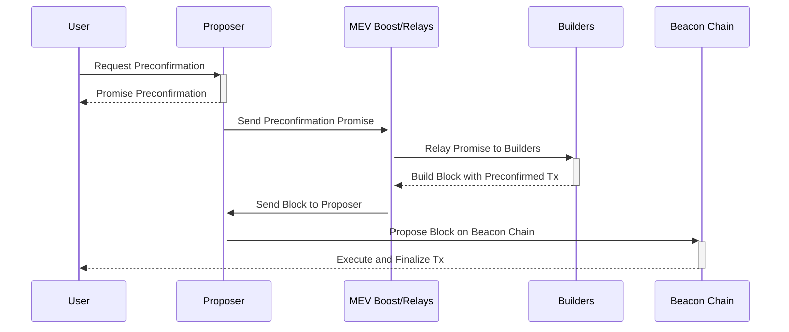

# 以太坊基于排序和 预确认

## [概述](#overview)

以太坊不断发展的生态系统将为 Rollup 和链交互引入新的Paradigm，强调无缝过渡和增强的用户体验。这篇 wiki 文章介绍了以太坊排序和 预确认的框架，最初由 Justin Drake[^1][^4] 提出，是实现这一愿景的一步，为所有以太坊链和 Rollup 提供统一的平台。 

## [动机](#Motivation)

### [联合连锁以太坊](#united-chains-of-ethereum)

以太坊的愿景不仅仅是一个孤立的链网络，而是一个有凝聚力的生态系统，其中所有 Rollup 和链无摩擦地共存，称为“以太坊联合链”。这一概念设想了一种场景，用户可以轻松地在不同州 (Rollup) 之间移动，类似于跨越州界线，无需护照或征收关税。这样的环境不仅可以增强用户体验，还可以培育更加集成和高效的区块链生态系统。

_图：以太坊的 United Chains，信用 Justin Drake_

### [以太坊为 Rollup 提供的服务](#ethereums-services-for-rollups)

- **当前服务：** 以太坊目前为 Rollup 提供两项关键服务：结算和数据可用性。这些服务为Rollup在以太坊的去中心化平台上有效运营奠定了基础。

- **引入以太坊排序：** 以太坊排序[^2][^3]，旨在补充现有资源，提供 Rollup 可以利用的新资源来进一步优化其操作。尽管排序一直是以太坊固有的，但它作为 Rollup 专用服务的潜力代表了一种创新应用程序，类似于为新功能自适应使用核心数据。

### [当前排序选项](#current-sequencing-options)

_图：不同的排序选项及其问题空间，图片来源：Justin Drake_

#### [去中心化排序](#decentralized-sequencing)

**概述：** 去中心化的排序将 交易排序的责任分配给多个节点，而不是单个中央机构。此方法增强了安全性和对审查的抵抗力，因为没有任何一个节点可以自行决定交易的顺序。

**问题和挑战：**
- **协调的复杂性：** 由于交易排序涉及多个节点，因此达成共识可能具有挑战性且复杂，特别是当节点具有不同的激励措施时。
- **网络完整性维护：** 确保所有参与的节点都遵循协议且没有任何恶意行为可能很难执行。
- **前置运行和 MEV：** 矿工或验证者可能会利用其订购交易的能力来提取最大可提取价值 (MEV)，这可能导致不公平的交易处理和负面的用户体验。
- **对审查的弹性：** 尽管去中心化的排序使审查变得更加困难，但这并不能消除这种可能性，特别是如果节点发生串通的话。

#### [共享排序](#shared-sequencing)

**概念：** 共享排序是去中心化排序的一种形式，其中订购交易的任务在多个实体之间共享，通常跨不同的层或平台。这种方法旨在进一步分散流程并减少任何单个参与者可能对交易序列产生的影响。

**应用：** 在以太坊中，共享排序可能涉及协调管理交易订单的各种 Rollup 解决方案。这种协调有助于确保交易得到高效、公平的处理，减少出现瓶颈或有偏见的排序做法的可能性。

**优点：** 共享排序旨在通过分配交易处理负载并增强网络吞吐量来提高可扩展性。它还致力于交易处理的中立性和公平性，这对于维护去中心化生态系统的信任至关重要。

**问题和挑战：**
- **MEV 共享：** 协调 MEV 共享，就像 Espresso 正在研究的方法一样，需要复杂的机制来在参与的 Rollup 和链之间公平分配 MEV [^5]。
- **存款共享：** 像 zkSync 的存款共享这样的解决方案是创新的，但需要不同 Rollup 之间的广泛采用和信任才能有效发挥作用，可能导致信任的中心化[^6]。
- **执行共享：**执行共享策略的实现，例如Polygon的聚合层，需要跨不同Rollup进行标准化和集成，以确保兼容性和去信任原子性[^7]。

**基于排序：**

**概念：** 去中心化排序的一种特殊形式，它使用以太坊的基础层信标链来管理交易排序。该方法利用信标链的安全和共识机制来确保交易以去信任的方式进行排序。

**重点：** 基于排序，旨在将信标链强大的安全特性集成到交易排序中，减少对外部排序器或中心化系统的依赖。它通过使用现有的以太坊基础设施来保护交易订单，符合以太坊的去中心化原则。

**与共享排序集成：** 基于排序可以成为更大的共享排序策略的关键部分，为其他层或 Rollup 可以构建提供可靠、安全的基础。它确保交易排序过程的至少一层与以太坊区块链的高度安全、经过充分测试的共识机制紧密相关。

**问题和挑战：**
- **提议者责任：** 提议者必须通过发布抵押品来选择基于排序，从而增加其角色的财务风险和责任。
- **包含列表管理：** 包含列表的概念必须谨慎维护和管理，以确保公平地包含交易。
- **共识机制依赖：** 基于排序与底层共识机制有着内在的联系，这意味着共识的任何问题都可能直接影响交易排序。
- **预确认复杂性：** 实施预确认机制(用户可以从提议者获得交易执行的保证)增加了交易处理的复杂性，并且需要用户和提议者之间的信任和交互达到新的水平。

## [技术施工](#technical-construction)

### [基于排序](#based-sequencing)

- **机制：** 基于排序的提案涉及利用信标链的预见期邀请提议者通过发布抵押品选择提供排序服务。此方法利用以太坊的现有结构为 Rollup 引入新的功能层。

- **预测期：**通过利用信标链预测下一组提议者的能力，系统可以准备并指定特定的提议者来承担排序器的附加角色，确保Rollup具有可预测性和可靠性排序服务。

### [预确认机制](#preconfirm-mechanism)

在 [预确认](/wiki/research/Preconfirmations/Preconfirmations.md) 文章中，我详细解释了预确认的工作原理以及 Promise 获取流程[^2][^3]。 

- **用户与提议者的交互：** 用户可以识别在预测期内哪些提议者选择了基于排序并向他们请求预确认。这些预确认类似于承诺用户的交易将在未来被包含并执行，并对不履行的处罚。

- **未履行的削减：** 系统会对未能履行预确认的 提议者实施处罚或削减。这增加了一层责任，确保提议者受到激励来兑现他们的承诺。

### [前瞻预确认构造](#look-ahead-preconf-construction)

_图：预确认的前瞻机制，图片来源：Justin Drake_

- **前瞻期：** 在以太坊信标链上，有一个前瞻期，其中提前知道区块时隙的即将到来的提议者。该周期通常可以包括接下来的 32 个时隙的设定数量。
- **预确认请求：** 想要创建交易的用户向计划在不久的将来(在前瞻期内)创建区块的 提议者发送预确认请求。该请求包括交易详细信息以及可能的费用报价。
- **承诺发布：** 在收到预确认请求后，选定的提议者(称为预授予者)评估交易并决定是否做出承诺。如果提议者同意，他们会向用户发出承诺，承诺在轮到他们提出建议时在未来的区块中包含并执行交易。这一承诺得到了提议者发布的抵押品的支持，如果他们未能兑现承诺，抵押品可能会被削减。
- **包含预先确认的交易：** 当提议者的时隙(上图中的n+1)到达时，他们必须按照他们的承诺包含并执行预先确认的交易。如果提议者无正当理由未能这样做，他们将面临被削减的风险。
- **共享预确认：** 提议者做出的承诺可能需要传达给网络中的其他人，特别是如果有多个提议者可能在提议者的 时隙到达之前包含交易。可以通过各种方式促进这种通信，包括 MEV boost 中继，以确保交易得到适当的解决和包含。
- **执行交易：** 一旦轮到提议者，并且如果它们没有被较早的提议者抢占，它们会将预先确认的交易包含在它们提议的区块中。这确保了交易正如向用户承诺的那样在链上执行。

### [通过MEV Boost进行通信](#communication-through-mev-boost)

预确认与 MEV Boost 的集成代表了技术建设的一个关键方面，促进了用户、提议者、构建者和 以太坊网络之间的信息高效流动。通过通过 MEV Boost 路由预确认详细信息，系统确保构建者知道预先确认的交易并可以相应地构造区块。此过程不仅优化了交易的包含，还保持了构建的区块的完整性和价值，与以太坊排序和 预确认框架的总体目标保持一致。

## [预确认流经 MEV Boost](#preconfirmations-flow-through-mev-boost)

*图：预确认通过 MEV Boost 的流量*

预确认如何在以太坊的基础层排序和 预确认的上下文中流经 MEV Boost 的过程涉及几个关键步骤和实体，详细讨论是有价值的。该机制旨在确保提议者(已选择提供排序服务)预先确认的交易通过MEV Boost中的中继有效传达给构建者，并最终包含在构建的构建者中。 区块。以下是该过程的详细分步说明：

- **用户请求预确认：**
  - 用户在信标链的预测期内识别排序，并选择通过发布抵押品来提供基于排序。
  - 然后，用户向这些提议者之一发送预确认请求，以确保它们的交易将包含在未来的时隙中并执行。

- **提议者提供预确认:**
  - 选定的提议者评估请求，如果接受，则向用户提供预确认。这个预确认本质上是一个承诺，在指定的未来时隙中包含并执行用户的交易，但须遵守某些条件和不履行的处罚。

- **提议者至 MEV 增强通信：**
  - 一旦提议者发出预确认，它们就会将此信息传达给 MEV Boost。 MEV Boost 充当中介，促进提议者(现在充当各自时隙的 排序器)、构建者和最终以太坊网​​络之间的通信。

- **MEV 提升中继预确认到 构建者：**
  - MEV 将中继 Boost 预确认详细信息传递给构建者，后者负责构建区块。 构建者接收有关所有预先确认的交易的信息，他们在构建区块时必须考虑这些信息。

- **构建者构造区块考虑预确认:**
  - 有了预确认详细信息，构建者构造区块来尊重这些预确认。这涉及到将预先确认的交易包含在指定时隙的区块中，并确保满足预确认中承诺的执行条件。

- **区块向网络提出：**
  - 一旦构建者构建了一个尊重所有预确认并针对其他因素(如 MEV)进行优化的区块，区块就会被提议到以太坊网络。最初发布预确认的相关时隙的 提议者负责确保此区块得到提交。

- **执行及结算：**
  - 如果区块成功包含在区块链中，则按照约定执行预先确认的交易，将提议者的承诺履行给用户。如果提议者未能满足预确认，则可能会根据故障的性质(例如，活性故障、安全故障)进行处罚(削减)。

**其他注意事项：**

- **削减机制：** 该过程采用了削减机制，如果提议者未能遵守预确认，则对其进行惩罚。这确保了对系统的一定程度的问责和信任。
- **动态通信：** 通过 MEV Boost 的信息流允许根据实时情况进行动态调整，例如交易优先级的变化或网络拥塞。

## [未来的研究领域](#future-areas-of-research)

之前对以太坊基于排序和 预确认[^4] 的讨论表明，该框架的设计空间涉及许多复杂的主题，并留下了社区提出的一些悬而未决的问题和担忧。以下是一些研究领域和所涉及的复杂性：

- **次优区块价值**：预确认可能会导致验证者的 区块价值降低，因为预先确认的交易施加的约束可能会限制 MEV 机会。
- **多个预确认的复杂性**：管理和协调多个预确认可能会使执行状态复杂化，并对交易排序的一致性提出挑战。
- **定价和经济激励**：确定预确认提示的正确价格很复杂，因为预先确认可能会影响预期的 MEV，从而影响提议者和用户的经济激励。
- **执行保证**：预确认的执行保证的可变性可能需要与提议者不同级别的复杂性，更复杂的预确认可能需要更高的功能。
- **中心化风险**：一些人担心预确认系统可能导致中心化，少数实体控制交易的序列。
- **活跃度和安全性故障**：理解并实施对系统内活跃度和安全性故障的正确响应，包括正确的故障归因和相关削减的管理，是很复杂的。
- **基础设施要求**： 验证者需要运行全节点、管理带宽并提供拒绝服务保护，这增加了操作复杂性。
- **抵押品过帐**：管理预确认抵押品的过帐和效率是一个重要的考虑因素，特别是涉及相对于交易价值的抵押品缩放比例。
- **用户体验**：用户体验过程如何，包括预确认的速度和可靠性，以及系统的透明度。
- **中继信任**：对中继及其在预确认流程中的角色的信任，考虑到中继必须平衡各个网络参与者的利益并管理相关风险。
- **通讯渠道**：建立用户提议者、中继、构建者之间安全高效的沟通渠道。
- **先行和选择机制**：先行机制对预授予选择的影响以及替代选择机制是否会更有利。
- **第 1 层和第 2 层协调**：信标链提议者和第 2 层排序器之间的协调，尤其是 Rollup 指定自己的排序器时，可能具有挑战性。
- **法律和监管考虑因素**：预确认流程的潜在法律和监管影响，尤其是有关财务交易的影响。
- **技术适应性**：系统需要适应新技术，例如执行票据的最终集成，这可能会改变预确认的格局。

## 资源
- [以太坊排序](https://docs.google.com/presentation/d/1v429N4jdikMIWWkcVwfjMlV2LlOXSawFCMKoBnZVDNU/)
- [基于预确认](https://ethresear.ch/t/based-preconfirmations/17353)
- [预确认](/docs/wiki/research/Preconfirmations/Preconfirmations.md)
- [以太坊排序和 预确认呼叫 #1](https://youtu.be/2IK136vz-PM)
- [浓缩咖啡共享排序](https://hackmd.io/@EspressoSystems/SharedSequencing)
- [Zksync充值分享](https://docs.zksync.io/zksync-protocol/contracts/l1-contracts/shared-bridges)
- [多边形聚合层](https://polygon.technology/blog/aggregated-blockchains-a-new-thesis)

## 参考文献
[^1]: https://docs.google.com/presentation/d/1v429N4jdikMIWWkcVwfjMlV2LlOXSawFCMKoBnZVDNU/
[^2]: https://ethresear.ch/t/based-preconfirmations/17353
[^3]: https://epf.wiki/#/wiki/research/Preconfirmations/Preconfirmations
[^4]: https://youtu.be/2IK136vz-PM
[^5]: https://hackmd.io/@EspressoSystems/SharedSequencing
[^6]: https://docs.zksync.io/zksync-protocol/contracts/l1-contracts/shared-bridges
[^7]: https://polygon.technology/blog/aggregated-blockchains-a-new-thesis
