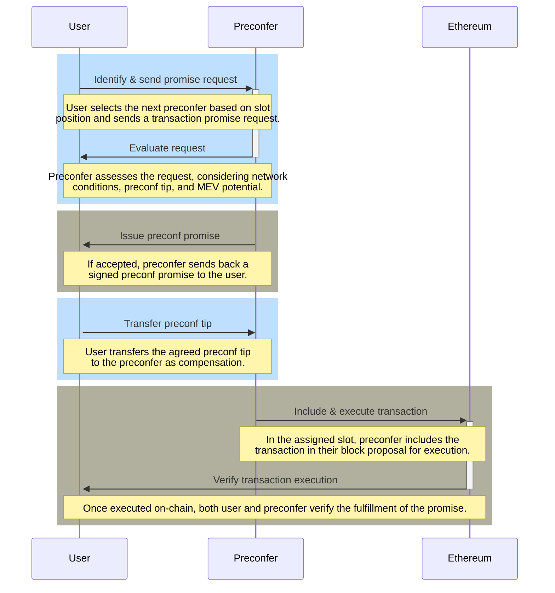

# Ethereum 基于 Preconfirmations

## [概述](#overview)

基于 Preconfirmations (Preconfirmations) 代表了 Ethereum 交易处理的重大进步，为用户提供快速可靠的执行。通过链上基础设施、提议者问责机制和灵活的承诺获取流程的结合，Preconfirmations 将显着增强 Ethereum 交互中的用户体验。该技术不仅减少了交易延迟，还引入了生态系统中前所未有的安全性和效率层[^1]。

## [Preconfirmations 承诺的构建](#construction-of-preconf-promises)

Preconfirmations Promise 或“Preconfirmations”依赖于两个基础的链上基础设施组件[^2][^3]：

- **提议者削减：** 提议者可以选择额外的削减条件，以确保可靠性和问责制。这种方法的灵感来自 EigenLayer 的模型，该模型采用重新抵押作为强制执行这些削减机制的手段。

- **提议者强制纳入：** 为了保证交易的无缝执行，提议者有权强制将特定的交易纳入链上。在提议者和 构建者 (PBS) 之间的分离导致自建不经济的情况下，这种能力至关重要。该机制的实现通常涉及使用 Inclusion Lists。

当 Beacon Chain 验证者决定成为“预授予者”时，他们本质上同意遵守与 Preconfirmations 承诺相关的两个不同的削减条件。作为对他们服务的回报，预授予者向用户发出签署的承诺，并因成功履行这些承诺而获得小费作为补偿。预授予者之间的层次结构是根据它们在 epoch 中的时隙顺序中的位置来确定的，优先考虑那些较早分配时隙的人。

保证 Preconfirmations 承诺的交易获得由位于承诺发行者 (预授予) 之前的任何提议者立即包含和在链上执行的资格。预授予者的主要义务是在其指定的时隙期间兑现所有此类承诺，并利用 Inclusion Lists 来促进此过程[^3]。

与 Promise 相关的错误主要有两种类型，每种类型都有可能被削减：

1. **活性故障：**当预协商未能在链上包含承诺的交易时，就会发生这些故障，因为它们指定的时隙被遗漏了。

2. **安全故障：**当预授予的交易包含在链上时，尽管没有遗漏时隙，但与所做出的承诺直接矛盾，就会出现安全故障。

为了确保具有 Preconfirmations Promise 的交易具有优先权，为缺少此类 Promise 的交易建立了特定的执行队列。这种安排保证了预配置的交易先于其他人执行。

预授予不限于单一类型的 Preconfirmations 承诺。他们可以提供一系列承诺，从基于特定状态根的严格执行保证到包含交易的简单承诺。这种灵活性使预会者能够满足广泛的用户需求和偏好。

## [Preconfirmations 的关键要素](#key-elements-of-preconfs)

通过与下一个可用的预协商建立连接来启动在 Ethereum 网络内确保交易的 Preconfirmations 承诺的过程。这个过程需要一系列关键步骤和因素，包括[^1]：

- **端点：**预协商者可以提供直接的 API 端点或利用去中心化的对等节点到 对等节点 (p2p) 网络来交换承诺，在快速响应时间和广泛可用性之间取得平衡。

- **延迟：** 利用直接通信通道，该过程旨在将 Preconfirmations 的速度提高到 100 毫秒，确保交易的快速处理。

- **引导：** L1 验证者作为预协商者的大量参与率至关重要。这确保了在提议者前瞻窗口内，总是有很大的机会遇到准备发出承诺的预协商。

- **Liveness Fallback：** 用户可以通过确保多个预协商者的承诺来增强其交易的可靠性，从而防止任何单个预协商者因错过时隙而无法履行承诺的可能性。

- **并行化：**系统可容纳各种 Promise 类型，从执行后状态上严格的承诺到更灵活、基于意图的 Promise。

- **重播保护：** 确保交易免受重播攻击，这对于维护 Preconfirmations 交易的完整性和安全性至关重要。

- **单一秘密领导者选举 (SSLE)：**此机制允许在前瞻期内对预授予者进行秘密识别，使他们能够验证自己的状态，而不会过早地暴露自己的身份。

- **委托 Preconfirmations：** 为受有限网络带宽或处理能力限制的提议者提供规定，允许他们委托 Preconfirmations 职责以确保高效处理承诺。

- **公平交换：**系统解决了用户和预授予者之间有关承诺请求和 Preconfirmations 提示收集的公平交换困境。解决方案包括公开承诺透明度、通过可信的中继进行中介，或使用加密公平交换协议来平衡所有相关方的利益。

- **提示定价：** Preconfirmations 提示的协商考虑了交易对 提议者提取 MEV 的能力的潜在影响。通过双方协议或可信中继的协助，用户和预授予者可以确定对 Preconfirmations 的公平补偿。

- **负面提示：** 预会者可以接受交易的负面提示，以增强其 MEV 机会，例如影响 DEX 价格并创造套利前景的机会。

这些元素中的每一个都在基于 Preconfirmations 的功能和效率中发挥着至关重要的作用，确保交易不仅在 Ethereum 生态系统中得到快速处理，而且安全、公平。

## [Preconfirmations 采集流程](#preconfs-acquisition-process-flow)

*图：Preconfirmations Promise 获取流程。资料来源：Justin Drake*

*这是解释典型 Preconfirmations 采集流程中的交互的序列图。*

Ethereum 的 排序上下文中的承诺获取过程和 Preconfirmations 机制是一个关键方面，确保交易从 提议者或 排序器接收 Preconfirmations 或“承诺”。这个过程涉及几个步骤，每个步骤都是为了确保交易将在指定时间范围内包含在链上并在链上执行。上图显示了通过一系列交互的 Preconfirmations Promise 获取流程[^2]。下面对采集流程进行详细说明：

**1. 用户确定下一次预会**

- **起点：** 用户或智能合约通过在 Ethereum 网络的提议者前视窗口中识别下一个可用的预协商 (已选择提供 Preconfirmations 服务的提议者) 来启动该过程。

- **选择标准：** 选择基于提议者在 提议者前瞻中的时隙位置，其中提议者已声明其有能力并愿意通过发布抵押品来发行 Preconfirmations。

**2. 发送至预协商的承诺请求**

- **发起：** 用户向所识别的预协商发送承诺请求。该请求包括为其寻求 Preconfirmations 的 交易的详细信息，以及任何特定条件或要求。

- **通信通道：** 请求可以通过预协商建立的各种链下通信通道发送，例如专用的 API 端点或点对点消息系统。

**3. 预协商评估请求**

- **评估：**收到请求后，预授予者会根据当前网络状况、用户提出的 Preconfirmations 小费金额以及执行交易的整体风险等因素进行评估。

- **决策：** 预授予者决定是否接受或拒绝承诺请求。该决定可能涉及计算潜在的 MEV 并评估交易是否符合预先授予的标准。

**4. 发出 Preconfirmations 承诺**

- **承诺生成：** 如果预授予者决定接受请求，他们会生成一个签名的 Preconfirmations 承诺。该承诺包括预授予者的承诺，以确保交易在即将到来的时隙中包含并执行，并遵守商定的条件。

- **承诺的传达：** Preconfirmations 承诺随后被传达回用户，为他们提供交易执行的保证。使用的通信方法与初始请求的通信方法类似，确保安全且可验证的交付。

**5. 支付 Preconfirmations 小费**

- **小费转账：** 在收到 Preconfirmations 承诺后，用户将约定的 Preconfirmations 小费转账给预约定者。此小费作为对所提供服务的补偿，并激励预授予者兑现承诺。

- **托管机制：** 在某些实现中，提示可能会被托管，直到兑现承诺为止，为用户增加了额外的安全层。

**6。 交易** 的包含和执行

- **链上履行：** 预授予者在分配的时隙期间将预先确认的交易包含在其提议的区块中，并根据 Preconfirmations 承诺中概述的条款执行它。

- **履行验证：** 一旦交易被包含并在链上执行，预授予者和用户都可以验证承诺是否已履行，从而完成该过程。

**其他注意事项：**

- **后备机制：** 如果出现意外问题或第一个预协商者未能包含交易，用户可能有后备选项，例如并行请求多个预协商者的承诺。

- **争议解决：** 该系统可能包括在对承诺是否充分履行存在分歧的情况下解决争议的机制。

## 参考文献
[^1]: https://ethresear.ch/t/based-preconfirmations/17353 
[^2]: https://www.youtube.com/watch?v=2IK136vz-PM
[^3]: https://notes.ethereum.org/@JustinDrake/rJ2eXRcKa
