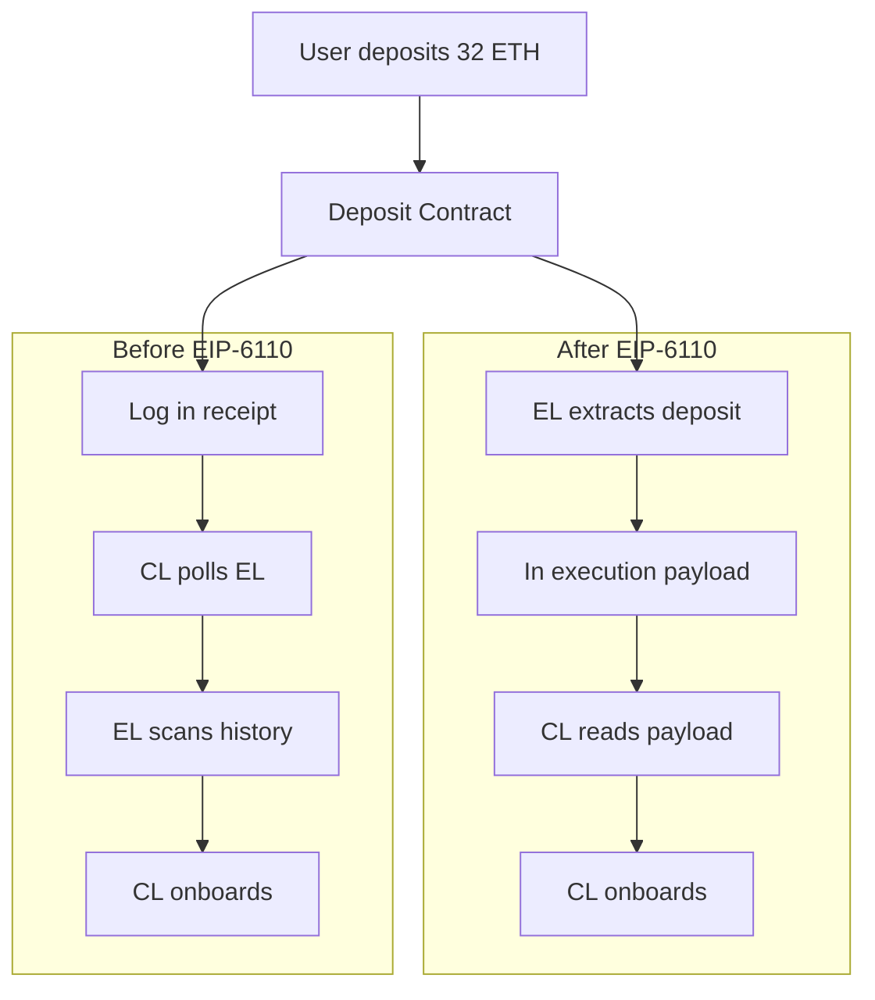
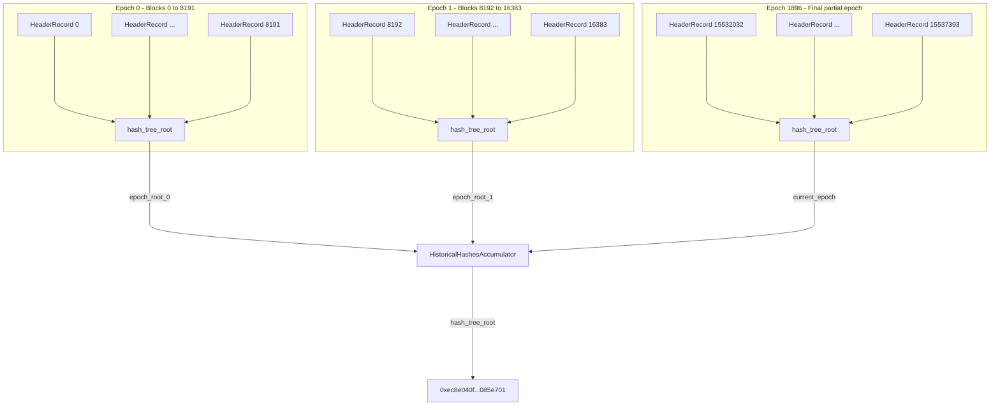

# 历史到期日期为以太坊

> **推荐预读**
> - [以太坊节点架构](/wiki/EL/el-specs.md)
> - [执行层规范](/wiki/EL/el-specs.md)
> - [DevP2P协议](/wiki/EL/devp2p.md)
> - [数据结构和编码](/wiki/EL/data-structures.md)
> - [EIP-4444：执行中绑定历史数据客户端](https://eips.ethereum.org/EIPS/eip-4444)
> - [EIP-7643：PoS 前数据的历史累加器](https://eips.ethereum.org/EIPS/eip-7643)

历史过期是指不应该要求节点永久存储历史数据。每个以太坊全节点存储两类数据。状态是当前账户、合约存储和代码。历史记录是过去的区块标头、正文和收据。

直到最近，全节点仍有望通过对等节点到 对等节点网络存储和提供所有历史数据，即使不需要这些数据来验证区块。自创世以来，该数据随着每个区块的增长而增长。如今，运行全节点需要远远超过 1 TB 的磁盘空间，而且即使链的容量保持不变，客户端的负载和同步时间也会不断增加。删除这些数据可能听起来有风险，但以太坊的默认同步策略已经无法验证创世中的每个区块。 [快照同步](https://ethereum.org/en/developers/docs/nodes-and-clients/#snap-sync)从最近的状态快照开始，[弱主观性检查点](https://epf.wiki/#/wiki/CL/syncing)将链锚定到可信的最终点。尽管历史验证仍然是可能的，但这不是强制性的。

为了解决这个问题，[EIP-4444](https://eips.ethereum.org/EIPS/eip-4444)建议节点可以修剪早于设定阈值的历史数据和收据，并停止通过点对点网络提供它们。一旦客户端同步到链的顶端，只有在通过 JSON-RPC 显式请求或对等节点尝试同步时才会检索历史数据。为此，点对点协议本身需要更改。

## DevP2P 变化

在 `eth/68` 和较旧的 `eth` 协议下，节点假设每个对等节点都存储了创世以来的完整链。 节点修剪旧历史记录，同时仍在 `eth/68` 上做广告，这将打破该假设并中断请求旧区块的 对等节点的同步。 [EIP-7642](https://eips.ethereum.org/EIPS/eip-7642) 引入了 `eth/69`，它消除了这个假设。在 `eth/69` 之前，当两个节点连接时，它们会交换一条状态消息，其中包含网络 ID、genesis 哈希、fork ID 以及节点最新的哈希区块，但现在状态握手包括两个新字段：`earliestBlock` 和 `latestBlock`，它们存储区块范围。

```python
    # Old eth/68 Status
    # [version, networkid, td, blockhash, genesis, forkid]

    # New eth/69 Status
    # Now includes earliestBlock and latestBlockHash.
    # td (totalDifficulty) is removed as it is useless since the merge.
    # [version, networkid, genesis, forkid, earliestBlock, latestBlock, latestBlockHash]

    # BlockRangeUpdate message, sent when a node's range changes.
    # Sent at most once per epoch (32 blocks).
    # [earliestBlock, latestBlock, latestBlockHash]
```

`eth/69` 还添加了一条新消息 BlockRangeUpdate。当节点修剪更多数据或下载更多历史记录时，它会将此消息发送到其连接的对等节点，以便他们可以更新区块可以服务的区块的视图。每个 epoch 只需发送一次。

`eth/69` 的线性范围适用于第一阶段，其中节点要么保存预合并(旧 PoW 链)数据，要么不保存。对于第二阶段，节点可能保存不连续的历史切片，像 [EIP-7801](https://eips.ethereum.org/EIPS/eip-7801) 这样的提案引入了一个名为 `etha` 的基于位掩码的子协议，让节点准确地通告它们存储的链的哪些段。虽然 eth 协议继续处理实时链操作，如区块传播、交易八卦和同步到提示，但 `etha` 子协议完全致力于提供历史数据。这意味着历史区块请求将不再通过与实时链相同的通道传输，因此正在寻找旧区块的 节点通过 Etha 查询对等节点，而不支持历史分片的节点永远不会再受到这些请求的困扰。

`etha`的核心思想是将链历史分为1,064,960个区块的重复窗口。每个窗口被分成 10 个相等的跨度，每个跨度为 106,496 区块。位掩码中的每一位代表这些跨度之一。如果节点设置位 3，则该节点承诺不仅在该段中保留十个跨度中的三分之一，而且还保留从区块 0 到 1,064,960 以及从区块 1,064,960 到 2,129,920 的整个链，依此类推，一直到链头。当生成新的区块并创建新的跨度时，节点必须继续存储与其提交位相对应的跨度。

**窗口：区块 0 — 1,064,960**

|              |跨度 0 |跨度 1 |跨度 2 |跨度 3 |跨度 4 |跨度 5 |跨度 6 |跨度 7 |跨度 8 |跨度 9 |
|--------------|--------|--------|--------|--------|--------|--------|--------|--------|--------|--------|
| 节点 |   X |        |        |        |        |        |        |        |        |        |
| 节点 B |        |        |        |   X |        |        |        |        |        |        |
| 节点 C |        |        |        |        |        |        |        |   X |        |        |
| 节点 D |        |   X |        |        |        |        |        |        |        |        |
| 节点 E |        |        |        |        |        |   X |        |        |        |        |
| 节点 F |        |        |        |        |        |        |        |        |        |   X |

106,496 的跨度大小不是任意的。每个跨度是 8,192 区块的倍数，这是 ERA1 文件的最大区块范围。这使得节点的存储和检索直接与数据打包分发的方式保持一致，并且直接回填分片。最低要求是每个参与的节点至少保留一位，这相当于总链历史的大约 10%，与保留所有内容相比，存储减少了 90%。同步节点找到特定分片取决于有多少对等节点持有它。 节点的 对等节点都不持有给定分片的概率被建模为 $(0.9)^n$，其中 $n$ 是连接的对等节点的数量。使用 25 对等节点时，分片丢失的可能性约为 7%，而使用 32 对等节点时，丢失分片的可能性降至约 3.4%。

|连接数对等节点 ($n$) | 对等节点没有持有给定分片的概率 $P = (0.9)^n$ |至少有一个对等节点成立的概率 $1 - (0.9)^n$ |
|---------------------------------|-------------------------------------------------------|-------------------------------------------------------|
| 10                              | 34.9%                                                 | 65.1%                                                 |
| 15                              | 20.6%                                                 | 79.4%                                                 |
| 20                              | 12.2%                                                 | 87.8%                                                 |
| 25                              | 7.2%                                                  | 92.8%                                                 |
| 32                              | 3.4%                                                  | 96.6%                                                 |
| 50                              | 0.5%                                                  | 99.5%                                                 |

当两个节点通过 etha 连接时，它们交换包含与 eth/69 相同字段以及 `blockBitmask` 的握手。从那时起，节点可以使用直接从 eth/69 重用的四个具有相同编码的消息来提供历史数据，例如 `GetBlockBodies`、`BlockBodies`、`GetReceipts` 和 `Receipts`。这使得数据检索过程以相同的方式工作，并且不需要新的消息类型。

```python
    # eth/69 Status Handshake
    # [version, networkid, genesis, forkid, earliestBlock, latestBlock, latestBlockHash]

    # etha Handshake (EIP-7801)
    # Same fields as eth/69, plus a 10-bit blockBitmask
    # [version, networkid, genesis, forkid, blockhash, blockBitmask]

    # etha reuses these four messages from eth/69 with identical encoding
    # GetBlockBodies  (0x05)
    # BlockBodies     (0x06)
    # GetReceipts     (0x0f)
    # Receipts        (0x10)
```

## 存款日志依赖

历史记录过期不仅影响执行层，而且给共识层带来直接问题。在 [Pectra 硬分叉](https://eips.ethereum.org/EIPS/eip-7600) 之前，当有人存入 32 个 ETH 成为验证者时，该交易会进入执行层上的存款合约，然后发出 `DepositEvent` 日志，其中包含验证者的公钥、提现凭证、充值金额、签名、索引。 共识层需要此信息来装载验证者。

```python
    # From github.com/ethereum/consensus-specs
    # event DepositEvent(
    #     bytes pubkey,                  # The validator's public key
    #     bytes withdrawal_credentials,  # Address to receive the validator's balance when it exits
    #     bytes amount,                  # How much ETH was deposited
    #     bytes signature,               # Validator's signature
    #     bytes index                    # Index tracks the number of deposits
    # )
```

共识层客户端通过一种称为 Eth1Data 轮询的机制获取此数据。每个信标区块都包含一个 `eth1_data` 字段，其中区块提议者对存款合约的最新状态进行投票。为了能够投票，提议者的共识客户端将查询 JSON-RPC 上的执行客户端，要求它从历史执行层区块中读取存款合约的日志。执行客户端将扫描旧的区块以查找相关的存款事件，而这正是历史到期破坏的地方。



这些存款日志存在于历史区块中，如果执行节点已修剪其历史记录，则共识客户端无法再读取其所依赖的存款日志。 `Eth1Data` 轮询机制将失败，因为它轮询的数据不再存在于节点上。

除了历史记录过期问题之外，`Eth1Data` 轮询流程也很脆弱。共识客户端依赖于 JSON-RPC 调用执行客户端，不同执行客户端实现之间的不一致导致失败。 区块提议者需要维护和分发存款合约快照才能参与。存款交易登陆执行层和 共识层处理它之间的延迟大约为 12 小时。整个投票机制，其中提议者对他们认为的存款合约状态进行投票，引入了直接读取不会有的攻击面。

现在，为了解决上述所有问题，[EIP-6110](https://eips.ethereum.org/EIPS/eip-6110)建议将存款处理作为从执行层到 共识层的每个区块上发送的执行载荷的一部分。因此，当存款交易包含在区块中时，执行客户端会立即从该区块的收据中解析 `DepositEvent` 日志，将它们打包到 `deposit_requests` 列表中，并将它们包含在执行载荷。这会终止 `Eth1Data` 投票机制，并完全消除共识层对历史执行层数据的依赖。 EIP-6110 作为 [Pectra 升级](https://eips.ethereum.org/EIPS/eip-7600) 的一部分提供，消除了这种依赖性。

## ERA 文件

一旦节点停止提供旧历史记录，该数据仍然需要在某个地方检索。 ERA 文件是包含最终历史区块的平面文件存档。它们构建在 [e2store](https://github.com/status-im/nimbus-eth2/blob/stable/docs/e2store.md) 之上，这是一种类型-长度-值文件格式，专为以太坊数据的长期冷存储而设计。 e2store 文件中的每个条目都有一个 8 字节的标头，后面是数据本身。标头被分解为

- 2 个字节用于类型
- 长度为 4 个字节
- 保留2个字节

有多种 [e2store 格式](https://github.com/eth-clients/e2store-format-specs)，每种格式都包含自己的数据片段。 ERA1 文件存储合并前执行层历史记录。每个 ERA1 文件都包含 8,192 个区块的标题、正文、收据和总难度值，全部经过快速压缩。 ERA 文件存储合并后信标链历史记录，包括信标区块和状态，也以 8,192 个时隙为批次(约 27 小时的链时间)。 E2HS 文件涵盖了执行层从创世到最新的完整历史记录，标头附有规范性证明。 Erb 文件仍在开发中，与 blob sidecar 等效。 E2SS文件存储执行状态快照。

```python
    # e2store entry layout
    # [type: 2 bytes | length: 4 bytes | reserved: 2 bytes | data: length bytes]

    # ERA1 file structure
    # era1 := Version | block-tuple* | other-entries* | Accumulator | BlockIndex
    # block-tuple := CompressedHeader | CompressedBody | CompressedReceipts | TotalDifficulty
```

8,192-区块批量大小来自 [EIP-7643](https://eips.ethereum.org/EIPS/eip-7643) 中定义的累加器大小限制。每个 ERA1 文件都包含一个累加器，它是最多 8,192 个头记录的 SSZ 哈希树根。头记录是一对区块哈希和总难度。累加器充当文件内容的加密承诺。

```python
    # Header record used in the accumulator
    # header_record = { block_hash: Bytes32, total_difficulty: Uint256 }

    # Accumulator is the hash tree root of up to 8192 header records
    # accumulator = hash_tree_root(List[header_record], max_length=8192)
```

任何下载 ERA1 文件的人都可以从其中的区块标头重建 epoch 累加器，并将结果与​​已知的累加器根进行比较。完整的预合并累加器根在 EIP-7643 中定义，并且区块 15,537,394(合并区块)之前的所有数据的整个 `HistoricalHashesAccumulator` 的哈希树根是单个固定值，使其不可信。

### 累加器验证

累加器使用三种数据结构。

```python
    EPOCH_SIZE = 8192  # blocks per ERA1 file
    MAX_HISTORICAL_EPOCHS = 2048  # upper bound on pre-merge epochs

    # A record for a single block
    # HeaderRecord = Container[
    #     block_hash: bytes32,
    #     total_difficulty: uint256
    # ]

    # All header records within a single 8192-block epoch
    # EpochRecord = List[HeaderRecord, max_length=EPOCH_SIZE]

    # The top-level accumulator
    # HistoricalHashesAccumulator = Container[
    #     historical_epochs: List[bytes32, max_length=MAX_HISTORICAL_EPOCHS],
    #     current_epoch: EpochRecord
    # ]
```

`HeaderRecord` 将区块的 哈希与该高度的总难度配对。 `EpochRecord` 最多收集 8,192 条此类记录。 `HistoricalHashesAccumulator` 将所有已完成的 epoch 的 Merkle 根存储在 `historical_epochs` 中，加上 epoch 中保留的任何部分 `current_epoch`。

例如，如果您在主网上取前三个区块，则每个区块都会生成一个 `HeaderRecord`。

```python
    # Block 0 (genesis)
    # header_record_0 = { block_hash: 0xd4e5..c520, total_difficulty: 17_179_869_184 }

    # Block 1
    # header_record_1 = { block_hash: 0x88e9..4c2d, total_difficulty: 34_359_738_368 }

    # Block 2
    # header_record_2 = { block_hash: 0xb495..cd62, total_difficulty: 51_539_607_552 }

    # ... continue for all 8192 blocks in epoch 0
```

一旦收集了 epoch 0 的所有标头记录，就可以通过 SSZ Merkle 树哈希计算出 epoch 根。它获取 8,192 个 `HeaderRecords` 列表，将每个序列序列化为 SSZ(block_hash 为 bytes32 + total_difficulty 为 uint256，每条记录 64 个字节)，然后在叶子上构建一个二进制 Merkle 树。每对叶子与 SHA256 一起进行哈希处理，然后对每对中间节点再次进行哈希处理，直到根。由于列表的最大长度为 8,192，因此树始终填充为 8,192 个叶子(深度为 $\log_2(8192) = 13$ 层)。最后的“混合长度”步骤哈希将树根与实际列表长度一起生成 epoch 根。

```python
    # epoch_root_0 = hash_tree_root([header_record_0, header_record_1, ..., header_record_8191])
    # epoch_root_0 = 0x5ec1ffb8c3b146f42606c74ced973dc16ec5a107c0345858c343fc94780b4218
```

刚刚计算的根是 `historical_epochs` 列表中的第一个条目。对整个预合并链中的每个区块批次重复相同的过程。



合并发生在区块 15,537,394。这意味着有 1,896 个完整的 epoch (1,896 × 8,192 = 15,531,008 区块) 加上最终的部分 epoch 6,386 区块 (15,537,394 - 15,531,008)。完整的 epoch 进入 `historical_epochs` 作为 1,896 个根的列表。最后 6,386 条头记录进入 `current_epoch`。整个 `HistoricalHashesAccumulator` 的 `hash_tree_root` 生成一个固定值，该固定值被硬编码到客户端中。它永远不会改变，因为预合并链被冻结。

```python
    # Final pre-merge accumulator root (from EIP-7643)
    # 0xec8e040fd6c557b41ca8ddd38f7e9d58a9281918dc92bdb72342a38fb085e701
```

当节点下载 ERA1 文件时，验证分四个步骤进行。从文件中提取所有区块标头。为每个区块构建一个 `HeaderRecord`。对记录计算 `hash_tree_root`。将结果与 EIP-7643 已发布表中的已知 epoch 根进行比较。如果根匹配，则该文件是规范的。如果不这样做，则文件已损坏或被篡改，应被拒绝。

### 包含证明

该累加器还可以为单个区块提供紧凑的 Merkle 证明。在 EIP-7643 之前，证明特定的区块是规范的需要向后遍历整个父哈希链，即 $O(n)$。使用累加器，从叶子(特定的 `HeaderRecord`)到 epoch 根的 Merkle 证明是 $O(\log n)$，特别是 $O(\log_2 8192) = 13$ 哈希对于 epoch 内的任何区块。为了证明完整的累加器根，您需要从 epoch 根到 `HistoricalHashesAccumulator` 根再添加一个证明步骤。

以区块 500,000为例

$$\text{epoch} = \left\lfloor \frac{500{,}000}{8{,}192} \right\rfloor = 61$$

$$\text{position within epoch} = 500{,}000 \mod 8{,}192 = 888$$

从索引 888 处的 `HeaderRecord` 到 `epoch_root_61` 的 Merkle 证明需要

$$\log_2(8192) = 13 \text{ sibling hashes}$$

从 `epoch_root_61` 到完整累加器根的 Merkle 证明需要

$$\log_2(2048) = 11 \text{ sibling hashes}$$

总证明大小为

$$13 + 11 = 24 \text{ hashes} \times 32 \text{ bytes} = 768 \text{ bytes}$$

证明任何预合并区块都是规范的。

这是[门户网络](https://www.ethportal.net/) 设计使用的验证机制。当节点从网络请求历史区块时，响应包括区块数据以及针对累加器的 Merkle 证明。

### 分布

ERA1 文件遵循命名约定 `<network>-<epoch>-<hexroot>.era1`，例如 `mainnet-00000-5ec1ffb8.era1` 表示主网上的前 8,192 个区块。十六进制部分是截断的累加器根，因此文件名本身是快速完整性检查。文件末尾的 BlockIndex 存储每个区块元组的相对偏移量，从而可以通过区块数字进行随机访问，而无需扫描整个文件。

[eth-客户端/history-endpoints](https://github.com/eth-clients/history-endpoints) 注册表维护着通过 HTTP 和 torrent 提供 ERA1 和 ERA 文件的提供商的社区列表。 [ethPandaOps](https://ethpandaops.io/data/history/) 等提供商托管全套主网 ERA1 文件，其中包含 SHA256 校验和以进行验证。文件还可以通过 [BitTorrent](magnet:?xt=urn:btih:edcc7c112bae520e3226065a61817d3575904e0d&dn=EthereumMainnetPreMergeEraFiles&xl=458498121702&tr=udp%3A%2F%2Ftracker.opentrackr.org%3A1337%2Fannounce&tr=udp%3A%2F%2Fopen.tracker.cl%3A1337%2Fannounce&tr=udp%3A%2F%2Fbt1.archive.org%3A6969%2Fannounce) 共享。目标是不需要单一的提供商，并且数据仍然可以通过多个独立渠道获取。

客户端支持已经就位。 [Geth](https://geth.ethereum.org/docs/fundamentals/downloadera)、[Nimbus](https://nimbus.guide/era-store.html)、[Besu](https://besu.hyperledger.org/public-networks/how-to/era1-file-full-sync) 和 [Reth](https://reth.rs/docs/reth_era/index.html) 都支持 ERA1 导入。每个 106,496 区块的 Etha 跨度正好是 13 个 ERA1 文件(13 × 8,192 = 106,496)，因此 Etha 下的节点的存储边界直接映射到整个 ERA1 文件。

## 门户网

ERA 文件解决了归档问题，但它们是静态的。需要单个旧区块的 节点不必下载整个 8,192-区块文件来获取它。 [门户网](https://www.ethportal.net/)提供按需检索层。它是一个轻量级的点对点网络，其中每个参与的节点存储一小部分以太坊的数据，并在请求时提供服务。与现有的 DevP2P 网络(其中每个全节点都应容纳所有内容)不同，Portal 的设计使得每个加入的节点都会增加容量而不是消耗容量。

Portal 在 UDP 上的 [Discovery v5](https://github.com/ethereum/devp2p/blob/master/discv5/discv5.md) 之上运行，并分为历史记录、信标链数据和状态的独立子网。每个子网络形成自己的覆盖层DHT。数据通过桥节点进入，桥全节点通过 JSON-RPC 从全节点拉出并推送到相应的子网。每条数据都由内容密钥标识，每个节点根据其与该密钥的 XOR 距离存储内容，并由自声明的半径控制。检索使用合并前数据的累加器证明和合并后数据的信标链 `historical_summaries` 进行验证。

然而，门户网络的发展已经基本停滞，目前还不是门户网络的积极组成部分。
历史到期路线图。存在四个客户端实现([Trin](https://github.com/ethereum/trin)，
[蓬松](https://github.com/status-im/nimbus-eth1/tree/master/fluffy),
[超轻](https://github.com/ethereumjs/ultralight),
[Shisui](https://github.com/optimism-java/shisui))虽然积极的工作已经明显放缓。


## 目前状态

历史到期的第一阶段已经开始，EIP-6110 作为 Pectra 升级的一部分发货。第 1 阶段的目标是合并前 (PoW) 历史记录，该历史记录占大多数节点上存储的大部分数据。第 2 阶段涵盖通过 Etha (EIP-7801) 进行非连续分片的合并后历史，并且仍在积极开发中。


## 资源

- [EIP-4444：执行中绑定历史数据客户端](https://eips.ethereum.org/EIPS/eip-4444)，[已存档](https://web.archive.org/web/20240601000000*/https://eips.ethereum.org/EIPS/eip-4444)
- [EIP-6110：在链上供应验证者存款](https://eips.ethereum.org/EIPS/eip-6110)，[已存档](https://web.archive.org/web/20240601000000*/https://eips.ethereum.org/EIPS/eip-6110)
- [EIP-7642：eth/69 - 历史到期和更简单的收据](https://eips.ethereum.org/EIPS/eip-7642)，[已存档](https://web.archive.org/web/20240601000000*/https://eips.ethereum.org/EIPS/eip-7642)
- [EIP-7643：PoS 前数据的历史累加器](https://eips.ethereum.org/EIPS/eip-7643)，[已存档](https://web.archive.org/web/20240601000000*/https://eips.ethereum.org/EIPS/eip-7643)
- [EIP-7801：etha - 分片区块子协议](https://eips.ethereum.org/EIPS/eip-7801)，[已存档](https://web.archive.org/web/20240601000000*/https://eips.ethereum.org/EIPS/eip-7801)
- [e2store格式规范](https://github.com/eth-clients/e2store-format-specs)
- [ERA1格式规范](https://github.com/eth-clients/e2store-format-specs/blob/main/formats/era1.md)
- [以太坊历史数据端点](https://eth-clients.github.io/history-endpoints/)
- [门户网络规范](https://github.com/ethereum/portal-network-specs)
- [门户网设计要求](https://blog.ethportal.net/posts/design-requirements-for-portal-network)
- [门户网FAQ](https://notes.ethereum.org/@Kolby-ML/HJ-9D5aYp)
- [ethPandaOps ERA1 数据](https://ethpandaops.io/data/history/)
- [Nimbus ERA 店铺指南](https://nimbus.guide/era-store.html)
- [Geth ERA 下载指南](https://geth.ethereum.org/docs/fundamentals/downloadera)
- [Besu ERA1 导入指南](https://besu.hyperledger.org/public-networks/how-to/era1-file-full-sync)
- [ethereum.org 上的门户网络](https://ethereum.org/developers/docs/networking-layer/portal-network/)