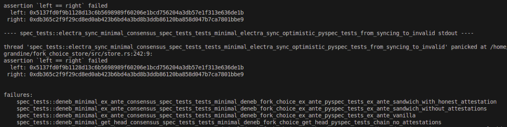

# 共识规范测试

> :warning: 本文是一个 [存根](https://en.wikipedia.org/wiki/Wikipedia:Stub)，通过 [贡献](/contributing.md) 和扩展它来帮助维基。

[consensus-spec-tests](https://github.com/ethereum/consensus-spec-tests) 仓库包含从 Ethereum 共识规范生成的测试向量集合。  
这些测试用于根据 [Ethereum 共识规范](https://github.com/ethereum/consensus-specs) 验证共识客户端实现的正确性。

客户端开发人员使用这些测试来确认对协议的更改在所有共识客户端中一致地实施。  

---

> ### 实用笔记
>
>`consensus-spec-tests` 仓库非常大，可能占用几 GB 的磁盘空间。  
当运行依赖于相同测试向量的多个共识客户端时，从技术上讲，可以通过从每个客户端的预期测试目录创建 **符号链接** 到 `consensus-spec-tests` 的单个共享副本来节省空间。
>
>然而，这种方法也存在风险：
>- 不同的客户端可能取决于测试套件的**不同版本**。  
  使用错误的版本可能会导致**漏报**(即使客户端实现正确，测试也会失败)。
    
>    
>- 手动将 (`git checkout`) 切换到客户端所需的测试版本并重新运行测试可能会导致**解压 SSZ Snappy 文件时出现问题**并导致测试失败。
    
> 具体示例请参阅 [issue](https://github.com/sntntn/grandine/issues/15)。
>
> 因此，**建议的做法**是为每个共识客户端 **保留 `consensus-spec-tests` 的单独副本**，即使它需要更多磁盘空间。

资源：  
- [共识规范测试仓库](https://github.com/ethereum/consensus-spec-tests)  
- [Ethereum 共识规范](https://github.com/ethereum/consensus-specs)(测试生成的真相来源)  
- [SimpleSerialize (SSZ) 规范](https://ethereum.github.io/consensus-specs/ssz/simple-serialize/)  

