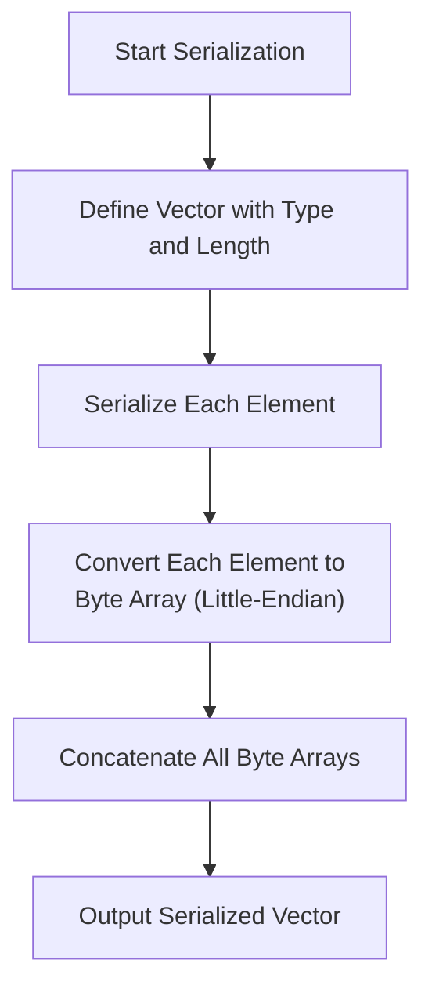
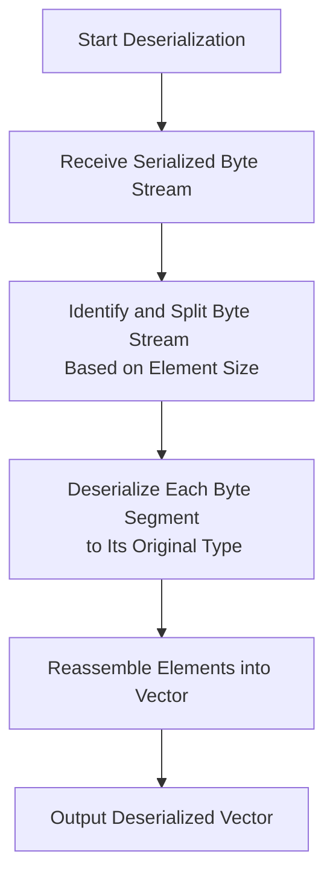
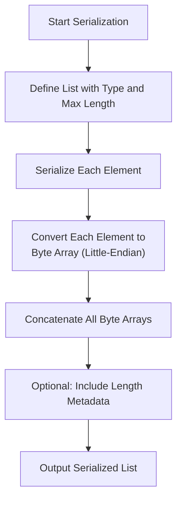
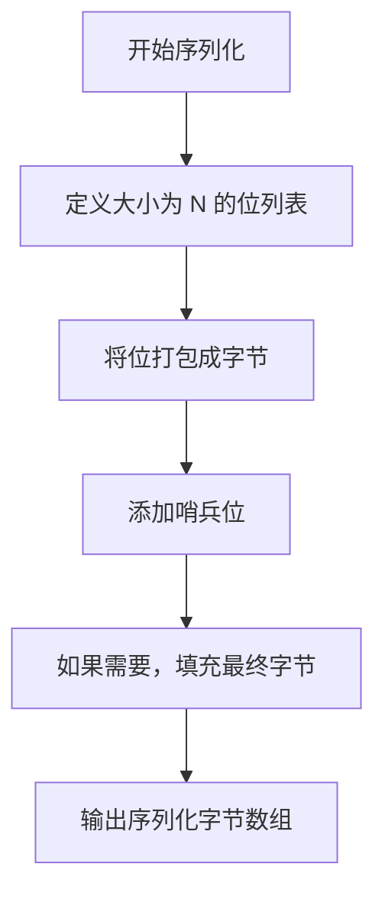
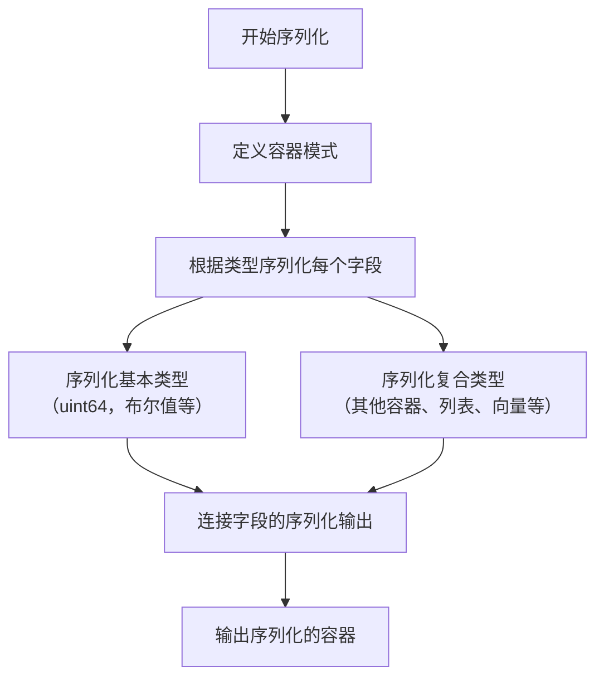

# Simple Serialize (SSZ)

## 概述

Simple Serialize (SSZ) 是一种为以太坊的 Beacon Chain 设计的序列化和[Merkle 化](/wiki/CL/merkleization.md)方案。SSZ 替代了执行层（EL）中使用的[ RLP 序列化](/wiki/EL/RLP.md)，在共识层（CL）中得到广泛应用，除了[对等发现协议](https://github.com/ethereum/devp2p)。它的开发和采用旨在提高以太坊共识层的效率、安全性和可扩展性。

本文讨论了 SSZ 序列化的内容。您可以在[merkle化维基页面](/wiki/CL/merkleization.md)了解更多关于 SSZ merkle 化的信息。

## SSZ 工具

有许多工具可供使用 SSZ。以下是 [SSZ 工具的完整列表](https://github.com/ethereum/consensus-specs/issues/2138)。以下是一些流行的工具：

- [py-ssz](https://github.com/ethereum/py-ssz)
- [dafny](https://github.com/ConsenSys/eth2.0-dafny)
- [remerkleable](https://github.com/protolambda/remerkleable)
- [fastssz](https://github.com/ferranbt/fastssz/)
- [rust-ssz](https://github.com/ralexstokes/ssz-rs)

## SSZ 与 RLP 序列化比较

| 标准       | 紧凑性 | 表达性       | 哈希化  | 索引      |
|------------|---------|--------------|----------|-----------|
| RLP        | 是      | 灵活         | 可能     | 否        |
| SSZ        | 否      | 是           | 是       | 较差      |

_表：SSZ 与 RLP 的比较，[Piper Merriam](https://twitter.com/pipermerriam)。_

**表达性**：
- **SSZ**：直接支持所有必要的数据类型，无需额外的抽象层。这使得 SSZ 在处理以太坊 PoS 中使用的复杂数据结构时，更加直观且健壮。
- **RLP**：仅限于动态长度的字节串和列表。其他数据类型仅能通过抽象层支持，这可能会引入复杂性和潜在的低效。

**哈希化**：
- **SSZ**：促进高效的哈希和再哈希操作，特别有利于需要频繁更新数据状态的操作，如分片和无状态客户端。这种效率对于维护区块链的完整性和性能至关重要。
- **RLP**：虽然支持哈希操作，但在数据结构发生微小变化时，性能优化不如 SSZ。

**索引**：
- **SSZ**：尽管索引表现为“较差”，但 SSZ 支持在无需完全反序列化的情况下对序列化数据进行某种程度的直接访问，这对于区块

**示例：**
- 整数 `1025` 作为 `uint16` 序列化后将变为 `01 04`（十六进制）。首先，将 `1025` 转换为十六进制得到 `0x0401`。在小端格式中，最低有效字节（LSB）排在最前面。因此，`0x0401` 在小端格式下是 `01 04`。字节数组 `[01, 04]` 即为序列化输出。

**无符号整数的反序列化过程：**

- **输入**：读取表示已序列化 `uintN` 的字节数组。
- **读取小端字节**：按小端顺序解释字节，以重构整数值。
- **输出**：将字节数组转换回整数。

**示例：**
- 字节数组 `01 04`（十六进制）反序列化为整数 `1025`。读取第一个字节 `01` 作为整数的低位部分，`04` 作为高位部分。按大端格式重新组装后，得到 `0401`（十六进制），其对应的十进制值为 1025。

### 布尔值

在 SSZ 中，布尔值非常简单，每个布尔值由一个字节表示。

**布尔值的序列化过程：**

- **输入**：获取布尔值（`True` 或 `False`）。
- **转换为字节**：
   - 如果布尔值为 `True`，则序列化为 `01`（十六进制）。
   - 如果布尔值为 `False`，则序列化为 `00`。
- **输出**：结果的单字节即为布尔值的序列化形式。

**示例：**
- `True` 序列化为 `01`。
- `False` 序列化为 `00`。

**布尔值的反序列化过程：**

- **输入**：读取单字节。
- **解释字节**：
   - 字节 `01` 表示 `True`。
   - 字节 `00` 表示 `False`。
- **输出**：对应字节的布尔值。

**示例：**
- 字节 `01` 反序列化为 `True`。
- 字节 `00` 反序列化为 `False`。

我们可以按照 [说明](https://eth2book.info/capella/appendices/running/) 使用 Python Eth PoS 规范运行 SSZ 序列化和反序列化命令，验证以上字节数组。


```python
>>> from eth2spec.utils.ssz.ssz_typing import uint64, boolean
# 序列化
>>> uint64(1025).encode_bytes().hex()
'0104000000000000'
>>> boolean(True).encode_bytes().hex()
'01'
>>> boolean(False).encode_bytes().hex()
'00' 

# 反序列化
>>> print(uint64.decode_bytes(bytes.fromhex('0104000000000000')))
1025
>>> print(boolean.decode_bytes(bytes.fromhex('01')))
1
>>> print(boolean.decode_bytes(bytes.fromhex('00')))
0
```

## SSZ 如何在复合类型上工作

### 向量

在 SSZ 中，向量用于处理具有固定长度的同质元素集合。以下是 SSZ 如何处理向量的序列化和反序列化的详细说明。

**向量的 SSZ 序列化**



_图：向量的 SSZ 序列化过程。_

**固定长度定义**：
- 向量使用特定的长度和元素类型进行定义，例如 `Vector[uint64, 4]` 表示一个包含四个 64 位无符号整数的向量。

**元素序列化**：
- 向量中的每个元素根据其类型独立序列化。
- 对于基本类型，如整数或布尔值，这意味着将每个元素转换为字节表示。
- 如果元素是复合类型，则根据其特定的序列化规则序列化每个元素。

**连接**：
- 每个元素的序列化输出按它们在向量中的顺序连接。
- 由于向量的长度和每个元素的大小是已知且固定的，因此不需要额外的元数据（如长度前缀）在序列化输出中。

**示例：**
- 对于一个 `Vector[uint64, 3]` 向量，其元素为 `[256, 512, 768]`，每个元素 64 位或 8 字节长。序列化过程如下：

**将每个整数转换为小端字节数组**：
- `256` 作为 `uint64` 转换为 `00 01 00 00 00 00 00 00`。
- `512` 作为 `uint64` 转换为 `00 02 00 00 00 00 00 00`。
- `768` 作为 `uint64` 转换为 `00 03 00 00 00 00 00 00`。

**连接这些字节数组**：
- 结果的连接字节数组为 `00 01 00 00 00 00 00 00 00 02 00 00 00 00 00 00 00 03 00 00 00 00 00 00`。

**序列化输出**：
- `00 01 00 00 00 00 00 00 00 02 00 00 00 00 00 00 00 03 00 00 00 00 00 00`。


**向量的 SSZ 反序列化**



_图：向量的 SSZ 反序列化过程。_

**固定长度利用**：
- 反序列化器使用预定义的向量长度和类型来解析序列化数据。
- 它知道每个元素占多少字节，向量中有多少个元素。

**元素反序列化**：
- 字节流被分割为与每个元素大小对应的段。
- 每个段根据向量中元素的类型独立反序列化。

**重构**：
- 将元素恢复为它们的原始形式（例如，将字节数组转换回整数或其他指定类型）。
- 然后将这些元素聚合以重构原始向量。

**示例：**
- 给定一个 `Vector[uint64, 3]` 的序列化数据
- 序列化字节数组：`00 01 00 00 00 00 00 00 00 02 00 00 00 00 00 00 00 03 00 00 00 00 00 00`。

**将数据解析为段**：
- 每个段由 8 个字节组成。
- 第一个段：`00 01 00 00 00 00 00 00` → 表示整数 256。
- 第二个段：`00 02 00 00 00 00 00 00` → 表示整数 512。
- 第三个段：`00 03 00 00 00 00 00 00` → 表示整数 768。

**将每个段从小端字节数组转换回整数**：
- 使用小端格式，每个字节数组被读取并转换回相应的 `uint64` 整数。

**重构**：
- 重构后的向量是 `[256, 512, 768]`。


以下是我们可以在 Python 中运行并验证的代码：

```python
>>> from eth2spec.utils.ssz.ssz_typing import uint8, uint16, Vector
>>> Vector[uint16, 3](256, 512, 768).encode_bytes().hex()
'000100000000000000020000000000000003000000000000'
>>> print(Vector[uint64, 3].decode_bytes(bytes.fromhex('000100000000000000020000000000000003000000000000')))
Vector[uint64, 3]<<len=3>>(256, 512, 768)
>>> 

```

### 列表

SSZ 中的列表在管理具有指定最大长度（`N`）的同质元素的可变长度集合方面至关重要。这种灵活性使得数据结构（如交易集合或可变状态组件）能够动态管理，并适应网络需求的变化。

**SSZ 列表序列化**




_Figure: SSZ 列表序列化_

**定义列表**:
- SSZ 中的列表定义了特定的元素类型和最大长度，表示为 `List[type, N]`。此定义不仅约束了列表的最大容量，还说明了元素应如何进行序列化。

**元素序列化**:
- 列表中的每个元素根据其类型进行序列化。对于 `uint64` 元素，序列化过程涉及将每个整数转换为字节数组。

**串联序列化元素**:
- 序列化元素的输出会按顺序连接在一起。序列化数据的总长度会根据序列化时存在的元素数量有所变化。

**包含长度元数据（可选）**:
- 根据实现需求，列表的长度可能会显式包含在序列化数据的开头，以便在反序列化过程中辅助解析和验证。

**示例**:
- 对于一个包含 `[1024, 2048, 3072]` 元素的 `List[uint64, 5]`，序列化过程将包括：
  - 将每个整数转换为小端格式的字节数组：`00 04 00 00 00 00 00 00`，`00 08 00 00 00 00 00 00`，`00 0C 00 00 00 00 00 00`。
  - 将这些数组串联起来，得到：`00 04 00 00 00 00 00 00 00 08 00 00 00 00 00 00 00 0C 00 00 00 00 00 00`。

**SSZ 列表反序列化**


```mermaid
flowchart TD
    A[开始反序列化] --> B[接收序列化字节流]
    B --> C["根据元素大小（uint64 为 8 字节）\n识别并拆分字节流"]
    C --> D[将每个字节段反序列化为 uint64]
    D --> E[将元素重新组装成列表]
    E --> F[输出反序列化后的列表]
    


```mermaid
flowchart TD
    A[开始反序列化] --> B[接收序列化字节流]
    B --> C["根据元素大小（uint64 为 8 字节）\n识别并拆分字节流"]
    C --> D[将每个字节段反序列化为 uint64]
    D --> E[将元素重新组装成列表]
    E --> F[输出反序列化后的列表]
    

    
```
_Figure: SSZ 位向量序列化_

**定义位向量**: 
- 在 SSZ 中，位向量由其长度 `N` 定义，指定了位的数量。例如，`Bitvector[256]` 表示一个包含 256 位的位向量。

**将位转换为字节**:
- 位向量中的每个位代表一个布尔值，其中 `0` 对应 `False`，`1` 对应 `True`。
- 这些位被打包到字节中，每个字节从最低有效位（LSB）开始排列。这意味着位向量中的第一个位对应于第一个字节的 LSB。

**字节数组的形成**:
- 位被序列化为字节数组，通过将 8 位打包到每个字节中，直到所有位都被处理完。
- 如果 `N` 不是 8 的倍数，最后一个字节将包含少于 8 位的数据，并在最高有效位位置填充零。

**示例**: 对于一个位向量 `Bitvector[10]`，其模式为 `1011010010`：
- 前 8 位（`10110100`）形成第一个字节。
- 剩余的 2_Figure: SSZ 位向量反序列化_

**读取序列化字节数组**: 
- 从一个字节数组开始，该字节数组编码了位向量。

**从字节中提取位**:
- 将每个字节转换回位。记住，位在每个字节中是从 LSB 开始存储的。
- 如果位向量的长度 `N` 不是 8 的倍数，请丢弃最后一个字节中的多余填充位。

**重建位向量**:
- 将提取的位重新组装成原始的位向量格式，遵循指定的长度 `N`。

**示例**: 对于一个 `Bitvector[10]`，序列化数据为 `B4 80`：
- 将 `B4`（`10110100`）和 `80`（`10000000`）转换回位。
- 从二进制序列中提取前 10 位：`1011010010`。
- 重建的位向量为 `1011010010`。

你可以如下运行并验证它：

```python
>>> from eth2spec.utils.ssz.ssz_typing import Bitvector
>>> Bitvector[8](0,0,1,0,1,1,0,1).encode_bytes().hex()
'b4'
>>> Bitvector[8](0,0,0,0,0,0,0,1).encode_bytes().hex()
'80'
```

### 位列表

SSZ 中的位列表与位向量类似，但它们设计用来处理具有指定最大长度 (`N`) 的布尔值的可变长度序列。

**SSZ 位列表的序列化过程**



_Figure: SSZ 位列表的序列化过程。_

**定义位列表**：
- 位列表通过其最大长度 `N` 来定义，`N` 确定了可以包含的最大位数。然而，实际的位数可能少于 `N`。

**将位打包成字节**：
- 位列表中的每一位表示一个布尔值，其中 `0` 对应 `False`，`1` 对应 `True`。
- 这些位被序列化为字节数组，从每个字节的最低有效位（LSB）到最高有效位（MSB）打包，类似于位向量。

**添加哨兵位**：
- 为了标记位列表的结束并区分其实际长度与最大容量，向位序列的末尾添加了一个哨兵位（`1`）。这一位对于确保反序列化过程准确识别位列表的长度至关重要。

**字节数组的形成与填充**：
- 在添加哨兵位后，位被打包进字节。如果总位数（包括哨兵位）不能整除 8，则需要对最后一个字节进行填充，以使其完整。

**SSZ 位列表的反序列化**
_Figure: SSZ 位列表的反序列化过程。_

**接收序列化字节数组**：
- 从编码位列表的字节数组开始，字节数组中包括了哨兵位。

**从字节中提取位**：
- 将每个字节转换回位，并保持顺序（从最低有效位到最高有效位）。
- 对序列化数据中的每个字节继续进行此过程。

**识别并移除哨兵位**：
- 在提取位时，从位序列的末尾找到第一个 `1`（哨兵位），以确定位列表数据的实际结束。
- 所有紧随其后的位被视为填充位，应予以忽略。

**重构位列表**：
- 将提取的位（去掉哨兵位和任何填充位）重新组合成原始的位列表格式。

您可以像下面这样运行位列表的编码：


```python
>>> from eth2spec.utils.ssz.ssz_typing import Bitlist
>>> Bitlist[100](0,0,0).encode_bytes().hex()
'08'
```

由于哨兵位的存在，如果位列表的实际长度是 8 的倍数（与最大长度 `N` 无关），我们需要额外的一个字节来序列化位列表。而位向量则不需要这种额外的字节。


```python
>>> Bitlist[8](0,0,0,0,0,0,0,0).encode_bytes().hex()
'0001'
>>> Bitvector[8](0,0,0,0,0,0,0,0).encode_bytes().hex()
'00'
```

### 容器

SSZ 中的容器是用于将多个字段组合成一个单一复合类型的基本结构。容器中的每个字段可以是任何 SSZ 支持的类型，包括基本类型如 `uint64`，更复杂的类型如其他容器、向量或列表。容器类似于编程语言中的结构体或对象，因此它们在表示以太坊中的复杂和嵌套数据结构时非常重要。

**SSZ 容器的序列化过程**




_Figure: SSZ 容器的序列化过程。_

**定义容器**：
- SSZ 中的容器通过其模式定义，该模式指定容器字段的类型和顺序。这个模式至关重要，因为它决定了数据如何被序列化和反序列化。

**序列化每个字段**：
- 容器中的每个字段按照模式中定义的顺序进行序列化。
- 每个字段的序列化方法取决于其类型：
  - **基本类型**：直接转换为其字节表示。
  - **复合类型**（其他容器、列表、向量）：根据其自身的规则递归序列化。

**连接序列化字段**：
- 所有字段的序列化输出将被连接起来，形成容器的完整序列化数据。
- 如果字段是可变大小（如具有可变长度的列表或向量），其序列化数据将包含一个长度前缀，或者根据实现和类型的具体要求，可能会使用偏移量来指示数据的起始位置。

**SSZ 容器的反序列化**


```mermaid
flowchart TD
    A[开始反序列化] --> B[接收序列化的容器数据]
    B --> C[根据容器模式解析数据]
    C --> D[根据类型反序列化字段]
    D --> E[反序列化基本类型]
    D --> F[反序列化复合类型]

_Figure: SSZ 容器的反序列化过程。_
```

**读取序列化数据**：
- 从表示容器的序列化字节流开始。

**根据模式解析序列化数据**：
- 根据容器的模式，解析序列化数据为其组成字段。
- 这需要知道每个字段的类型和大小，以便正确提取和反序列化每个字段。

**反序列化每个字段**：
- 根据字段的类型对每个字段的数据进行反序列化。
- 反序列化可能涉及将字节数组转换回整数，解码嵌套的容器，或从序列化形式重建列表和向量。

**重构容器**：
- 每个字段反序列化后，将其放回定义的位置，从而重构容器。

**示例**：

让我们通过 Beacon Chain 中 `IndexedAttestation` 容器的具体示例来查看 SSZ 的序列化和反序列化过程。此示例将概述如何处理和处理 SSZ 中的复杂嵌套容器，特别是涉及固定大小和可变大小数据类型的容器。
 
`IndexedAttestation` 容器看起来如下。


```python
class IndexedAttestation(Container):
    attesting_indices: List[ValidatorIndex, MAX_VALIDATORS_PER_COMMITTEE]
    data: AttestationData
    signature: BLSSignature
```

它包含一个 `AttestationData` 容器，

```python
class AttestationData(Container):
    slot: Slot
    index: CommitteeIndex
    beacon_block_root: Root
    source: Checkpoint
    target: Checkpoint
```

其中包含两个 `Checkpoint` 容器，


```python
class Checkpoint(Container):
    epoch: Epoch
    root: Root
```    

**IndexedAttestation 容器结构**

`IndexedAttestation` 容器包括几个字段，其中一些是固定大小的基本类型，另一些是复合类型，包括另一个容器（`AttestationData`）和列表（如 `attesting_indices`）。

其结构如下：

- **attesting_indices**: `List[ValidatorIndex, MAX_VALIDATORS_PER_COMMITTEE]`（可变大小）
- **data**: `AttestationData`（复合容器）
- **signature**: `BLSSignature`（固定大小）

**AttestationData 容器结构**

- **slot**: `Slot`（固定大小）
- **index**: `CommitteeIndex`（固定大小）
- **beacon_block_root**: `Root`（固定大小）
- **source**: `Checkpoint`（复合容器）
- **target**: `Checkpoint`（复合容器）

**Checkpoint 容器结构**
- **epoch**: `Epoch`（固定大小）
- **root**: `Root`（固定大小）

**序列化过程**

- **序列化固定和可变组件**
  - `IndexedAttestation` 的序列化涉及根据字段类型序列化每个组件：

- **序列化固定大小元素**
  - 每个固定大小的元素（`Slot`、`CommitteeIndex`、`Epoch`、`Root`、`BLSSignature`）会序列化为相应的字节格式，通常对于数值类型采用小端格式。

- **序列化可变大小元素**
  - `List[ValidatorIndex, MAX_VALIDATORS_PER_COMMITTEE]` 的序列化会先记录列表的长度，然后序列化每个索引。
  - 如果列表或其他可变大小元素为空或没有达到最大容量，则只会消耗实际数据所需的空间，并可能包含一些长度或偏移量元数据。

- **连接序列化数据**
  - 所有序列化字节按容器结构中指定的顺序连接。固定大小的字段直接按顺序放置，而可变大小的字段可能会在序列化中包含偏移量或长度作为一部分。


**示例序列化输出**

```python
from eth2spec.utils.ssz.ssz_typing import *
from eth2spec.capella import mainnet
from eth2spec.capella.mainnet import *

attestation = IndexedAttestation(
    attesting_indices = [33652, 59750, 92360],
    data = AttestationData(
        slot = 3080829,
        index = 9,
        beacon_block_root = '0x4f4250c05956f5c2b87129cf7372f14dd576fc152543bf7042e963196b843fe6',
        source = Checkpoint (
            epoch = 96274,
            root = '0xd24639f2e661bc1adcbe7157280776cf76670fff0fee0691f146ab827f4f1ade'
        ),
        target = Checkpoint(
            epoch = 96275,
            root = '0x9bcd31881817ddeab686f878c8619d664e8bfa4f8948707cba5bc25c8d74915d'
        )
    ),
    signature = '0xaaf504503ff15ae86723c906b4b6bac91ad728e4431aea3be2e8e3acc888d8af'
                + '5dffbbcf53b234ea8e3fde67fbb09120027335ec63cf23f0213cc439e8d1b856'
                + 'c2ddfc1a78ed3326fb9b4fe333af4ad3702159dbf9caeb1a4633b752991ac437'
)

print(attestation.encode_bytes().hex())
```

The resulting serialized blob of data that represents this `IndexedAttestation` object is (in hexadecimal):

```code
e40000007d022f000000000009000000000000004f4250c05956f5c2b87129cf7372f14dd576fc15
2543bf7042e963196b843fe61278010000000000d24639f2e661bc1adcbe7157280776cf76670fff
0fee0691f146ab827f4f1ade13780100000000009bcd31881817ddeab686f878c8619d664e8bfa4f
8948707cba5bc25c8d74915daaf504503ff15ae86723c906b4b6bac91ad728e4431aea3be2e8e3ac
c888d8af5dffbbcf53b234ea8e3fde67fbb09120027335ec63cf23f0213cc439e8d1b856c2ddfc1a
78ed3326fb9b4fe333af4ad3702159dbf9caeb1a4633b752991ac437748300000000000066e90000
00000000c868010000000000
```

**序列化输出的拆解**

为了清楚地解释 `IndexedAttestation` 容器在示例中的序列化过程及其序列化数据的结构，以下将序列化过程拆解为其各个组成部分，帮助理解每个部分是如何在字节流中表示的。这一拆解有助于说明 SSZ 格式如何处理复杂的数据结构。

**第1部分：固定大小元素**

**可变大小列表（`attesting_indices`）的 4 字节偏移量**：
- **字节偏移**: `00`
- **值**: `e4000000`
- **解释**: 这表示 `attesting_indices` 列表在序列化字节流中的起始位置。十六进制值 `e4` 转换为十进制是 `228`，意味着列表从字节流的第 228 字节开始。

**Slot（uint64）**：
- **字节偏移**: `04`
- **值**: `7d022f0000000000`
- **解释**: 表示 `slot` 字段，序列化为一个 64 位无符号整数。小端格式下，`7d022f00` 转换为十进制 `3080829`，即槽位号。

**委员会索引（uint64）**：
- **字节偏移**: `0c`
- **值**: `0900000000000000`
- **解释**: 这是 `index` 字段，表示一个委员会索引作为 64 位无符号整数。值 `09` 表示委员会索引 `9`。

**信标区块根（Bytes32）**：
- **字节偏移**: `14`
- **值**: `4f4250c05956f5c2b87129cf7372f14dd576fc152543bf7042e963196b843fe6`
- **解释**: 这是一个 256 位的哈希值，存储为 `Bytes32`，表示信标区块的根哈希。

**源检查点的 epoch（uint64）和根（Bytes32）**：
- **Epoch 字节偏移**: `34`
- **Epoch 值**: `1278010000000000`
- **Root 字节偏移**: `3c`
- **Root 值**: `d24639f2e661bc1adcbe7157280776cf76670fff0fee0691f146ab827f4f1ade`
- **解释**: 源检查点包含 `epoch`（96274）和一个根哈希。根是另一个 256 位哈希。

**目标检查点的 epoch（uint64）和根（Bytes32）**：
- **Epoch 字节偏移**: `5c`
- **Epoch 值**: `1378010000000000`
- **Root 字节偏移**: `64`
- **Root 值**: `9bcd31881817ddeab686f878c8619d664e8bfa4f8948707cba5bc25c8d74915d`
- **解释**: 与源检查点类似，目标检查点也包含 `epoch`（96275）和一个根哈希，指示证明的目标。

**签名（BLSSignature/Bytes96）**：
- **字节偏移**: `84`
- **值**: 被分为几行，因为其长度为 96 字节。
- **解释**: 这是对证明的 BLS 签名，验证证明的真实性。

**第2部分：可变大小元素**

**Attesting Indices（List[uint64, MAX_VALIDATORS_PER_COMMITTEE]）**：
- **字节偏移**: `e4`
- **值**: `748300000000000066e9000000000000c868010000000000`
- **解释**: 这表示对区块进行证明的验证器索引列表。它从偏移量 `228` 开始，包含如 `33652`、`59750` 和 `92360` 等验证器的索引。


## 资源
- [Simple serialize](https://ethereum.org/en/developers/docs/data-structures-and-encoding/ssz/)
- [SSZ specs](https://github.com/ethereum/consensus-specs/blob/dev/ssz/simple-serialize.md)
- [eth2book - SSZ](https://eth2book.info/capella/part2/building_blocks/ssz/#ssz-simple-serialize)
- [Go Lessons from Writing a Serialization Library for Ethereum](https://rauljordan.com/go-lessons-from-writing-a-serialization-library-for-ethereum/)
- [Interactive SSZ serializer/deserializer](https://www.ssz.dev/)
- [SSZ encoding diagrams by Protolambda](https://github.com/protolambda/eth2-docs#ssz-encoding)
- [SSZ explainer by Raul Jordan](https://rauljordan.com/go-lessons-from-writing-a-serialization-library-for-ethereum/)
- [SSZ Specifications](https://github.com/ethereum/consensus-specs/blob/v1.3.0/ssz/simple-serialize.md)
- [Why Ethereum Clients prefer SSZ over RLP?](https://etherworld.co/2023/01/25/why-ethereum-clients-prefer-ssz-over-rlp/)
