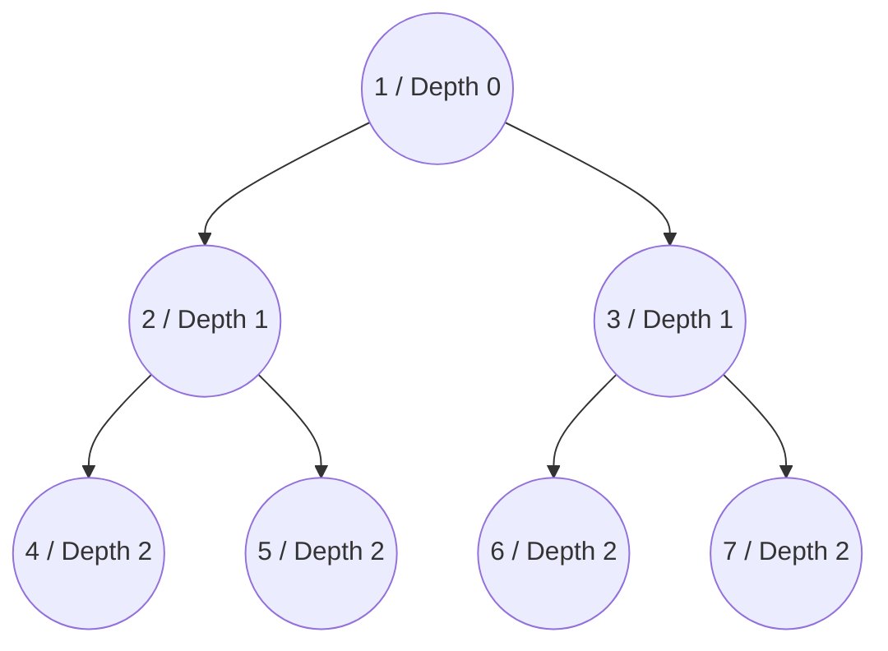
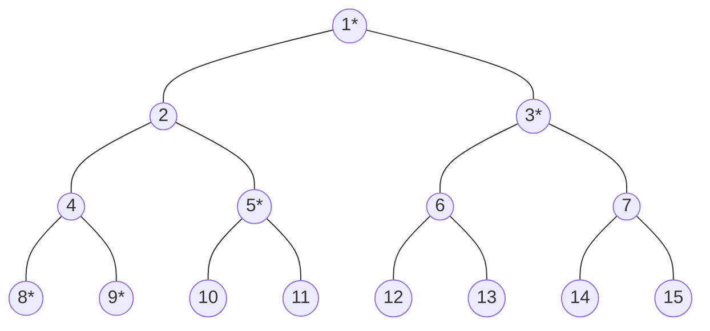
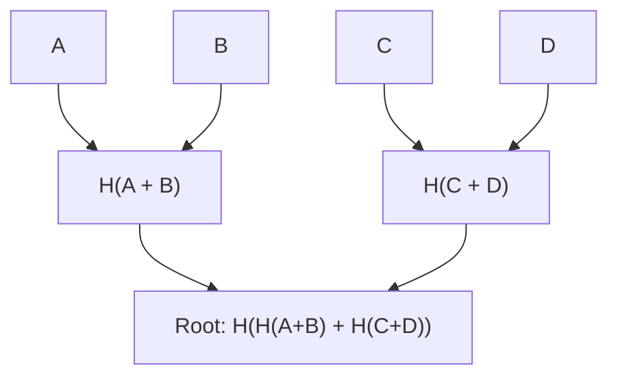

# Merkle化与哈希树根

在以太坊共识机制中，所有参与节点必须始终如一且高效地达成对系统状态的一致性。通过 [Simple Serialize (SSZ)](/wiki/CL/SSZ.md) 框架，Merkle化过程将序列化数据转化为 Merkle 树结构。Merkle化方案的目标是确保在受限环境（如轻客户端、执行环境等）中，能够访问轻量级的证明，用以做出重要决策。本文讨论了 Merkle化的细节及其在确保节点之间共享状态的可扩展性与安全性方面的重要性。

## 术语与方法

- **Merkle化：** 指构建 Merkle 树并推导出其根。
- **哈希树根：** Merkle化的特定应用，用于计算复杂 SSZ 容器的根哈希。

## Merkle化的必要性

加密哈希函数提供了解决方案，通过生成数据集的紧凑且唯一的表示（如 Beacon 状态）。通过对 Beacon 链的序列化状态进行哈希，节点可以快速且高效地通过交换这些小哈希输出进行状态比较。

## Merkle化过程

Merkle化过程将序列化数据分解为 32 字节的块，这些块作为 Merkle 树的叶子。然后，这些块成对组合并进行哈希计算，直到树的顶层，最终得到一个哈希——即 Merkle 根哈希。此根哈希作为整个数据集的唯一指纹。关键步骤如下：

- **分块：** 将序列化数据分为 32 字节的块。
- **树构建：** 将块成对组合并哈希每对数据，形成树的下一层。重复此步骤，直到只剩一个哈希：Merkle 根。
- **填充：** 如果块的数量不是 2 的幂，则会添加额外的零值块，以平衡树的结构，确保树是平衡的。

## Merkle化的优势

- **性能效率：** 虽然树的哈希需要大约两倍于原始数据的计算量，但缓存机制可以存储那些不常变化的子树根。这显著减少了计算开销，因为只有修改过的数据部分需要重新哈希。
- **轻客户端支持：** Merkle 树结构支持创建 Merkle 证明——这些小数据块能够证明特定状态部分的包含性和完整性，而无需整个数据集。这对于资源有限的轻客户端至关重要，它们依赖这些证明与以太坊安全地交互。

如果你想了解更多关于 Merkle 树结构的信息，可以参考 [这里](https://eth2book.info/capella/part2/building_blocks/merkleization/) 和 [这里](https://github.com/protolambda/eth2-docs?tab=readme-ov-file#ssz-hash-tree-root-and-merkleization)。

## 一般化索引

为了便于直接引用和验证树中的元素，每个节点（包括叶节点和内部节点）都会被分配一个一般化索引。该索引根据节点在树中的位置进行推导：



_图：Merkle 树的一般化索引和深度层级_

- **根节点索引：** 1（深度 = 0）
- **后续层级：** $2^{depth} + index$，其中 `index` 是节点在该层级的零索引位置。

## 使用一般化索引的多重证明

使用一般化索引的多重证明提供了一种高效的方式来验证 Merkle 树中特定元素，而无需知道整个树的结构。在以太坊和加密应用中，这一概念至关重要，因为数据的完整性和验证速度至关重要。我们通过一个例子来说明多重证明的工作原理：

**理解结构**
- Merkle 树是分层结构，每个节点要么是叶节点（包含实际数据），要么是内部节点（包含子节点的哈希值）。
- 一般化索引数值表示每个节点在树中的位置，计算方式为 $2^{depth} + index$，从根节点（索引为 1）开始。

**示例中的树布局**
- 树结构如下，`*` 表示生成索引 9 元素证明所需的节点：



_图：Merkle 树布局_

**确定所需的节点**
- **识别所需的哈希值：** 为了验证索引 9 的数据，需要获取索引 8、9、5、3 和 1 的哈希值。
- **成对哈希：** 将索引 8 和 9 的哈希值结合，计算其父节点的哈希，即 `hash(4)`。
- **进一步的哈希组合：**
  - 将 `hash(4)` 与索引 5 的哈希值结合，计算父节点的哈希 `hash(2)`。
  - 将此结果与索引 3 的哈希值结合，继续向上计算。
- **最终验证：** 将前一步的合并结果与来自相对分支（索引 3）的根进行哈希，得到最终的树根（`hash 1`）。
- **完整性检查：** 如果计算出的根与已知的正确根（`hash 1`）相匹配，则验证索引 9 的数据是准确的。如果数据不正确，则计算出的根会有所不同，表明存在错误或篡改。

在共识规范中，有帮助的函数用于计算多重证明和一般化索引。你可以 [在这里](https://github.com/ethereum/consensus-specs/blob/dev/ssz/merkle-proofs.md#merkle-multiproofs) 查找相关内容。


## 计算哈希树根

SSZ 对象的哈希树根是递归计算的。对于基本类型和基本类型的集合，数据会被打包成块并直接进行 Merkle 化。对于复合类型（如容器），该过程涉及哈希每个组件的树根。在以下部分，我们将通过实际示例来理解这一过程。

### 打包与分块

打包与分块使得通过 SSZ 实现 Merkle 化成为可能，通过格式化序列化数据并将其分割成多个小块，接着进行哈希生成 Merkle 树。以下是该过程的具体操作：

**序列化数据**
- **序列化**是将数据结构（基本类型、列表、向量或位图/位向量）转换为线性字节数组，遵循 SSZ 序列化规则。
- 每个元素会根据其类型进行序列化。

**序列化数据的填充**
- 序列化后，字节数组可能与 Merkle 树中使用的 32 字节块大小不完全对齐。
- **填充**是将序列化数据扩展至完整的 32 字节块。填充使用零字节（0x00）。

**分块**
- 填充后的序列化数据被分割成多个 32 字节的片段或“块”。
- 这些块是 Merkle 化过程中使用的基本单元。

**填充为完整二叉树**
- 从上一步得到的块数可能不是 2 的幂，而这是形成平衡二叉树（完整二叉树）的必要条件。
- 必要时，会添加零填充块（完全由零字节填充的块）以使块数达到最接近的 2 的幂。
- 这确保了生成的 Merkle 树是完整且平衡的，从而促进高效的加密操作。

**应用 Merkle 化过程**
- 准备好块后，它们被安排为二叉 Merkle 树的叶子节点。
- Merkle 化通过成对哈希块，逐层向上，直到只剩下一个哈希值。最终的哈希值即为 Merkle 根。

**实际示例：**
假设我们有一个整数列表需要进行打包与分块：
- **整数**：[10, 20, 30, 40]（假设每个整数占 8 字节）。
- **序列化数据**：由这些整数生成的连续字节数组。
- **填充**：如果序列化后的总长度不是 32 的倍数，则添加填充字节。
- **分块**：数据被分割成 32 字节的块。
- **树的零填充**：如果块数不是 2 的幂，则添加填充零的块。
- **Merkle 化**：这些块作为叶子节点，用于计算 Merkle 根。

### 混合长度

在 Merkle 化过程中，混合长度是一个关键步骤，特别是在处理列表和向量时。此步骤确保最终的哈希树根准确反映数据的内容和结构，包括其长度。让我们分解这个概念及其重要性。

**混合长度的目的**

混合长度用于确保具有相似内容但不同长度的两个列表或向量生成不同的哈希树根。没有将长度纳入哈希计算，如果仅对内容进行哈希，两个列表（一个比另一个长，但直到短列表长度为止完全相同）会有相同的哈希树根，这可能导致潜在的安全漏洞和数据验证过程中的不一致。

**混合长度的示例**

下面的示例说明了如果不包含列表的长度，`a_root_hash` 和 `b_root_hash` 的 Merkle 根哈希将保持相同，尽管它们表示的是两个长度不同的列表。然而，当包含长度时，Merke 根哈希 `a_mix_len_root_hash` 与 `a_root_hash` 和 `b_root_hash` 都不同。这种区分在处理长度不同的列表或向量时至关重要。

```python
>>> from eth2spec.utils.ssz.ssz_typing import uint256, List
>>> from eth2spec.utils.merkle_minimal import merkleize_chunks
>>> a = List[uint256, 4](33652, 59750, 92360)
>>> a_len = a.length()
>>> a = List[uint256, 4](33652, 59750, 92360).encode_bytes()
>>> b = List[uint256, 4](33652, 59750, 92360, 0).encode_bytes()
>>> a_root_hash = merkleize_chunks([a[0:32], a[32:64], a[64:96]])
>>> b_root_hash = merkleize_chunks([b[0:32], b[32:64], b[64:96], b[96:128]])
>>> a_mix_len_root_hash = merkleize_chunks([merkleize_chunks([a[0:32], a[32:64], a[64:96]]), a_len.to_bytes(32, 'little')])
>>> print('a_root_hash = ', a_root_hash)
a_root_hash =  0x3effe553b6091b1982a6850fd2a788943363e6f879ff796057503b76802edd9d
>>> print('b_root_hash = ', b_root_hash)
b_root_hash =  0x3effe553b6091b1982a6850fd2a788943363e6f879ff796057503b76802edd9d
>>> print('a_mix_len_root_hash = ', a_mix_len_root_hash)
a_mix_len_root_hash =  0xeca15347139a6ad6e7eabfbcfd3eb3bf463af2a8194c94aef742eadfcc3f1912
>>> 
```

## SSZ Merkle 化中的摘要与扩展

在以太坊 PoS 中，摘要和扩展的概念对于高效管理状态数据至关重要。摘要提供了数据结构的紧凑表示，封装了核心的验证信息，而不需要完整的细节。扩展则提供了完整的数据集，用于深入处理或当需要详细信息时。以下是它们的优势：

- **效率与速度**：通过使用摘要，验证者可以快速验证状态变化或验证交易，而无需处理完整的数据集。此方法显著加快了验证过程，并减少了计算开销。
- **减少数据负载**：摘要减少了存储和传输的数据量，从而节省带宽和存储资源。这对存储能力有限的节点（如轻客户端）尤为重要，轻客户端依赖摘要来提高操作效率。
- **安全性增强**：摘要中包含的加密哈希确保了数据的完整性，使得在不访问完整数据集的情况下能够安全且可靠地进行验证。
- **示例**：
  - **BeaconBlock 和 BeaconBlockHeader**：`BeaconBlockHeader` 容器作为摘要，允许节点快速验证区块的完整性，而无需获取来自 `BeaconBlock` 容器的完整区块数据。`BeaconBlock` 是扩展。
  - **提议者惩罚**：验证者使用区块摘要高效识别并处理冲突的区块提议，从而快速准确地做出惩罚决定。


## 基本类型的 Merkle 化

让我们通过一个示例来理解基本类型的 Merkle 化过程。下面是一个简单的 Merkle 树，我们将按照 Merkle 化的过程来计算 Merkle 根哈希。



_图：示例 Merkle 树_

在上面的 Merkle 树中，树的叶子节点是四个数据块：A、B、C 和 D。

- **定义数据：**
  - 在这个示例中，我们处理四个基本数据项：A、B、C 和 D。它们被设定为数字（分别为 `10`、`20`、`30` 和 `40`），并将在 Merkle 树中作为 32 字节的块表示。
- **将数据转换为 32 字节块：**
  - 每个数据项都使用 SSZ 类型系统中的 `uint256` 类型进行序列化。序列化的过程是将数据转换为一致且填充的格式，确保每个数据项为 32 字节长。
- **配对并哈希叶子节点：**
  - 接下来，将这些序列化的数据块配对并进行哈希计算。
- **将结果哈希化形成根：**
  - 最后，前一步得到的哈希值 (`ab` 和 `cd`) 被连接并进行哈希，形成 Merkle 根。
- **输出 Merkle 根：**
  - 然后，Merke 根会被转换为十六进制字符串，以便可读。

这个最终的 Merkle 根是数据 `A`、`B`、`C` 和 `D` 的唯一表示。任何对输入数据的更改都会导致不同的 Merkle 根，展示了哈希函数对输入数据的敏感性。这个特性对于确保以太坊中的数据完整性至关重要。

```python
>>> from eth2spec.utils.ssz.ssz_typing import uint256
>>> from eth2spec.utils.hash_function import hash
>>> a = uint256(10).to_bytes(length = 32, byteorder='little')
>>> b = uint256(20).to_bytes(length = 32, byteorder='little')
>>> c = uint256(30).to_bytes(length = 32, byteorder='little')
>>> d = uint256(40).to_bytes(length = 32, byteorder='little')
>>> ab = hash(a + b)
>>> cd = hash(c + d)
>>> abcd = hash(ab + cd)
>>> abcd.hex()
'1e3bd033dcaa8b7e8fa116cdd0469615b29b09642ed1cb5b4a8ea949fc7eee03'
```

## 复合类型的 Merkle 化

本节我们将学习如何对 `IndexedAttestation` 复合类型进行 Merkle 化，并通过详细的示例展示这一过程。此示例清晰展示了 Merkle 化过程如何应用于复合类型、列表和向量类型，同时还展示了摘要和扩展如何通过这一过程得以有效演示。

**定义与结构**

`IndexedAttestation` 是一个复合类型，定义如下：

```python
class IndexedAttestation(Container):
    attesting_indices: List[ValidatorIndex, MAX_VALIDATORS_PER_COMMITTEE]
    data: AttestationData
    signature: BLSSignature
```

`IndexedAttestation` 由以下三个主要组件组成：

  - **attesting_indices：** 一个 `ValidatorIndex` 类型的列表，表示参与认证的验证者。
  - **data：** 一个 `AttestationData` 容器，包含与认证相关的各种数据。
  - **signature：** 一个 `BLSSignature`，是对认证的签名。

**Merkle 化过程**

`IndexedAttestation` 的 Merkle 化过程包括计算每个组件的哈希树根，并将这些根合并形成整体容器的哈希树根。

**Merkle 化 `attesting_indices`：**

- **序列化与填充：** 首先，对索引列表进行序列化。考虑到该列表的可能长度（最多可达 `MAX_VALIDATORS_PER_COMMITTEE`），通常需要填充以对齐至 32 字节块大小，以便进行哈希计算。
- **哈希计算：** 序列化后的数据通过 `merkleize_chunks` 函数进行哈希，这个函数负责处理填充并构建多层 Merkle 树。
- **混合长度：** 由于 SSZ 中的列表长度可能不同，但具有相同的类型结构，因此列表的长度也会被哈希（混合进哈希中），确保不同长度列表具有唯一的哈希表示。

```python
attesting_indices_root = merkleize_chunks(
           [
               merkleize_chunks([a.attesting_indices.encode_bytes() + bytearray(8)], 512),
               a.attesting_indices.length().to_bytes(32, 'little')
           ])
```

**Merkle 化数据（`AttestationData`）：**
- **处理嵌套结构：** `AttestationData` 本身包含多个字段（如 `slot`、`index`、`beacon_block_root`、`source` 和 `target`），每个字段都将单独进行序列化和 Merkle 化。
- **合并哈希值：** 这些字段的哈希值将被合并，形成 `AttestationData` 的根哈希。

```python
data_root = merkleize_chunks(
    [
        a.data.slot.to_bytes(32, 'little'),
        a.data.index.to_bytes(32, 'little'),
        a.data.beacon_block_root,
        merkleize_chunks([a.data.source.epoch.to_bytes(32, 'little'), a.data.source.root]),
        merkleize_chunks([a.data.target.epoch.to_bytes(32, 'little'), a.data.target.root]),
    ])
```

**Merkle 化签名：**

- **简单哈希：** `BLSSignature` 是一个固定长度的字段，直接将其哈希为三个 32 字节块，然后通过 Merkle 化得到签名的根。

```python
signature_root = merkleize_chunks([a.signature[0:32], a.signature[32:64], a.signature[64:96]])
```

**组合组件根：**

- 从每个组件计算得到的根会被组合在一起，计算整个 `IndexedAttestation` 容器的哈希树根。

```python
indexed_attestation_root = merkleize_chunks([attesting_indices_root, data_root, signature_root])
```

**验证最终根：**

- 正确实现 `IndexedAttestation` 的 Merkle 化确保了数据结构中的任何变化都会反映在最终的根哈希中，从而提供了一个强有力的机制来检测差异并确保网络中所有节点的数据一致性。

```python
assert a.hash_tree_root() == indexed_attestation_root
```

现在，您可以可视化 `IndexedAttestation` 的完整 Merkle 化过程：


**IndexedAttestation 的 Merkle 化**

### 完整代码示例：

```python
from eth2spec.capella import mainnet
from eth2spec.capella.mainnet import *
from eth2spec.utils.ssz.ssz_typing import *
from eth2spec.utils.merkle_minimal import merkleize_chunks

# 初始化 IndexedAttestation 类型
a = IndexedAttestation(
    attesting_indices = [33652, 59750, 92360],
    data = AttestationData(
        slot = 3080829,
        index = 9,
        beacon_block_root = '0x4f4250c05956f5c2b87129cf7372f14dd576fc152543bf7042e963196b843fe6',
        source = Checkpoint (
            epoch = 96274,
            root = '0xd24639f2e661bc1adcbe7157280776cf76670fff0fee0691f146ab827f4f1ade'
        ),
        target = Checkpoint(
            epoch = 96275,
            root = '0x9bcd31881817ddeab686f878c8619d664e8bfa4f8948707cba5bc25c8d74915d'
        )
    ),
    signature = '0xaaf504503ff15ae86723c906b4b6bac91ad728e4431aea3be2e8e3acc888d8af'
                + '5dffbbcf53b234ea8e3fde67fbb09120027335ec63cf23f0213cc439e8d1b856'
                + 'c2ddfc1a78ed3326fb9b4fe333af4ad3702159dbf9caeb1a4633b752991ac437'
)

# 容器的根是其字段根的 Merkle 化
# 这是 IndexedAttestation。
assert(a.hash_tree_root() == merkleize_chunks(
    [
        a.attesting_indices.hash_tree_root(),
        a.data.hash_tree_root(),
        a.signature.hash_tree_root()
    ]))

# 列表被序列化后（虚拟地）填充到其完整块数，再进行 Merkle 化。
# 最后，通过进一步的哈希/merkle 化将实际长度混合进来。
assert(a.attesting_indices.hash_tree_root() ==
       merkleize_chunks(
           [
               merkleize_chunks([a.attesting_indices.encode_bytes() + bytearray(8)], 512),
               a.attesting_indices.length().to_bytes(32, 'little')
           ]))

# 容器的根是其字段根的 Merkle 化
# 这是 AttestationData。
assert(a.data.hash_tree_root() == merkleize_chunks(
    [
        a.data.slot.hash_tree_root(),
        a.data.index.hash_tree_root(),
        a.data.beacon_block_root.hash_tree_root(),
        a.data.source.hash_tree_root(),
        a.data.target.hash_tree_root()
    ]))

# 扩展上述 AttestationData 根，通过 "手动" 计算其字段的根。
assert(a.data.hash_tree_root() == merkleize_chunks(
    [
        a.data.slot.to_bytes(32, 'little'),
        a.data.index.to_bytes(32, 'little'),
        a.data.beacon_block_root,
        merkleize_chunks([a.data.source.epoch.to_bytes(32, 'little'), a.data.source.root]),
        merkleize_chunks([a.data.target.epoch.to_bytes(32, 'little'), a.data.target.root]),
    ]))

# Signature 类型有一个简单的 Merkle 化。
assert(a.signature.hash_tree_root() ==
       merkleize_chunks([a.signature[0:32], a.signature[32:64], a.signature[64:96]]))

# 将所有内容组合在一起，我们得到了 "手动" Merkle 化的 IndexedAttestation。
assert(a.hash_tree_root() == merkleize_chunks(
    [
        # a.attesting_indices.hash_tree_root()
        merkleize_chunks(
            [
                merkleize_chunks([a.attesting_indices.encode_bytes() + bytearray(8)], 512),
                a.attesting_indices.length().to_bytes(32, 'little')
            ]),
        # a.data.hash_tree_root()
        merkleize_chunks(
            [
                a.data.slot.to_bytes(32, 'little'),
                a.data.index.to_bytes(32, 'little'),
                a.data.beacon_block_root,
                merkleize_chunks([a.data.source.epoch.to_bytes(32, 'little'), a.data.source.root]),
                merkleize_chunks([a.data.target.epoch.to_bytes(32, 'little'), a.data.target.root]),
            ]),
        # a.signature.hash_tree_root()
        merkleize_chunks([a.signature[0:32], a.signature[32:64], a.signature[64:96]])
    ]))

print("Success!")
```

### 参考资源
- [哈希树根与 Merkle 化](https://eth2book.info/capella/part2/building_blocks/merkleization/)
- [SSZ](https://ethereum.org/en/developers/docs/data-structures-and-encoding/ssz/)
- [Protolambda 关于 Merkle 化的介绍](https://github.com/protolambda/eth2-docs?tab=readme-ov-file#ssz-hash-tree-root-and-merkleization)
- [执行规范](https://eth2book.info/capella/appendices/running/)
