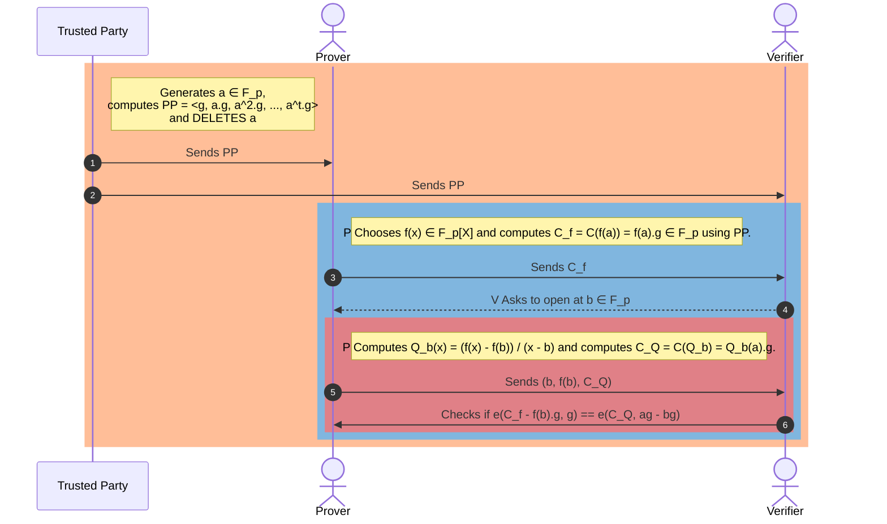

# KZG 多项式承诺方案

## [摘要](#摘要)
KZG（Kate、Zaverucha 和 Goldwasser）承诺方案类似于一个密码学保险库，它可以安全地锁定多项式（数学方程），以便稍后在不泄露其内容的情况下证明它们的存在。这就像是做出一个封闭的承诺，而验证者可以检查承诺的真实性，而无需实际查看其中的内容。KZG 使用基于椭圆曲线的高级数学技术，使得承诺验证既高效又可验证，这对于区块链交易的隐私性和可扩展性至关重要。该方案特别适用于以太坊的升级，它有助于快速、安全地验证交易，同时不会影响隐私。

KZG 是一个强大的密码学工具，在以太坊生态系统及其他密码学应用中具有广泛的用途。其独特特性被用于各种证明方案，以提升不同应用的可扩展性和隐私性。

## [动机](#动机)

### [ZKSNARKs](#zksnarks)
学习多项式承诺方案（PCS）至关重要，因为它们在构造零知识简洁非交互性知识证明（ZKSNARKs）中起到了核心作用。ZKSNARKs 是一种特殊的密码学方法，它允许某人（证明者）向另一人（验证者）证明自己知道某个特定信息（例如一个数值），而无需直接暴露该信息。这一过程依赖于 PCS 和交互式预言机证明（IOP）的结合。

*现代 ZKSNARK = 函数承诺方案 + 兼容的交互式预言机证明（IOP）*

### [以太坊生态系统中的应用](#以太坊生态系统中的应用)
KZG 承诺方案已成为以太坊生态系统中的关键技术，特别是在 Proto-Danksharding 及其预期发展为 Danksharding 的背景下。这一承诺方案是以太坊中许多零知识（ZK）相关应用的基础，能够在不泄露底层信息的情况下实现高效、安全的数据验证。

在以太坊生态系统中，利用 KZG（Kate、Zaverucha 和 Goldwasser）方案的应用包括：

- **Proto-Danksharding（EIP-4844）**：该提案旨在通过 KZG 多项式承诺方案降低 Rollup 在以太坊 Layer 1 上发布数据的成本。它引入了一种“携带数据块的交易”类型，以容纳大量数据块，并且仅提供数据块的承诺，而非完整数据，从而提升执行层的效率。

- **数据可用性采样（DAS）**：PCS 使以太坊路线图中的数据可用性采样（DAS）成为可能，使得验证者可以确认数据块的正确性和可用性，而无需下载完整数据。此功能利用了 PCS 的独特特性，能够在以太坊 Danksharding 等区块链应用中实现高效验证。

- **PSE 的 Summa 资产证明协议**：以太坊基金会的 PSE 研究小组开发的 Summa 方案，在其资产证明协议中使用了 KZG 承诺。这使得中心化交易所和托管机构能够证明其总资产超过负债，同时保持用户余额信息的隐私性。

- **Scroll zkRollups**：Scroll 是以太坊上的原生 zkEVM Layer 2，它利用 KZG 生成对多项式集合的承诺，这些多项式封装了计算过程。验证者可以在随机点请求评估，以验证这些多项式所表示计算的准确性。

- **Jellyfish**：Jellyfish 采用 KZG 承诺方案，在承诺阶段生成多项式的承诺。它利用 KZG 的同态特性，使得可以在不泄露系数的情况下对多项式进行高效评估。

- **Hyperplonk**：Hyperplonk 采用多线性 KZG 承诺方案，表明其适用于需要多线性多项式承诺的场景。

## [目标](#目标)
在了解了 PCS 的重要性后，我们现在要定义学习 KZG 方案的目标，即要解决的具体问题。

假设我们有一个多项式函数 $f(x)$，其形式为：
$$
f(x) = f_0 + f_1x + f_2x^2 + \ldots + f_dx^t
$$
该多项式的次数为 $t$。

我们在 KZG 方案中的主要目标是证明我们知道该多项式，而不泄露多项式的具体内容，即多项式的系数。

在实际应用中，我们通常的做法是证明我们知道该多项式在某个特定点 $x=a$ 处的取值。

用数学表达，我们要证明：
$$
f(a)
$$
其中 $x=a$。

## [先备知识](#先备知识)
在深入理解 KZG 方案之前，我们需要掌握一些基础概念。幸运的是，我们只需具备高中数学水平即可从工程角度理解 KZG 方案。我们将尝试直观地理解高级概念及其关键特性，而无需深入研究它们的数学细节。这有助于我们理解 KZG 协议的流程，而不会被复杂的数学理论所困扰。

我们需要了解以下内容：

### [模运算](#模运算)
模运算的一个简单例子是时钟：当小时数达到上限后，会循环回到 0。例如，在 12 小时制时钟上，下午 3 点加上 12 小时仍然是 3 点。

对于 KZG 而言，我们只需掌握基本的加、减、乘、除运算，并理解“取模”操作。例如，计算 $17 \mod 5$ 的结果是 $2$，因为 17 除以 5 的余数是 2。这种“循环”特性对于 KZG 方案至关重要。

### [素数阶有限域](#素数阶有限域)
素数阶有限域 $\mathbb{F}_p$ 是一个特殊的数集 { $\{0, 1, 2, ..., p-1\}$ }，其中的数值可以进行加、减、乘、除（除零外），并且符合封闭性等运算规则。

有限域的“阶”指的是其元素数量。当阶为素数 $p$ 时，该有限域包含 $p$ 个元素，通常通过模 $p$ 计算得到。例如：

若 $p=5$，则有限域 $\mathbb{F}_5$ 的元素集为 {0, 1, 2, 3, 4}。在这个集合内，所有运算都采用模 5 计算。例如：
- $3 + 4 \equiv 2 \mod 5$ （因为 $3+4=7$，而 7 除以 5 余 2）
- $2 \times 3 \equiv 1 \mod 5$ （因为 $2\times3=6$，而 6 除以 5 余 1）

有限域的一个重要特性是“环绕”计算，即当数值达到 $p-1$ 时，计算会回到 0。

通常，我们用 $(\mathbb{F}_p, +)$ 表示加法有限域，用 $(\mathbb{F}^*_p, \cdot)$ 表示乘法有限域，其中 `*` 表示去除 0 元素，以确保所有元素都有可逆元（即存在乘法逆元）。如果包含 0，我们将无法找到 0 的逆元，因此需要将其排除。

在下一部分，我们将学习群的概念，以及如何利用群的生成元，使 KZG 方案成为一种高效、安全、可验证的多项式承诺方案。该方案在区块链等应用中极为重要。

### [群](#群)
群的概念类似于有限域，但有一些区别。最主要的区别是：
- **有限域** 具有加法和乘法运算。
- **群** 只定义一种运算（通常是加法或乘法）。

群的元素必须满足：
1. **封闭性**：群内的两个元素运算后，结果仍然在群内。
2. **结合律**：$(a \circ b) \circ c = a \circ (b \circ c)$。
3. **单位元**：存在一个特殊元素 $e$，对任意元素 $a$，满足 $a \circ e = e \circ a = a$。
4. **逆元**：每个元素 $a$ 存在一个逆元 $b$，满足 $a \circ b = b \circ a = e$。

群的表示法：
- 采用加法运算的群记作 $(\mathbb{G}, +)$。
- 采用乘法运算的群记作 $(\mathbb{G}^*, \cdot)$，其中 `*` 表示去除 0 以避免除法无解。

接下来，我们将通过示例定义群，以帮助我们直观理解群的概念。

### [群的生成元](#群的生成元)
生成元是群中的一个特殊元素，它可以通过自身的运算生成群内的所有元素。

数学上，若群 $(\mathbb{G}, \cdot)$ 中的元素 $g$ 满足：
$$
\{g, g^2, g^3, ...\} = \mathbb{G}
$$
则称 $g$ 为群的生成元。

我们通过具体示例来理解这一概念。

#### **加法群的生成元**
设 $(\mathbb{G}_7, +)$ 是一个加法群，元素集为 {0,1,2,3,4,5,6}，运算采用模 7 计算。

该群满足：
- **封闭性**：任意两个元素相加后取模 7，仍然在集合内。
- **结合律**：$(a+b)+c \equiv a+(b+c) \mod 7$。
- **单位元**：0 是单位元，满足 $a+0 = a$。
- **逆元**：每个元素 $a$ 都存在一个逆元 $b$，使得 $a + b \equiv 0 \mod 7$。

在该群中，若选取 $g=1$ 作为生成元，我们可以得到：
$$
\{0, g, 2g, 3g, 4g, 5g, 6g\} = \{0, 1, 2, 3, 4, 5, 6\}
$$
表明 $g=1$ 是该群的生成元。

在下一部分，我们将进一步探讨如何利用群的生成元来构造 KZG 承诺方案，使其成为区块链和密码学协议中的重要工具。

- 从 $2$ 开始，我们每次乘以 $2$ 并取模 $7$：
  - $2^1 = 2$
  - $2^2 = 4$
  - $2^3 = 8 \equiv 1 \mod 7$
  - $2^4 = 16 \equiv 2 \mod 7$ （到这里我们回到了开始的地方，表明 $2$ 不是生成元）

- 我们尝试 $3$：
  - $3^1 = 3$
  - $3^2 = 9 \equiv 2 \mod 7$
  - $3^3 = 27 \equiv 6 \mod 7$
  - $3^4 = 81 \equiv 4 \mod 7$
  - $3^5 = 243 \equiv 5 \mod 7$
  - $3^6 = 729 \equiv 1 \mod 7$ （因为我们经过所有元素后回到单位元，$3$ 是生成元）

你可以验证 $5$ 也是我们模 $7$ 的乘法群 ($\mathbb{G}^*_7, .)$ 的生成元。

### [为何选择质数作为有限域中的模数](#why-primes-for-modulo-operations-in-fields)
选择质数作为模数来进行有限域操作有几个优点，简化了域算术的各个方面：

1. **明确的除法运算：** 在有限域中，任何非零元素都必须有乘法逆元。如果模数是质数，那么集合 {${1, 2, 3, \ldots, p-1}$} 中的每个数都有一个模$p$的乘法逆元。这个特性使得域中的除法操作是明确的。如果模数不是质数（除非在特殊情况如Galois域中模数为$p^n$，其中$p$是质数），则除法运算不一定有效。

2. **构造简易性：** 当模数是质数时，域的构造很简单。域的元素仅仅是整数集合 {${1, 2, 3, \ldots, p-1}$}，并且所有的域运算（加法、减法、乘法和除法）都在模$p$下进行。对于非质数模数，构造域时需要更复杂的结构，如多项式环。

3. **确保域的性质：** 使用质数模数保证了域的所需性质，包括加法和乘法单位元的存在，且每个元素都有加法和乘法逆元，同时满足加法和乘法的交换律、结合律以及分配律。质数模数确保这些属性得到满足。

4. **非零元素的均匀分布：** 在模质数的有限域中，非零元素在乘法上均匀分布。这意味着，域的乘法表在每行每列中（除去零元素所在的行列）都不会有“空隙”，每个元素都会出现一次。

5. **简化算法：** 许多数论和密码学中的算法，在质数域中更为简单和高效。例如，求乘法逆元可以通过扩展欧几里得算法高效地完成，并且不需要像非质数域那样进行复杂的多项式运算。

6. **密码学安全性：** 在密码学中，某些问题的难度，如离散对数问题，在质数域中有很好的理解。这种难度对于密码学系统的安全至关重要。对于复合模数（尤其是当其因子未知时），结构可能引入漏洞，或者使问题的难度难以预测。

7. **计算优化：** 一些质数（如31或形式为$2^n - 1$的质数）可以通过CPU优化乘法操作。这种优化能显著提高计算速度，对于需要高性能的应用非常有利。

使用质数作为模数来构造有限域不仅简化了域运算，而且确保了域的所有性质，对于理论研究和实际应用，特别是密码学，都是至关重要的。

### [密码学假设](#cryptographic-assumptions)
为了能够使用KZG承诺方案，我们需要两个额外的假设。我们不会深入探讨这些假设的具体原因，但会简要给出这些密码学假设为何能够确保KZG的安全。

**离散对数假设**

假设我们有一个生成元$g$，在群$\mathbb{G}^\*_p$中，$a$是有限域$\mathbb{F}^*_p$中的任意元素，$g^a$是群$\mathbb{G}^\*_p$中的某个元素。离散对数假设认为，给定$g$和$g^a$的情况下，找出$a$是几乎不可能的。这意味着我们不能轻易找到能够得到这些元素的指数$a$。

**离散对数问题的直观理解**

想象你有一个特殊的锁，它用数字来工作（我们叫它“生成元”，记作$g$）。这个锁属于一个神奇的锁和钥匙的集合，它们都生活在一个叫做$\mathbb{G}^\*_p$的神奇世界里。现在，你选择一个秘密数字$a$，并用它来转动你的锁$g$若干次。结果，锁就会到达一个新位置，我们称之为$g^a$。

如果有人路过并看到你的锁处在$g^a$这个位置，即使他们知道锁从$g$开始并且知道它属于哪个神奇世界，想要猜出你转动了多少次（找到秘密数字$a$）是非常困难的。

简单来说，离散对数问题告诉我们，虽然知道秘密数字可以轻松转动锁，但反过来，如果只是看到了锁的结果并试图猜测秘密数字，就像在干草堆里找针一样困难。这一概念在密码学中非常重要，确保某些秘密是非常难以揭示的。

**强Diffie-Hellman假设**

假设我们有一个生成元$g$，在群$\mathbb{G}^\*_p$中，$a$和$b$是有限域$\mathbb{F}^*_p$中的任意元素，$g^a$和$g^b$是群$\mathbb{G}^\*_p$中的一些元素。强Diffie-Hellman假设认为，$g^a$和$g^b$无法从$g^{ab}$中区分开。这意味着，即使知道$g^a$和$g^b$，也无法从中提取出关于$g^{ab}$的更多信息。

**强Diffie-Hellman的直观理解**

想象你在一个因其魔法饼干而闻名的世界里，这些饼干有一个特别的秘密配料（我们的“生成元”，记作$g$），使它们变得与众不同。两位大师级面包师，爱丽丝和鲍勃，各自有一个独特的使用这个配料的秘诀，分别表示为她们的秘密食谱$a$和$b$。

当爱丽丝用她的秘密食谱做饼干时，她会做出一批特别的饼干$g^a$。鲍勃也用自己的食谱做出另一批独特的饼干$g^b$。

现在，假设爱丽丝和鲍勃决定合作，将他们的秘密食谱混合，创造出一批超级特别的饼干$g^{ab}$。强Diffie-Hellman假设认为，即使有人尝试过爱丽丝和鲍勃各自的饼干，他们也无法从中猜测出最终混合后的饼干的味道。

所以，实质上，强Diffie-Hellman假设告诉我们，仅仅知道个别秘密（食谱）的结果，并不能帮助任何人破解这些秘密的结合结果。这是安全通信的基石，确保即使有人知道了各自的部分，最终的结合秘密仍然是安全且无法猜测的。

### [配对函数](#pairing-function)
假设我们有一个生成元$g$，在群$\mathbb{G}^\*_p$中，$a$和$b$是有限域$\mathbb{F}^*_p$中的任意元素，$g^a$和$g^b$是群$\mathbb{G}^\*_p$中的一些元素。

配对函数是一种数学函数，它接受两个输入并通过映射不同的输入对来生成一个唯一的输出。它有两个重要的属性，双线性和非退化性。

- 双线性意味着我们可以以可逆的方式进行操作。
- 非退化性意味着，如果我们对同一个元素应用配对函数，它不会得到群的单位元。

让我们更严谨地定义这些属性。

配对函数$e: \mathbb{G}_1 \times \mathbb{G}_2 \rightarrow \mathbb{G}_T$满足，

双线性属性：$e(g^a, g^b) = e(g, g^{ab}) = e(g^{ab}, g) = e(g,g)^{ab}$

非退化性：$e(g,g) \neq 1$，意味着输出不是单位元素。

当$\mathbb{G}_1$和$\mathbb{G}_2$是同一个群时，我们称之为对称配对函数。否则，它是一个非对称配对函数。

这里有一些很好的资源，可以从实际角度了解配对函数[^3][^8][^9]。
**直观理解配对函数**

想象有两个分开的岛屿，每个岛屿上住着一种独特的魔法生物。第一个岛屿是独角兽的家园，每只独角兽都有独特的颜色；第二个岛屿上住着龙，每只龙都有独特的火焰颜色。配对函数就像一座神奇的桥，连接了独角兽和龙，创造出一种独特的新魔法生物——“龙角兽”，它结合了两者的特点。

以下是如何理解这个配对函数，而不被技术细节困扰：

- **两个群体：** 把独角兽和龙看作是属于两个不同的群体（在数学术语中，这通常称为群$\mathbb G_1$和$\mathbb G_2$）。
- **配对函数：** 这座神奇的桥就是配对函数。当独角兽和龙在这座桥上相遇时，配对函数将它们结合成一个龙角兽。这个龙角兽有一个特殊的光芒，独特地对应于那个特定的独角兽和龙的组合（可逆的）。
- **独特的结果：** 就像每对独角兽和龙组合都会产生一个独特光芒的龙角兽，在数学中，配对函数从每个群体中取出一个元素，并在第三个群体中生成一个唯一的输出（通常表示为$\mathbb G_T$）。

**为什么这很神奇？** 因为尽管有无数种独角兽和龙的组合，每一种组合（配对）都会产生一个独特的龙角兽。这在密码学中非常强大，因为它允许执行复杂的操作，这些操作支撑着许多安全协议，确保每个组合都是独特的，并且可以追溯到其原始配对。

**用更简单的话说，** 想象你有两组钥匙（独角兽和龙），当你将每组中的一把钥匙组合在一起时，你得到了一把独特的锁（龙角兽）。这其中的魔力在于，这种组合既可预测又安全，允许通过这种独特的结果进行安全的交互，而不揭示原始的钥匙。

配对函数使得先进的密码学技术成为可能，例如用于某些类型的数字签名和加密，通过允许这种“跨群体”的交互以安全和可预测的方式发生。

## [承诺的性质](#properties-of-commitments)
承诺方案就像数字世界中的秘密守护巫师。它们让某人能够对一条信息（我们称之为秘密消息）作出承诺，并以一种方式将自己与承诺绑定，同时又不让其他人知道这个秘密是什么。它是如何运作的呢？

- **作出承诺（承诺）：** 你决定一个秘密消息，并使用一种特殊的咒语（承诺方案）来创建一个魔法印章（承诺）。这个印章证明你拥有一个秘密，但它保持秘密不被揭示。
- **保持秘密（隐藏性）：** 尽管你已作出了承诺，但其他人无法看到你的秘密消息是什么。就像你把它锁在一个箱子里，只有你拥有钥匙。
- **证明你是诚实的（绑定性）：** 承诺的魔力在于，你不能在之后修改你的秘密消息而不破坏印章。这意味着，一旦你作出了承诺，你就被绑定在这个承诺上。

稍后，当时机来临，你可以展示原始消息，并证明它与之前所做的印章相匹配。这使得其他人（验证者）可以检查并确认你所承诺的秘密消息与最初承诺的内容一致，从而证明你遵守了诺言。

绑定性和隐藏性是非常重要的，它们与我们在离散对数假设和强Diffie-Hellman假设中所做的密码学假设密切相关。

但现在，我们不需要深入探讨技术细节。如果你想了解更多，这里有一个来自Dan Boneh教授的好资源，关于PCS的内容[^4]。

有了这些背景知识，我们可以开始解释KZG协议流程，并理解其构造。

## [KZG协议流程](#kzg-protocol-flow)
让我们重申一下，KZG协议解决的问题是什么。

我们希望证明我们知道一个函数或多项式在某个点$x=a$的特定评估，而不揭示它。

在KZG承诺方案中，受信任的第三方、证明者和验证者的角色对其功能和安全性至关重要。以下是每个角色如何参与该过程的：

1. **受信任的第三方（设置机构）：** 该实体负责KZG方案的初始设置阶段。他们生成公用参数（PP）或公共参考字符串（CRS），这些将用于承诺和证明，这些参数基于一个只有他们知道的秘密。这个秘密对于承诺的构造至关重要，但在设置完成后必须丢弃（或保持高度安全）以确保系统的完整性。对这一方的信任至关重要，因为如果秘密被处理不当或泄露，可能会破坏整个系统。该方的角色在生成CRS并分发给证明者和验证者后结束，之后不再参与协议的任何后续步骤，无论是证明还是验证。

2. **证明者：** 证明者是想要对某个数据（如多项式）作出承诺的人，而不透露数据的内容。使用受信任的第三方提供的CRS，证明者计算出该数据的承诺。当需要证明数据的某些属性（如多项式在特定点的评估）时，证明者可以基于他们的承诺生成证明。这个证明显示了他们的数据具有某些属性，而不透露数据本身。

3. **验证者：** 验证者是想要检查证明者关于其秘密数据的声明的方。验证者使用证明者提供的证明以及受信任的第三方提供的CRS来验证证明者关于其数据的声明是否为真。这是通过验证者从不直接访问秘密数据的方式进行的。KZG方案的强大之处在于，如果证明验证正确，验证者可以相信证明者的声明，前提是受信任的第三方正确执行了他们的角色，且秘密未被泄露。

这三方之间的互动使得数据属性的安全和高效验证成为可能，在各种密码学应用中，特别是在区块链协议和安全计算中，提供了透明性与隐私性之间的平衡。

以下是解释典型KZG协议流程的详细顺序图。

### [受信任的设置](#trusted-setup)
受信任的第三方选择一个随机元素 $a \in \mathbb{F}_p$。他们计算公用参数（PP）或公共参考字符串（CRS），如下所示：< $g, {a^1}.g, {a^2}.g, \ldots, {a^t}.g$ >。然后，他们**删除** $a$。删除 $a$ 这一步骤对于确保系统安全性至关重要。

接着，受信任的第三方将CRS发送给证明者和验证者。

实际上，这个过程通常围绕着多方计算（MPC）进行，其中一个秘密以某种方式生成，只要至少有一个参与者保持诚实，秘密的随机性就能得到保证。

受信任的设置是一个一次性过程，用来生成加密协议所需的数据。这些数据每次运行协议时都必须使用，但一旦生成并且秘密被遗忘，创建仪式的参与者就不再需要进一步参与。对设置的信任来源于这样一个事实：用于生成数据的秘密在设置后被安全地丢弃，确保数据在未来的使用中保持安全。

现代协议通常使用“tau次幂”设置，可能涉及成千上万的参与者。最终输出的安全性依赖于至少一个参与者的诚实行为，他们不会公开自己的秘密。此方法被认为在实践中“足够接近于无需信任”，因此成为了需要受信任设置的加密协议的实际解决方案。

以太坊有一个非常详细的受信任设置仪式文档，供参考[^2]。

### [初始配置](#initial-configuration)
假设证明者有一个函数或多项式 $f(x)$，它在有限域 $\mathbb{F}_p$ 中定义为 $f(x) = f_0 + f_1x + f_2x^2 + \ldots + f_dx^t$。多项式 $f(x)$ 的度数是 $t$，小于有限域 $\mathbb{F}_p$ 的阶数 $p$。

我们通常将其表示为 $f(x) \in \mathbb{F}_p[x]$。

$\mathbb{G}_p$ 是一个阶数为 $p$ 的椭圆曲线群，生成元为 $g$。

通常，质数阶数 $p$ 被选择为 $p \gt 2^k$，其中 $k$ 是安全性参数。在实际中，质数 $p$ 非常大。

证明者还选择一个满足双线性和非退化属性的配对函数。配对表示如下：

$e:$  $\mathbb{G}_1 \times \mathbb{G}_2 \rightarrow \mathbb{G}_T$ 

为了简化这一步骤，证明者选择一个多项式 $f(x) \in \mathbb{F}_p[x]$，其度数最大为 $t$，小于有限域 $\mathbb{F}_p$ 的阶数 $p$。证明者还选择一个在椭圆曲线群 $\mathbb{G}_p$ 上的配对函数 $e$。

### [多项式的承诺](#commitment-of-the-polynomial)
假设多项式 $f(x)$ 的承诺表示为 $C_f$。这个承诺就像哈希函数。

所以 $C_f = {f(a)} \cdot g  = {(f_0 + f_1a + f_2a^2 + \ldots + f_ta^t)} \cdot g$。这里 $f(a)$ 是多项式在 $x=a$ 处的值。

尽管证明者不知道 $a$，他或她仍然可以计算出多项式在 $x=a$ 处的承诺。

所以我们有：$C_f = {f(a)} \cdot g  = {(f_0 + f_1a + f_2a^2 + \ldots + f_ta^t)} \cdot g$。

$C_f =  {f_0} \cdot g + {f_1a} \cdot g + {f_2a^2} \cdot g + \ldots + {f_ta^t} \cdot g $。

$C_f =  {f_0} \cdot g +  {f_1} \cdot (ag) + {f_2} \cdot ({a^2}g) + \ldots  + {f_t} \cdot ({a^t}g)$。

从CRS中，证明者知道这些值 < $g, {a^1}.g, {a^2}.g, \ldots, {a^t}.g$ >，他或她可以将这些值作为多项式的承诺 $C_f$ 计算出来并发送给验证者。

### [多项式的打开](#opening-of-the-polynomial)
在从证明者接收到多项式的承诺 $C_f$ 后，验证者在协议中进行下一步，选择一个来自有限域 $\mathbb{F}_p$ 的随机点，我们称之为 $b$。然后，验证者请求证明者打开或揭示多项式在这个特定点的值。

**“打开多项式”是什么意思？**
在 $x=b$ 处打开多项式意味着计算该点的多项式值，这在数学上表示为 $f(b)$。通过使用所选择的点 $b$ 来评估多项式：

$f(b) = f_0 + f_1b + f_2b^2 + \ldots + f_tb^t$。

假设这个计算的结果是 $f(b) = d$。证明者的任务是向验证者提供一个评估证明，证明 $f(b)$ 确实等于 $d$。

让我们一步步分析这个过程。

**计算评估证明：**
证明者确定商多项式（Quotient Polynomial），我们将其表示为 $Q(x)$，并计算它的承诺。这一步骤对于创建可验证的证明至关重要。由于我们知道 $f(b)=d$，多项式 $(f(x)−d)$ 在 $x=b$ 处有一个根，这意味着 $(f(x)−d)$ 可以被 $x−b$ 整除，没有余数——这是小贝祖定理[^1]的结果。

在数学上，商多项式表示为：
$Q(x) = \frac{f(x) - f(b)}{x - b} = \frac{f(x) - d}{x - b}$

商多项式 $Q(x)$ 的承诺表示为 $C_Q$。使用在受信任设置期间提供的公共参考字符串（CRS），证明者计算 $C_Q$：
$C_Q = {Q(a)} \cdot g$。

只要 $(f(x) - f(b))$ 能被 $(x−b)$ 整除，证明者就可以计算出 $C_Q$。如果不是这样，$Q(x)$ 就不是一个合适的多项式，即商多项式将有一个分母和一些负指数，证明者就无法仅使用CRS计算评估证明 $C_Q$。

最后，证明者将元组 < $b, f(b), C_Q$ > 发送给验证者，完成协议的这一阶段。

### [验证证明](#verification-proof)
首先总结一下验证者目前在协议中掌握的数据。

**手中的数据：** 验证者知道：
- 多项式的承诺 $C_f$。
- 打开的点 $b$。
- 多项式在 $b$ 处的值 $f(b)$。
- 商多项式在 $b$ 处的承诺 $C_Q = {Q(a)} \cdot g$。

**承诺方案的性质：**
- **完整性：** 如果一个承诺方案是**完整的**，则任何真实的内容都可以被证明。
- **可靠性：** 如果一个承诺方案是**可靠的**，则所有可以证明的内容都是真的——即任何虚假的内容无法通过该方案证明。

**商多项式和验证：**

回顾一下，商多项式表示为
$Q(x) = \frac{f(x) - f(b)}{x - b} = \frac{f(x) - d}{x - b}$。

所以，$(x - b) \cdot Q(x) = f(x) - d$

在 $x=a$ 处评估，得到
$(a - b) \cdot Q(a) = f(a) - d$

两边都乘以生成元 $g$，得到

$(a−b) \cdot Q(a) \cdot g = f(a) \cdot g − d \cdot g$

现在，验证者知道 $C_Q = Q(a) \cdot g$ 和 $C_f = f(a) \cdot g$。

所以代入后，我们得到

$(a−b) \cdot C_Q = C_f − d \cdot g$

如果验证者能够确认上述等式的有效性，那么就意味着承诺已经被验证。然而，由于验证者不知道 $a$ 的值，他们不能直接验证这个等式的真实性。

然而，验证者可以使用上面提到的椭圆曲线配对来验证等式约束，即使他们不知道 $a$。记住，配对函数表示为：

$e:$  $\mathbb{G}_1 \times \mathbb{G}_2 \rightarrow \mathbb{G}_T$，并满足：

双线性属性：$e(g^a, g^b) = e(g, g^{ab}) = e(g^{ab}, g) = e(g,g)^{ab}$

非退化性：$e(g,g) \neq 1$，意味着输出不是单位元素。

现在我们使用对称配对函数，其中 $e:$  $\mathbb{G} \times \mathbb{G} \rightarrow \mathbb{G}_T$

证明者必须检查等式 $(a−b) \cdot C_Q = C_f − d \cdot g$。

配对函数接受来自群 $\mathbb{G}$ 的任意两个元素，并将其映射到 $\mathbb{G}_T$ 中的一个元素。

- 一个承诺，如 $C_f$ 或 $C_Q$，是通过将一个数字（标量）与群的生成元 $g$ 相乘得到的。
- 由于 $C_f$ 和 $C_Q$ 都是通过这种操作得到的，它们属于群 $\mathbb{G}$。
- 当我们将 $C_Q$ 乘以两个数字 $a$ 和 $b$ 的差值，这也是一个标量时，结果 $(a−b) \cdot C_Q$ 仍然在群 $\mathbb{G}$ 中。
- 类似地，$C_f$ 是群元素，$d \cdot g$ 也是群元素，因为它是生成元与标量相乘得到的。
- 从 $C_f$ 中减去 $d \cdot g$ 得到另一个群中的元素，即 $C_f − d \cdot g$。
- 所有这些结果元素都属于群 $\mathbb{G}$，可以在配对函数中使用。

因此，应用配对函数在两边，使用生成元 $g$ 作为第二个参数，等式约束变为：

$e((a−b) \cdot C_Q, g) = e(C_f − d \cdot g, g)$

我们仍然无法计算 $a-b$，因为没人知道 $a$。但我们可以利用配对函数的双线性属性：

$e(g^a, g^b) = e(g, g^{ab}) = e(g^{ab}, g) = e(g,g)^{ab}$

因此我们可以将等式约束重写为：

$e(C_Q, (a−b) \cdot g) = e(C_f − d \cdot g, g)$

$e(C_Q, a \cdot g − b \cdot g) = e(C_f − d \cdot g, g)$

尽管验证者不知道 $a$，但他或她知道从公共参考字符串中得到的 $a \cdot g$。因此，验证者现在可以检查上述等式是否成立。这就完成了评估证明的验证。

**多项式的完全打开与部分打开**

- **完全打开过程：**
  - 证明者将完整的多项式发送给验证者。
  - 使用公共参考字符串（CRS），验证者独立计算多项式的承诺。
  - 然后，验证者检查这个独立计算的承诺是否与证明者最初发送的承诺匹配。

- **KZG中的部分打开过程：**
  - 证明者可以选择部分打开，而不是打开整个多项式。
  - 这意味着证明者只揭示多项式在某个特定点的值。
  - 这种部分揭示称为评估证明。

## [KZG通过手动操作](#kzg-by-hands)
现在，让我们通过一个小的有限域来实际推导KZG协议中的步骤。我们可以手动计算所有有限域运算和配对运算，感受KZG协议的流程以及验证多项式承诺。

### [KZG通过手动操作 - 初始配置](#kzg-by-hands---initial-configuration)
- 我们将使用有限域 $(\mathbb{F}_{11}, + )$。因此，质数阶数 $p = 11$，这意味着所有有限域运算都是模11进行的。
- 有限域集合是 {0, 1, 2, 3, 4, 5, 6, 7, 8, 9, 10}。
- 生成元 $g = 2$ 在 $(\mathbb{G}_{11}, +)$ 中。
- 这意味着群运算是加法并模11。
- 证明者选择多项式 $f(x) = 3x^2 + 5x + 7$。
- 于是多项式 $f(x)$ 的度数为 $t = 2$。
- 配对函数 $e(x, y) = xy$ 在 $(\mathbb{G}_{11}, +)$ 上。

### [KZG通过手动操作 - 受信任的设置](#kzg-by-hands---trusted-setup)
- 受信任的第三方随机选择一个秘密数字。假设 $a = 3$ 是秘密数字。
- 他们生成公共参数或公共参考字符串（CRS）< $g, {a^1}.g, {a^2}.g, \ldots, {a^t}.g$ >。
- 这等于 < $2, 3 \cdot 2, {3^2} \cdot 2$ >，经过模11运算后得到 < $2, 6, 7$ >。
- 受信任的第三方**删除**秘密数字 $a$。
- 受信任的第三方将CRS发送给证明者和验证者。

### [KZG通过手动操作 - 多项式的承诺](#kzg-by-hands---commitment-of-the-polynomial)
- 证明者计算多项式的承诺 $C_f$。
- $C_f = f(a) \cdot g = {f_0} \cdot g +  {f_1} \cdot (ag) + {f_2} \cdot ({a^2}g) $。
- $C_f = 7 \cdot g + 5 \cdot (ag) + 3 \cdot a^2g = 7.2 + 5.6 + 3.7 = 65 = 10$ (mod 11)。
- 证明者将多项式的承诺 $C_f = 10$ 发送给验证者。

### [KZG通过手动操作 - 多项式的打开](#kzg-by-hands---opening-of-the-polynomial)
- 验证者要求证明者在 $x = 1$ 处打开多项式。
- 证明者计算商多项式 $Q(x) = \frac{f(x) - f(1)}{x - 1} = \frac{f(x) - d}{x - b}$。
- 计算 $f(1) = d = 3.1^2 + 5.1 + 7 = 4$ (mod $11$)。
- $Q(x) = \frac{3x^2 + 5x + 7 - 4}{x - 1} = \frac{3x^2 + 5x + 3}{x - 1}$。
- 除去首项：$3x^2$ 除以 $x$ 得到 $3x$，我们把 $3x$ 写在除法条上。
- 用商的首项乘以除数：将 $x - 1$ 乘以 $3x$ 得到 $3x^2 - 3x$。
- 从多项式中减去：从 $3x^2 + 5x$ 中减去 $3x^2 - 3x$ 得到 $8x$。
- 带下一个项：将 $+3$ 带下来得到 $8x + 3$。
- 除去下一个项：$8x$ 除以 $x$ 得到 $8$，把 $+8$ 写在除法条上。
- 再次乘法：将 $x - 1$ 乘以 $8$ 得到 $8x - 8$。
- 减去：从 $8x + 3$ 中减去 $8x - 8$ 得到 $11$。
- 模11运算：我们对每一项进行模11运算。由于 $11$ 在模11下等于0，余数为0。
- 证明者计算 $C_Q = Q(a) \cdot g = 3 \cdot ag + 8 \cdot g = 3.6 + 8.2 = 34 = 1$ (mod 11)。
- 证明者发送 < $1, f(1), C_Q$ > = < $1, 4, 1$ > 给验证者。

### [KZG通过手动操作 - 验证](#kzg-by-hands---verification)
- 验证者必须检查配对约束 $e(C_Q, a \cdot g − b \cdot g) = e(C_f − d \cdot g, g)$。
- L.H.S (左侧)：$e(1, 6 - 1.2) = e(1, 4) = 1.4 = 4 (mod 11)$。
- R.H.S (右侧)：$e(10 - 4.2, 2) = e(2, 2) = 2.2 = 4 (mod 11)$。
- 这证明了等式约束成立，因此评估证明已被验证。

## [KZG的安全性](#security-of-kzg)
**在受信任的设置仪式中删除毒废物**

- 假设证明者以某种方式找到了秘密数字 $a$，或者受信任的第三方泄露了 $a$ 给恶意的证明者。
- 证明者计算 $f_1(x) = 3x^2 + 5x + 7$ 在 $x=3$ 处的值。得到 $f_1(2) = 3.3^2 + 5.3 + 7 = 49 = 5$ (mod 11)。
- 证明者计算 $f_2(x) = 2x^2 + 7x + 10$ 在 $x=3$ 处的值。得到 $f_2(2) = 2.3^2 + 7.3 + 10 = 49 = 5$ (mod 11)。
- 这打破了承诺方案的绑定性，导致恶意证明者提供伪造的证明。
- 因此，受信任的第三方在生成CRS后**删除**秘密数字 $a$ 是极其重要的。

## [非对称配对函数](#asymmetric-pairing-functions)
非对称配对函数表示为：

$e:$  $\mathbb{G}_1 \times \mathbb{G}_2 \rightarrow \mathbb{G}_T$。

设 $\mathbb{G}_1$ 的生成元为 $g_1$，$\mathbb{G}_2$ 的生成元为 $g_2$。

证明者必须检查等式 $(a−b) \cdot Q(a) = f(a) − d$。

两边都乘以 $g_1$，我们得到

$(a−b) \cdot Q(a) \cdot g_1 = f(a) \cdot g_1 − d \cdot g_1$

$(a−b) \cdot C_Q = C_f − d \cdot g_1$

对两边应用非对称配对函数，得到

$e((a−b) \cdot C_Q, g_2) = e(C_f − d \cdot g_1, g_2)$

利用双线性属性，我们得到

$e(C_Q, (a−b) \cdot g_2) = e(C_f − d \cdot g_1, g_2)$

$e(C_Q, a \cdot g_2 − b \cdot g_2) = e(C_f − d \cdot g_1, g_2)$

这里 $a \cdot g_2$ 将是 $\mathbb{G}_2$ 的CRS部分，其他的则可以通过计算或是 $\mathbb{G}_1$ 的CRS部分获得。

## [不变紧凑性](#unwavering-compactness)
KZG多项式承诺方案确保无论多项式的长度如何，承诺和评估证明的大小始终固定，提供一致且空间高效的加密操作[^5][^6][^7]。

KZG多项式承诺方案的一个关键优点是高效使用空间。无论我们处理的多项式的长度或复杂性如何，对该多项式的承诺——本质上是其加密“足迹”——始终是群 $\mathbb{G}$ 中的一个固定大小的元素。这意味着，随着多项式度数的增长，承诺的大小不会增加。同样的原则适用于评估证明，无论我们验证一个值还是多个值（批处理模式），证明的大小始终是一致的。这种大小的一致性转化为可预测和高效的存储需求，这对于加密学中的实际应用至关重要。

## [KZG批处理模式](#kzg-batch-mode)
KZG承诺也可以在多个点或使用多个多项式，或两者的组合下进行打开和验证。这在实践中称为批处理模式。

### [单一多项式，多点验证](#single-polynomial-multiple-points)
在批处理模式下，验证者要求证明者验证一组点 $B =$ { $b_1, b_2, b_3, \ldots, b_n$ }，其中 $n < t$，$t$ 是多项式 $f(x)$ 的度数。对于这些点，证明者计算出 $f(b_1) = d_1, f(b_2) = d_2, \ldots, f(b_n) = d_n$ 并形成集合 $D =$ { $d_1, d_2, d_3, \ldots, d_n$ }。

然后，证明者创建一个多项式 $P(x) = (x - b_1)(x - b_2)\ldots(x - b_n)$。由于 $n < t$，可以将 $f(x)$ 除以 $P(x)$，得到 $f(x) = P(x)Q(x) + R(x)$，其中 $Q(x)$ 是商多项式，$R(x)$ 是余数。这个除法表明 $f(x)$ 可以表示为这种形式，但并不意味着 $Q(x)$ 可以直接整除 $f(x)$。

商多项式的承诺，表示为 $C_Q$，以及集合 $B$ 被证明者发送给验证者。可选地，证明者也可以将余数多项式 $R(x)$ 发送给验证者。然而，验证者可以独立计算 $R(x)$，因为对于集合 $B$ 中的任意 $b_i$，$P(x)$ 在 $b_i$ 处的值为零，因此 $f(x) = R(x)$ 对所有 $b_i$ 都成立。

由于 $Q(x)$ 的度数是 $n$，而 $R(x)$ 的度数小于 $n$，验证者通过知道 $R(x)$ 在 $n$ 个点的值，可以通过拉格朗日插值法[^10]来确定 $R(x)$。

验证者还计算多项式 $P(x)$ 和 $R(x)$，以及它们的承诺 $C_P = P(a) \cdot g$ 和 $C_R = R(a) \cdot g$。然后，他们通过确保对所有 $b_i$ 都有 $f(b_i) = R(b_i)$，并验证等式 $f(x) = P(x)Q(x) + R(x)$ 是否成立，来验证批量评估。

验证者需要评估上述约束来验证证明。然而，由于在 $x = a$ 处的秘密打开是未知的，因此他或她不能直接评估。但如前所述，验证者可以利用配对函数来解决这个问题。

为验证，验证者检查：
- 对每个 $b_i$ 在 $B$ 中，检查 $f(b_i) = R(b_i)$，将证明者提供的 $D$ 值与他们对每个 $b_i$ 处 $R(x)$ 的计算进行比较。

- 等式 $f(x) \cdot g - R(x) \cdot g = P(x)Q(x) \cdot g$ 在 $x = a$ 处评估，简化为使用已知承诺和秘密 $a$ 得到的 $C_f - C_R = P(a) \cdot C_Q$。

尽管验证者不知道 $a$，但验证者可以利用配对函数来评估证明：
- 由于 $C_f$ 和 $C_R$ 都属于 $\mathbb{G}$，它们的差值也属于 $\mathbb{G}$。
- 由于 $C_Q$ 属于 $\mathbb{G}$，而 $P(a)$ 是标量，$P(a) \cdot C_Q$ 仍然属于 $\mathbb{G}$。

应用配对函数得到：

$e(C_f − C_R, g) = e(P(a) \cdot C_Q, g)$

应用双线性属性，我们得到：

$e(C_f - C_R, g) = e(C_Q, C_P)$

其中 $C_P = P(a) \cdot g$。根据这一点，验证者可以确认等式的真实性，从而验证证明。

## [参考文献](#references)
[^1]: https://en.wikipedia.org/wiki/Polynomial_remainder_theorem
[^2]: https://github.com/ethereum/kzg-ceremony
[^3]: https://www.rareskills.io/post/bilinear-pairing
[^4]: https://www.youtube.com/watch?v=WyT5KkKBJUw
[^5]: https://www.iacr.org/archive/asiacrypt2010/6477178/6477178.pdf
[^6]: https://dankradfeist.de/ethereum/2020/06/16/kate-polynomial-commitments.html
[^7]: https://www.youtube.com/watch?v=uGeIDNEwHjs&t=520s
[^8]: https://www.youtube.com/watch?v=8WDOpzxpnTE
[^9]: https://vitalik.eth.limo/general/2017/01/14/exploring_ecp.html
[^10]: https://en.wikipedia.org/wiki/Lagrange_polynomial
