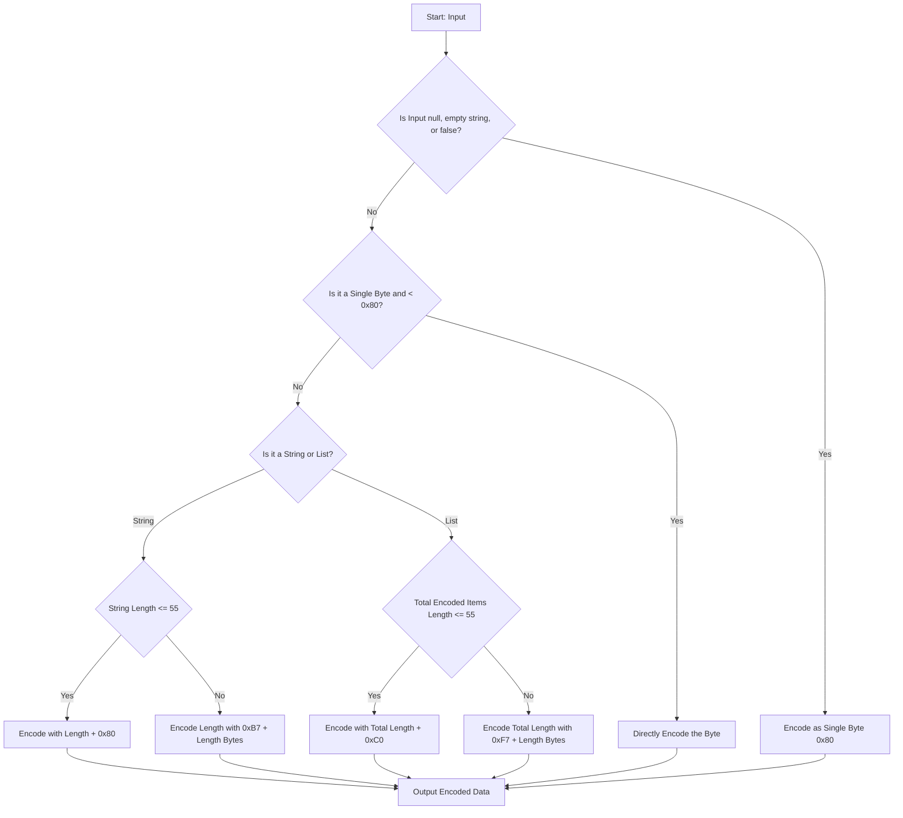
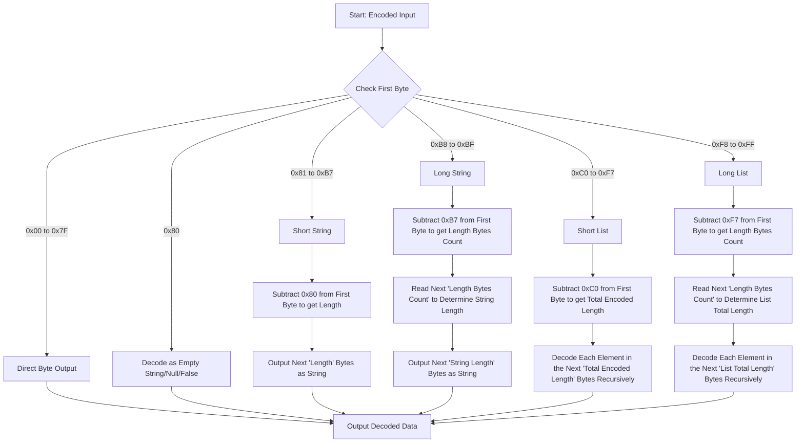

# 递归长度前缀（RLP）序列化

递归长度前缀(RLP)是以太坊执行层中用于编码和解析数据的核心序列化协议。它旨在序列化数据并生成所有客户端软件都可读的结构。它用于从交易数据到区块链的整个状态的所有内容。本维基页面探讨了 RLP 的内部原理、其编码/解码规则、可用工具以及它在以太坊功能中的作用。

## 以太坊中的数据序列化

数据序列化是将数据结构或对象转换为字节流以进行存储、传输或后续重建的过程。在以太坊这样的分布式系统中,序列化对于在网络节点之间可靠且高效地传输数据至关重要。用不同语言编写的客户端需要能够以相同的方式处理数据。传输给其他节点或由客户端导出的数据需要有标准格式。虽然有像 JSON、XML 或 Protobuf 这样常见的序列化格式，但以太坊使用其自己的协议，因为它在编码嵌套字节数组方面简单且有效。

> 以太坊实际上使用两种格式:RLP 和简单序列化(SSZ),后者是共识层使用的更现代的标准。

## RLP 算法的工作原理

**RLP 编码算法**

以下是 RLP 编码算法的流程图。

_注意:在某些 RLP 工具中,一些客户端可能会添加额外的条件情况到流程中。这些额外的条件情况不是标准规范的一部分,但它们对于客户端正确序列化数据非常有用,例如 geth 客户端节点与 Nethermind 客户端节点通信时。_

_Figure: RLP Encoding Flow_

**RLP decoding algorithm**

以下流程图描述了 RLP 解码算法的工作原理。

_Figure: RLP Decoding Flow_

## RLP 编码规则

理解 RLP 编码的推导需要掌握基于数据类型和大小应用的具体规则。让我们通过示例来探索这些规则,展示不同类型数据是如何编码的。

如果你不熟悉字符串转十六进制的过程,可以参考这个 [ASCII 对照表](https://www.asciitable.com/)。

### RLP 编码规则的详细说明和示例

递归长度前缀(RLP)是以太坊中用于将结构化数据编码为字节序列的基础数据序列化技术。理解 RLP 编码的推导需要掌握基于数据类型和大小应用的具体规则。让我们逐步通过示例来探索这些规则,展示不同类型数据是如何编码的。

**单字节编码**

- **条件**: 如果输入是单个字节且其值在 `0x00` 和 `0x7F` 之间(包含边界)。
- **编码**: 该字节直接编码,保持不变。
- **示例**: 编码字节 `0x2a` 直接得到 `0x2a`。

**短字符串编码(1-55 字节)**

- **条件**: 如果字符串(或字节数组)长度在 1 到 55 字节之间。
- **编码**: 输出为字符串长度加上 `0x80`,后跟字符串本身。
- **示例**: 编码字符串 "dog" (`0x64, 0x6f, 0x67`) 得到 `0x83, 0x64, 0x6f, 0x67`。这里 `0x83` 是 `0x80 + 3` ("dog" 的长度)。

**长字符串编码(超过 55 字节)**

- **条件**: 如果字符串长度超过 55 字节。
- **编码**: 字符串的长度被编码为大端格式的字节数组,前缀为 `0xb7` 加上这个长度数组的长度。
- **示例**: 对于长度为 56 的字符串,长度 `0x38` 被编码,前面加上 `0xb8` (`0xb7 + 1`)。最终编码以 `0xb8, 0x38` 开始,后跟字符串的字节。

**短列表编码(总负载 1-55 字节)**

- **条件**: 如果列表项的总编码负载在 1 到 55 字节之间。
- **编码**: 列表前缀为 `0xc0` 加上编码项的总长度。
- **示例**: 对于列表 `["cat", "dog"]`,每个项先编码为 `0x83, 0x63, 0x61, 0x74` 和 `0x83, 0x64, 0x6f, 0x67`。总长度为 8,所以前缀是 `0xc8` (`0xc0 + 8 = 0xc8`)。完整编码为 `0xc8, 0x83, 0x63, 0x61, 0x74, 0x83, 0x64, 0x6f, 0x67`。

**长列表编码(总负载超过 55 字节)**

- **条件**: 如果列表项的总编码负载超过 55 字节。
- **编码**: 类似于长字符串,负载的长度以大端格式编码,前缀为 `0xf7` 加上这个长度数组的长度。
- **示例**: 对于超过 55 字节的列表 `["apple", "bread", ...]`,假设负载长度为 57。长度 `0x39` 被编码,前面加上 `0xf8` (`0xf7 + 1`),后跟编码的列表项。

**空值、空字符串、空列表和 false**

- 空字符串、空值和 false 的规则: 编码为单个字节 `0x80`。
- 空列表的规则: 编码为 `0xc0`。
- 示例:
  - 编码空字符串、空值或 false (` `, `null`, `false`) 得到 `0x80`。
  - 编码空列表 `[]` 得到 `0xc0`。

## RLP 解码规则

RLP 解码过程基于编码数据的结构和具体特征:

**确定数据类型**:

- 编码数据的第一个字节(前缀)决定了后续数据的类型和长度。这个字节对指导解码过程至关重要。
  **解码单字节**:
- 如果前缀字节在 `0x00` 到 `0x7F` 范围内,该字节本身就代表解码后的数据。这种情况很简单,因为字节是直接编码的。
  **解码字符串和列表**:
- 解码的复杂性主要来自于字符串和列表,它们具有不同的长度并可能包含嵌套结构。
  **短字符串(0x80 到 0xB7)**:
- 如果前缀字节在 `0x80` 和 `0xB7` 之间,表示这是一个字符串,其长度可以通过从前缀中减去 `0x80` 直接得到。后续等于该长度的字节就是字符串内容。
  **长字符串(0xB8 到 0xBF)**:
- 对于较长的字符串,如果前缀字节在 `0xB8` 和 `0xBF` 之间,长度字节的数量可以通过从前缀中减去 `0xB7` 得到。随后的字节表示字符串的长度,之后的字节则是字符串本身。
  **短列表(0xC0 到 0xF7)**:
- 类似于短字符串,前缀在 `0xC0` 和 `0xF7` 之间表示这是一个列表。列表编码数据的长度可以通过从前缀中减去 `0xC0` 得到。随后的字节必须递归解码为单独的 RLP 编码项。
  **长列表(0xF8 到 0xFF)**:
- 对于较长的列表,前缀在 `0xF8` 和 `0xFF` 之间表示接下来的几个字节(通过从前缀中减去 `0xF7` 确定)将告诉我们列表编码数据的长度。这些长度字节之后的数据然后被递归解码成 RLP 项。

**RLP 解码示例 `[0xc8, 0x83, 0x63, 0x61, 0x74, 0x83, 0x64, 0x6f, 0x67]`**

- **识别前缀**
  - 序列以字节 `0xc8` 开始。在 RLP 中,列表的长度前缀从 `0xc0` 开始。`0xc8` 和 `0xc0` 的差值给出了列表内容的长度。
    - `0xc8 - 0xc0 = 8`
  - 这告诉我们接下来的 8 个字节是列表的一部分。
- **解码列表内容**
  - 本例中的列表内容是 `[0x83, 0x63, 0x61, 0x74, 0x83, 0x64, 0x6f, 0x67]`。
  - 我们将逐字节解码这些内容以提取各个项。
- **解码第一项**
  - 列表内容的第一个字节是 `0x83`。在 RLP 中,对于长度在 1 到 55 字节之间的字符串,长度前缀从 `0x80` 开始。因此:
    - `0x83 - 0x80 = 3`
  - 这表明第一个字符串的长度为 `3` 字节。
  - 接下来的三个字节是 `0x63, 0x61, 0x74`,对应 ASCII 值为 "cat"。
  - 现在我们已经解码出第一项: "cat"。
- **解码第二项**
  - 解码第一项后,序列中的下一个字节是另一个 `0x83`。
  - 按照相同的规则:
    - `0x83 - 0x80 = 3`
  - 这表明下一个字符串也有 3 个字节长。
  - 接下来的三个字节是 `0x64, 0x6f, 0x67`,对应 "dog"。
  - 现在我们已经解码出第二项: "dog"。
- 解码后的输出是 `["cat", "dog"]`。

## 以太坊为什么需要 RLP

> RLP 旨在成为一个高度简约的序列化格式;它的唯一目的是存储嵌套的字节数组。与 protobuf、BSON 和其他现有解决方案不同，RLP 不试图定义任何特定的数据类型，如布尔值、浮点数、双精度数或甚至整数;相反，它仅仅用于以嵌套数组的形式存储结构，并将数组的含义解释权留给协议。
> -- 以太坊设计理念

RLP 是为以太坊创建的，专门用于满足其特定需求:

- 极简设计：它纯粹专注于存储结构，而不强加数据类型定义。
- 一致性：它保证了不同实现之间的字节级一致性，这对区块链操作所需的确定性特征至关重要。

## RLP 工具

以太坊中有许多可用的 RLP 实现库。以下是一些工具：

- [Geth RLP](https://github.com/ethereum/go-ethereum/tree/master/rlp)
- [RLP Dump](https://github.com/ethereum/go-ethereum/tree/master/cmd/rlpdump)
- [RLP for Node.js and the browser.](https://github.com/ethereumjs/ethereumjs-monorepo/tree/master/packages/rlp)
- [Python RLP serialization library.](https://github.com/ethereum/pyrlp)
- [RLP for Rust](https://docs.rs/ethereum-rlp/latest/rlp/)
- [Nethermind RLP Serialization](https://github.com/NethermindEth/nethermind/tree/master/src/Nethermind/Nethermind.Serialization.Rlp)

## Resources

- [Ethereum Yellow Paper](https://ethereum.github.io/yellowpaper/paper.pdf)
- [Ethereum RLP documentation](https://ethereum.org/vi/developers/docs/data-structures-and-encoding/rlp/)
- [A Comprehensive Guide to RLP Encoding in Ethereum by Mark Odayan](https://medium.com/@markodayansa/a-comprehensive-guide-to-rlp-encoding-in-ethereum-6bd75c126de0)
- [Ethereum's RLP serialization in Elixir](https://www.badykov.com/elixir/rlp/)
- [Ethereum Under The Hood Part 3 (RLP Decoding)](https://medium.com/coinmonks/ethereum-under-the-hood-part-3-rlp-decoding-df236dc13e58)
- [Ethereum's Recursive Length Prefix in ACL2](https://arxiv.org/abs/2009.13769)
