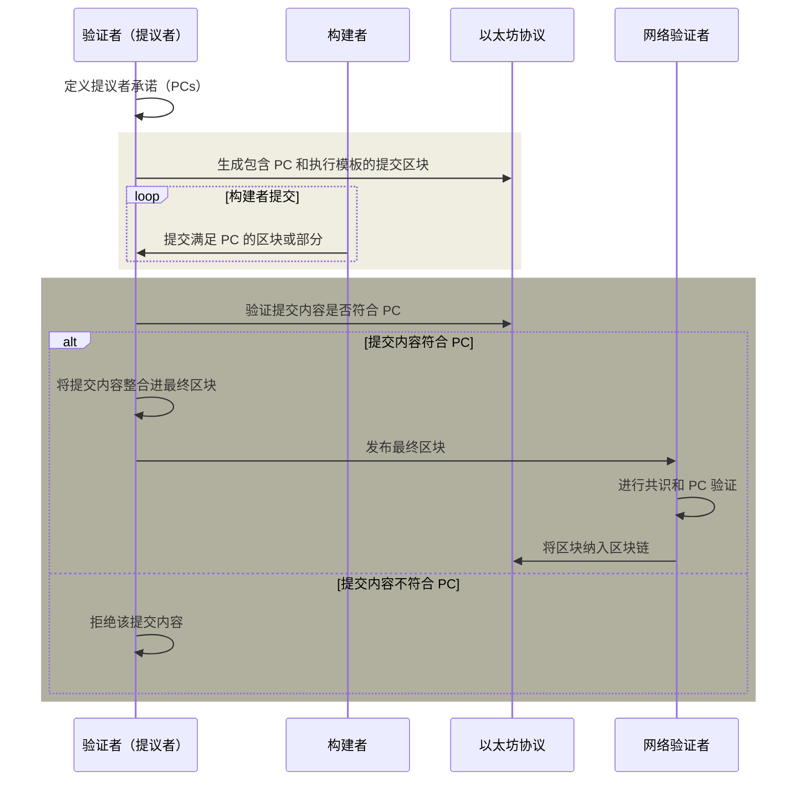

# 协议强制的提议者承诺（PEPC）

**协议强制的提议者承诺（Protocol-Enforced Proposer Commitments，PEPC）** 是对 **提议者-构建者分离（PBS）** 的概念扩展与泛化。它为提议者（验证者）承诺区块构建提供了一种更灵活且安全的方式。不同于当前依赖链下协议的 [MEV-Boost](https://docs/wiki/research/PBS/mev-boost.md) 机制，PEPC 旨在将这些承诺直接内置到以太坊协议中，从而提供一个无需信任、无许可的基础设施，保障提议者与构建者/中继者之间的交互【1】【2】。

## PEPC 的优势与相关权衡

### **提升安全性与去信任化**
- **优势：** 通过协议强制执行承诺，减少对外部参与者的依赖，降低操控风险。
- **权衡（安全性 vs. 计算开销）：** 虽然安全性增强了，但这种机制的内置会增加计算负担，可能影响网络效率和可扩展性。

### **提升区块构建的灵活性**
- **优势：** 允许提议者和构建者之间建立可编程的合约，以支持不同的区块构建场景。
- **权衡（灵活性 vs. 复杂性）：** 这种灵活性引入了额外的复杂性，可能会限制普通用户的参与，并提高准入门槛。

### **促进 MEV 机会的去中心化**
- **优势：** 让 MEV 的分配更加公平，增强验证者的经济激励。
- **权衡（MEV 的去中心化 vs. 潜在的中心化风险）：** 尽管目标是去中心化 MEV，但由于该机制的复杂性，可能仍然会使更大型、更专业的运营商占据优势。

### **可扩展性与效率优化**
- **优势：** 规范化区块构建和验证流程，提高整体网络可扩展性。
- **权衡（长期可扩展性 vs. 短期性能影响）：** 验证者需要适应新机制，可能在早期影响网络性能。

### **经济模式创新**
- **优势：** 允许新的交易类型和区块构建方式，促进以太坊经济模式创新。
- **权衡（经济创新 vs. 经济稳定性）：** 可能会改变既有的收益结构，对以太坊生态的经济稳定性产生影响。

## PEPC 运行机制

_图：PEPC 工作流程_

PEPC 的运行流程包括多个关键步骤，以确保其与以太坊生态无缝集成。

### **步骤 1：承诺阶段**
- **提案创建：** 提议者在创建区块前，定义一系列承诺（Proposer Commitments，PCs），规定区块应如何构建。例如，承诺包含特定交易、不包含某些交易，或采用特定的区块结构。
- **提交区块生成：** 提议者生成包含 PC 的提交区块，并附带一个执行模板或占位符，定义区块的大致结构。

### **步骤 2：揭示阶段**
- **构建者提交：** 构建者根据提议者发布的 PC 提交区块或区块部分，以满足这些承诺。
- **承诺验证：** 提议者或协议本身验证这些提交内容是否符合 PC，只有符合要求的提交内容才会被考虑。
- **区块最终化：** 通过验证的构建者提交内容将被合并到最终区块，并发布到网络。

### **步骤 3：验证与纳入区块链**
- **网络验证：** 其他验证者检查最终区块是否符合以太坊协议规则及 PEPC 规定的承诺。
- **区块纳入：** 通过验证的区块被正式纳入区块链。

## PEPC 关键应用场景

- **全区块拍卖：** 提议者向构建者拍卖整个区块的构建权。
- **部分区块拍卖：** 允许多个构建者共同竞标并构建同一个区块的不同部分。
- **并行区块拍卖：** 针对区块的不同组件进行独立拍卖。
- **未来时隙拍卖：** 提议者可以提前竞拍未来时隙的区块构建权。
- **交易包含列表：** 提议者承诺包含特定交易，提高交易透明度。
- **动态区块配置：** 依据实时网络情况调整区块结构，提高吞吐量。
- **抗审查机制：** 通过承诺包含特定交易，提升去审查性。
- **协议升级与测试：** 允许在主网环境下测试新功能，降低风险。

## PEPC 与 EigenLayer 的关系

PEPC 和 EigenLayer 互补，二者分别从不同角度增强以太坊的安全性、可扩展性和去中心化【3】。

| 机制 | PEPC | EigenLayer |
|---|---|---|
| **安全层次** | 在主协议内部增强区块提议和交易包含的安全性 | 通过再质押机制扩展以太坊的安全性 |
| **提议者承诺** | 规定区块构建规则，确保符合承诺 | 验证者再质押 ETH 以支持额外服务 |
| **MEV 相关性** | 提高 MEV 分配的公平性，透明化交易包含 | 可能用于构建新的 MEV 解决方案 |

当 EigenLayer 质押资产的经济价值超过以太坊主网的质押价值时，可能会导致安全激励错配的风险【2】。

PEPC 与 EigenLayer 结合使用，可以增强以太坊的效率，使其在区块构建和安全扩展方面更具适应性。

## 参考资源
- [PEPC 研究论文](https://ethresear.ch/t/unbundling-pbs-towards-protocol-enforced-proposer-commitments-pepc/13879/1)
- [PEPC FAQ](https://efdn.notion.site/PEPC-FAQ-0787ba2f77e14efba771ff2d903d67e4)
- [EigenLayer 白皮书](https://docs.eigenlayer.xyz/eigenlayer/overview/whitepaper)

