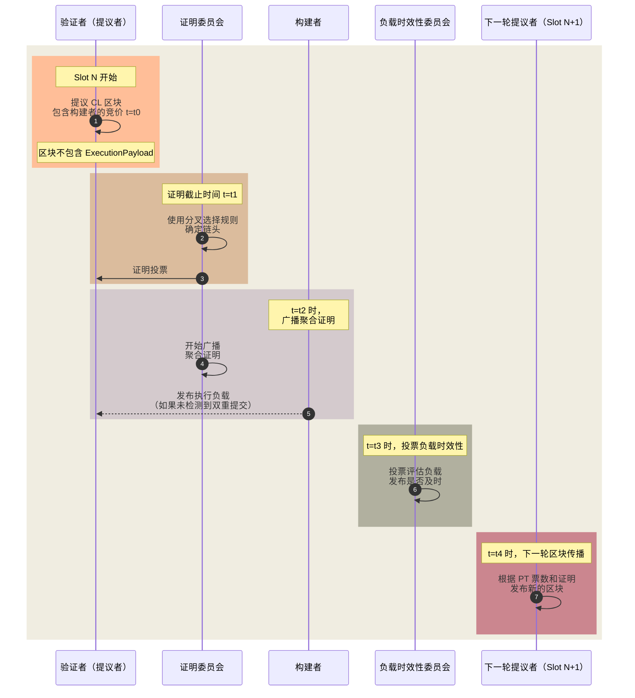

# 负载时效性委员会（PTC）——用于 ePBS

负载时效性委员会（Payload-Timeliness Committee，PTC）提案是一种 **将提议者-构建者分离（PBS）机制纳入以太坊协议（ePBS）** 的设计方案。它在 **确定区块有效性的机制** 上进行演进，并引入一个由验证者组成的 **子集**，用于对区块负载（Payload）的 **时效性** 进行投票[^1][^2][^3]。

## PTC 概览

_图示：负载时效性委员会（PTC）工作流程_

该提案引入了 **新的时隙结构**，增加了一个 **用于负载时效性投票（PT 投票）传播的阶段**，以优化提议者与构建者在区块创建过程中的角色分工。此机制的目标是 **保持提议者的轻量化**，以确保去中心化，同时允许 **专业化的构建者** 以更高效的方式创建高价值区块。

### 主要流程：
1. **区块传播**（Block Propagation）：
   - 在 **时隙（Slot）开始（t = t0）**，由 **PoS 选出的验证者**（即提议者）广播一个 CL（共识层）区块。
   - 该区块 **仅包含构建者的竞价信息**，但 **不包含实际的执行负载（交易）**。

2. **证明聚合**（Attestation Aggregation）：
   - 在 **证明截止时间（t = t1）**，验证者（称为证明者）使用 **本地分叉选择规则** 进行投票，以确定 **链头**。

3. **负载传播**（Aggregation & Payload Propagation）：
   - **构建者** 看到 CL 区块后，发布 **执行负载（Execution Payload）**。
   - **验证者委员会** 开始广播 **聚合证明**。

4. **负载时效性投票传播**（Payload-Timeliness Vote Propagation）：
   - 在 **t = t3**，**负载时效性委员会（PTC）** 投票，判断执行负载是否按时发布。

5. **下一轮区块传播**（Next Block Propagation）：
   - 在 **t = t4**，**下一轮的提议者** 参考 PT 票数，决定构建 **完整区块** 还是 **空区块**。

---

## 机制特性与潜在攻击向量

### **机制特性**：
- **诚实构建者的支付安全性**：
  - 如果构建者的竞价被处理，其负载将成为 **正式区块**。

- **诚实提议者的安全性**：
  - 如果提议者 **按时提交** 并且 **仅提交一个区块**，他们将 **获得报酬**。

- **诚实构建者的同槽负载安全性**：
  - 诚实构建者可以确保 **在同一时隙内** 其负载不会被其他负载覆盖。

### **不具备的特性**：
- **诚实构建者的负载安全性**：
  - 由于设计不保护 **下一时隙的分裂（next-slot splitting）**，构建者无法 **确保其负载一定成为正式区块**。

### **可能的新攻击向量**：
- **提议者发起的分裂攻击（Proposer-Initiated Splitting）**：
  - 提议者可能会 **在截止时间前** 才发布区块，导致 **部分验证者产生不同的视角**，从而 **分裂证明投票**。

- **构建者发起的分裂攻击（Builder-Initiated Splitting）**：
  - 构建者可能 **选择性地向部分委员会披露负载**，影响 **下一轮提议者的区块**，进而导致该区块被孤立（Orphaned）。

---

## **参考资料**
- [负载时效性委员会（PTC）——一种 ePBS 设计](https://ethresear.ch/t/payload-timeliness-committee-ptc-an-epbs-design/16054)
- [ePBS 设计考量](https://notes.ethereum.org/@mikeneuder/consider-the-epbs)
- [ePBS 研讨会](https://www.youtube.com/watch?v=63juNVzd1P4)
- [提议者-构建者分离（PBS）笔记](https://barnabe.substack.com/p/pbs)
- [Mike Neuder——走向正式的提议者-构建者分离](https://www.youtube.com/watch?v=Ub8V7lILb_Q)
- [ePBS 设计规范](/docs/wiki/research/PBS/ePBS-Specs.md)

## **引用**
[^1]: https://ethresear.ch/t/payload-timeliness-committee-ptc-an-epbs-design/16054  
[^2]: https://hackmd.io/@potuz/rJ9GCnT1C  
[^3]: https://github.com/potuz/consensus-specs/pull/2

