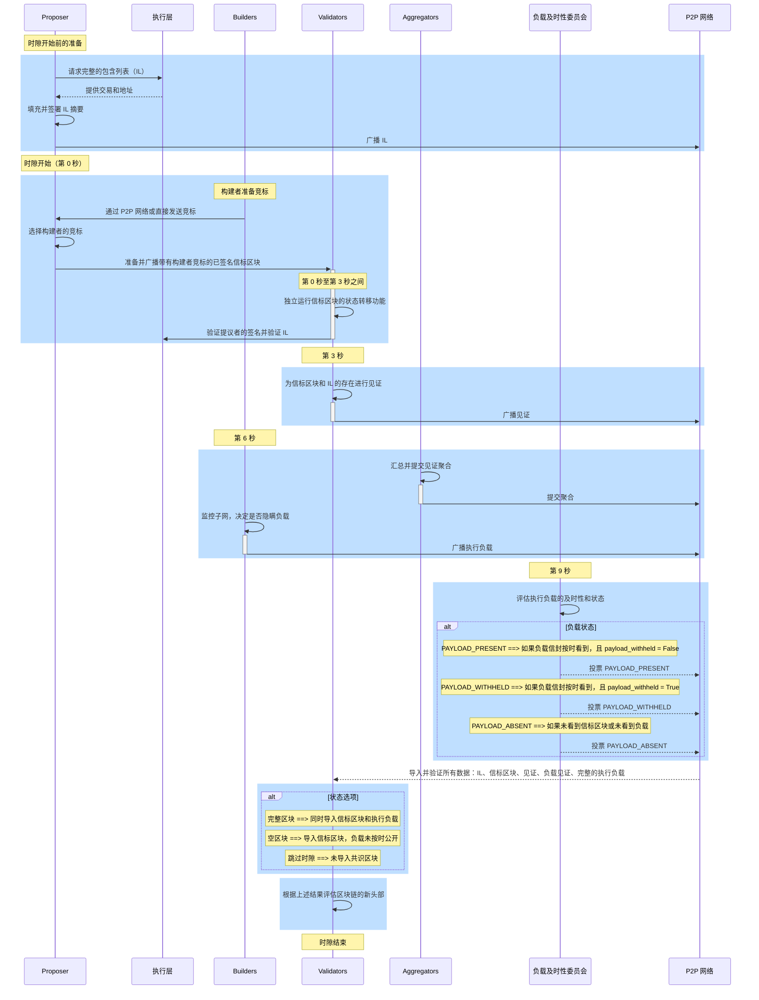

# ePBS 设计规格

[当前的 ePBS 规格](https://hackmd.io/@potuz/rJ9GCnT1C)和[GitHub 仓库](https://github.com/potuz/consensus-specs/tree/epbs_stripped_out/specs/_features/epbs)解决了以太坊当前 PBS 实现中的一个关键问题[^1][^2][^11]。传统上，提议者和构建者都需要依赖中介机构通过[MEV-Boost](/docs/wiki/research/PBS/mev-boost.md)，这引入了信任和审查问题，如[ePBS 文档](/docs/wiki/research/PBS/ePBS.md)中所述。ePBS 规格框架通过将中介的必要性（“必须”）改为可选（“可以”），使以太坊生态系统中的互动更加去信任化。

## 规格概述

[ePBS 规格](https://github.com/potuz/consensus-specs/tree/epbs_stripped_out/specs/_features/epbs)分为几个组件，以建立在以太坊现有的组件规格之上：
- `Beacon-chain.md`：该文档指定了 ePBS 功能的信标链规格[^6]。
- `Validator.md`：该文档指定了 ePBS 功能中诚实验证者的行为规格[^7]。
- `Builder.md`：该文档指定了 ePBS 功能中诚实构建者的规格[^8]。
- `Engine.md`：该文档指定了由于 ePBS 分叉所需的引擎 API 变更[^9]。
- `fork-choice.md`：该文档指定了由于 ePBS 升级而对分叉选择的变更[^10]。

## ePBS 规格的主要改进

**信任最小化**：通过允许提议者和构建者更加独立地操作，减少了对中介的依赖，从而降低了操控和信任依赖的风险。

**最小化的兼容性变更**：该设计实现了对现有共识和执行客户端操作的最小变更。它遵循现有的 12 秒时隙时间，确保了网络操作的连续性和稳定性。

**审查抵抗性**：通过结合[以太坊改进提案 EIP-7547](https://eips.ethereum.org/EIPS/eip-7547)中的强制前向包含列表，提高了审查抵抗性，确保某些交易必须被包含，从而帮助维护网络的完整性。

**层级增强**：这些变更主要发生在共识层（CL），对执行层（EL）的调整较少，主要涉及处理包含列表的方式。

**安全保障**：

- **提议者安全**：确保提议者免受通过串通提议者和构建者进行的单时隙重组攻击，即使这些攻击者控制着最多 20% 的质押份额。
- **构建者安全**：保证构建者免受连续提议者的串通和操控，包括确保隐瞒和公开的有效负载的安全。
- **解捆绑保障**：在所有攻击场景下，构建者受到保护，确保交易处理和执行的完整性。

**验证者自建负载**：验证者保留了自建负载的能力，这对保持独立性和灵活性至关重要。

**可组合性**：该规格设计可与其他机制如时隙拍卖或执行票务拍卖兼容，增强了灵活性和未来创新的潜力。

## 实施细节

ePBS 规格引入了特定的角色和责任：

- **构建者**：提交负载承诺的验证者。
- **PTC（负载及时性委员会）**：一个新委员会，负责验证负载的及时性和有效性。

在每个时隙中，提议者收集竞标，并在选择一个竞标后，提交带有构建者签名承诺的区块。验证者根据这些承诺调整构建者和提议者之间的财务积分。构建者随后公开他们的执行负载，履行承诺。时隙的结果可以是错过、空白或已满，具体取决于区块的生产和公开，PTC 在确定时隙的结局中扮演关键角色。

该实施包括[EIP-7251](https://eips.ethereum.org/EIPS/eip-7251)和[EIP-7002](https://eips.ethereum.org/EIPS/eip-7002)，这些都是 ePBS 功能的核心。EIP-7251 增加了以太坊验证者的最大余额至 2048 ETH，保持最少 32 ETH，以减少验证者的数量，同时保持安全性[^3]。EIP-7002 允许验证者使用特殊的退出凭证退出信标链，增强了质押的灵活性和安全性[^4]。

## 时隙时间轴解剖



_图 – 基于 ePBS 规格的新时隙结构流程._

### 插槽前的准备

- **提议者** 通过向执行层（EL）请求完整的包含列表（IL）、填写并签署摘要，然后将其广播到 P2P 网络来准备。
  
**ePBS 新增内容：** 包含列表（IL）是执行层（EL）中的新组件，旨在确保网络的抗审查性。它们基于前向包含操作，提议者和验证者互动，确保事务准确有效地向前推进[^5]。

**包含列表容器：**
- **InclusionListSummary：** 包含提议者的索引、插槽和执行地址列表。
- **SignedInclusionListSummary：** 包含上述摘要及提议者的签名。
- **InclusionList：** 包含已签名的摘要、信标块的父区块哈希以及事务列表。

**从执行层请求 IL：**
- 提议者通过调用 `get_execution_inclusion_list` 函数，从执行层检索待包含的事务，确保它们符合当前状态的有效性。响应是一个容器 `GetInclusionListResponse`，其中包含 `transactions`（所需的事务对象列表）和 `summary`（事务摘要，包括如“from”地址等关键信息）。
  
**构建 IL：**
- 提议者调用 `build_inclusion_list` 函数，将接收到的事务整理成结构化格式，准备签署摘要，并确保符合网络标准。响应是一个容器 `InclusionList`，其中包含 `SignedInclusionListSummary`（已签名的事务摘要），验证其真实性和完整性，以及 `transactions`（已验证的事务列表）。

**广播 IL：**
- 一旦 IL 准备并签署完成，提议者将其通过 P2P 广播到整个网络。

### 第二 t=0 时插槽开始

- **构建者** 准备他们的竞标，并通过 P2P 网络或直接发送给提议者。
- **提议者** 选择一个构建者的竞标，准备并广播一个包含该竞标的 **SignedBeaconBlock**。

**ePBS 新增内容：** 在 `ExecutionPayload` 中新增了 `inclusion_list_summary` 属性。该字段涉及区块内某些事务的包含摘要，提供了对区块内容的控制。

**构建者：准备和发送竞标**
- 构建者使用 `ExecutionPayloadHeader` 容器准备竞标，包含父区块哈希、费用接收者和提议的事务费用等基本信息。
- 构建者创建 `SignedExecutionPayloadHeader`，即已签名的 `ExecutionPayloadHeader`，并广播。
- 竞标通过 `execution_payload_header` 主题直接发送给提议者或通过 P2P 网络广播。

**提议者：选择竞标并广播签名的信标块**
- 提议者根据多个标准（如竞标金额和构建者的可靠性或过去表现）评估竞标以选择一个。
- 提议者构建 `BeaconBlockBody`，其中包括 `signed_execution_payload_header` 和其他标准元素。
- `process_block_header` 函数处理区块头，确保所有元素符合共识规则，并且区块在当前链上下文中有效。
- 区块包含选定的执行负载头，通过提议者签名生成 `SignedBeaconBlock`。
- 签名区块通过 P2P 网络广播，使用 `beacon_block` 主题，供所有网络参与者访问。
- 提议者在 `BeaconBlockBody` 中准备的 `ExecutionPayloadHeader` 包含 `parent_block_hash`，连接到执行层中的父区块，确保链的延续性，并且 `block_hash` 最终将连接到构建者将生成的 `ExecutionPayload` 哈希，对于验证者来说，这对于验证链的完整性和连续性至关重要。

### 第二 t=0 到 t=3 之间

- **验证者** 独立运行状态转换函数来验证信标块，验证提议者的签名并验证包含列表。

**验证者：验证信标块和包含列表**
- 在收到 `SignedBeaconBlock` 后，验证者调用 `process_block` 函数，这是一个全面处理区块处理各方面的函数，包括头部验证、RANDAO、提议者惩罚、见证等。
- 对于 ePBS，特别关注 `process_execution_payload_header`，它验证区块内的执行负载头。
- 验证者验证 `ExecutionPayloadHeader` 中引用的 IL。为此，他们使用 `verify_inclusion_list` 函数来评估 IL 的正确性，检查事务的有效性、摘要签名的完整性，并确保与之前商定的状态对齐，IL 中的提议者索引应与给定插槽的预期提议者匹配。
- 如果区块和 IL 成功验证，状态转换函数 `state_transition` 会更新信标状态，以反映新区块。这包括更新验证者状态、根据见证和惩罚调整余额、轮换委员会。

### 大约第二 t=3 时

- **验证者** 对信标块和 IL 的存在进行见证，确保这一点在此时是正确的。

**验证者：对信标块进行见证**
- 验证者调用 `process_attestation` 函数来验证并处理每个对信标块的见证。这包括验证信标块的插槽、见证委员会，并确保见证数据符合共识规则。

### 大约第二 t=6 时

- **聚合器** 聚合并提交见证聚合。
- **构建者** 构建并广播他们的执行负载。他们监视网络子网，并根据网络条件和投票决定是否保留他们的负载。
- 构建者将执行负载打包成容器 `ExecutionPayloadEnvelope`，该容器包含执行事务所需的所有信息。该封装确保负载可以整合进信标链中。构建者将设置字段 `payload_withheld` 为 `false`。
- 此外，诚实的构建者如果没有及时看到共识区块，也可以通过设置 `payload_withheld` 为 `true` 来保留负载。
- 他们调用 `process_execution_payload` 函数，根据当前状态处理执行负载，确保其有效性。这涉及到验证事务、确保状态转换正确，并检查负载是否与共识规则一致。
- 然后，他们签署容器 `ExecutionPayloadEnvelope`，生成 `SignedExecutionPayloadEnvelope`，并通过 P2P 网络的 `execution_payload` 主题广播。

### 大约第二 t=9 时 - 负载时效委员会（PTC）

- 在插槽的第 t=9 秒时，PTC 评估执行负载的时效性。这个委员会由 512 个验证者组成，根据他们对执行负载的观察以及其相对于共识区块的时机投票。

**ePBS 新增内容：** PTC 是在这个 ePBS 规范中新增的组件。
- **组成和功能：**
  - **委员会构成：** PTC 成员从每个信标插槽委员会的首个非构建者成员中选出。这确保了该委员会完全由非构建者的验证者组成，从而最小化利益冲突。
  - **见证奖励和惩罚：** PTC 成员根据他们是否正确见证负载的存在或缺失来获得标准的见证奖励。准确的见证与实际的负载状态（`full` 或 `empty`）一致，验证者会获得完整的见证积分（目标、源和头部及时）。不正确的见证会导致惩罚，类似于错过的见证。
  - **见证处理：** PTC 成员对 CL 块的见证会被忽略，重点处理负载验证任务。
  - **见证在区块中的包含：** 插槽 `N+1` 的提议者负责将插槽 `N` 的 PTC 见证包含到区块中。没有直接奖励用于包含错误的见证，因此通常每个区块只需要一个 PTC 见证。
- **聚合和广播：** 通过两种方法导入 PTC 见证。聚合的见证（`PayloadAttestation`）包含在前一个插槽的区块中，而未聚合的见证（`PayloadAttestationMessage`）则在当前插槽的实时处理中广播。

**PTC 验证者评估并投票执行负载的时效性**
- 每个 PTC 验证者独立检查是否收到了构建者按签名的 `ExecutionPayloadHeader` 应该按时揭示的有效 `ExecutionPayload`。PTC 验证者根据负载的存在与接收时机，投票评估负载的时效性。

**广播负载时效性见证**
- 如果确认执行负载存在并及时，PTC 验证者将生成并广播负载时效性见证，确认这些观察结果。`PayloadAttestation` 容器捕获验证者的见证，记录负载的时效性和存在性。
- `get_payload_attesting_indices` 函数通过检查 `PayloadAttestation` 中的聚合位来确定哪些 PTC 验证者在见证负载的存在和时效性。
- 见证通过 P2P 网络的 `payload_attestation_message` 主题广播。

**聚合并将负载见证包含在信标区块中**
- 聚合器收集单独的 `PayloadAttestation` 消息，聚合它们，并确保它们包含在即将到来的信标区块中，以记录并最终确定验证者对负载时效性的共识。它们被聚合到 `IndexedPayloadAttestation` 容器中，该容器包含见证的验证者索引列表、负载见证数据和集体签名。

**基于见证更新信标链状态**
- `process_payload_attestation` 函数由信标链调用，用于处理和验证传入的负载见证。它确保见证数据正确，签名有效，并将这些信息整合进信标状态。信标链状态根据负载见证更新。
- 这些见证通过影响各种区块的权重，进而影响分叉选择，可能会导致基于负载时效性和存在性进行链重组。

**奖励计算与分发：** 每个正确见证负载状态的验证者将设置参与标志，并根据预定义的权重计算奖励（`PARTICIPATION_FLAG_WEIGHTS`）。奖励被聚合，并且见证提议者按比例获得奖励，计算时考虑协议规范中定义的各种权重和分母（`WEIGHT_DENOMINATOR`，`PROPOSER_WEIGHT`）。

**提议者奖励：** 最后，函数计算提议者奖励并通过调用 `increase_balance` 方法更新提议者的余额。

### 插槽结束

- 随着插槽的结束，验证者完成若干关键任务：
  - **导入和验证：** 验证者确保他们已导入并验证了包含列表、共识区块、所有单比特和聚合见证、负载见证和完整执行负载。
  - **评估区块链的新头：** 基于验证的数据，验证者做出关键决策，确定该插槽是否会导致：
    - **完整区块：** 共识区块和对应的执行负载均已成功导入。
    - **空区块：** 共识区块已导入，但关联的执行负载未及时揭示。
    - **跳过插槽：** 插槽期间未导入共识区块，导致跳过插槽的情况。
- 分叉选择函数 `get_head` 根据最新的区块提议、负载见证和任何其他相关信息（如见证的权重和余额）确定链的头部。
- 所有节点根据分叉选择的结果同步它们的状态，确保网络的一致性。这一同步包括应用所有通过见证的区块和执行负载的状态转换和更新。 

## 包含列表时间线

**Gossip 层检查：**
- 包含列表通过时间验证，确保它们与当前或下一个插槽相关。
- 每个提议者插槽对仅限广播一个包含列表，尽管提议者可能会向不同的对等节点发送不同的列表。
- 事务数量必须与摘要计数匹配，并且不得超过 `MAX_TRANSACTIONS_PER_INCLUSION_LIST` 中设定的最大值。
- 验证包含列表签名是否与提议者的密钥匹配，确认它们是按计划的插槽发送。

**风险与缓解措施：**
- 在头部变化之前广播即将到来的插槽的包含列表可能会导致可用性问题，尽管该列表仍然被视为有效。

**on_inclusion_list 处理器：**
- 作为执行引擎 API 调用的桥梁，假设相应的信标区块已处理。
- 如果信标区块的父级为空，任何新的包含列表会自动被忽略以防止积压。

**信标状态跟踪：**
- 跟踪提议者和插槽以管理最新和先前的 IL 以便在新有效区块到来时进行更新。

**EL 验证：**
- 检查事务 `inclusion_list.transactions` 是否有效且可以使用当前状态包含。
- 确保摘要 `inclusion_list.signed_summary.message.summary` 准确列出已包含事务的“from”地址。
- 验证事务的最大气体限制不超过 `MAX_GAS_PER_INCLUSION_LIST` 中允许的最大值。
- 确保列出的账户有足够的资金来支付最大可能的气体费用（`base_fee_per_gas + base_fee_per_gas / BASE_FEE_MAX_CHANGE_DENOMINATOR`） * gas_limit）。
  

## 执行有效载荷的时间线

在 ePBS 系统中，执行有效载荷的处理包括几个关键步骤，分布在 gossip、共识和执行层之间：

**Gossip** 通过 `execution_payload` pubsub 主题共享执行有效载荷，并进行以下关键验证：
- 确保与有效载荷关联的信标区块有效。
- 验证构建器索引和有效载荷哈希与信标区块的匹配。
- 验证构建者的签名。

**共识状态转换** 在 gossip 后，有效载荷通过 `on_execution_payload` 分叉选择处理器进行共识验证：
- **签名验证**：确保有效载荷签名的完整性。
- **提款和包含列表验证**：确认提款的正确处理并符合信标状态指定的包含列表。
- **有效载荷一致性和执行层验证**：检查所有有效载荷元素是否与信标状态承诺一致，并将有效载荷发送到执行层进行进一步验证。
- **状态更新与验证**：更新信标状态记录并验证新的状态根，以确认准确的状态转换，包括 `latest_block_hash` 和 `latest_full_slot`。

**执行层状态转换** 执行层扩展其角色以验证 `InclusionListSummary` 的满足情况：
- **交易和余额验证**：跟踪涉及交易或余额变化的地址。
- **包含列表满足情况**：确保每个地址都出现在 `InclusionListSummary` 中，考虑当前和之前有效载荷中的交易和余额变化。
- **特殊情况处理**：管理诸如 [EIP-3074](https://github.com/ethereum/EIPs/blob/master/EIPS/eip-3074.md) 启用的事务等特殊场景。

## 有效载荷证明的时间线

**Gossip** 有效载荷证明由 PTC 成员使用 `PAYLOAD_ATTESTATION_MESSAGE` 对象广播，并在传播前进行严格检查：
- **当前槽验证**：仅广播当前槽的证明。
- **有效载荷状态验证**：证明必须具有有效的有效载荷状态才能广播。
- **每个成员单次证明**：每个 PTC 成员只能共享一个证明。
- **信标区块根存在性**：证明与已知的信标区块根相联系。
- **PTC 成员检查**：验证者必须确认是 PTC 的成员。
- **签名验证**：证明必须具有有效的签名。

**分叉选择处理器** 通过 `on_payload_attestation_message` 处理有效载荷证明，该处理器包括：
- **信标区块验证**：确认关联的信标区块在分叉选择存储中。
- **PTC 插槽验证**：验证证明者在指定的槽中是否为 PTC 成员。
- **槽匹配**：检查信标区块是否与证明的槽对应。
- **当前槽和签名检查（如果不是来自区块）**：对于直接广播，验证槽是否当前，并验证签名。
- **PTC 投票更新**：更新分叉选择中与给定区块根关联的 PTC 投票。

## 信标区块的时间线

**Gossip**
- **初始验证**：`SignedBeaconBlock` 通过 gossip 或 RPC 进入，进行的关键验证主要集中在父信标区块的合法性。

**on_block 处理器**
- **信标区块验证**：根据两个父元素进行区块验证：共识层（通过 `block.parent_root`）和来自 `signed_execution_payload_header` 条目的执行层。
- **BeaconBlockBody 调整**：`BeaconBlockBody` 的修改包括移除执行有效载荷和 blob KZG 承诺，添加 `signed_execution_payload_header` 和新的 `payload_attestations`。

**状态转换**
- **修改的函数**：`process_block` 现在调整了 ePBS 更改，包括提款处理的修改和父有效载荷的同步。
- **提款**：分为两个阶段管理；在共识区块处理期间扣除，并在执行有效载荷处理时验证兑现。
- **执行有效载荷头部**：验证构建者的签名、资金和即时转移给提议者的竞标金额，并在信标状态中记录状态调整。

**有效载荷证明** 有效载荷证明 `PayloadAttestation` 是信标区块处理中的一个重要组成部分，为 PTC 提供了对执行有效载荷的验证层。

- **PTC 委员会的组成**
  - **委员会选择**：`get_ptc` 函数旨在通过选择来自现有信标委员会的验证者，特别是从每个委员会列表的末尾选择验证者，来组建 PTC。该选择过程确保 PTC 得到充分填充，同时最小化对标准信标委员会结构和功能的影响。

- **处理有效载荷证明**
  - **证明要求**：有效载荷证明必须与前一个槽相关，并且匹配父信标区块根，确保它们及时且准确地引用正确的信标状态。
  - **奖励与惩罚**：
    - **一致性检查**：每个证明与信标状态进行一致性检查。对于一致的证明（例如，当槽已满时，证明为 `PAYLOAD_PRESENT`），提议者和证明验证者将获得奖励。这将他们的激励与准确和诚实的有效载荷状态报告对齐。
    - **奖励计算**：对于一致的证明，参与标志 `PARTICIPATION_FLAG_WEIGHTS` 被设置为证明验证者，提议者将根据证明者的基础奖励计算 `proposer_reward`。
    - **不一致的惩罚**：如果证明被发现不一致（例如，证明 `PAYLOAD_ABSENT` 时，实际有效载荷存在），则会对提议者和证明者进行惩罚。提议者的惩罚 `proposer_penalty` 被加倍，以防止提议者和证明者之间的潜在勾结。

- **实施与理由**
  - **避免削减条件**：对于 PTC 证明的相互矛盾的证明，不会施加特别严厉的削减条件，以防止过于惩罚性的措施可能会使参与者失去动力。然而，惩罚的结构确保提交矛盾证明不会产生净收益。
  - **加倍提议者惩罚**：加倍提议者惩罚的理由是确保没有任何场景下，惩罚和奖励会相互抵消，从而保持对提交冲突证明的威慑作用。

## 诚实验证者行为

由于引入了新的机制，如分叉选择考虑、执行有效载荷验证和 IL 时间的变化，验证者的角色和行为被进一步细化，特别是提议者和 PTC 成员。

**提议者职责**
- **执行有效载荷和包含列表准备**：
  - 在指定的槽之前，提议者需要从构建者选择 `SignedExecutionPayloadHeader` 并请求或构建 `InclusionList`。
  - 这些活动可以在槽开始之前进行，以确保准备好并提高效率。
- **广播时机**：
  - 提议者通过尽早广播其 IL 以增加其区块被证明的可能性，从而确保其区块在链中的位置。

- **与构建者的互动**：
  - 验证者可以作为自己构建者（自建）或与外部构建者合作。鼓励与构建者的直接互动（脱协议方式），因为这样可以实时获得最具竞争力的竞标。

- **战略考量**：
  - 由于可能的 MEV 机会，提议者可能会战略性地延迟选择或请求构建者的竞标，直到最后可能的时刻再广播区块。这一策略是为了从现有的交易池中获得 MEV。

**提议者的链头确定**
- **基本原则**：在槽 `N` 开始时，提议者必须确定链头，以有效地提议新区块。这涉及评估多种情景，如跳过的槽、缺失的有效载荷和迟到的有效载荷，并根据最近有效的区块数据做出决策。

**PTC 成员职责**
- **有效载荷的及时性证明**：
  - PTC 成员的任务是验证当前槽的执行有效载荷是否及时，并根据其观察结果投下 `payload_attestation`：
    - `PAYLOAD_PRESENT`：如果观察到当前槽的有效共识区块和相应的执行有效载荷。
    - `PAYLOAD_WITHHELD`：如果观察到当前槽的有效共识区块，同时从构建者收到 `payload_withheld = true` 消息。
    - `PAYLOAD_ABSENT`：如果观察到当前槽的有效共识区块，但没有相应的执行有效载荷。
    - 如果没有观察到当前槽的共识区块，则不投任何证明。

- **证明条件**：
  - PTC 成员仅导入他们观察到的第一个共识区块，并基于该区块执行操作，确保每个槽有一致且明确的响应。

**构建有效载荷证明**
- **操作窗口**：
  - PTC 成员大约在槽开始后的 9 秒准备进行证明，评估执行有效载荷是否及时且准确地与共识区块同步。
  - 这包括评估有效载荷是否正确地被 withheld，并确保其证明反映了有效载荷是否可用或缺失的实际情况。

**验证者考量**
- 验证者必须巧妙地处理他们的角色，无论是作为提议者、PTC 成员还是一般的证明者，都需要驾驭 ePBS 新机制的复杂性，以维持网络的完整性和安全性。这涉及到战略决策、及时行动以及遵守协议，从而优化他们在网络中的影响力和奖励。

Here is the translation of the provided text:

---

## 诚实构建者行为

**准备多个有效载荷**
- **适应性**：构建者需要为各种潜在的父区块头准备不同的有效载荷。这种准备使他们能够在最后时刻适应分叉选择的变化。
- **多重竞标**：构建者可以在预定槽之前提交多个竞标，提高被提议者选中的机会。

**竞标提交策略**
- **广播竞标**：构建者可以通过脱协议服务直接向提议者提交竞标。这种策略允许构建者持续更新和优化他们的竞标，而不会将其暴露给整个网络，避免可能包含不最佳的有效载荷。
- **首次见消息规则**：验证者将仅广播某个特定（构建者，槽）的首次有效消息，这鼓励构建者在早期提交最佳竞标。

**直接竞标请求**
- **增强的 API 规范**：通过签名竞标请求机制引入直接竞标请求，允许验证者直接从构建者请求执行头。这对构建者 API 的小修改可以利用现有的客户端代码，并增强验证者与构建者之间的直接互动。

```python
class BidRequest(container):
    slot: Slot
    proposer_index: Validator_index
    parent_hash: Hash32
    parent_block_root: Root

class SignedBidRequest(container):
    message: BidRequest
    signature: BLSSignature
```

- **加密绑定**：直接请求机制可以设计为将请求与验证者进行加密绑定，防止构建者根据其他人的竞标调整其竞标，从而减少构建者之间的勾结和卡特尔化风险。

**作为备用的 Gossip**
- **备用机制**：尽管直接竞标请求具有优势，但保持一个全球竞标话题作为重要的备用机制。这个系统支持运行在低端硬件上的验证者或那些更喜欢社区驱动的构建者的验证者，确保他们能访问到竞争性的竞标。
- **反审查与反卡特尔措施**：通过设置一个由社区驱动的最低竞标，系统迫使集中化的构建者如果想审查某些交易，就必须超出这些公开的竞标。这一功能作为竞标提交的竞争性和透明度的基准。
- **防垃圾邮件保护**：全球话题可以通过只允许传播为给定父区块哈希收到的最高价值竞标，并限制每个构建者每槽只能发送一条消息，从而防止垃圾邮件。

## 提议者与构建者交互的安全分析

**构建者揭示安全**
- **场景**：提议者之间的勾结重新组织一个按时揭示有效载荷的构建者的有效载荷。
- **结果**：安全设计确保，只要攻击者控制的质押不超过特定的阈值（例如 40%），构建者的有效载荷无法被后续的提议者重新组织。
- **关键方程**：如果 \(RB > PB\)，其中 \(RB\) 为构建者的揭示提升，\(PB\) 为提议者提升，则揭示的有效载荷保持安全。

**构建者拒绝安全**
- **场景**：构建者因共识区块的到达较晚而决定拒绝有效载荷，以避免惩罚。
- **结果**：通过（区块，槽）投票机制支持构建者拒绝有效载荷的决定，如果区块不是链头或者到达较晚。
- **有效安全性**：在攻击者试图操控区块时间强制揭示有效载荷时，构建者得到了保护，确保如果不符合安全揭示的条件，构建者不必支付。

**提议者安全**
- **场景**：构建者和下一个提议者之间的合作试图重组链。
- **结果**：分析表明，只要攻击者控制的质押少于 20%，诚实的提议者和按时揭示其区块的提议者将确保区块被包含在链中。
- **详细分析**：展示了该系统对反向重组（ex-anti）和后期反重组（post-anti）攻击的抗性，保持了诚实提议者区块的完整性，防止构建者与网络控制的勾结。

**一般安全考虑**
- 所提出的设计通过确保投票只支持与 PTC 决策一致的链，合理处理了不同的有效载荷状态。
- 包含列表的可用性在确定规范链头中起着至关重要的作用，通过强调已验证的包含项，增强了账本的完整性。
- 有效载荷提升（无论是揭示还是拒绝）在分叉选择中的加权计算中起着至关重要的作用，这可能会影响链重组和基于有效载荷可用性和行动的稳定性。

## 分叉选择考虑

ePBS 分叉引入了复杂的分叉选择规则，特别是针对构建者和提议者的安全性。为适应网络延迟和像有效载荷拒绝等战略行为，进行了这些改变。

**ePBS 分叉选择中的关键概念：**

- **（区块，槽）投票：**
  - 该机制确保如果区块到达较晚，验证者将支持最后一个按时到达的区块，而不是迟到的区块。
  - 迟到的区块会累积较少的权重，因为验证者继续支持较早的、按时到达的区块。
- **有效载荷状态处理：**
  - 有效载荷的状态（缺失、空、完整）影响验证者对链的支持。
  - 投票支持与 PTC 对有效载荷状态的决定一致的链，确保有效载荷在及时可用的情况下被包含或排除。
- **包含列表可用性：**
  - 包含列表的存在与验证至关重要。验证者可能根据最新的具有完全验证 IL 的区块来确定链头。
  - 这一考虑确保了基于已正确定义的交易构建的区块优先被采纳，增强了链的完整性。
- **有效载荷提升的安全分析：**
  - 引入了构建者的揭示提升（RB）和拒绝提升（WB），根据构建者在揭示或拒绝有效载荷中的行为进行奖励或保护。
  - 这些提升显著影响了分叉选择，通过调整权重计算，可能会导致链重组或基于有效载荷可用性和完整性而稳定链。

**实际示例：**
- **正常情况**：所有区块和有效载荷按时到达并获得完全支持。
- **迟到的区块和有效载荷**：演示了验证者如何将支持转移到较早的区块，影响权重分配。
- **有效载荷状态场景**：展示了如何根据有效载荷的可用性来支持或排除某些区块，符合 PTC 投票。
- **包含列表的考虑**：强调了这些列表在确定规范链头时的影响，特别是在缺失或迟到的包含数据的情况下。

## 资源
- [ePBS 规范笔记](https://hackmd.io/@potuz/rJ9GCnT1C)
- [最小 ePBS（不含 Max EB 和 7002）](https://github.com/potuz/consensus-specs/pull/2)
- [EIP-7251 最大有效余额 (MaxEB)](https://eips.ethereum.org/EIPS/eip-7251)
- [EIP-7002 执行层可触发的提款](https://eips.ethereum.org/EIPS/eip-7002)
- [epbs - 信标链规格](https://github.com/potuz/consensus-specs/blob/epbs_stripped_out/specs/_features/epbs/beacon-chain.md)
- [epbs - 诚实验证者规格](https://github.com/potuz/consensus-specs/blob/epbs_stripped_out/specs/_features/epbs/validator.md)
- [epbs - 诚实构建者规格](https://github.com/potuz/consensus-specs/blob/epbs_stripped_out/specs/_features/epbs/builder.md)
- [epbs - 引擎 API 规格](https://github.com/potuz/consensus-specs/blob/epbs_stripped_out/specs/_features/epbs/engine.md)
- [epbs - 分叉选择规格](https://github.com/potuz/consensus-specs/blob/epbs_stripped_out/specs/_features/epbs/fork-choice.md)
- [EIP-7547 包含列表](https://eips.ethereum.org/EIPS/eip-7547)

## 参考文献
[^1]: https://hackmd.io/@potuz/rJ9GCnT1C
[^2]: https://github.com/potuz/consensus-specs/pull/2
[^3]: https://eips.ethereum.org/EIPS/eip-7251
[^4]: https://eips.ethereum.org/EIPS/eip-7002
[^5]: https://eips.ethereum.org/EIPS/eip-7547
[^6]: https://github.com/potuz/consensus-specs/blob/epbs_stripped_out/specs/_features/epbs/beacon-chain.md
[^7]: https://github.com/potuz/consensus-specs/blob/epbs_stripped_out/specs/_features/epbs/validator.md
[^8]: https://github.com/potuz/consensus-specs/blob/epbs_stripped_out/specs/_features/epbs/builder.md
[^9]: https://github.com/potuz/consensus-specs/blob/epbs_stripped_out/specs/_features/epbs/engine.md
[^10]: https://github.com/potuz/consensus-specs/blob/epbs_stripped_out/specs/_features/epbs/fork-choice.md
[^11]: https://github.com/potuz/consensus-specs/tree/epbs_stripped_out/specs/_features/epbs 
